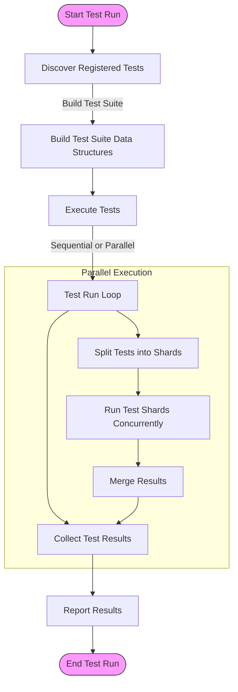

# Scalability and Performance

As projects grow larger and testing suites become more complex, maintaining high performance and scalability is crucial to ensure tests provide fast feedback and do not become a bottleneck in your development workflow. This guide outlines key concepts and best practices for managing scalable and performant test suites in GoogleTest.

---

## Understanding Scalability in Testing

Scalability in testing refers to the ability of your test framework to efficiently handle increasing numbers and complexity of tests without significant degradation in speed or resource usage. GoogleTest is designed to scale gracefully with large codebases, discovering and managing many tests efficiently.

### Automatic Test Discovery

GoogleTest automatically discovers tests at runtime using the registration mechanism built into the framework. This allows your test binaries to include many test cases and suites, which GoogleTest organizes and executes efficiently.

### Parallel Test Execution

To speed up test execution, consider running tests in parallel. While GoogleTest natively supports sharding and filtering via command-line flags, parallel execution tools and test runners (e.g., Bazel, CTest, or third-party runners) orchestrate concurrent test runs to utilize multiple CPU cores effectively.

### Managing Memory Usage

Large test suites inevitably use more memory. GoogleTest’s architecture minimizes memory footprint by lazy initialization and avoids unnecessary copies of test data. However, it remains important to review individual tests to avoid memory-heavy fixtures or excessive global state.

---

## Performance Considerations

Optimizing test performance includes not only efficient test discovery and execution but also writing tests that run quickly and consume minimal resources.

### Writing Efficient Tests

- **Minimize Expensive Setup:** Use test fixtures thoughtfully to share expensive setup steps among related tests.
- **Mock Dependencies:** Use GoogleMock to isolate and speed up tests by replacing slow external dependencies (e.g., network, database).
- **Prefer Lightweight Assertions:** Use precise assertions that fail fast to avoid unnecessary computation.

### Reducing Runtime Overhead

- **Avoid Unnecessary Prints and Logs:** Limit logging in tests, as excessive output can slow down test execution.
- **Use Conditional Checks and Filters:** Leverage GoogleTest command-line filtering to run subsets of tests during development.

### Measuring and Profiling

Periodically profile your test runs to identify slow tests or bottlenecks using tools such as `time`, profilers, or GoogleTest's built-in verbose options.

---

## Integration with Build and CI Systems

To handle scalability effectively, integrate GoogleTest with build and continuous integration (CI) systems that support:

- **Incremental Builds:** Only rebuild changed tests to speed up iteration.
- **Test Sharding:** Split tests into smaller groups to run concurrently.
- **Warm-up and Caching:** Cache results or test data when safe to do so.

For details, see [Integrating GoogleTest with Build and CI Systems](https://google.github.io/googletest/overview/features-architecture/integration-other-systems).

---

## Practical Tips for Large Test Suites

- **Organize Tests Logically:** Use test fixtures and suites to group related tests.
- **Use Test Filters:** Run only relevant tests during local development.
- **Adopt Mocking Early:** Mock slow or non-deterministic dependencies to keep tests fast.
- **Regularly Monitor Runtime:** Keep an eye on average test runtime growth.
- **Automate Performance Checks:** Integrate test timing thresholds in CI to detect regressions early.

---

## Troubleshooting Common Performance Issues

| Problem                              | Solution                                                         |
|------------------------------------|------------------------------------------------------------------|
| Slow test discovery or startup      | Use filtered runs, reduce global state, or disable unused tests. |
| Tests taking too long to execute    | Profile tests, split large tests, mock external dependencies.    |
| Excessive memory usage              | Avoid large fixtures, deallocate resources promptly.             |
| Test flakiness under parallel runs | Synchronize shared resources, avoid global mutable state.        |

---

## Summary

GoogleTest is built to handle large-scale test suites efficiently, but achieving optimal scalability and performance requires thoughtful test design, effective use of mocking, and integration with parallel execution strategies in your build infrastructure. Applying these principles ensures your tests run quickly, reliably, and provide fast feedback in growing projects.

---

## References and Further Reading

- [GoogleTest System Architecture](https://google.github.io/googletest/overview/features-architecture/architecture-diagram)
- [Integrating with Build and CI Systems](https://google.github.io/googletest/overview/features-architecture/integration-other-systems)
- [Mocking in practice](https://google.github.io/googletest/guides/core-test-workflows/mocking-intro)
- [Performance Best Practices](https://google.github.io/googletest/guides/advanced-usage-and-integration/performance-best-practices)

---

## Diagram: Test Execution Flow and Scalability

This diagram illustrates the general process GoogleTest follows to discover, organize, execute, and report on tests, highlighting points where performance optimizations such as parallel execution can be applied.

---

## Best Practices Checklist

- Use `EXPECT_CALL` and `ON_CALL` effectively to mock dependencies and minimize slow external interactions.
- Structure tests into logical groups and suites for better parallelization and selective runs.
- Use test filters (`--gtest_filter`) to speed up iterative development.
- Consider test sharding strategies for large CI pipelines.
- Regularly measure and profile test durations and memory usage.
- Avoid shared mutable global state to facilitate safe parallel execution.

---

By adhering to these guidelines, GoogleTest users can maintain high-quality, scalable test suites that keep pace with growing projects and evolving codebases.
