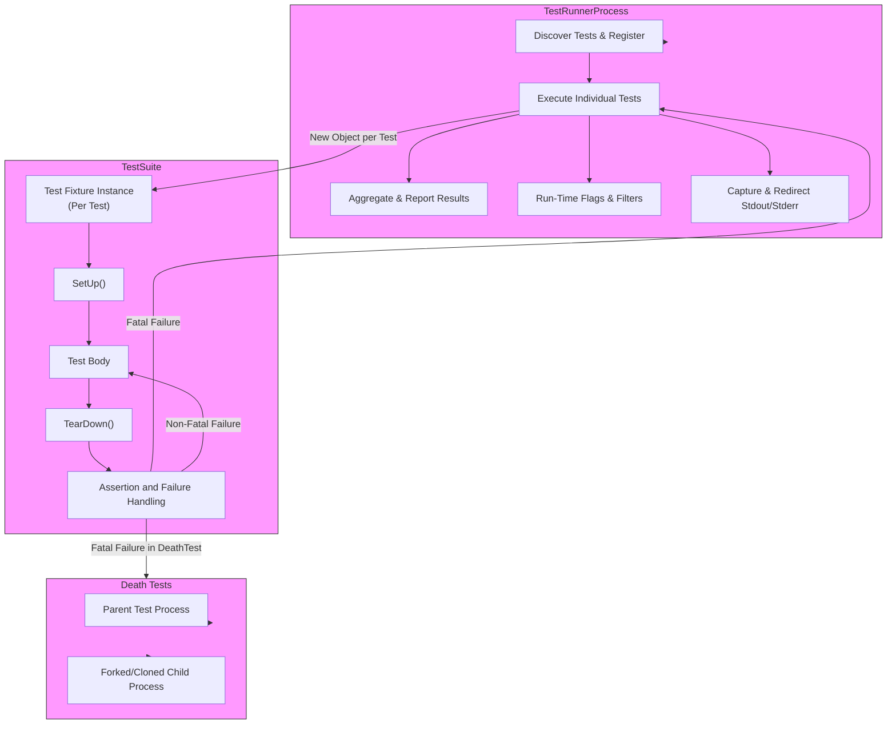

# Security and Isolation Models

Understanding how GoogleTest and GoogleMock protect your production systems and continuous integration (CI) workflows from potentially disruptive or destructive test code is critical to maintaining trust and stability in your testing environment. This guide explores the conceptual approaches GoogleTest and GoogleMock employ to ensure test isolation, failure containment, and process integrity.

---

## Test Isolation: Keeping Tests Independent

One of GoogleTest's fundamental principles is that each test should be *independent* and *repeatable* without side effects that leak across tests. Here's how this is conceptualized and enforced:

- **Isolated Test Instances:**  
  GoogleTest creates a new test fixture object for each test. This guarantees that any modifications a test makes to the fixture or related state are not visible to other tests.

- **Per-Test Setup and Teardown:**  
  Each test’s `SetUp()` and `TearDown()` methods are called immediately before and after the test runs, respectively, providing a clean environment every time.

- **Avoids Shared State Leakage:**  
  Test fixtures prevent interaction through shared members, avoiding tangled dependencies.

- **Test Suites Grouping:**  
  Related tests are grouped into test suites, which help organize shared test code but do not share fixture instances during individual test runs.

**Benefit:** This isolation prevents test failures caused by unintended interactions, making failures reproducible and debugging manageable.

---

## Failure Containment: Managing Test Failures Internally

When a test fails, GoogleTest and GoogleMock prevent failures from cascading and disrupting the test execution process or the larger CI environment:

- **Assertion Result Types:**  
  Assertions can signal *success*, *non-fatal failure*, or *fatal failure*. Fatal failures abort the current test execution flow but do not terminate the whole test suite run.

- **Non-Fatal Failures:**  
  GoogleTest supports `EXPECT_*` assertions that report failures but allow the test to continue, enabling detection of multiple issues in one run.

- **Fatal Failures and Exception Safety:**  
  When exceptions are enabled and `throw_on_failure` is configured, GoogleTest turns assertion failures into exceptions local to the test, allowing fail-fast without crashing the entire test runner.

- **Scoped Trace Points:**  
  Features like `SCOPED_TRACE` provide contextual failure information to isolate the cause and help contain the scope of failure impact.

- **Death Tests:**  
  Specialized tests that expect a process to terminate are run in forked or cloned child processes, so crashes and abnormal termination propagate safely without affecting the parent process.

**Benefit:** This architecture ensures that test failures report precisely and do not destabilize the entire testing process.

---

## Process Integrity: Safeguarding the Test Execution Environment

GoogleTest employs additional mechanisms to protect the running test suite and the system environment:

- **Death Tests Isolation:**  
  Death tests spawn new processes to execute code expected to terminate abruptly, maintaining the integrity of the test runner process.

- **Thread Safety and Synchronization:**  
  GoogleTest’s internal synchronization primitives guard concurrent operations, ensuring threaded tests do not corrupt state or leak resources.

- **Environment Variable Usage:**  
  Variables such as `TEST_TMPDIR` and `TEST_SRCDIR` are used to isolate file system dependencies, so tests have controlled access to temporary directories and source locations without global side effects.

- **Test Event Listener API:**  
  Extensibility points like event listeners allow users to monitor test progress and react to failures without interfering with core process behavior.

- **Run-Time Flags and Configuration:**  
  Flags like `--gtest_fail_fast` help control process behavior in the face of failures, allowing early aborts without manual intervention.

- **Stream Redirection and Capture:**  
  Facilities to capture stdout and stderr during tests keep log output isolated and prevent side-effects on the terminal or log files.

- **Fatal Failure Propagation Controls:**  
  Tools like `ASSERT_NO_FATAL_FAILURE` macros and exception-based failure propagation help maintain control flows without destabilizing the process.

**Benefit:** These models safeguard the runtime environment of tests and prevent tests from causing unintended side effects or leaving the system in an inconsistent state.

---

## Summary Diagram: Conceptual Isolation and Failure Containment

---

## Practical Tips for Success

- **Design tests to avoid shared static state:** Use static members sparingly and only with proper setup/teardown methods.
- **Prefer non-fatal assertions (`EXPECT_*`) to continue gathering failure info.** Use fatal (`ASSERT_*`) only when continuing makes no sense.
- **Wrap sub-tests with `ASSERT_NO_FATAL_FAILURE` or check `HasFatalFailure()`** to prevent crashes from cascading.
- **Run death tests only when necessary and isolate them properly.** Name suites with `*DeathTest` suffix.
- **Use `SetUpTestSuite()` and `TearDownTestSuite()` carefully** to manage expensive shared resources without compromising test isolation.
- **Leverage `SCOPED_TRACE` when asserting in nested subroutines** to improve traceability of failures.
- **Avoid test dependencies**; the order of test execution is undefined and should not be relied upon.
- **Utilize GoogleTest and GoogleMock run-time flags** to tailor test execution characteristics for CI and local debugging.

---

## Troubleshooting Common Isolation and Failure Issues

<AccordionGroup title="Common Issues with Isolation and Failure Containment">
<Accordion title="Tests Affecting Each Other Due to Shared State">
Ensure that your test fixtures do not use shared mutable static or global variables unless protected and reset between tests. Use fresh fixture instances and avoid unintended side effects in static data.
</Accordion>
<Accordion title="Unexpected Test Suite Abort or Hang">
Check for fatal assertion failures that are not properly caught by the test framework. For death tests, verify isolation is working and the child processes are correctly spawned and terminated.
</Accordion>
<Accordion title="Tests Failing Due to Timing or Threading Issues">
Use synchronization primitives and GoogleTest’s thread safety guarantees carefully. Avoid race conditions and ensure tests do not invoke `EXPECT_*` from multiple threads unsafely.
</Accordion>
<Accordion title="Mock/Object Leaks in Death Tests">
Use `Mock::AllowLeak()` to permit leaks within death tests to avoid false-positive failures from the leak detector.
</Accordion>
</AccordionGroup>

---

## Additional Resources

- [GoogleTest Primer](https://github.com/google/googletest/blob/main/docs/primer.md) — Fundamental user guide for GoogleTest, including test isolation concepts.
- [Advanced GoogleTest Topics](https://github.com/google/googletest/blob/main/docs/advanced.md) — Details on failure propagation, death tests, and environment management.
- [gMock Cookbook](https://github.com/google/googletest/blob/main/docs/gmock_cook_book.md) — Explains mocking behaviors, including mock strictness and failure handling.
- [GoogleTest System Architecture](https://github.com/google/googletest/blob/main/overview/architecture-audience-integration/system-architecture.mdx) — High-level architectural perspective.
- [Test Lifecycle and Execution Model](https://github.com/google/googletest/blob/main/concepts/core-architecture/test-lifecycle-model.mdx) — How GoogleTest organizes test execution and failure containment.

---

## Conclusion

By encapsulating each test within its isolated fixture, managing assertion failures locally, and providing process-level failure containment through features like death tests, GoogleTest and GoogleMock preserve the integrity of your testing environment. These conceptual models empower you to write robust, repeatable, and maintainable tests without risking the stability of your production or continuous integration systems.

---