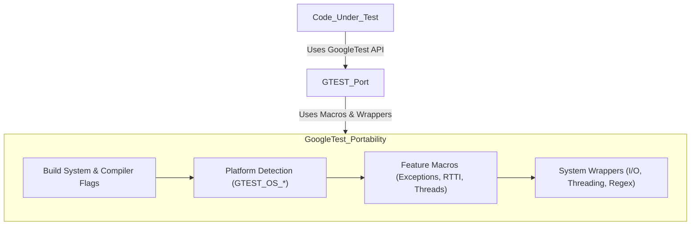

# Portability: Platform and Compiler Support

GoogleTest and GoogleMock are designed to work reliably across a *wide range of compilers and operating systems*. This is achieved through a set of dedicated portability headers, macros, and utility functions that abstract away the platform-specific differences, allowing you to write tests and mocks without worrying about platform details.

---

## Overview

This guide explains how GoogleTest and GoogleMock maintain cross-platform compatibility by internalizing environment detection and providing platform-agnostic interfaces for system features such as threading, file operations, exception support, and compiler quirks. Understanding this layer helps you troubleshoot platform-specific issues, configure your environment correctly, and extend the framework when needed.


## Environment Detection: Identifying Your Platform

GoogleTest uses preprocessor macros to comprehensively detect the environment where it is compiled. This includes operating systems, compiler versions, and available system features.

- The platform is identified by macros of the form `GTEST_OS_*`. For example, `GTEST_OS_LINUX`, `GTEST_OS_WINDOWS_DESKTOP`, or `GTEST_OS_MAC`. These macros distinguish between mobile, embedded, and desktop variants where relevant.

- Compiler capabilities such as exception handling support or Run-Time Type Information (RTTI) are detected and indicated by macros like `GTEST_HAS_EXCEPTIONS` and `GTEST_HAS_RTTI`.

- Threading support is determined mainly by the availability of pthreads on UNIX-like systems or native Windows primitives, expressed through `GTEST_HAS_PTHREAD`.

- Other feature flags identify availability of POSIX regex support, stream redirection, wide string support, and more.

### Typical Macros and Usage:

| Macro                          | Meaning                                       |
|-------------------------------|-----------------------------------------------|
| `GTEST_OS_WINDOWS`             | Compiling on Windows                           |
| `GTEST_OS_LINUX`               | Compiling on Linux                             |
| `GTEST_HAS_PTHREAD`            | POSIX pthread library available                |
| `GTEST_HAS_EXCEPTIONS`         | C++ exceptions are enabled                      |
| `GTEST_HAS_RTTI`               | Run-Time Type Information enabled              |
| `GTEST_HAS_STD_WSTRING`        | `std::wstring` is available                     |
| `GTEST_HAS_STREAM_REDIRECTION` | Support for redirecting stdout/stderr           |

These macros are always defined as `1` (true) or `0` (false) as part of GoogleTest's detection logic, ensuring consistent behavior.

## Abstraction of System Functionality

GoogleTest provides wrappers for key system calls and C++ features, offering consistent APIs regardless of underlying platform variations:

### File and I/O Operations

- Functions such as `FOpen()`, `FReopen()`, `FDOpen()`, `FileNo()`, `Stat()`, and `RmDir()` are provided with implementations that call the appropriate system or CRT function.

- These wrappers handle differences such as wide-char versions on Windows, function replacements for embedded platforms, and special cases for MinGW and others.

### Threading and Synchronization

- GoogleTest and GoogleMock use platform-appropriate primitives:
  - On Windows, they employ native critical sections and mutexes.
  - On pthreads-enabled systems, they use pthread mutexes and keys.
  - When threading support is absent, dummy implementations are provided to allow compilation.

### Exception and RTTI Support

- GoogleTest detects whether exceptions and RTTI are enabled in your compilation environment.

- Based on this, features like assertion macros that depend on exceptions or code that rely on `typeid` can be conditionally compiled.

### Regular Expressions

- GoogleTest abstracts regular expression support, leveraging:
  - Abseil's RE2 library if compiled with Abseil support.
  - POSIX Extended Regular Expressions otherwise (where available).
  - A simple internal regex fallback when neither is available.

### Character Type and Encoding

- Utilities like `IsAlpha()`, `IsDigit()`, `ToUpper()`, and similar functions work uniformly and safely across platforms, handling signedness and character encoding issues.

## Compiler and Build System Configuration

### Minimum Compiler Requirements

GoogleMock requires at least Visual C++ 2015 (version 14.0) on Windows to compile.

### C++ Version Support

GoogleTest and GoogleMock require a compiler supporting C++17 or newer.
They enforce this at compile time using static assertions.

### Compiler Flags Management

- GoogleTest and GoogleMock include a CMake function that tweaks default compiler flags for MSVC, GCC, Clang, Intel compilers, and others to enforce stricter warning levels and correct runtime settings.

- Special handling for runtime library linking (e.g., `/MD` vs `/MT` on MSVC), warning suppression, and UTF-8 encoding support in MSVC is done carefully.

### Pkg-config and Build Integration

- GoogleTest installer packages include appropriate `.pc` files for pkg-config to convey the necessary include paths, macros, and linking flags.

- This aids build system integration on Linux and other UNIX-like systems.

- Cross-compilation environments require setting environment variables such as `PKG_CONFIG_SYSROOT_DIR` for proper sysroot-aware flag generation.

### Shared Library and DLL Support

- Macros allow building GoogleTest and GoogleMock as static or shared libraries.

- When building a shared library on Windows, `__declspec(dllexport)` and `__declspec(dllimport)` are handled via macro definitions.

- Compiling user tests against shared GoogleTest libraries requires specific flags for proper linking.

## Handling Platform Edge Cases and Embedded Systems

- GoogleTest detects embedded and constrained platforms such as Windows Mobile, ESP8266/ESP32, QURT, and others, disabling features like file systems or stream redirection where unavailable.

- On these platforms, stub implementations or no-op fallbacks are used to allow compilation while acknowledging feature limitations.

## Diagnostic and Debug Facilities

- GoogleTest provides portable logging, file location formatting, and error reporting that behaves consistently across platforms.

- Stack trace capturing and thread-safe logging primitives are adapted to the environment's capabilities.

## Practical Tips

- To ensure full portability and smooth builds, define or verify platform-detection macros if targeting unusual or unsupported platforms.

- When cross-compiling, verify that support libraries like pthreads are either present or disabled accordingly.

- Use the provided CMake configuration functions and macros to align compiler settings with GoogleTest's expectations.

- Enable or disable runtime feature flags using macros or command-line defines to customize GoogleTest for your environment.


---

## Example: Checking Platform in Your Test Code

You can conditionally compile code depending on platform features detected by GoogleTest:

```cpp
#include <gtest/gtest.h>

TEST(EnvironmentTest, PlatformFeatures) {
#ifdef GTEST_OS_WINDOWS
  std::cout << "Running on Windows" << std::endl;
#elif defined(GTEST_OS_LINUX)
  std::cout << "Running on Linux" << std::endl;
#else
  std::cout << "Unknown platform" << std::endl;
#endif

#if GTEST_HAS_EXCEPTIONS
  std::cout << "Exception handling enabled" << std::endl;
#else
  std::cout << "Exceptions disabled" << std::endl;
#endif
}
```


---

## Summary

GoogleTest and GoogleMock encapsulate platform and compiler differences within a comprehensive portability layer. This layer employs fine-grained environment detection macros and platform-specific abstractions to provide uniform behavior for threading, file I/O, exception support, regular expressions, and system APIs. By handling these nuances internally, GoogleTest enables you to write portable, maintainable C++ tests and mocks with confidence.

---

## Additional Resources

- [Supported Platforms & Dependencies](https://github.com/google/googletest/blob/main/docs/platforms.md)
- [Setting Up and Building Tests](https://github.com/google/googletest/blob/main/docs/setup-build-integration.md)
- [Configuration Macros & Flags](https://github.com/google/googletest/blob/main/api_reference/platform_integration_and_utilities/configuration_macros_flags.mdx)
- [Main Entry Points & Initialization](https://github.com/google/googletest/blob/main/api_reference/platform_integration_and_utilities/main_entry_points.mdx)
- [GoogleTest CMake Build Guide](https://github.com/google/googletest/blob/main/README.md#build-with-cmake)


---

## Troubleshooting

- If GoogleTest or GoogleMock fails to build due to platform issues, verify that your compiler meets minimum version requirements:
  - Visual Studio 2015 or later on Windows
  - A compiler with full C++17 support

- If threading support is missing, confirm `GTEST_HAS_PTHREAD` is set correctly or forcibly define it.

- Check that you link with required system libraries such as pthreads when needed.

- Make sure that your build system honors macros like `GTEST_CREATE_SHARED_LIBRARY` and `GTEST_LINKED_AS_SHARED_LIBRARY` when building or linking shared libraries.

- Consult the flag macros for debugging and customizing GoogleTest's behavior on your platform.

---

## Contact and Support

If you encounter issues on less common platforms or require help extending portability, contact the GoogleTest maintainers via the mailing list at `googletestframework@googlegroups.com` or file issues in the official GitHub repository.


---

### Diagram of Portability Layer (simplified)



This diagram shows how the core portability support fits within the GoogleTest framework to provide seamless cross-platform support.
