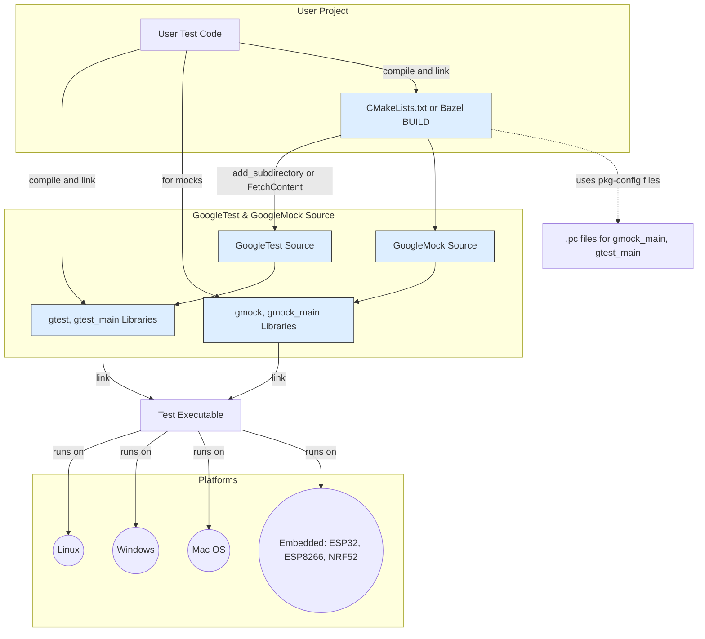

# Build System and Platform Integration

This guide reviews how GoogleTest and GoogleMock are incorporated into your build environment, emphasizing support for the CMake and Bazel build systems, platform-specific considerations, and configurations designed for portability and scalability across operating systems.

---

## Introduction

Integrating GoogleTest and GoogleMock efficiently into your build system is key to enabling seamless test compilation, linkage, and execution across diverse platforms. This page focuses solely on the build and platform integration aspects, guiding you from setup through advanced configuration to ensure your testing environment is both portable and scalable.

While other documentation covers writing tests and mocking patterns, this guide helps you configure your build and runtime environment to fully leverage GoogleTest/GoogleMock’s capabilities.

## Supported Platforms and Portability

GoogleTest and GoogleMock support a wide range of platforms in accordance with Google’s [Foundational C++ Support Policy](https://opensource.google/documentation/policies/cplusplus-support), ensuring compatibility across common operating systems and compilers.

### Platform Highlights

- **Operating Systems:** Linux, Windows, macOS, plus selected embedded and special-purpose platforms like ESP8266, ESP32, and NRF52 Arduino
- **Compiler Support:** Major C++ compilers including MSVC, Clang, GCC, Intel, and others, configured automatically via the build scripts
- **C++ Version:** Requires C++17 support—your build environment must support at least this standard level

Platform-specific integration points, such as different entry points for embedded systems and Windows runtime configurations, are automatically managed by the GoogleTest build system.

<Info>
For details on platform compatibility, please see the [Supported Platforms](docs/platforms.md) document.
</Info>

## Build System Support

GoogleTest and GoogleMock provide extensive support for common modern C++ build systems, with first-class integration for **CMake** and **Bazel**. This section discusses how each is accommodated.

### CMake Integration

GoogleTest includes a comprehensive `CMakeLists.txt` that can be used both as a standalone build or as an integrated subdirectory in your own CMake-based project.

#### Standalone CMake Project

Typically, to build GoogleTest and GoogleMock with CMake:

1. Clone the repository and create a build directory:

   ```bash
   git clone https://github.com/google/googletest.git -b v1.17.0
   cd googletest
   mkdir build && cd build
   ```

2. Configure the project. By default, both GoogleTest and GoogleMock are built:

   ```bash
   cmake ..
   ```

   To build GoogleTest only, disable GoogleMock:

   ```bash
   cmake .. -DBUILD_GMOCK=OFF
   ```

3. Build the project using your platform's native build tool (e.g., `make`, `ninja`, Visual Studio)

4. Optionally, install the libraries and headers system-wide or to a custom directory using:

   ```bash
   sudo make install  # typical on Unix-like platforms
   ```

#### Incorporation into Existing CMake Projects

To integrate GoogleTest properly into your own CMake project:

- **Preferred:** Use `FetchContent` to pull GoogleTest during configure step.

  ```cmake
  include(FetchContent)
  FetchContent_Declare(
    googletest
    URL "https://github.com/google/googletest/archive/5376968f6948923e2411081fd9372e71a59d8e77.zip"
  )
  set(gtest_force_shared_crt ON CACHE BOOL "" FORCE) # for Windows runtime consistency
  FetchContent_MakeAvailable(googletest)

  add_executable(my_tests test_main.cpp)
  target_link_libraries(my_tests gtest_main)
  add_test(NAME my_tests COMMAND my_tests)
  ```

- Alternatively, add GoogleTest as a git submodule or embed the source directly.

- Link your test executables against `gtest` or `gtest_main` and/or `gmock` libraries as needed.

##### Compiler and Linker Flags

GoogleTest’s CMake configuration automatically detects platform-specific compiler features, sets C++17 standard requirements, and tweaks compiler/linker flags to maximize compatibility:

- Adjusts MSVC runtime linkage (static vs dynamic) with an option `gtest_force_shared_crt`.
- Enables pthread detection and usage where applicable for thread safety.
- Applies strict warning levels and exception handling flags appropriate to the compiler.

See the internal CMake macros in `googletest/cmake/internal_utils.cmake` for detailed flag settings.

#### Building the Test Main Library

GoogleTest provides `gtest_main` and `gmock_main` libraries which supply default `main()` functions:

- Linking with `gtest_main` runs `InitGoogleTest()` and executes all tests.
- Linking with `gmock_main` additionally initializes GoogleMock via `InitGoogleMock()`.

This allows users to avoid writing custom `main()` routines unless specialized initialization is needed.

#### pkg-config Support

On install, GoogleMock installs `.pc` package configuration files (e.g., `gmock_main.pc.in`) to assist in build system discovery.

<CodeGroup>
```cmake
# Example installation of pkg-config files:
install(DIRECTORY "${PROJECT_SOURCE_DIR}/include/"
  DESTINATION "include"
)
install(TARGETS gmock_main
  LIBRARY DESTINATION "lib"
  ARCHIVE DESTINATION "lib"
)
configure_file(
  "cmake/gmock_main.pc.in"
  "${CMAKE_BINARY_DIR}/gmock_main.pc"
  @ONLY
)
install(FILES "${CMAKE_BINARY_DIR}/gmock_main.pc"
  DESTINATION "lib/pkgconfig"
)
```

```bash
# Example pkg-config usage to discover flags:
pkg-config --cflags --libs gmock_main
```
</CodeGroup>

### Bazel Integration

GoogleTest supports Bazel as a build environment, reflecting Google’s internal usage.

- Bazel BUILD files are included for `googletest` and `googlemock` libraries.
- They manage dependencies, ensure proper compiler flags, and support test targets.
- Use Bazel targets like `//googletest:googletest` and `//googlemock:gmock_main` to link your tests.

### Manual/Custom Build Integration

For build systems without direct support or for advanced users, GoogleTest permits manual compilation and linkage:

- Include headers from the GoogleTest source tree.
- Compile GoogleTest and GoogleMock source files alongside your test code.
- Link the resulting objects or libraries.

This approach requires more care in ensuring ABI compatibility, compiler flags, and dependencies.

## Platform-Specific Entry Points

GoogleTest and GoogleMock provide platform-adapted test runners:

- **Standard Platforms:** Use a `main(int argc, char** argv)` provided by `gtest_main` or `gmock_main`.
- **Embedded Platforms (ESP8266, ESP32, NRF52 Arduino):** Entry points are `setup()` and `loop()`, as typical in Arduino environments.

Example snippet from `gmock_main.cc`:

```c++
void main(int argc, char** argv) {
  std::cout << "Running main() from gmock_main.cc\n";
  testing::InitGoogleMock(&argc, argv);
  return RUN_ALL_TESTS();
}

#ifdef GTEST_OS_ESP8266
extern "C" {
void setup() {
  testing::InitGoogleMock();
}
void loop() {
  RUN_ALL_TESTS();
}
}
#endif
```

This ensures that GoogleTest’s initialization workflows integrate naturally with platform expectations.

## Handling Portability and Scalability

GoogleTest’s build scripts and platform adaptations ensure tests remain portable and scalable:

- **Thread Support:** Automatically detects pthread availability; falling back to platform-specific threading where necessary.
- **Exception & RTTI Settings:** Conditionally configured flags based on compiler capabilities and user preferences.
- **Warning Levels:** Sets strict warnings to maintain code quality, with options for user adjustments.
- **Dynamic vs Static Linking:** Supports shared and static library builds, allowing flexible integration.

<Note>
Building GoogleTest with consistent compiler and linkage flags (for example, consistent CRT linkage on Windows) is critical to avoid runtime failures and maintain ABI stability.
</Note>

## Best Practices and Tips

- Use `gtest_main` or `gmock_main` libraries to avoid boilerplate in test executables.
- Prefer integrating GoogleTest as part of your main build system (e.g., via `add_subdirectory()` or `FetchContent`) to ensure consistent compiler flags.
- On Windows, set `gtest_force_shared_crt=ON` if your project uses dynamic CRT linkage.
- Consult the `googletest/cmake/internal_utils.cmake` file for advanced flag tuning.
- Use provided pkg-config files on platforms and build systems that support them for easier dependency discovery.
- For embedded platforms, use the platform-specific setup and loop entry points as integrated by GoogleTest.

## Troubleshooting Common Build Issues

- **Linker errors on Windows:** Check CRT linkage consistency and the `gtest_force_shared_crt` CMake option.
- **Missing pthreads:** On some platforms, pthread support is disabled by default; enable it or adjust build options.
- **Incorrect C++ standard:** Ensure your build enforces C++17 or higher.
- **Multiple definitions of `main()`:** Avoid linking both `gtest_main` and your own `main` function.

## Diagram: GoogleTest & GoogleMock Build Integration Flow



---

## Summary

This page explained how to incorporate GoogleTest and GoogleMock into your build systems, focusing on CMake and Bazel support, platform portability, and configuration details to ensure scalable and reliable test environments. The guide covered platform supported, entry points, compiler and linker flag customizations, and troubleshooting insights.

For integrating tests effectively, especially in multi-platform projects, leveraging the provided build scripts and libraries like `gtest_main` and `gmock_main` will save time and prevent common pitfalls.

---

## Next Steps

- For detailed instructions on writing and running tests, consult the [Your First Test: From Source to Success](getting-started/configuration-first-run/your-first-test) guide.
- To understand test execution and configuration, see the [Running and Configuring Tests](api-reference/core-testing-api/running-and-configuring-tests) reference.
- Review the [Integration Entry Points & Ecosystem Support](overview/architecture-features/integration-entrypoints) for how GoogleTest integrates with IDEs and CI pipelines.


---

## Related Documentation

- [System Requirements](getting-started/prerequisites-installation/system-requirements) — Platform and compiler prerequisites.
- [Installation on Different Platforms](getting-started/prerequisites-installation/installation-methods) — Installation workflows targeting various OSes.
- [Setup and Project Integration](getting-started/configuration-first-run/configuration-setup) — Integrating GoogleTest into your build system.
- [Supported Platforms](docs/platforms.md) — Official support matrix.

---

## Sources
- `googletest/cmake/internal_utils.cmake` — Internal CMake macros and compiler flags
- `googlemock/src/gmock_main.cc` — Default mock main entry points
- `googletest/src/gtest_main.cc` — Default test main entry points
- `googletest/README.md` — Build system instructions and guidelines
- `docs/platforms.md` — Platform support details


---

<Source url="https://github.com/google/googletest" paths='[{"path": "googletest/cmake/internal_utils.cmake", "range": "1-200"},{"path": "googlemock/src/gmock_main.cc", "range": "1-60"},{"path": "googletest/src/gtest_main.cc", "range": "1-70"},{"path": "googletest/README.md", "range": "1-150"},{"path": "docs/platforms.md", "range": "1-20"}]' />