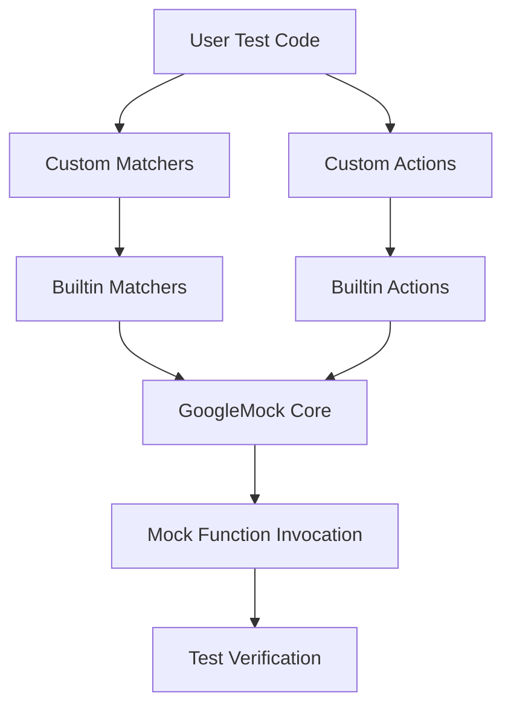

# Extending Actions and Matchers

GoogleTest’s mocking framework (gMock) provides powerful built-in mechanisms for specifying actions on mock functions and for matching arguments with matchers. However, there are many scenarios where the built-in features are not enough, and you need to extend gMock’s capabilities by creating custom actions and matchers tailored to your specific testing needs.

This guide teaches you how to define your own actions and matchers, explains the extension points, best practices, and common pitfalls. By mastering these techniques, you can create expressive, reusable, and maintainable test specifications that fit complex and domain-specific requirements.

---

## Why Extend Actions and Matchers?

While gMock offers a rich set of built-in actions and matchers, real-world testing often requires:

- Verifying complex invariants that can't be expressed as simple equality or range matches.
- Specifying mock behavior that involves intricate side effects or computations.
- Bridging gaps between code interfaces and tests by creating domain-specific abstractions.

Extending actions and matchers empowers you to:

- Express intent clearly in tests with readable custom predicates.
- Reuse complex verification logic without cluttering test code.
- Integrate with legacy or third-party code more naturally.

---

## Overview of Matchers

Matchers in gMock are predicates that determine whether a function argument meets the expected condition. They provide rich diagnostics when a match fails, making test failures easier to understand.

### Types of Matchers

- **Built-in Matchers:** Cover common cases like equality (`Eq()`), comparison (`Gt()`, `Le()`), and container contents (`ElementsAre()`).
- **Custom Matchers:** Define your own logic to inspect argument values.
- **Polymorphic Matchers:** Work generically with multiple argument types.

### Defining Custom Matchers

There are several ways to create custom matchers:

#### 1. Using the `MATCHER` Macros

These macros provide a concise way to write matcher classes without verbose boilerplate.

```cpp
MATCHER(IsPositive, "Checks if a number is positive") {
  return arg > 0;
}

// Example usage:
EXPECT_CALL(mock, Foo(IsPositive()));
```

You can also define parameterized matchers with `MATCHER_P` and up to `MATCHER_P10`.

```cpp
MATCHER_P(IsDivisibleBy, divisor, "Checks divisibility") {
  return arg % divisor == 0;
}

EXPECT_CALL(mock, Bar(IsDivisibleBy(3)));
```

#### 2. Implementing Matcher Classes

For advanced control and improved error messages, implement the matcher interface directly:

- Provide a `MatchAndExplain(const T& value, std::ostream* os)` method that returns whether the match succeeded.
- Provide `DescribeTo(std::ostream* os)` and `DescribeNegationTo(std::ostream* os)` to explain the matcher’s meaning and negation.

Example:

```cpp
class DivisibleByMatcher {
 public:
  explicit DivisibleByMatcher(int divisor) : divisor_(divisor) {}

  template <typename T>
  bool MatchAndExplain(T n, std::ostream* os) const {
    if (n % divisor_ == 0) return true;
    if (os) {
      *os << "whose remainder is " << n % divisor_;
    }
    return false;
  }

  void DescribeTo(std::ostream* os) const {
    *os << "is divisible by " << divisor_;
  }

  void DescribeNegationTo(std::ostream* os) const {
    *os << "is not divisible by " << divisor_;
  }

 private:
  int divisor_;
};

// Factory function
inline ::testing::Matcher<int> DivisibleBy(int divisor) {
  return ::testing::MakeMatcher(new DivisibleByMatcher(divisor));
}
```

### Best Practices for Matchers

- Keep matchers pure and side-effect free.
- Provide meaningful messages in `DescribeTo` and `DescribeNegationTo`.
- Use `MATCHER` macros for simple predicates to avoid boilerplate.
- Write polymorphic matchers with templates when applicable.

---

## Overview of Actions

Actions define the behavior of a mock function when it is called — what it returns, what side-effects it performs, etc.

### Built-in Actions

Common actions include:

- `Return(value)`: returns a fixed value.
- `Invoke(function)`: calls a user-supplied function.
- `SetArgPointee<N>(value)`: sets the value pointed by the Nth argument.
- `DoAll(...)`: performs multiple actions in order, returning the last one's value.

### Defining Custom Actions

When built-in actions are insufficient, you can define your own:

#### 1. Using Lambdas or Functors

The easiest way is to supply a lambda or callable as an action:

```cpp
EXPECT_CALL(mock, Foo(_))
    .WillOnce([](int x) { return x * 2; });

// Or with a functor:
struct MultiplyBy {
  int factor;
  int operator()(int x) { return x * factor; }
};
EXPECT_CALL(mock, Foo(_))
    .WillOnce(MultiplyBy{3});
```

#### 2. Using `ACTION` and `ACTION_P` Macros

For reusable actions:

```cpp
ACTION(IncrementArg0) {
  ++(*arg0);
}

EXPECT_CALL(mock, Foo(_))
    .WillOnce(IncrementArg0());
```

Parameterized action example:

```cpp
ACTION_P(Add, n) {
  return arg0 + n;
}

EXPECT_CALL(mock, Foo(_))
    .WillOnce(Add(5));
```

#### 3. Implementing the ActionInterface Class

For full control, implement the `ActionInterface<F>` directly (where `F` is the signature of the mock function). This is more complex but allows actions to be polymorphic.

### Tips for Actions

- Use `DoAll()` to combine multiple effects.
- Use `IgnoreResult()` to discard action’s return value when needed.
- Use `InvokeArgument<N>()` to call a callback passed as an argument.
- Be cautious with move-only types; lambdas and functors are your friends.

---

## Practical Examples

### Custom Matcher: Validate a Member Value

```cpp
MATCHER_P(HasFooValue, expected, "Matches Foo objects by foo value") {
  return arg.foo() == expected;
}

EXPECT_CALL(mock, ProcessFoo(HasFooValue(42)));
```

### Custom Action: Set Output Argument and Return Success

```cpp
ACTION(SetOutputAndReturnSuccess) {
  *arg1 = 100;
  return true;
}

EXPECT_CALL(mock, Compute(_, _))
    .WillOnce(SetOutputAndReturnSuccess());
```

### Delegating to a Real Object for Default Behavior With Additional Checks

```cpp
class MockFoo : public Foo {
 public:
  MOCK_METHOD(int, Calculate, (int x), (override));

  MockFoo() {
    ON_CALL(*this, Calculate)
        .WillByDefault([this](int x) { return real_.Calculate(x); });
  }

 private:
  Foo real_;
};
```

---

## Best Practices and Pitfalls

- Place mock methods (`MOCK_METHOD`) in the `public:` section even if overriding protected or private methods.
- Avoid over-specifying expectations; use `ON_CALL` for default behavior and `EXPECT_CALL` only where verification is needed.
- Make use of sequences (`InSequence` and `After`) to manage call ordering.
- Avoid side effects in matchers; they must be pure functions.
- When mocking methods with move-only types, prefer lambdas in `WillOnce` and `WillRepeatedly`.
- Use `RetiresOnSaturation()` to disable sticky expectations when appropriate.
  
---

## Extending GoogleMock in Your Tests

By mastering custom actions and matchers, you craft clear, maintainable, and expressive tests. Combine them with other gMock features such as strictness controls, cardinalities, and sequences to build robust test suites with precise interaction specifications.

For a deeper dive, consult the:

- [gMock Cookbook](https://google.github.io/googletest/gmock_cook_book.html) for recipes and examples.
- [Matchers Reference](../api-reference/advanced-behaviors/argument-matchers.html) for detailed matcher documentation.
- [Actions Reference](../api-reference/advanced-behaviors/mock-actions.html) for built-in and custom actions.

---

## Additional Resources

- [gMock for Dummies](docs/gmock_for_dummies.md): An approachable introduction to mocking.
- [Mocking Reference](docs/reference/mocking.md): Comprehensive details on mock classes and expectations.
- [gMock Cheat Sheet](docs/gmock_cheat_sheet.md): Quick reference for common mock usage.

---

## Summary Diagram: Extension Points



This flow illustrates how user-defined matchers and actions plug into the framework during execution.

---

This concludes the guide to extending GoogleMock actions and matchers. Empower your tests with custom logic and behavior to fit any testing challenge with clarity and precision.
