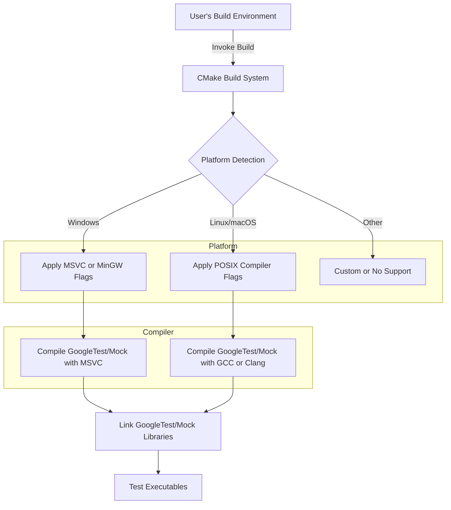

# Platform and Toolchain Compatibility

Ensuring robust testing across multiple platforms and toolchains is central to effective usage of GoogleTest and Google Mock. This guide navigates you through supported platforms, compiler requirements, integration strategies with common build systems, and environment-specific considerations. By understanding these compatibility aspects, you can confidently incorporate GoogleTest and Google Mock into diverse development workflows, avoiding common pitfalls and ensuring smooth, reliable builds.

---

## Supported Platforms

GoogleTest and Google Mock are designed with cross-platform compatibility in mind. They support a broad range of environments, from modern desktop operating systems to embedded and mobile platforms. Compatibility is assured via a set of well-defined macros and platform detection utilities.

### Platform Detection Macros

GoogleTest automatically detects the platform at compile time and defines corresponding macros that indicate the environment. Examples include:

- `GTEST_OS_WINDOWS`, `GTEST_OS_LINUX`, `GTEST_OS_MAC`: Indicate Windows, Linux, and macOS respectively.
- Variants such as `GTEST_OS_WINDOWS_DESKTOP`, `GTEST_OS_LINUX_ANDROID`, and `GTEST_OS_IOS` provide more granular detection.

These macros help conditionally compile code and enable or disable specific features based on platform capabilities.

### Platform Coverage

The frameworks support:

- **Desktop OS:** Windows (including MinGW), Linux, macOS, FreeBSD, Solaris, AIX, z/OS
- **Mobile and Embedded:** Android, iOS, Windows Phone, Windows RT
- **Other:** Cygwin, Haiku, NetBSD, OpenBSD, QNX

### Threading Support

Thread safety relies on platform support for threading primitives:
- POSIX threads (`pthread`) are used on *nix systems where available.
- Windows threading primitives are used on Windows platforms.

You can verify whether threading support is enabled through the macro `GTEST_HAS_PTHREAD`. When detected, GoogleTest and Google Mock provide thread-safe execution; otherwise, they fall back to a single-threaded mode.

---

## Compiler Compatibility and Requirements

To build and use GoogleTest and Google Mock, your compiler must support **C++17** or later. Attempting to build with older standards will raise errors.

### Required Compiler Versions

- **Microsoft Visual C++:** Version 2015 (Visual Studio 14.0) or later.
- **GCC:** Version supporting C++17 features, typically GCC 7 and above.
- **Clang (including Apple's LLVM Clang):** Version 3.4.1 or later.

Attempting to use older compilers or unsupported versions results in compilation failures. For Visual Studio users, this is enforced by checks in the codebase (e.g., error directive if `_MSC_VER < 1900`).

### Compiler Flags

GoogleTest's build scripts and CMake functions automatically adapt compiler flags for safety, warnings, and compatibility.

Examples of flag adjustments:

- For **MSVC**:
  - Replaces `/MD` with `/MT` for static runtime linkage when appropriate.
  - Enables warnings level `/W4`.
  - Suppresses specific warnings such as unreachable code (`-wd4702`) and disables exception handling if configured.
  - Forces source files to be treated as UTF-8 (`-utf-8`).

- For **Clang, GCC, IntelLLVM**:
  - Enables strict warning flags like `-Wall` and `-Wshadow`.
  - Adjusts exception and RTTI flags (`-fexceptions`, `-fno-rtti`).
  - Applies platform- or compiler-specific workaround flags.

### C++ Standard Specification

Your build configuration must explicitly enable C++17. For CMake-based projects, this is typically done via:

```cmake
set(CMAKE_CXX_STANDARD 17)
set(CMAKE_CXX_STANDARD_REQUIRED ON)
```

If integrating into projects that do not set this, you will need to provide appropriate compiler flags (e.g., `-std=c++17`).

---

## Build System Integration

GoogleTest and Google Mock provide seamless integration points for popular build systems, primarily CMake, but also others like Bazel.

### Building as a Standalone Project with CMake

Typical workflow:

```bash
git clone https://github.com/google/googletest.git -b v1.17.0
cd googletest
mkdir build && cd build
cmake ..
make
sudo make install
```

This automatically builds GoogleTest and includes GoogleMock unless overridden by `-DBUILD_GMOCK=OFF`.

### Integrating With Existing CMake Projects

GoogleTest source can be added to your own project via `add_subdirectory()`, allowing consistent compiler and linker flags:

```cmake
include(FetchContent)
FetchContent_Declare(
  googletest
  URL https://github.com/google/googletest/archive/5376968f6948923e2411081fd9372e71a59d8e77.zip
)
set(gtest_force_shared_crt ON CACHE BOOL "" FORCE) # Windows runtime linkage fix
FetchContent_MakeAvailable(googletest)

add_executable(example example.cpp)
target_link_libraries(example gtest_main)
add_test(NAME example_test COMMAND example)
```

The `gtest_force_shared_crt` option resolves the common Visual Studio runtime conflicts by linking GoogleTest dynamically.

---

## Platform-Specific Considerations

### Windows Runtime Library Linking

By default, GoogleTest links the C runtime statically (`/MT`), but many Visual Studio projects use dynamic linkage (`/MD`). This can cause linker errors like:

```
gtest.lib(gtest-all.obj) : error LNK2038: mismatch detected for 'RuntimeLibrary'
```

Activating the CMake cache option `gtest_force_shared_crt` aligns GoogleTest's runtime linkage with your project, avoiding such errors.

### Thread Safety and Pthreads on MinGW

- Pthread support on MinGW is limited and may cause compatibility issues.
- GoogleTest disables `GTEST_HAS_PTHREAD` automatically on MinGW.

If threading support is critical on your environment, verify and configure explicitly using `-DGTEST_HAS_PTHREAD=1` or `0` as suitable.

### Platform-Specific Flags and Macros

GoogleTest and Google Mock employ platform-indicative macros such as `GTEST_OS_WINDOWS`, `GTEST_OS_LINUX`, and others to adapt functionality internally.

You can rely on these macros to customize your tests or configure build options when targeting specific platforms.

---

## Flag Support and Deprecation

Google Mock defines several flags that you can reference or override programmatically.

For instance, using Abseil flags integration when available or fallback to internal flag implementations:

- Defining flags like `GMOCK_DEFINE_bool_` or `GMOCK_DECLARE_int32_` depending on configuration.
- Safe retrieval and setting of flag values using `GMOCK_FLAG_GET()` and `GMOCK_FLAG_SET()`.

Refer to the customization sections in `gmock-port.h` for detailed usage.

---

## Best Practices and Common Pitfalls

- **Build consistency:** Ensure GoogleTest and your project use the same compiler version, flags, and runtime linkage to avoid mysterious link errors.
- **Use C++17 or later:** Older standards are unsupported and generate build-time errors.
- **Platform macros usage:** Leverage platform macros to guard platform-specific code or tests gracefully.
- **Thread safety awareness:** Check `GTEST_HAS_PTHREAD` and configure accordingly.

---

## Troubleshooting

If you encounter issues such as:

- Build errors related to compiler flags or versions
- Runtime library mismatch on Windows
- Missing pthread or threading issues
- Unsupported platform errors

Use these approaches:

- Verify compiler and C++ standard version compliance
- Enable or disable threading support explicitly with macros
- Use provided CMake options, especially on Windows
- Consult platform-specific macros to conditionally compile

For additional help, refer to the Troubleshooting Installation and Configuration guide.

---

## Summary

This guide equips you with essential knowledge to successfully build and integrate GoogleTest and Google Mock across diverse platforms and toolchains. By aligning your development environment with platform-specific requirements, compiler standards, and build best practices, you can ensure your tests build reliably and run as expected.

---

## References and Further Reading

- [System Requirements & Supported Platforms](../../getting-started/prerequisites-installation/requirements-overview)
- [Installing GoogleTest](../../getting-started/prerequisites-installation/installation-methods)
- [Configuring Your Project for GoogleTest](../../getting-started/configuration-first-test/project-setup)
- [Troubleshooting Installation and Configuration](../../getting-started/troubleshooting-validation/common-setup-issues)
- [GoogleMock Flags and Customization](../../api-reference/integration-examples/config-options)
- [GoogleTest CMake Build Instructions](https://github.com/google/googletest/blob/main/README.md#build-with-cmake)

---

## Mermaid Diagram: Platform and Build Integration Overview



---

## Practical Example: Enabling GoogleTest in a CMake Project

```cmake
include(FetchContent)
FetchContent_Declare(
  googletest
  URL https://github.com/google/googletest/archive/release-1.17.0.zip
)
set(gtest_force_shared_crt ON CACHE BOOL "" FORCE)
FetchContent_MakeAvailable(googletest)

target_link_libraries(my_test PRIVATE gtest gtest_main)

# Enable C++17 standard
set_target_properties(my_test PROPERTIES
  CXX_STANDARD 17
  CXX_STANDARD_REQUIRED ON
)
```

This example demonstrates embedding GoogleTest directly, configuring runtime linkage, and setting the minimum C++ standard.

---

<Tip>
Always ensure that your project’s compiler and linker flags are consistent with those used to build GoogleTest and Google Mock. Mismatched runtimes or standard versions are the most common cause of build failures.
</Tip>

<Warning>
Building GoogleTest or Google Mock with unsupported compiler versions or without proper C++17 support will result in immediate compilation errors.
</Warning>

<Note>
On Windows, if you see `RuntimeLibrary` mismatch errors, try enabling the `gtest_force_shared_crt` option in your CMake configuration.
</Note>
