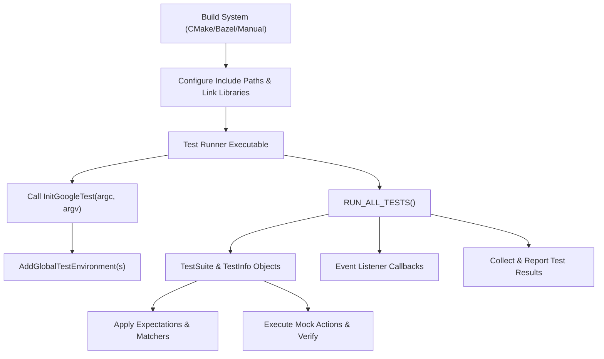

# Integration Patterns and Extensibility

Successfully integrating GoogleTest and GoogleMock into your build system is crucial for seamless test execution and extensibility. This guide walks you through common integration approaches, discusses environment management, illustrates how to customize test behavior, and explores extension points like custom actions and matchers. Whether you’re setting up a main test runner or enhancing mock behaviors, this guide empowers you to tailor the framework to your project’s needs.

---

## 1. Integrating GoogleTest and GoogleMock with Build Systems

GoogleTest and GoogleMock are designed to integrate smoothly with popular C++ build tools, enabling robust test automation within your development environment.

### 1.1 Common Build System Support

- **CMake Integration**: The recommended approach for modern C++ projects. GoogleTest provides CMake scripts (`CMakeLists.txt`) that allow you to add it as a subdirectory or use pre-installed packages. This ensures compiler and linker settings remain consistent between your application and tests.

- **Bazel Integration**: For Bazel-based projects, you can incorporate GoogleTest and GoogleMock by declaring dependencies in your build files. This integration supports scalable, hermetic builds optimized for large codebases.

- **Manual Integration**: Alternatively, you can include GoogleTest and GoogleMock sources directly, adjusting include paths and linking appropriately.

  ```cmake
  # FetchContent example for GoogleTest in CMake
  include(FetchContent)
  FetchContent_Declare(
    googletest
    URL https://github.com/google/googletest/archive/refs/tags/release-1.17.0.zip
  )
  FetchContent_MakeAvailable(googletest)

  add_executable(MyTests test_main.cpp my_tests.cpp)
  target_link_libraries(MyTests gtest_main gmock_main)
  add_test(NAME MyTests COMMAND MyTests)
  ```

### 1.2 Linking Strategies

- Use `gtest` for GoogleTest only, or `gmock` if you need mocking capabilities.
- `gmock_main` is a convenient library that includes a `main()` function.
- Link your test executables against these libraries and ensure headers are accessible.

### 1.3 Configuration Setup

- Set the C++ standard (C++17 or newer) in your build to satisfy GoogleTest's requirements.
- Specify compiler flags and ensure thread support if multithreading tests are anticipated.

## 2. Customizing Your Test Runner and Environment

### 2.1 Writing a Custom Main Function

By default, GoogleTest provides a ready-to-use main function through `gtest_main`. However, if you need to customize setup or teardown around your tests, you can write your own main function:

```cpp
#include <gtest/gtest.h>

int main(int argc, char** argv) {
  ::testing::InitGoogleTest(&argc, argv);

  // Perform global initialization here

  int result = RUN_ALL_TESTS();

  // Perform global cleanup here

  return result;
}
```

### 2.2 Managing Global and Test-Level Environments

GoogleTest allows users to define global environments that perform setup and teardown once for the entire test program:

```cpp
class MyGlobalEnvironment : public ::testing::Environment {
public:
  void SetUp() override {
    // Initialize shared resources
  }

  void TearDown() override {
    // Cleanup shared resources
  }
};

int main(int argc, char** argv) {
  ::testing::InitGoogleTest(&argc, argv);
  ::testing::AddGlobalTestEnvironment(new MyGlobalEnvironment);
  return RUN_ALL_TESTS();
}
```

These environments provide a central place to manage costly or shared resources.

## 3. Extension Points: Custom Actions, Matchers, and Test Behaviors

GoogleTest and GoogleMock expose powerful extension points to craft precise and expressive tests.

### 3.1 Custom Matchers

Matchers verify arguments passed to mock methods. While GoogleMock offers an extensive set of built-in matchers, users can define custom matchers to capture domain-specific validation:

```cpp
// A simple matcher that checks if an integer is even
MATCHER(IsEven, "is an even number") {
    return (arg % 2) == 0;
}

EXPECT_CALL(mock_obj, Foo(IsEven()));
```

These can be parameterized and can provide detailed failure messages.

### 3.2 Custom Actions

Actions define what a mock method does when invoked. GoogleMock provides various built-in actions like `Return()`, `SetArgPointee()`, and `Invoke()`.

You can also create your own:

```cpp
struct MultiplyByFactor {
  int factor;
  int operator()(int x) { return x * factor; }
};

EXPECT_CALL(mock_obj, Compute(_))
    .WillOnce(MultiplyByFactor{10});
```

This supports complex behaviors like stateful computations or side effects.

### 3.3 Using ON_CALL and EXPECT_CALL for Behavior and Verification

- Use `ON_CALL` to specify default mock method behavior without expecting calls.
- Use `EXPECT_CALL` to set expectations that methods are called with specified arguments in specific orders, frequencies, or sequences.

Example:

```cpp
ON_CALL(mock_obj, GetData(_)).WillByDefault(Return(42));
EXPECT_CALL(mock_obj, GetData(5)).Times(2).WillRepeatedly(Return(10));
```

This pattern helps selectively verify critical calls while allowing others to use default behavior.

### 3.4 Strictness Wrappers for Mocks

GoogleMock supports wrappers to control how strictly it treats uninteresting calls:

- `NiceMock<T>` suppresses warnings on calls without expectations.
- `StrictMock<T>` treats such calls as errors, causing test failures.
- `NaggyMock<T>` (default) warns but does not fail.

Use these judiciously to balance test rigor and maintenance overhead.

## 4. Managing Test Execution Flow

### 4.1 Event Listener Infrastructure

GoogleTest supports custom event listeners to tap into the test lifecycle:

- Start and end of test programs, iterations, and test cases.
- Test successes, failures, skips.

You can write listeners for logging, custom reporting, or integration with other tools.

```cpp
class MyListener : public ::testing::EmptyTestEventListener {
  void OnTestStart(const ::testing::TestInfo& test_info) override {
    std::cout << "Starting test: " << test_info.name() << std::endl;
  }
  void OnTestEnd(const ::testing::TestInfo& test_info) override {
    std::cout << "Finished test: " << test_info.name() << std::endl;
  }
};

int main(int argc, char** argv) {
  ::testing::InitGoogleTest(&argc, argv);
  ::testing::TestEventListeners& listeners =
      ::testing::UnitTest::GetInstance()->listeners();
  listeners.Append(new MyListener);
  return RUN_ALL_TESTS();
}
```

### 4.2 Test Filtering and Sharding

Control which tests to execute via command line flags or environment variables:

- `--gtest_filter` to include/exclude tests by name patterns.
- `GTEST_TOTAL_SHARDS` and `GTEST_SHARD_INDEX` environment variables to divide tests among shards for parallel execution.

## 5. Practical Tips and Best Practices

- Prefer integration via CMake or Bazel for reproducibility and simplicity.
- Use `gmock_main` for quick setup, or write a custom main to integrate additional logic.
- Use global environments to manage expensive setup/teardown shared across tests.
- Default to `ON_CALL` for behavior and reserve `EXPECT_CALL` for essential verifications to keep tests resilient.
- Utilize strictness wrappers (`NiceMock`, `StrictMock`) carefully to avoid brittle tests.
- Extend behavior and verification with custom matchers and actions to express domain constraints clearly.
- Leverage event listeners to hook into test events for enhanced reporting or integration.

## 6. Troubleshooting Integration Issues

- Ensure your build system configures the include paths and links with necessary GoogleTest/GoogleMock libraries.
- Confirm C++ standard compliance (at least C++17).
- For slow compile times, consider moving mock class constructor/destructor definitions into source files.
- Validate linkage by running the sample tests bundled with GoogleTest.

---

## Diagram: Integration Overview Flow



This flow represents the typical integration and runtime test execution cycle.

---

## References and Related Documentation

- [Integrating with Build Systems](/guides/integration-and-patterns/build-system-integration)
- [Mock Object Basics](/guides/mocking-with-gmock/mock-object-basics)
- [Actions and Expectations](/guides/mocking-with-gmock/actions-and-expectations)
- [Test Infrastructure API](/api-reference/core-testing-apis/test-infrastructure)
- [Writing Custom Matchers and Actions](/guides/advanced-testing-patterns/custom-assertions-and-matchers)


For detailed examples and API descriptions, consult the GoogleTest repository and related guides.

---

This guide helps you embed GoogleTest and GoogleMock into your C++ build and test cycles with control and flexibility, enabling you to write maintainable, verifiable, and extendable tests efficiently.
