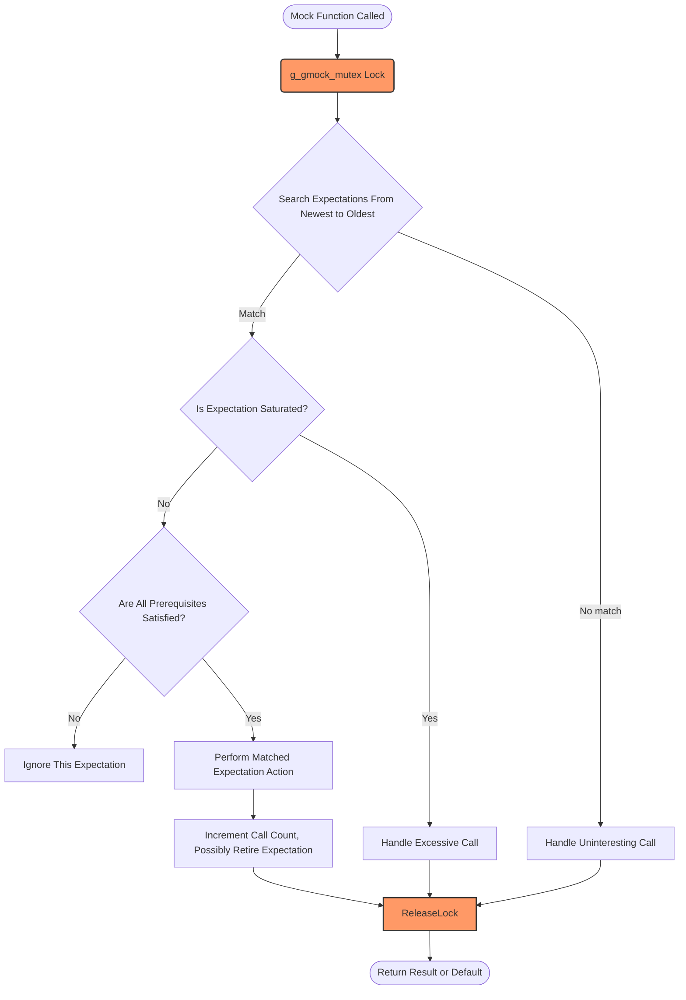

# Scalability and Performance

GoogleTest and GoogleMock are designed to support robust and maintainable testing at scale. This guide provides essential strategies and conceptual guidance on effectively scaling test suites, optimizing test execution, and leveraging parallelism to handle large codebases with confidence.

---

## Introduction

As your C++ codebase grows, the volume and complexity of tests increase correspondingly. To keep test cycles fast and maintainable, it is critical to understand how to write efficient mock setups, manage expectations thoughtfully, and harness GoogleTest’s features for parallel and flexible test execution. This page distills practical patterns and best practices specifically focused on scaling and performance.


---

## Writing Efficient and Maintainable Expectations

### Use ON_CALL vs EXPECT_CALL Appropriately

- **ON_CALL** establishes default behaviors for mock methods without enforcing call count.
- **EXPECT_CALL** both specifies behavior and asserts expectations on call frequency, order, and arguments.

**Best Practice:** Use `ON_CALL` to define general default behavior, such as in test fixture setup or mock constructor. Reserve `EXPECT_CALL` for cases where you want to strictly verify interaction patterns. Overusing `EXPECT_CALL` can bloat tests and slow execution.

<Info>
Over-specifying expectations increases brittleness and test maintenance costs. Favor lean expectation sets.
</Info>


### Limit the Number of Active Expectations

GoogleMock processes expectations from newest to oldest until a match is found. To minimize matching overhead:

- Collate broadly scoped `EXPECT_CALL` statements early (e.g., catch-all expectations).
- Place more specific expectations **after** the generalized ones so they take precedence.
- Use `.RetiresOnSaturation()` for expectations that should deactivate once saturated, preventing unnecessary matching later.


### Ordering and Sequences

When calls must occur in a specific order, prefer using `InSequence` or `After` clauses:

```cpp
{
  InSequence s;
  EXPECT_CALL(mock, FirstCall());
  EXPECT_CALL(mock, SecondCall());
}
```

Using sequences reduces failed expectation checks and clarifies partial ordering explicitly.


---

## Optimizing Test Execution

### Reducing Flakiness

Ensure mocks and expectations are thread-safe and properly synchronized:

- Avoid side effects or stateful actions during mock invocations without proper locking.
- Use `NiceMock` to suppress irrelevant warnings caused by uninteresting calls when you expect noisy mocks.

### Parallel Test Execution

GoogleTest supports test-level parallelism through external frameworks (e.g., `gtest-parallel`, Bazel parallel test runners). To maximize gains:

- Structure tests to be independent, avoiding shared mutable state.
- Use minimal global or static state in mocks.
- Leverage sequences and retirement of expectations to limit mock overhead under concurrency.

<Note>
GoogleMock internally uses a global mutex to serialize mock method calls for correctness. However, parallel tests running completely independent mock objects in separate threads achieve good scaling.
</Note>


### Profiling and Detecting Bottlenecks

For large test suites:

- Monitor test runtime to identify tests with excessive mock calls or complex matching.
- Reduce excessive and redundant expectations.
- Use `--gmock_verbose=info` for detailed mock call logging during troubleshooting.


---

## Managing Mock Object Lifecycle for Performance

### Early Verification and Cleanup

Use `Mock::VerifyAndClearExpectations(&mock_obj)` to force expectation verification and reset mock state before destruction. This improves detection of unsatisfied expectations promptly and frees resources for lengthy test suites with many mocks.

### Allowing Leaks Intentionally

In rare cases where mocks are deliberately leaked (e.g., long-lived mocks), use `Mock::AllowLeak(&mock_obj)` to suppress leak warnings and speed tear down.


---

## Common Patterns for Scalable Tests

### Delegating Default Behavior

Define fakes or real implementations and delegate mock default actions to them via `ON_CALL(...).WillByDefault(Invoke(&real_obj, &RealClass::Method))`. This reduces boilerplate and keeps expectations focused.

### Chaining Multiple Actions

Use `DoAll()` to combine multiple actions in expectations without splitting them across many calls. This streamlines test setup and reduces overhead.


---

## Summary of Key Features Supporting Performance

- **Automatic expectation ordering with `InSequence` and `After`** helps manage complex test flows efficiently.
- **Sticky expectations and explicit retirement** optimize matching logic.
- **Flexible verbosity controls (`--gmock_verbose`)** enable detailed diagnostics only when needed.
- **Global mutex synchronization internally** ensures thread safety with strategic locking to avoid deadlocks.
- **Mock object registry and leak detection** assist in maintaining healthy test suites.


---

## Troubleshooting Performance Issues

- If expectations seem not to work reliably on multithreaded tests, verify that expectation setup and mock destruction are performed single-threaded.
- Beware of excessive `EXPECT_CALL` with overlapping matchers causing repeated costly matching.
- With move-only types or complex actions, confirm that custom actions do not introduce serialization bottlenecks.


---

## Illustrative Example: Efficient Mock Setup with Sequencing

```cpp
using ::testing::InSequence;
using ::testing::Return;

class MockWorker {
public:
  MOCK_METHOD(void, Start, (), ());
  MOCK_METHOD(int, Compute, (int x), ());
  MOCK_METHOD(void, Finish, (), ());
};

TEST(WorkerTest, ProcessSequence) {
  MockWorker worker;
  {
    InSequence s;  // Ensures calls occur in this order
    EXPECT_CALL(worker, Start()).Times(1);
    EXPECT_CALL(worker, Compute(42))
        .WillOnce(Return(100))
        .RetiresOnSaturation();  // Retires after first use
    EXPECT_CALL(worker, Finish()).Times(1);
  }

  worker.Start();
  int result = worker.Compute(42);
  EXPECT_EQ(result, 100);
  worker.Finish();
}
```

This approach clearly expresses the expected call order, avoids sticky expectations causing unintended matches, and promotes maintainability.


---

For further best practices, consult the related guides on [Test Performance and Scaling Best Practices](../guides/real-world-integration/test-performance-and-scaling) and integration patterns.


---

## References & Related Documentation

- [gMock Cookbook](https://github.com/google/googletest/blob/main/docs/gmock_cook_book.md) — Practical examples and advanced patterns.
- [Mocking APIs and Macros](../api-reference/core-testing-apis/mocking-apis) — Reference for `MOCK_METHOD`, `EXPECT_CALL`, and `ON_CALL`.
- [Core Concepts and Terminology](../overview/product-intro-core-concepts/core-concepts-terminology) — Fundamental GoogleTest vocabulary.
- [Test Discovery and Execution Lifecycle](../concepts/architecture-core-concepts/test-discovery-lifecycle) — Understand how tests run under the hood.
- [Using GoogleTest and GoogleMock in Your Build System](../guides/real-world-integration/using-google-test-in-your-build-system) — Integration insights.


---

## Action Items

- Apply the `ON_CALL` vs `EXPECT_CALL` distinction to control test strictness.
- Use `InSequence` and `RetiresOnSaturation` to efficiently express call order and retire expectations.
- Run tests with `--gmock_verbose=info` to diagnose expectation matching performance.
- Consider parallelizing test execution at the test binary level, ensuring mocks are thread-safe.
- Monitor and profile tests to find hotspots caused by excessive or complex mocking.


---

## Diagram: Conceptual Flow of Mock Expectation Matching and Execution



This flow highlights the critical locking region around expectation matching to ensure concurrency safety, while actions themselves are executed outside the lock to avoid deadlocks.
