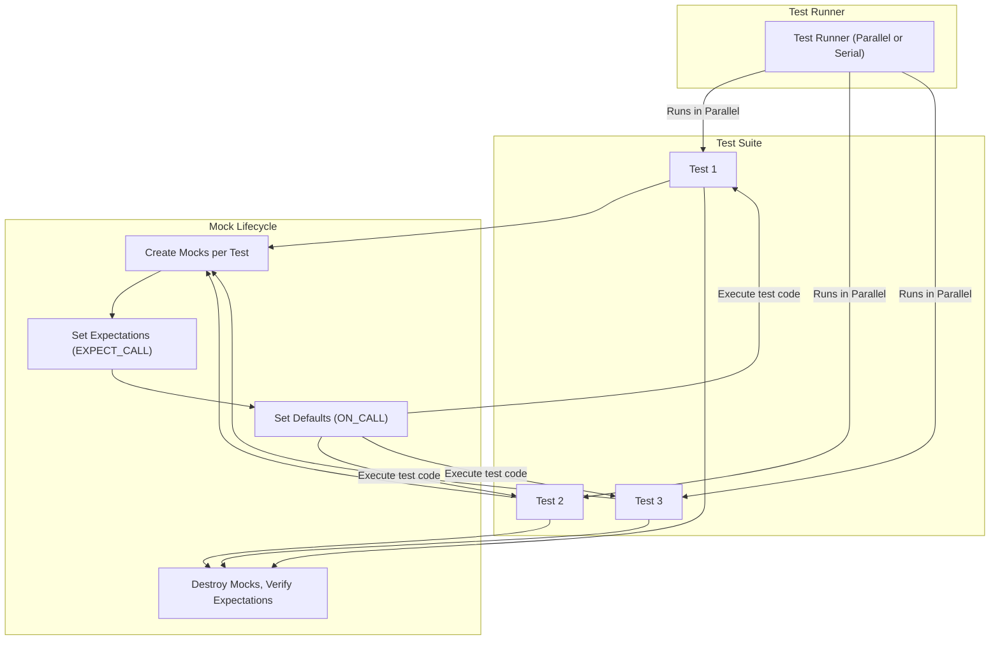

# Performance, Reliability, and Parallelism in GoogleMock Tests

## Introduction

As your test suite grows beyond a few tests, ensuring its speed, robustness, and scalability becomes paramount. This guide focuses on practical recommendations to write scalable and robust tests using GoogleMock, particularly addressing **parallel test execution**, managing **resource constraints**, and **efficient mock management** in large test suites. By following these principles, you will build tests that run quickly, detect regressions reliably, and scale effectively as your codebase expands.

---

## Achieving Scalable Test Execution

### Why Scale Matters

Large test suites can slow down your development cycle if run serially, leading to increased feedback latency and developer frustration. Efficient parallelism can reduce wall-clock time dramatically but requires careful consideration to avoid flaky tests and resource contention.

### Recommendations for Parallel Test Runs

1. **Isolate Tests Completely**
   - Tests should avoid sharing any mutable global or static state.
   - Mock objects in GoogleMock are scoped and verified per test; do not share mocks across threads or tests.
   - Ensure no side effects leak between tests to prevent flakiness under parallel execution.

2. **Avoid Global or Shared Resources Where Possible**
   - External resources like files, network ports, or databases should be mocked or isolated uniquely per test.
   - Use dependency injection to replace real dependencies with mocks or fakes.

3. **Configure Your Test Runner for Parallelism**
   - Use your build system or test execution framework’s support for parallel jobs.
   - Monitor resource usage (CPU, memory, IO) to tune the number of parallel threads or processes.

4. **Synchronize Ordered Expectations Judiciously**
   - GoogleMock supports call sequence control (`InSequence`, `After`), but these impose constraints incompatible with parallel runs.
   - Structure tests so that ordering constraints are localized to a single test or exclude tests with strict ordering from parallel runs.

5. **Use Fresh Mocks Per Test**
   - Avoid mocking shared singleton objects or static methods that can be modified concurrently.
   - Each test’s mock lifecycle ensures isolation and simplifies concurrency guarantees.

**Tip:** If you encounter intermittent failures after enabling parallel runs, audit for shared state or external dependencies accessed without synchronization.

---

## Managing Resource Constraints

### Understanding Resource Bottlenecks

Tests that exhaust memory, file handles, sockets, or CPU can degrade test reliability and slow down execution. Large mock suites can amplify this impact if mocks are resource-intensive or leak objects.

### Preventing Mock Leaks

GoogleMock warnings and errors about leaked mock objects, such as:

```text
ERROR: this mock object should be deleted but never is. Its address is @0x#.
```

indicate that mocks are not properly destroyed, preventing verification of expectations and risking false positives in tests.

#### Best Practices for Mock Lifecycle

- Always ensure mocks are **destroyed** at test completion.
- When creating mocks on the heap, consider ownership models and use smart pointers where possible.
- Use `testing::Mock::AllowLeak()` only when intentionally ignoring a mock’s lifecycle (rare and discouraged).
- Regularly run tests with heap checkers enabled to catch leaks early.

### Efficient Mock Creation

- Define mocks close to your test logic, ensuring they are constructed and destroyed within the test fixture or test scope.
- Avoid unnecessary mocks or mock methods; mock only what your test requires.
- Use `NiceMock` for suppressing unimportant warnings when mocks might receive uninteresting calls, improving test output clarity.

### System Resource Usage

- Avoid excessive creation of threads or processes within tests.
- Limit parallelism based on your system’s CPU cores and memory.
- Use mocking to avoid expensive setup of real resources.

---

## Writing Robust Tests for Large Suites

### Managing Complex Expectations

- Use precise expectations with `EXPECT_CALL` to monitor interaction properly.
- Beware of over-specification which leads to brittle tests; prefer broader matchers where possible.
- Use `.RetiresOnSaturation()` on expectations that should become inactive after usage to prevent lingering constraints.

### Handling Parallel Execution Pitfalls

- Avoid shared state or static mutable state within mocks or tests.
- Structure tests without hidden dependencies on execution order.
- If ordering is critical, isolate to single-threaded tests or sequence blocks.

### Using ON_CALL and EXPECT_CALL Effectively

- Use `ON_CALL` to specify default mock behaviors without enforcing call count.
- Use `EXPECT_CALL` to verify calls that must happen.
- Avoid padding test code with excessive `EXPECT_CALL` for uninteresting calls to reduce maintenance overhead.

<Tip>
When writing tests in large suites:
- Remember that `EXPECT_CALL` implies an expectation and failure on mismatch,
- Whereas `ON_CALL` defines default behavior silently.
</Tip>

---

## Efficient Mock and Expectation Management

### Avoiding Flaky Behavior

- Carefully balance expectations and default actions.
- Use `NiceMock`, `NaggyMock`, or `StrictMock` wrappers to adjust strictness.
- Pay attention to GoogleMock warnings about uninteresting, excessive, unexpected calls (see example warnings in gmock_output_test_golden.txt).

### Example: Managing Expectation Actions

A mismatch between the number of expected call actions and the actual calls leads to warnings or errors like:

```text
GMOCK WARNING:
Too few actions specified in EXPECT_CALL(...).
Expected to be called twice, but has only 1 WillOnce().
```

Avoid this by:
- Ensuring `.Times()` matches the number of `.WillOnce()` clauses,
- Providing `.WillRepeatedly()` for calls beyond `.WillOnce()` clauses,
- Using `.RetiresOnSaturation()` where appropriate to mark expectations inactive after saturation.

### Example Workflow for Defining Expectation with Actions

```cpp
EXPECT_CALL(mockFoo, Method(_))
    .Times(3)
    .WillOnce(Return(true))
    .WillOnce(Return(false))
    .WillOnce(Return(true));
```

For unlimited calls:

```cpp
EXPECT_CALL(mockFoo, Method(_))
    .WillRepeatedly(Return(true));
```

---

## Troubleshooting Common Issues in Large Suites

### Leaked Mocks

- Check that every new-ed mock gets deleted.
- Use `Mock::VerifyAndClearExpectations()` in tests where destruction timing is uncertain.
- Avoid suppressing errors by `AllowLeak()` unless intentional.

### Unexpected or Excessive Calls

- Review `EXPECT_CALL` matchers for accuracy.
- Use `.Times(AnyNumber())` to permit multiple calls if appropriate.
- Ensure `.WillRepeatedly()` is specified if calls exceed `.WillOnce()` actions.

### Parallelism-related Flakes

- Audit shared data or singletons accessed concurrently.
- Prefer process-level parallelism when tests cannot be fully thread-safe.

---

## Summary

By adopting explicit mock lifecycles, precise expectation management, and designing tests for parallel execution, you will create scalable, reliable test suites. Keep the test environment isolated, avoid shared mutable state, and leverage GoogleMock’s flexible expectation APIs to gain confidence in your tests’ robustness.

---

## References and Further Reading

- [gMock Cheat Sheet](../docs/gmock_cheat_sheet.md) — Quick reference for mock and expectation syntax.
- [Mocking Reference](../docs/reference/mocking.md) — Detailed explanation of macros and classes.
- [gMock Cookbook](../docs/gmock_cook_book.md) — Recipes and practical examples for advanced mocking scenarios.
- [GoogleTest Primer](../docs/primer.md) — Foundational knowledge for writing tests.
- [Best Practices for Mocking and Expectations](../guides/mocking-techniques/best-practices-mocking.md) — Recommendations for maintainable mocks.
- Example warning and error messages from [gmock_output_test_golden.txt](googlemock/test/gmock_output_test_golden.txt) — Illustrative output highlighting issues with expectation mismatches and leaks.

---

## Diagram: Test Execution Flow with Parallelism and Mock Lifecycle



This diagram illustrates that each test creates and verifies its own mocks, allowing for safe parallel execution if tests are isolated.
