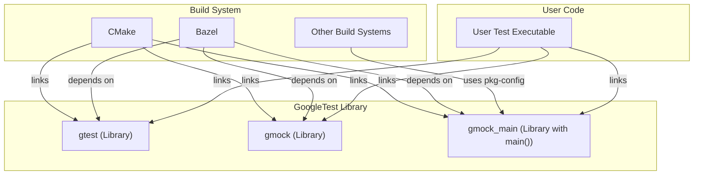

# Extensibility and Build Integration

This section explores how you can integrate GoogleTest and GoogleMock effectively into your build systems, such as CMake and Bazel, and how you can extend its capabilities by writing custom assertions, matchers, and test listeners. The goal is to empower you to adopt GoogleTest in large, complex codebases while maintaining flexibility, scalability, and deep integration with your development environment.

---

## 1. Build System Integration Patterns

GoogleTest and GoogleMock provide several features for smooth integration into common C++ build systems. Understanding these patterns can significantly streamline setup, reduce build times, and ensure reliable test execution.

### 1.1. Building with CMake

GoogleTest includes a community-maintained CMake build script that supports building the libraries, optional inclusion of tests, and installation.

#### Key Features:

- Modular targets: `gtest`, `gtest_main`, `gmock`, and `gmock_main` provide separate options depending on whether you want a main function provided.
- Control over shared vs static library builds with the standard CMake `BUILD_SHARED_LIBS` flag.
- Hermetic build support for tightly controlled environments.
- Built-in support for running GoogleMock's own tests, helpful for validation.

#### Basic CMake Usage Example:

```cmake
cmake_minimum_required(VERSION 3.13)
project(MyProject CXX)

# Enable GoogleTest and GoogleMock via FetchContent or add_subdirectory
FetchContent_Declare(
  googletest
  URL https://github.com/google/googletest/archive/release-1.12.1.zip
)
FetchContent_MakeAvailable(googletest)

add_executable(my_tests test_main.cpp my_tests.cpp)
target_link_libraries(my_tests PRIVATE gtest_main gmock)

include(GoogleTest)
gtest_discover_tests(my_tests)
```

#### Best Practices:

- Prefer linking to `gtest_main` or `gmock_main` to leverage provided main() entry points unless custom main is required.
- Use modern CMake targets instead of legacy include directories.
- Support hermetic build configurations if consistency across environments is important.

### 1.2. Build Integration with Bazel

GoogleTest and GoogleMock offer official Bazel support with prebuilt rules for test targets, enabling straightforward test suite definitions and execution.

- Use `cc_test` rules in Bazel to define test targets that link against `@com_google_googletest//:gtest_main` and `@com_google_googletest//:gmock_main`.
- Co-locate tests with code for maintainability.

### 1.3. Integration via pkg-config

pkg-config `.pc` files are provided for `gtest`, `gmock`, `gmock_main` and `gmock_main` packages allowing easy integration with other build systems that support pkg-config.

Example usage:

```bash
pkg-config --cflags --libs gmock_main
```

### 1.4. Linking and Compilation Tips

- To speed up compilation, especially for mocks, move mock class constructors and destructors to `.cc` files.
- Resolve macro collisions (common on Windows with Win32 APIs) by careful inclusion order or using macro exemptions.

---

## 2. Extending GoogleTest Framework Functionality

### 2.1. Writing Custom Assertions and Matchers

GoogleTest provides a powerful mechanism to write your own assertions and matchers, allowing you to express domain-specific validation in a natural, readable form.

- Use `MATCHER`, `MATCHER_P`, and `MATCHER_P*` macros to create custom matchers quickly.
- Implement the matcher interface directly for more control and expressive diagnostics.

Example:

```cpp
MATCHER(IsEven, "checks if a number is even") {
  return (arg % 2) == 0;
}

EXPECT_THAT(value, IsEven());
```

This enables diagnostic messages tailored to your problem domain, making test failures more actionable.

### 2.2. Writing Custom Actions

If the built-in mock actions do not suit your needs, you can create custom actions via:

- Simple lambdas or callable structs with an appropriately compatible call operator.
- The `ACTION` and `ACTION_P*` macros for parameterized actions.
- Implementing the `ActionInterface<F>` when you need full control.

Example custom action that increments a pointer:

```cpp
ACTION(IncrementArg0) {
  ++(*arg0);
  return 0;
}

EXPECT_CALL(mock, Foo(_))
    .WillOnce(IncrementArg0());
```

### 2.3. Custom Test Event Listeners

GoogleTest allows you to register custom test event listeners to react to test lifecycle events, such as test start, test end, failure, or environment setup.

- Implement `::testing::TestEventListener` interface or subclass existing listeners.
- Register listeners using `::testing::UnitTest::GetInstance()->listeners()`.

This is useful for custom logging, reporting, or integration with external systems.

---

## 3. Best Practices for Large Codebase Adoption

### 3.1. Incremental Integration

- Gradually add GoogleTest to your project, starting with new modules or components.
- Use interfaces and adapters to isolate legacy code for targeted testability.
- Use mocks, fakes, and stubs appropriately without over-mocking.

### 3.2. Organizing Tests and Build Targets

- Structure test suites to match your project's hierarchy.
- Use parameterized and typed tests for reusable test logic.
- Group tests in dedicated targets when possible to reduce rebuild scope.

### 3.3. Managing Test Dependencies and Protobufs

- Isolate unstable or expensive dependencies in dedicated test targets.
- Use precompiled headers and caching tooling where appropriate.

### 3.4. Monitoring and Controlling Verbose Output

- Adjust `--gmock_verbose` flag to control mock call reporting and warnings.
- Use `NiceMock`, `NaggyMock`, or `StrictMock` based on your test phase to balance verbosity versus strictness.

---

## 4. Sample Mermaid Diagram: Build System Integration Overview



---

## 5. Additional Resources & References

- [GoogleMock Cookbook](https://google.github.io/googletest/gmock_cook_book.html) — Recipes for using advanced mocking features and customizations.
- [Mocking Reference](https://google.github.io/googletest/reference/mocking.md) — API details for mocking and expectation setting.
- [Custom Actions and Matchers](https://google.github.io/googletest/api/advanced_testing_features/custom_actions_and_matchers.html) — How to create custom matchers and actions.
- [Continuous Integration & Build System Integration Guide](https://google.github.io/googletest/guides/real-world-integration/ci-build-integration.html) — Best practices for integrating tests into CI and build pipelines.
- [Platform & Toolchain Support](https://google.github.io/googletest/overview/integration-and-ecosystem/platform-support.html) — Supported platforms and compilers to consider when integrating.


<Tip>
For large projects, generating mock definitions in separate compilation units speeds up builds by limiting recompilation.
</Tip>

<Note>
Managing mock strictness and verbosity with `NiceMock`, `NaggyMock`, and `StrictMock` allows gradual hardening of tests for better maintenance.
</Note>

<Warning>
Avoid over-specifying expectations in `EXPECT_CALL` to prevent brittle tests. Prefer `ON_CALL` for default behaviors.
</Warning>