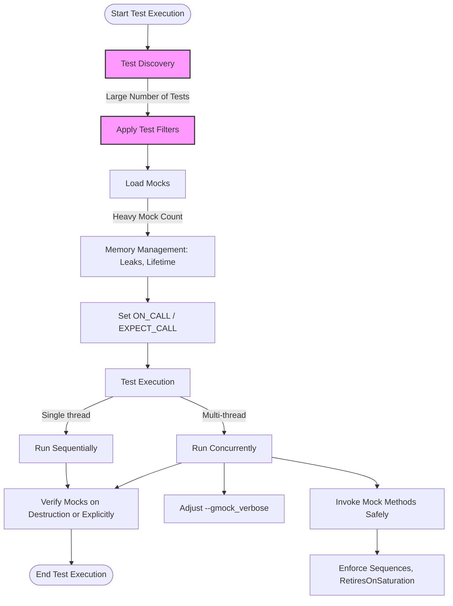

# Scalability & Performance Considerations

As your GoogleTest suite grows, it is crucial to maintain efficient performance and reliable behavior. This page guides you through best practices and features of the GoogleMock framework that help ensure scalability is manageable — from test discovery under scale, effective parallelization strategies, to memory management tips.

---

## Managing Scalability in Large Test Suites

When implementing tests with GoogleMock, large test suites may introduce challenges like slow test discovery, increased memory consumption, or test flakiness. Proper handling is necessary to keep your tests fast, stable, and maintainable.

### Test Discovery Under Scale

GoogleTest automatically discovers test cases written using its macros. As the number of tests grows, the following practices ensure smooth discovery:

- **Consistent Naming:** Use clear, consistent test suite and test names to simplify filtering and management.
- **Efficient Filtering:** Use test filtering flags (e.g. `--gtest_filter`) to run subsets of tests when needed.

These techniques prevent performance bottlenecks during test discovery and execution startup.

### Memory Management Considerations

GoogleMock facilitates efficient memory use, but mocks and tests must be mindful of lifetime and resource management:

- **Avoid Leaking Mocks:** Mocks that go out of scope automatically verify expectations. Leaked mocks may cause missed verification and increased memory use.
- **Use `Mock::AllowLeak()` Sparingly:** When intentional leaks occur, explicitly mark mocks using `Mock::AllowLeak()` to suppress false positives and control memory behavior.
- **Minimize Large Mock Classes:** Excessively large mock classes can increase compilation times and resource demands. Where feasible, split mocks or minimize the number of mocked methods.
- **Avoid `/clr` Compiler Flag in MSVC:** If compiling on MS Visual C++, avoid `/clr` when compiling mocks to prevent excessive memory usage.

### Parallelization Strategies

To reduce overall test duration and improve throughput, parallel execution is critical:

- **Leverage GoogleTest Parallel Execution:** Use test runners or continuous integration configurations that support parallel and/or sharded test runs.
- **Isolate Test Fixtures:** Keep test fixtures lightweight and independent to avoid contention and deadlocks in concurrent runs.
- **Avoid Shared State in Tests:** Minimize shared global or static state to reduce flakiness and race conditions when tests run in parallel.

### Managing Expectations Under Load

GoogleMock’s expectation model supports progressive matching and effective failure reporting even in heavily stressed or concurrent tests:

- **Sticky Expectations:** By default, expectations remain active until explicitly retired or the test ends. This ensures consistent behavior under concurrent invocation.
- **Retiring Expectations:** Use `.RetiresOnSaturation()` to deactivate expectations once they are fulfilled, preventing unexpected call errors.
- **Sequences and Partial Ordering:** Utilize `Sequence` and `.InSequence()` to express ordering constraints which help maintain test correctness and prevent race-related failures.
- **Verbose Output for Debugging:** Under performance pressure, enable `--gmock_verbose=info` to trace calls, understand matching logic, and quickly identify bottlenecks or ordering issues.

### Thread Safety and Multi-threading

GoogleMock supports concurrent testing scenarios, but test authors must design accordingly:

- **Single-threaded Setup and Tear-down:** Configure expectations (`EXPECT_CALL`) and mock lifetimes on a single thread outside of concurrent test execution.
- **Concurrent Mock Method Calls:** Calls to mock methods can happen in multiple threads; GoogleMock automatically synchronizes internally to ensure thread safety.
- **Lock Avoidance in Actions:** Actions triggered by mock calls run in the caller's thread, so avoid actions that can deadlock or cause race conditions.
- **Use `NiceMock`, `NaggyMock`, or `StrictMock` Appropriately:** Control mock strictness to balance noise and test sensitivity, especially in multithreaded environments.

### Compilation Performance

Large mocks can slow compilation significantly:

- **Move Mock Class Constructor and Destructor Out of Headers:** Defining them in source files reduces redundant recompilation.
- **Modularize Mock Classes:** Splitting large mock classes into smaller, focused mocks enhances incremental build speeds.

### Common Pitfalls to Avoid

- Defining mocks with non-virtual destructors causes resource leaks and undefined behavior.
- Over-specifying expectations leads to brittle tests that break with benign code changes.
- Forgetting to retire saturated expectations can cause excessive call errors.
- Mixing test setup and execution in multiple threads causes undefined behavior.

---

## Practical Tips & Best Practices

- When setting multiple expectations, order them from general to specific to leverage back-to-front matching.
- Use `.WillOnce()` combined with `.RetiresOnSaturation()` with sequences for ordered multi-step tests.
- Use `ON_CALL` for default behaviors, reserving `EXPECT_CALL` for methods where call verification is essential.
- Suppress uninteresting call warnings by wrapping mocks in `NiceMock` or setting broader matchers.
- Keep mock methods and tests focused to avoid excessive coupling and memory pressure.
- Utilize logging verbosity flags judiciously for performance diagnostics.

---

## Summary

Scaling your GoogleTest suite with GoogleMock involves mindful test design, understanding mock lifecycles, leveraging framework features for concurrency, and tuning compilation and runtime resources. Apply sequences and ordering to clarify call expectations, manage mock strictness for fewer false positives, and distribute test execution for faster runs.

---

## Additional Resources

- [gMock Cookbook: Using Actions and Expectations](https://google.github.io/googletest/gmock_cook_book.html#actions)
- [Mocking Reference: Defining Expectations and Call Controls](https://google.github.io/googletest/reference/mocking.html#EXPECT_CALL)
- [gMock for Dummies: Mock Usage and Best Practices](https://google.github.io/googletest/gmock_for_dummies.html)
- [GoogleTest Primer: Performance Optimization](https://google.github.io/googletest/guides/performance-optimization.html)
- [Parallel Test Execution Strategies](https://google.github.io/googletest/guides/real-world-integration/performance-optimization.html#parallelization-strategies)

---

## Diagram: GoogleMock Call Flow and Test Scaling Considerations

---