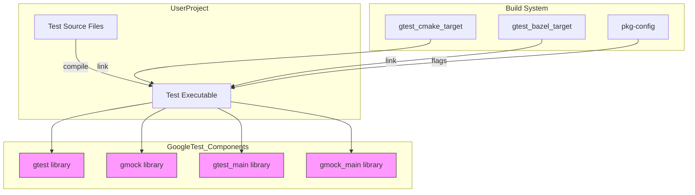

# Build System Integration Patterns

Explore supported ways to integrate GoogleTest and GoogleMock into your builds, including CMake, Bazel, and pkg-config. This guide focuses on platform requirements, configuration best practices, and how these frameworks fit seamlessly into varied development pipelines.

---

## Why Build System Integration Matters

Integrating GoogleTest and GoogleMock effectively into your build system is essential to leverage their full power while ensuring clean, maintainable, and scalable test workflows. A solid integration strategy:

- Simplifies dependency management.
- Enables smooth test discovery and execution.
- Allows flexible customization to match your development environment.

Your build configuration choices directly impact your productivity and the reliability of your tests.

## Supported Integration Methods

GoogleTest and GoogleMock offer first-class support for mainstream build systems, notably **CMake** and **Bazel**, as well as traditional tools like **pkg-config**. Each method comes with its own configuration paradigms and best practices.

### CMake Integration

CMake is the recommended and most widely used approach for integrating GoogleTest and GoogleMock in cross-platform C++ projects.

#### Key Points:
- GoogleTest and GoogleMock can be added as external projects or fetched via `FetchContent`.
- The libraries provide CMake targets such as `gtest`, `gmock`, `gtest_main`, and `gmock_main`, enabling clean linking and dependency specification.
- Use provided CMake variables and macros to set include directories and compile options consistently.

#### Example Setup:
```cmake
include(FetchContent)
FetchContent_Declare(
  googletest
  URL https://github.com/google/googletest/archive/refs/tags/release-1.12.1.zip
)
FetchContent_MakeAvailable(googletest)

add_executable(my_tests test_main.cpp my_tests.cpp)
target_link_libraries(my_tests PRIVATE gtest gmock gtest_main gmock_main)
```

#### Best Practices:
- Link with `gtest_main` or `gmock_main` to get a ready-made `main()` for your tests.
- Use CMake imported targets to manage dependencies automatically.
- Prefer out-of-source builds to keep your source directory clean.

### Bazel Integration

Bazel users benefit from native support via workspace and build rules provided by GoogleTest.

#### Setup:
- Add GoogleTest and GoogleMock to your `WORKSPACE` file using `http_archive` or `git_repository`.
- Reference `@com_google_googletest//` targets like `gtest`, `gmock`, and their main libraries in your `BUILD` files.

#### Example `WORKSPACE` Snippet:
```starlark
http_archive(
    name = "com_google_googletest",
    urls = ["https://github.com/google/googletest/archive/release-1.12.1.zip"],
    strip_prefix = "googletest-release-1.12.1",
)
```

#### Example `BUILD` Snippet:
```starlark
cc_test(
    name = "my_test",
    srcs = ["my_test.cc"],
    deps = ["@com_google_googletest//:gtest_main", "@com_google_googletest//:gmock"]
)
```

#### Tips:
- Bazel handles transitive dependencies and platform-specific configurations internally.
- Use `.bazelrc` to adjust flags globally if needed.

### pkg-config Support

While less common, for projects using traditional build tools (Make, autotools), GoogleTest offers pkg-config files for dependency discovery.

- The `gtest.pc` and `gmock.pc` files help compilers and linkers find include paths and libraries.
- Configure your build system’s `PKG_CONFIG_PATH` to point to the installed pkg-config directory.

Example:
```bash
pkg-config --cflags --libs gtest
```

This outputs the appropriate compiler and linker flags.

## Platform and Threading Considerations

When integrating, be mindful of platform-specific requirements:

- GoogleTest supports Linux, Windows, macOS, and other POSIX systems.
- For thread safety and parallel test execution, ensure your build system enables `pthread` linkage when needed.
- Use provided CMake macros or Bazel options to automatically detect and configure threading.

## Configuration Macros and Compilation Flags

To write portable tests that integrate well:

- Use GoogleTest’s configuration macros such as `GTEST_HAS_PTHREAD` and `GTEST_HAS_EXCEPTIONS` to conditionally compile test features.
- Set appropriate compiler flags in your build system to enable exceptions and RTTI if your tests depend on them.

## Integration Best Practices

- **Add Dependencies Explicitly:** Clearly declare your dependencies on GoogleTest and GoogleMock in your build targets.
- **Use Provided Main Libraries:** `gtest_main` and `gmock_main` provide default `main()` implementations, simplifying test executables.
- **Isolate Test Code:** Place test sources and mocks in dedicated targets or directories to keep production code clean.
- **Reuse Mock Definitions:** If mocking external interfaces, define mocks in shared test-only libraries to simplify maintenance.
- **Enable Verbose Logging During Development:** Use the `--gmock_verbose` flag in your test invocations to gain more insight into mock calls.

## Troubleshooting Common Integration Issues

- ***Linker Errors***: Ensure linking against `gtest`, `gmock`, and their corresponding main libraries. Check that threading libraries (pthread) are linked when needed.
- ***Multiple Mains***: Avoid defining your own `main()` when linking with `gtest_main` or `gmock_main`.
- ***Missing Headers***: Confirm include directories are set correctly according to your build system’s conventions.
- ***Platform-Specific Failures***: Verify supported platforms in [Platform Support & Configuration](../api_reference/configuration_integration/platforms_config.md).

## How Integration Fits in Your Development Pipeline

Proper build system integration ensures that GoogleTest and GoogleMock can:

- Be incorporated into continuous integration pipelines.
- Work seamlessly with external test runners.
- Be updated independently of production code.

Automated integration improves test reliability and decreases manual maintenance overhead.

---

## Additional Resources and Next Steps

- See [Integrating with Build Systems Guide](../../guides/integration-and-real-world-scenarios/integrating-with-build-systems.md) for detailed build system configurations.
- Review [Configuration & Integration](../../getting-started/first-run-usage/configuration-integration.md) for setup and dependency inclusion.
- Consult the [Platform Support & Configuration](../../api_reference/configuration_integration/platforms_config.md) page for platform-specific integration details.
- For Bazel-specific usage, check examples in the GoogleTest repository.

---

## Summary Diagram of Integration Flow



---

## Practical Tips

- When starting, use the main libraries (`gtest_main`, `gmock_main`) to avoid writing your own `main()`.
- For large projects, modularize your mocks and test dependencies in your build files.
- Regularly verify that your build system supports your target platforms and required compiler flags.
- Enable verbose logging (`--gmock_verbose=info`) while troubleshooting integration or test failures.

---

Harness the flexible integration options GoogleTest and GoogleMock provide to embed reliable, maintainable testing deeply within your build process, unlocking high-quality software craftsmanship.

---