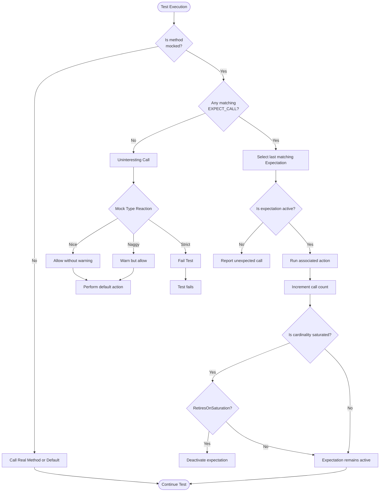

# Performance & Maintainability in Large Codebases

GoogleTest and GoogleMock are designed not only to streamline C++ testing but also to remain performant and maintainable as your project scales up. This guide unpacks the principles and architectural choices critical to achieving efficient test execution and reducing maintenance overhead when working with expansive codebases featuring numerous tests and mocks.

---

## Modularizing Your Test Code

As projects grow, organizing tests into clear, focused modules becomes vital. Modularization helps keep tests manageable and improves build and execution speed by isolating unrelated changes.

- **Group Tests into Suites:** Structure related tests inside suites using consistent naming and file organization. This logical grouping makes it simpler to locate tests and understand coverage.
- **Use Test Fixtures:** Share common setup and teardown code to avoid duplication across tests, improving readability and maintainability.
- **Separate Test Dependencies:** Avoid bloating modules by mocking slowly changing or heavyweight dependencies. This keeps tests fast and reduces recompilation.

<Check>
Always design your test suite structure to mirror your codebase's logical components. This alignment encourages clarity and speeds up debugging.
</Check>

---

## Selective Test Execution and Scalability

Running all tests every time can become prohibitively expensive as test count grows. GoogleTest provides granular control over test execution:

- **Filter Tests:** Run specific tests or suites using the `--gtest_filter` flag to focus on relevant areas during development.
- **Parallel Execution:** Leverage test runners or CI environments that support parallel test execution to utilize available CPU resources effectively.
- **Incremental Testing:** Combine selective filtering with changeset-aware test selection in CI to only run impacted tests.

<Note>
Test execution speed is directly tied to productivity and feedback loop time—strategically limiting test runs without losing coverage is critical.
</Note>

---

## Managing Many Mocks with Efficiency

Mocks are powerful, but managing many mocks in large test suites can introduce complexity and slow compilation.

### Mock Object Strictness Levels
GoogleMock offers three wrapper classes to control the behavior of uninteresting calls – those calls that have no explicit expectations:

- **NiceMock:** Suppresses warnings for uninteresting calls. Use when you want to silence noise without strict enforcement.
- **NaggyMock (default):** Warns on uninteresting calls but allows them, suitable during test development.
- **StrictMock:** Treats all uninteresting calls as errors, enforcing rigor but increasing brittleness.

Use these wisely to balance test maintainability and thoroughness.

### Expectation Ordering and Performance

- GoogleMock searches expectations in reverse order, so put more specific expectations after general ones to avoid shadowing.
- Use `.RetiresOnSaturation()` to automatically retire an expectation when its call limit is reached, preventing unnecessary failures on extra calls.
- When expecting a sequence of calls, use `InSequence` or `After` clauses to enforce order, which also aids test readability and correctness.

### Compilation Optimization Tips

- **Out-of-Class Mock Definitions:** Move mock class constructor and destructor definitions from the header into `.cc` files to reduce redundant compilation work.
- **Limit Mock Overhead:** Avoid mocking methods unnecessarily; sometimes a fake or stub is a better fit.

<Warning>
Overusing strict mocks and overly specific expectations can lead to fragile tests that break often during refactoring. Prefer `NiceMock` for most scenarios and reserve `StrictMock` for areas where strict verification is crucial.
</Warning>

---

## Example: Managing Expected Call Cardinalities

GoogleMock provides flexible constructs for specifying how many times a mock method is expected to be called.

Basic cardinalities include:

- `AnyNumber()` — the mock method can be called any number of times.
- `AtLeast(n)` and `AtMost(n)` — minimum or maximum calls.
- `Between(min, max)` — calls within a range.
- `Exactly(n)` — exact number of calls.

```cpp
using ::testing::AtLeast;
using ::testing::Exactly;
using ::testing::AnyNumber;

class MockFoo {
 public:
   MOCK_METHOD(void, DoBar, (int), ());
};

TEST(FooTest, Example) {
  MockFoo foo;

  // Expect DoBar to be called at least once.
  EXPECT_CALL(foo, DoBar).Times(AtLeast(1));

  // Allow any number of other calls.
  EXPECT_CALL(foo, DoBar).Times(AnyNumber());

  foo.DoBar(42);
}
```

<Note>
Use cardinalities judiciously to express intent concisely and keep tests meaningful.
</Note>

---

## Best Practices for Large-Scale Test Maintainability

- **Set Expectations Sparingly:** Prefer `ON_CALL` for default behaviors without enforcing call counts, reserving `EXPECT_CALL` for cases where call frequency or arguments require verification.
- **Minimize Over-Specification:** Avoid asserting on every interaction; focus on contract behaviors.
- **Use Parameterized Tests:** This reduces boilerplate and scales well when testing multiple input scenarios.
- **Leverage Helper Functions:** To create common mock expectations or actions, reducing code duplication.
- **Verify and Clear Mocks as Needed:** Use `Mock::VerifyAndClearExpectations()` to enforce expectations early, especially when mocks have long lifetimes.

---

## Troubleshooting Common Performance & Maintainability Issues

| Issue                                              | Cause & Solution                                                             |
|----------------------------------------------------|-----------------------------------------------------------------------------|
| Slow compilation due to large mock classes         | Move mock constructors and destructors definitions to implementation files.  |
| Excessive warnings from uninteresting mock calls    | Use `NiceMock` or define catch-all `EXPECT_CALL(foo, Method(_)).Times(AnyNumber());` |
| Tests breaking from excessive expectation strictness | Review and reduce the number of `EXPECT_CALL`s; relax cardinalities and use sequences with `.RetiresOnSaturation()` |
| Too long test execution times                        | Use test filters, run tests in parallel, or split tests logically           |

---

## Summary

Maintaining performance and quality in large GoogleTest codebases hinges on modular test design, selective execution, and prudent mock management. By leveraging GoogleMock's strictness levels, expectation cardinalities, and thoughtful sequencing, developers can write scalable, maintainable tests that evolve gracefully with their projects.

---

## Additional Resources

- [gMock Cookbook](https://github.com/google/googletest/blob/main/docs/gmock_cook_book.md) — practical recipes and best practices.
- [Setting Expectations Reference](https://github.com/google/googletest/blob/main/docs/reference/mocking-and-stubbing/setting-expectations.md) — detailed usage of `EXPECT_CALL` clauses.
- [NiceStrictNaggy Mocks](https://github.com/google/googletest/blob/main/docs/gmock_cook_book.md#NiceStrictNaggy) — guide on controlling mock warning and error behavior.
- [Organizing and Structuring Tests Guide](https://github.com/google/googletest/blob/main/guides/core-workflows/organizing-tests.md) — advice for modular test code.
- Platform and Portability Model Concepts — for understanding how GoogleTest adapts to environments.


---

## Related Documentation Links

- Integration & Ecosystem Overview
- Getting Started: Prerequisites & Configuration
- Mocking and Stubbing APIs
- Assertions and Matchers Conceptual Guide
- Test Lifecycle and Execution Flow


---

## Diagram: Expectation Matching and Mock Behavior Flow



This diagram illustrates the flow of mock method invocation, expectation matching, and how different mock strictness levels influence handling uninteresting calls.
