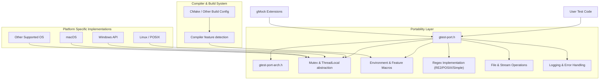

# Platform & Portability Model

GoogleTest and GoogleMock achieve wide platform support and portability through a carefully designed abstraction layer that addresses the myriad differences in compilers, operating systems, and build environments. This document explains how the frameworks encapsulate platform-specific details, the macro system implementation for managing environment variations, and practical strategies users and integrators can rely on to ensure smooth, cross-platform development.

---

## Understanding the Need for Portability

C++ projects and test suites routinely span multiple platforms including Linux, macOS, Windows, and embedded systems, each with different toolchains, runtime environments, and system capabilities. Ensuring GoogleTest and GoogleMock can run seamlessly across this landscape requires handling:

- Compiler differences (e.g., MSVC, GCC, Clang).
- Operating system APIs and features (e.g., POSIX availability, Windows system calls).
- Variations in exception support and RTTI availability.
- Threading and synchronization primitives.
- File system conventions and capabilities.

Without a robust portability model, writing and running tests in a uniform manner would be difficult and error prone. GoogleTest's model abstracts these platform differences behind well-defined macros and utility code placed primarily in internal headers.

## The Portability Layer: `gtest-port.h` and `gtest-port-arch.h`

GoogleTest defines a core portability interface via headers such as `gtest-port.h` and `gtest-port-arch.h`, which provide:

- **Environment-Describing Macros:** These macros indicate key platform features available at compile time, such as whether exceptions are enabled (`GTEST_HAS_EXCEPTIONS`), POSIX regex support (`GTEST_HAS_POSIX_RE`), threading (`GTEST_HAS_PTHREAD`), RTTI support (`GTEST_HAS_RTTI`), and more.

- **Platform Identification Macros:** Platform-specific macros such as `GTEST_OS_WINDOWS`, `GTEST_OS_LINUX`, `GTEST_OS_MAC`, and sub-platform variants allow conditional compilation tailored for precise environments.

- **Feature Selection:** GoogleTest automatically detects or can be overridden to indicate the availability of features like SEH (Windows Structured Exception Handling), standard wide string support, stream redirection capabilities, and death test support.

- **Utility Wrappers:** Wrappers around low-level system functions like file operations, threading primitives, and regex facilitate consistent behavior across platforms.

- **Macro-Based Code Modifiers:** Macros for annotating attributes (`GTEST_NO_INLINE_`, `GTEST_ATTRIBUTE_PRINTF_`), disabling warnings, and managing compiler-specific quirks help maintain clean, portable build behavior.

- **Synchronization Primitives:** Platform-dependent implementations for `Mutex`, `MutexLock`, and `ThreadLocal` support effectively synchronize tests in multi-threaded contexts when supported.

### Automatic and Manual Override

GoogleTest attempts to detect environment properties automatically, but users and integrators can override or force definitions of key macros via compiler flags when needed (e.g., `-DGTEST_HAS_EXCEPTIONS=0` to disable exceptions).

## Managing Compiler and Build Environment Differences

### Compiler Feature Detection

GoogleTest incorporates checks for compiler capabilities, such as support for feature-test macros (`__has_include`, `__has_attribute`) and C++ language levels (at least C++17 is required). If the compiler lacks critical support, GoogleTest will emit errors during compilation.

It customizes build behavior based on:

- Compiler family and version (e.g., MSVC vs GCC).
- Available warning controls and code annotations.
- Exception and RTTI support, controlled by explicit macros.

### Platform-Specific Code Paths

GoogleTest uses targeted code for Windows, Linux, macOS, and other platforms, guarded by strict macros. For example:

- Windows uses Windows-specific synchronization primitives and file handling.
- POSIX platforms use pthreads implementations.
- Stream redirection and death test support vary based on platform capabilities.

This selective compilation ensures code compiles cleanly and behaves reliably on each platform.

## Threading and Synchronization

GoogleTest supports safe multi-threaded testing on platforms with robust threading libraries:

- Where `pthreads` is available, an implementation utilizing pthread mutexes and thread-local storage is used.
- On Windows, native Win32 synchronization primitives are employed.
- On platforms lacking threading support or when threading is disabled, dummy implementations default to no-op locks.

This design ensures tests can use synchronization without conditional user code.

## Environment Variable and Flag Support

GoogleTest reads environment variables and command-line flags portably to configure runtime behavior. Utilities for retrieving environment variables (`GetEnv()`) and parsing flag values support cross-platform consistency.

## Regular Expressions

Depending on the environment, GoogleTest chooses from:

- RE2 library (if compiled with Abseil).
- POSIX extended regex on UNIX-like systems.
- A simple internal regex implementation on limited platforms.

This allows features requiring regex matching (e.g., filtering tests) to work reliably everywhere.

## Stream Redirection & Output Capture

The framework detects support for redirecting `stdout` and `stderr` to facilitate capturing test output and verifying logs (including in death tests). This capability adapts automatically based on platform capabilities.

## Macro-Driven Portability Controls

GoogleTest uses carefully designed macros to:

- Abstract platform and compiler conditional code.
- Manage export/import declarations (`GTEST_API_`) for shared libraries.
- Suppress or manage compiler warnings consistently across toolchains.
- Annotate functions with attributes such as `noinline` or disable optimizations.

This macro-driven approach reduces platform-specific scatter throughout the code, localizing complexity.

## Practical Tips for Users and Integrators

- **Checking Portability Macros:** You can test macros like `GTEST_HAS_EXCEPTIONS` or `GTEST_IS_THREADSAFE` to conditionally adapt code or test behaviors.
- **Overriding Defaults:** Environment quirks or cross-compilation may require defining portability macros explicitly in your build system.
- **Multi-threading:** Ensure that when using GoogleTest on platforms without `pthreads` support, tests do not run assertions concurrently on multiple threads.
- **Shared Libraries:** When building or linking GoogleTest as shared libraries, use the corresponding macros `GTEST_CREATE_SHARED_LIBRARY` or `GTEST_LINKED_AS_SHARED_LIBRARY` to avoid runtime issues.
- **Compiler Flags:** Leverage GoogleTest’s integrated CMake configuration helpers to automatically set recommended compiler flags.

## Architecture Diagram: Platform Abstraction Layer

This diagram depicts how GoogleTest/internal portability headers form the core bridge connecting user-level tests and mocks with platform-dependent implementations.

---

## Summary

The Platform & Portability Model is foundational to GoogleTest's success in delivering a consistent, reliable user experience across diverse environments. The key is encapsulating compiler quirks, operating system differences, feature availability, and threading models behind macros and utility classes. Users benefit from the automatic environment detection and can override settings when necessary to support uncommon or emerging platforms. This model allows GoogleTest/GoogleMock to remain lightweight, maintainable, and robust.

---

## Further Reading and Related Documents

- [Supported Platforms & Build Systems](../overview/integration-ecosystem/supported-platforms.md) — Detailed platform and compiler support.
- [Core Setup & Installation](../../getting-started/core-setup/prerequisites-requirements.md) — Environment prerequisites and system requirements.
- [CMake Build Integration](../../guides/advanced-scenarios/build-integration.md) — How to configure build systems for portability.
- Source code for extensible portability macros:
  - [`gtest-port.h`](https://github.com/google/googletest/blob/main/googletest/include/gtest/internal/gtest-port.h)
  - [`gtest-port-arch.h`](https://github.com/google/googletest/blob/main/googletest/include/gtest/internal/gtest-port-arch.h)
- [GoogleTest Primer](../docs/primer.md) — Introductory concepts that rely on portability assurances.

---

## Summary of User Advice

- Do not assume `GTEST_HAS_PTHREAD` or threading availability; check macros.
- Use provided macros for compiler and platform detection rather than custom guards.
- Override portability macros deliberately when targeting non-mainstream platforms.
- Link properly to static/shared libraries using corresponding macros.
- Appreciate that test isolation and output capture leverage platform-specific capabilities exposed through the portability layer.

---