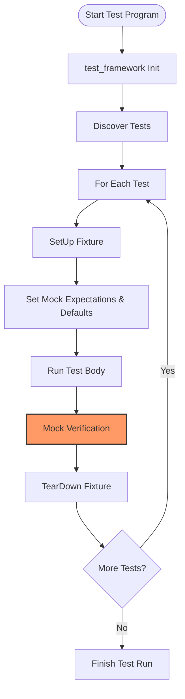

# Performance & Scalability Considerations

GoogleTest and GoogleMock provide a powerful framework for testing C++ code, but as projects grow, maintaining fast, reliable, and scalable test suites becomes critical. This guide helps you navigate the key strategies, user workflows, and best practices to ensure efficient execution of tests, especially when working with complex mocks and large test suites.

---

## Understanding Test Execution Performance

As your test codebase grows, the runtime performance of tests can have a significant impact on your productivity. Users aim to have reliable and quick feedback loops from their tests. GoogleTest optimizes discovery and execution, but certain factors influence overall performance.

### Automatic Test Discovery

GoogleTest automatically discovers tests via the macros like `TEST()` and `TEST_F()`. This means users don't have to manually register tests, which simplifies test management and script integration. However, with many thousands of tests, discovery time may increase.

**Best Practice:**
- Group and organize tests logically using test suites and fixtures to reduce noise and speed up discovery.
- Use filtering capabilities (`--gtest_filter`) to run subsets of tests when debugging or developing.

### Test Execution Flow

Tests run sequentially by default, but GoogleTest supports parallel execution to leverage multicore systems:

- **Parallel Test Execution:**
  - Users can split tests across multiple processes or threads externally (GoogleTest itself does not provide native multithreading for test cases).
  - Using build system integration and Continuous Integration (CI) pipelines can accelerate test runs by distributing tests.

- **Sharding Support:**
  - GoogleTest supports sharding tests across machines using environment variables `GTEST_TOTAL_SHARDS` and `GTEST_SHARD_INDEX`.
  - This ease of distributing tests maintains accuracy while scaling out.

### Performance Overhead of Mocks

While invaluable for interaction-based verification, mocks can introduce overhead due to:

- Runtime matching of calls against expectations (especially if expectations are too broad or numerous).
- Reporting extensive diagnostic information when failures occur.

**Tips to Mitigate Mock Performance Costs:**
- Use `ON_CALL` to define default behaviors without setting expectations when verification is unnecessary.
- Minimize the number and complexity of expectations in frequently called mock methods.
- Prefer `NiceMock` to reduce warning noise that can slow down test output, but use `StrictMock` judiciously.
- Leverage sequences and partial ordering to structure expectations efficiently.

---

## Organizing Tests for Scalability

### Logical Test Suites and Fixtures

Organize tests into suites and shared fixtures to:

- Enable batch setup and teardown, avoiding unnecessary repetition.
- Facilitate more manageable filtering and reporting.

### Parallel Execution via Build Systems and CI

GoogleTest integrates well with popular build systems like CMake and Bazel to:

- Run tests in parallel easily across multiple CPU cores.
- Generate reports suitable for CI systems.

### Handling Large Numbers of Mocks

- Splitting large mocks or frequently used mocks across multiple files can reduce compile times.
- Consider moving mock constructor and destructor definitions out-of-line (into `.cc` files) to reduce compilation overhead.
- Use `Mock::VerifyAndClearExpectations()` selectively for partial verification and clearing of mocks.

---

## Effective Use of GoogleMock Features for Performance

### Expectations and Call Ordering

- Set meaningful expectations to prevent vague or overly broad matchers that increase matching cost.
- Leverage `.RetiresOnSaturation()` to prevent over-matching of saturated expectations.
- Use `InSequence` and `After` to enforce call order, reducing matcher ambiguity and speeding up verification.

### Controlling Verbosity

`--gmock_verbose` flag controls logging during test runs and directly impacts performance:

- `info`: detailed logs for every mock interaction — useful during debugging but slower.
- `warning`: warnings and errors only — the default balance.
- `error`: errors only — fastest and least verbose.

Users should choose verbosity levels based on current needs: development (more verbose) vs. CI runs (less verbose).

---

## Common Pitfalls Affecting Performance

- Setting expectations after mock methods are called causes undefined behavior and may negatively impact performance.
- Using too many expectations for mocks that accept wide ranges of arguments can lead to frequent matcher failures and degraded runtime.
- Unmatched or unexpected calls trigger diagnostic output, which can accumulate and slow down tests.

---

## Practical Tips & Best Practices

- **Filtering Tests:** Use `--gtest_filter` to run relevant subsets interactively.
- **Leak Detection:** Enable heap checking alongside mocks to catch leaks early.
- **Mock Cleanup:** Use `Mock::AllowLeak()` if your mock must outlive the test or skip verification.
- **Test Isolation:** Keep tests independent to enable parallelization and quick reruns.
- **Incremental Development:** Start with simple mocks and expectations, adding complexity only as needed.

---

## Troubleshooting Performance Issues

- Run tests with `--gmock_verbose=error` to minimize logging noise when chasing sporadic slowness.
- Use the `--gtest_repeat` flag to detect flaky tests slowing down suites.
- Profile test execution to identify hotspots.
- Consult the [Troubleshooting Common Issues](../guides/advanced-and-integrations/troubleshooting-common-issues) guide for detailed problem-solving techniques.

---

## Diagram: Typical Test Execution Flow with Mock Expectations

---

## Summary of Key Concepts

| Concept                       | Value to User                          | Impact on Performance                |
|------------------------------|--------------------------------------|------------------------------------|
| Automatic Test Discovery      | Simple test addition without manual registration | Minimal runtime overhead, improves usability |
| Parallel Test Execution       | Speeds up large test suites           | Improves test throughput            |
| Expectation Stickiness        | Avoids fragile tests through `.RetiresOnSaturation` | Prevents runtime matching ambiguities |
| Verbosity Levels             | Balance between insight & speed       | Controls log volume and runtime    |
| Logical Suite Organization    | Easier filtering & maintenance        | Reduces unnecessary test runs      |
| Mock Construction Location    | Faster compilations                    | Reduces build times                |

---

## Further Reading & Related Documentation

- [GoogleTest Primer](../docs/primer.md) — For foundational understanding of GoogleTest performance aspects.
- [gMock Cookbook](../docs/gmock_cook_book.md) — Contains detailed techniques for expectations and actions impacting performance.
- [Using Assertions](../guides/core-testing-workflows/using-assertions.mdx) — Effective test assertions help reduce unnecessary failures and improve test clarity.
- [Organizing Test Suites](../guides/core-testing-workflows/organizing-test-suites.mdx) — Best practices for scalable test organization.
- [Integrating with Build Systems](../guides/advanced-and-integrations/integrating-with-build-systems.mdx) — How to leverage tools like Bazel and CMake for efficient parallel test execution.
- [Troubleshooting Common Issues](../guides/advanced-and-integrations/troubleshooting-common-issues.mdx) — Solve flaky tests and performance bottlenecks.

---

## Summary

Performance and scalability in GoogleTest and GoogleMock are enhanced by thoughtful test organization, leveraging build and CI integrations, controlling mock complexity, and managing logging verbosity. Users maximize speed and efficiency by running filtered tests, structuring mocks for minimal overhead, and using parallel execution strategies.

---