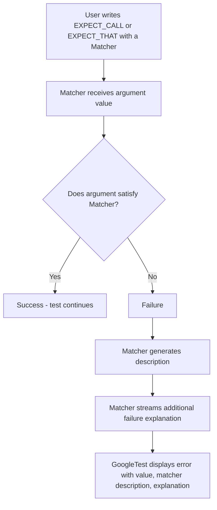

# Matcher Architecture & Custom Matchers

GoogleMock’s matcher subsystem is the key enabler of flexible, expressive testing by allowing you to specify precise conditions for mock method arguments and conditions on expected values. This page dives into the architecture of matchers, the types of built-in matchers available, how they are composed, and how you can craft custom matchers tailored to your testing needs.

---

## Understanding Matchers: Bridging Expectation and Actual

Matchers are predicates that determine whether a given value or argument satisfies a specific property. They are used primarily in `EXPECT_CALL`, `ON_CALL`, and assertion macros such as `EXPECT_THAT`. The matcher evaluates the value, and if it fails, generates a human-readable explanation to help you understand what went wrong.

### What a Matcher Does

- **Matching:** Given an argument, a matcher returns `true` if the argument meets the expected criteria, otherwise `false`.
- **Explanation:** Matchers provide descriptive text and detailed failure messages to clarify the reason for success or failure.
- **Polymorphism:** Some matchers are polymorphic, meaning they can be applied to multiple types without needing you to define type specifics.

---

## Built-in Matcher Types

GoogleMock offers a rich suite of built-in matchers covering common matching needs. Each matcher is designed to be intuitive and generates clear descriptions for both successes and failures.

### 1. Wildcard Matchers

- **`_`** or **`A<T>()` / `An<T>()`**: Match *any* value of type `T`. Useful as a placeholder when the argument is unimportant.

### 2. Equality and Comparison Matchers

- **`Eq(value)`**: Matches values equal to `value`.
- **`Ne(value)`**: Matches values not equal to `value`.
- **`Lt(value)`**, **`Le(value)`**, **`Gt(value)`**, **`Ge(value)`**: Match less than, less or equal, greater than, and greater or equal comparison respectively.
- **Floating Point Matchers** `FloatEq()`, `DoubleEq()`, and their near variants compare floating-point numbers within an acceptable tolerance.

### 3. Pointer Matchers

- **`IsNull()` / `NotNull()`**: Match pointers that are `NULL` or not.
- **`Pointee(matcher)`**: Matches a pointer whose pointee matches the provided matcher.
- **`Pointer(matcher)`**: Matches a pointer that itself matches the matcher.

### 4. String Matchers

- **`StrEq(str)`, `StrNe(str)`**: Case-sensitive string equality / inequality.
- **`StrCaseEq(str)`, `StrCaseNe(str)`**: Case-insensitive string equality / inequality.
- **`HasSubstr(substring)`**: Matches strings containing the given substring.
- **`StartsWith(prefix)`, `EndsWith(suffix)`**: Matches strings that start or end with the specified substring.

### 5. Container and Collection Matchers

- **`ElementsAre(m1, m2, ...)`**: Matches containers whose elements match the provided matchers *in order*.
- **`UnorderedElementsAre(m1, m2, ...)`**: Matches containers containing matching elements in any order.
- **`Contains(matcher)`**: Matches if at least one element in the container matches.
- **`Each(matcher)`**: Matches if every element in the container matches.
- **`SizeIs(size_matcher)`**, **`BeginEndDistanceIs(distance_matcher)`**: Match on container size or distance between iterators.

### 6. Composite / Logical Matchers

- **`Not(matcher)`**: Matches when the matcher does not match.
- **`AllOf(m1, m2, ...)`**: Matches if *all* provided matchers match.
- **`AnyOf(m1, m2, ...)`**: Matches if *any* provided matcher matches.

### 7. Field and Property Matchers

- **`Field(&Class::field, matcher)`**: Matches objects whose member field matches the matcher.
- **`Property(&Class::method, matcher)`**: Matches objects whose property (getter) method returns a value matching the matcher.

### 8. Pair and Tuple Matchers

- **`Pair(matcher1, matcher2)`**: Matches a pair whose first and second members match their respective matchers.
- **`Key(matcher)`**: Matches a pair whose key matches the matcher.
- **`Pointwise(pair_matcher, container)`**: Matches a container whose elements match pairwise with another container's elements.


---

## Matcher Composition: Building Complex Expectations

Matchers can be combined logically for rich expression of conditions:

- Combine via `AllOf()` to require multiple conditions simultaneously.
- Combine via `AnyOf()` to accept multiple fair alternatives.
- Negate specific conditions with `Not()`.
- Inside composite matchers, each submatcher will describe why it failed or succeeded, helping clarify test failures.

Example:

```cpp
EXPECT_THAT(value, AllOf(Ge(10), Lt(20), Not(Eq(15))));
```
This expects `value` to be between 10 and 20 but not equal to 15.

---

## Custom Matchers: Tailoring Checks to Your Domain

Flexibility is essential for effective testing. GoogleMock makes it simple to write custom matchers suited to your domain logic and data structures.

### Quickly Defining Simple Matchers

Use the `MATCHER` macros provided for quick matcher definitions.

- **`MATCHER(name, description_expr)`**: Defines a matcher with a given name and a boolean predicate on `arg`.

Example:

```cpp
MATCHER(IsEven, "") { return (arg % 2) == 0; }
```

Usage:

```cpp
EXPECT_CALL(mock, Foo(IsEven()));
EXPECT_THAT(value, IsEven());
```

If the assertion fails, the message clearly explains the expectation (`is even`) and the actual value.

### Parameterized Matchers

If your matcher needs parameters, use `MATCHER_P`, `MATCHER_P2`, ..., `MATCHER_P10`.

Example:

```cpp
MATCHER_P(IsDivisibleBy, divisor, "") { return (arg % divisor) == 0; }

// Usage:
EXPECT_THAT(value, IsDivisibleBy(7));
```

You can also create expressive descriptions that include parameter values:

```cpp
MATCHER_P2(InRange, low, high,
          std::string(negation ? "isn't" : "is") + " in range [" +
          ::testing::PrintToString(low) + ", " +
          ::testing::PrintToString(high) + "]") {
  return low <= arg && arg <= high;
}
```

Which yields clearer failure messages referencing the range.

### Advanced Custom Matcher Techniques

For cases where the `MATCHER` macros are insufficient, you can implement the matcher interface classes directly, allowing control over argument types, polymorphism, or more efficient error reporting. Consider this when you require matchers to handle complex data structures or multiple overloads.

Refer to the [Creating Custom Actions & Matchers](../../api_reference/advanced_extensions/custom_actions_and_matchers.md) page for detailed recipes.


---

## Writing a Custom Matcher: Step-by-Step Workflow

1. **Determine the matching criteria:** What property or invariant do you want to verify in the argument?
2. **Choose the matcher type:** Use `MATCHER` for simple or `MATCHER_P` for parameterized matchers. For more advanced cases, implement the matcher interface directly.
3. **Implement matching logic:** Return `true` if the argument matches; otherwise, `false`.
4. **Provide descriptive messages:** Implement a human-readable description in the matcher’s description string or via `DescribeTo` and `DescribeNegationTo` methods.
5. **Optionally, provide detailed failure explanations:** Stream additional info to the `result_listener` or use `EXPECT_` macros inside the matcher for richer diagnostics.
6. **Use the matcher:** In `EXPECT_CALL`, `EXPECT_THAT`, or other assertion macros for precise validation.

---

## Practical Tips & Best Practices

- **Matchers Should Be Pure Functions:** Avoid any side effects; the matcher might be invoked multiple times during testing.
- **Be Specific but Not Overly Restrictive:** Only specify argument conditions you truly care about to avoid brittle tests.
- **Leverage Composition:** Use built-in logical combinators like `AllOf()` and `AnyOf()` to build readable compound matchers.
- **Include Helpful Descriptions:** This greatly eases debugging failing tests.
- **Parameterize Intelligently:** When your matcher depends on parameters, surface them clearly in failure messages.
- **Use Polymorphic Matchers for Generality:** This lets your matcher work seamlessly across related types.

---

## Illustrative Example: Custom Parameterized Matcher

```cpp
#include <gmock/gmock.h>

MATCHER_P(IsFactorOf, divisor, "checks if a value is a factor of divisor") {
  if (divisor == 0) {
    *result_listener << "division by zero error";
    return false;
  }
  const bool matches = (arg % divisor) == 0;
  if (!matches) {
    *result_listener << "remainder is " << (arg % divisor);
  }
  return matches;
}

// Usage in a test:
// EXPECT_THAT(value, IsFactorOf(7));
```

If `value` isn’t divisible by 7, failure output will indicate the divisor and remainder.

---

## Summary

Matchers in GoogleMock form the expressive bridge connecting your test expectations to actual arguments and values during test execution. The framework provides a thorough library of built-in matchers for common cases and easy-to-use macros to create custom matchers to express complex, domain-specific logic clearly and succinctly.

Start by using the built-in matchers and leverage composition for complexity. When needed, define your own matchers with `MATCHER` macros or fully custom classes to get both precision and clarity. Proper use of matchers will make your tests highly maintainable, readable, and informative.

---

## Related Documentation

- [Matchers Reference](../api_reference/mocking_api/matchers_reference.md): Complete list with usage details of built-in matchers.
- [Writing New Matchers Quickly](../guides/advanced-usage-patterns/custom-matchers-actions.md#writing-new-matchers-quickly): Guide on crafting custom matchers.
- [GoogleMock for Dummies](../docs/gmock_for_dummies.md): Getting started with mocks and matchers.
- [EXPECT_THAT Assertion](../docs/reference/assertions.md#EXPECT_THAT): Using matchers in assertions.

---

## Visual Summary: Matcher Conceptual Flow



This flow illustrates the user-side experience: the matcher evaluates the argument, and in failure cases, explains in detail the mismatches to aid debugging.
