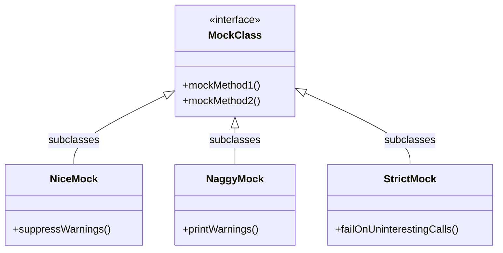

# Strictness and Customization

GoogleMock offers flexible modes to control how your mock objects handle calls that are not explicitly expected, known as uninteresting calls. By choosing the right strictness level, you can tailor the behavior of mocks to align with your project's policies on warnings and errors during tests.

---

## Understanding Strictness Levels

GoogleMock provides three primary wrappers for mock classes that define how uninteresting calls are treated:

- **NiceMock&lt;MockClass&gt;**: Suppresses warnings on uninteresting calls. Use this when you want your tests to ignore unverified mock calls silently.
- **NaggyMock&lt;MockClass&gt;**: Prints warnings on uninteresting calls. This is the current default behavior of raw mock classes.
- **StrictMock&lt;MockClass&gt;**: Treats uninteresting calls as errors, causing tests to fail if any unexpected method is invoked.

Each of these wrappers subclasses your original mock class, allowing them to be used interchangeably, while altering uninteresting call handling.

<Info>
By default, mock classes behave like `NaggyMock`, printing warnings on uninteresting calls. However, it is planned to switch to `NiceMock` behavior by default in the future to promote more maintainable tests.
</Info>

### When to Use Each Strictness Level

| Strictness         | Effect on Uninteresting Calls         | Recommended Use Case                                  |
|--------------------|--------------------------------------|-----------------------------------------------------|
| **NiceMock**       | Silently ignores uninteresting calls | Most tests, to reduce noise and focus on relevant calls |
| **NaggyMock**       | Warns about uninteresting calls      | When developing or debugging tests to identify unexpected calls |
| **StrictMock**      | Fails tests on uninteresting calls   | When enforcing strict API contract adherence or for very precise tests |

---

## How to Use Strictness Wrappers

Suppose you have a mock class called `MockFoo`. You can create strictness-controlled versions as follows:

```cpp
#include <gmock/gmock.h>
using ::testing::NiceMock;
using ::testing::NaggyMock;
using ::testing::StrictMock;

// Create a nice mock that ignores uninteresting calls.
NiceMock<MockFoo> nice_mock;

// Create a naggy mock that warns on uninteresting calls.
NaggyMock<MockFoo> naggy_mock;

// Create a strict mock that treats uninteresting calls as test failures.
StrictMock<MockFoo> strict_mock;
```

These objects can be used anywhere a `MockFoo` is accepted, including passing to functions or storing in containers.

<Tip>
If your mock class has constructors with arguments, you can pass them to strictness wrappers just as you would to the original mock class:

```cpp
NiceMock<MockFoo> nice_mock(5, "test");
StrictMock<MockFoo> strict_mock("argument");
```

This makes switching between strictness levels seamless without code refactoring.
</Tip>

---

## Behavior of Uninteresting Calls

An **uninteresting call** occurs when a mock method is called but no expectation matches the call. How these calls are handled depends on the strictness wrapper:

- **NiceMock**: Uninteresting calls return default values or perform default actions without reporting or failing.
- **NaggyMock**: Emits a warning message explaining the uninteresting call. The test continues.
- **StrictMock**: Reports a test failure immediately for the uninteresting call.

<Warning>
StrictMock does not affect **unexpected calls**, which are calls that match some expectation but violate specified conditions such as argument matchers or call counts. Unexpected calls are always treated as errors regardless of strictness wrapper.
</Warning>

---

## Key Details and Limitations

### Compatibility

- Strictness wrappers only affect mock methods declared using `MOCK_METHOD` directly in the mock class. If you mock methods inherited from a base class, the strictness wrapper may not apply properly.

- Nested strictness wrappers (e.g., `NiceMock<StrictMock<MockFoo>>`) are **not supported**.

- The mock class should have a virtual destructor to avoid undefined behavior when using these wrappers.

### Interaction with Verbosity

GoogleMock's verbosity level (`--gmock_verbose`) controls the runtime logging of mock calls:

| Verbosity Level | Effect on Output                                     |
|-----------------|-----------------------------------------------------|
| `info`          | Logs detailed info about expected and uninteresting calls (most verbose). |
| `warning`       | Logs warnings for uninteresting calls without stack traces (default).    |
| `error`         | Logs only errors, suppressing warnings and info.    |

Reduce verbosity if you want less noise or increase it for deeper analysis.

---

## Example: Controlling Strictness

```cpp
#include <gmock/gmock.h>
using ::testing::NiceMock;
using ::testing::StrictMock;
using ::testing::Mock;

class MockDatabase {
public:
  MOCK_METHOD(bool, Connect, (), ());
  MOCK_METHOD(int, GetRecordCount, (), ());
};

TEST(DatabaseTest, NiceMockExample) {
  NiceMock<MockDatabase> db;

  // No expectation set for Connect(), won't warn or fail.
  EXPECT_CALL(db, GetRecordCount()).WillOnce(::testing::Return(42));

  bool connected = db.Connect();  // Allowed without complaint
  int count = db.GetRecordCount();
  EXPECT_EQ(count, 42);
}

TEST(DatabaseTest, StrictMockExample) {
  StrictMock<MockDatabase> db;

  EXPECT_CALL(db, GetRecordCount()).WillOnce(::testing::Return(42));

  // Uninteresting call to Connect() will cause test failure.
  EXPECT_NONFATAL_FAILURE(db.Connect(), "Uninteresting mock function call");

  int count = db.GetRecordCount();
  EXPECT_EQ(count, 42);
}
```

---

## Tips and Best Practices

- Prefer **`NiceMock`** in most tests to avoid cluttering output with warnings about uninteresting calls.
- Use **`NaggyMock`** while developing or debugging tests to spot unexpected call patterns.
- Use **`StrictMock`** when you want to enforce that only explicitly expected calls can happen.
- Always specify expectations for calls you care about using `EXPECT_CALL`.
- Consider adding catch-all expectations with `.Times(AnyNumber())` to tolerate some uninteresting calls explicitly, reducing surprises.
- Avoid nesting strictness wrappers to prevent undefined behavior.
- Ensure your mock classes have virtual destructors for safety.

---

## Troubleshooting Common Issues

### Strictness Wrapper Has No Effect

- Confirm that mock methods are declared in the mock class itself using `MOCK_METHOD`. Inherited mock methods may not respect strictness.
- Verify the mock class has a virtual destructor.

### Excess Warnings or Failures

- Check if your expectations cover all expected calls. Uncovered calls can cause warnings (NaggyMock) or failures (StrictMock).
- Use catch-all expectations (`EXPECT_CALL(mock, Method(_)).Times(AnyNumber())`) to handle less interesting calls.

### Unexpected Calls Still Fail in NiceMock

- Understand that unexpected calls (calls with expectations but mismatched arguments or over-call) always result in failures.
- Adjust expectations or test code accordingly.

### Verbosity Setting

- Adjust `--gmock_verbose` to control how much logging appears during test runs.

---

## Summary Diagram



---

## Further Reading

- See [Mock Strictness and Object Lifecycle guide](/guides/mocking-patterns/mock-strictness-lifecycle) for more on lifecycle and strictness.
- Consult the [Mocking Reference](reference/mocking-api/mocking-classes-methods) for detailed API and usage.
- The [gMock Cookbook](docs/gmock_cook_book.md) provides practical recipes related to mock behavior.
- Review the concept of [Uninteresting vs Unexpected Calls](docs/gmock_cook_book.md#NiceStrictNaggy) to better design your tests.

---

For quick reference on creating strictness-wrapped mocks:

```cpp
NiceMock<MockClass> nice_mock;
NaggyMock<MockClass> naggy_mock;
StrictMock<MockClass> strict_mock;
```

Choose based on how tolerant your test should be of unplanned method calls.

---

## Summary

The strictness and customization page explains how GoogleMock’s `NiceMock`, `NaggyMock`, and `StrictMock` wrappers allow developers to control the reaction of mock objects to uninteresting calls. It guides users to select the appropriate strictness level to either silence, warn, or fail on unexpected mock function calls. The documentation covers key usage patterns, caveats, and best practices to align mock behavior with test requirements, improving test maintainability and clarity.
