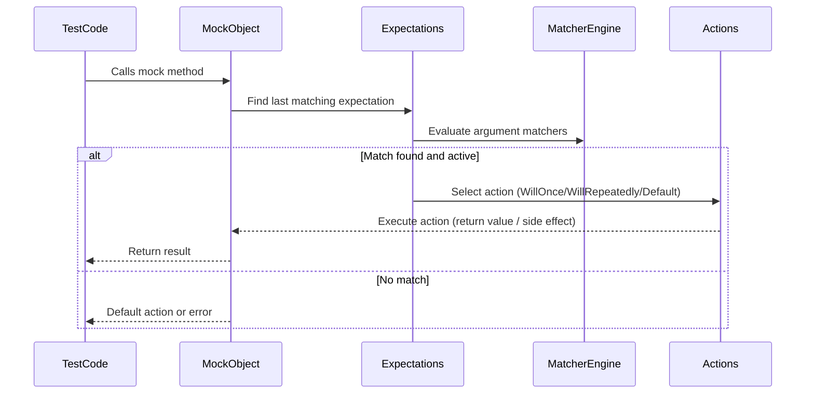

# Expectations, Actions, and Matchers

GoogleMock empowers C++ developers to model and verify the behavior of components through the declarative specification of **expectations**, the configuration of **actions** to define mock behavior, and the use of **matchers** to flexibly verify method arguments. This page guides you through how these core concepts interplay to build precise, expressive, and maintainable tests.

---

## Understanding Expectations: Defining What to Verify

At the heart of GoogleMock lies the ability to specify **expectations** on mock objects. Expectations describe *which* methods are expected to be called, *how many times*, with *what arguments*, and *in what order*.

### The EXPECT_CALL Macro

You declare an expectation on a mock method invocation using the `EXPECT_CALL` macro:

```cpp
EXPECT_CALL(mock_object, Method(arg_matchers...))
    .With(multi_arg_matcher)
    .Times(cardinality)
    .InSequence(sequences...)
    .After(expectations...)
    .WillOnce(action)
    .WillRepeatedly(action)
    .RetiresOnSaturation();
```

- **Matchers**: Specify argument constraints (individual or multi-argument) to control which calls this expectation matches.
- **Times (Cardinality)**: Indicates how many times the call is expected. For example, `Times(1)`, `AtLeast(2)`, or `AnyNumber()`.
- **Ordering**:
  - `.InSequence(...)`: Puts expectations into sequences that enforce call order.
  - `.After(...)`: Specifies that this expectation can only match calls after certain other expectations have been fulfilled, enabling partial order graphs.
- **Actions**:
  - `.WillOnce(action)`: Defines behavior for the next matching call.
  - `.WillRepeatedly(action)`: Defines behavior for all subsequent calls after `.WillOnce()` actions are exhausted.
- **RetiresOnSaturation()**: Causes the expectation to become inactive (retire) once it reaches its upper call limit, allowing other expectations to match afterward.

#### How Expectations Are Matched

GoogleMock evaluates expectations in reverse order of declaration, honoring only active (non-retired) expectations whose argument matchers and prerequisite conditions are satisfied. The first such matching expectation handles the call.

> The **sticky** nature of expectations means that saturated expectations remain active unless retired explicitly or by `.RetiresOnSaturation()`.

### ON_CALL: Setting Default Behavior Without Verification

`ON_CALL` lets you define *default actions* for mock methods to specify what happens when the mock is called but no explicit `EXPECT_CALL` matches:

```cpp
ON_CALL(mock_object, Method(arg_matchers...))
    .With(multi_arg_matcher)
    .WillByDefault(action);
```

This is useful for setting common behaviors shared by many tests or for methods called without interest in call counts or ordering.

<Callout title="Tip">
Use `ON_CALL` to define behavior without adding constraints. Prefer sparse `EXPECT_CALL`s to only verify important interactions.
</Callout>

---

## Matchers: Precise and Flexible Argument Verification

Matchers allow you to describe properties or constraints on arguments passed to mock calls. They enable tests to focus on relevant argument details, avoid over-specification, and express rich conditions.

### Basic Matcher Usage

Within `EXPECT_CALL` or `ON_CALL`, you provide matchers corresponding to each argument. Some examples:

```cpp
EXPECT_CALL(mock, Foo(5, _));  // First arg must be 5; second arg can be anything.
EXPECT_CALL(mock, Bar(Ge(10))); // Argument >= 10
EXPECT_CALL(mock, Baz(NotNull())); // Argument not null pointer
```

If you omit matcher arguments, all arguments are implicitly matched with wildcard `_`.

### Combining Matchers

Matchers can be composed to describe complex conditions:

- `AllOf()` requires all predicates to be true.
- `AnyOf()` passes if any predicate is true.
- `Not()` negates a matcher.

Example:

```cpp
EXPECT_CALL(mock, Foo(AllOf(Ge(5), Ne(10))));
```

### Multi-Argument Matchers and `.With()` Clause

Sometimes you want to apply a condition involving multiple arguments at once. For this purpose, use the `.With()` clause together with a matcher over a tuple:

```cpp
EXPECT_CALL(mock, Method(_, _))
    .With(Lt());  // First arg < second arg
```

GoogleMock provides tuple matchers such as `Lt()` for two-argument comparisons. You can also create custom tuple matchers or compose argument subsets with `Args<>()`.

### Writing Custom Matchers

When built-in matchers are insufficient, define your own:

- Use `MATCHER` and `MATCHER_P` macros for quick one-off matchers.
- Implement polymorphic or monomorphic matchers by defining `MatchAndExplain`, `DescribeTo`, and `DescribeNegationTo`.

Example:

```cpp
MATCHER(IsEven, "is even") {
  return (arg % 2) == 0;
}
EXPECT_CALL(mock, Foo(IsEven()));
```

For more, see [gMock Cookbook - Writing New Matchers](docs/gmock_cook_book.md#NewMatchers).

---

## Actions: Specifying Behavior of Mock Methods

Actions define *what* the mock method does when invoked. By default, GoogleMock generates reasonable return values where possible, but you can customize this behavior using actions.

### Built-in Actions

Some common built-in actions include:

| Action                 | Description                                |
|-----------------------|--------------------------------------------|
| `Return(value)`         | Return the specified value.                 |
| `ReturnRef(variable)`   | Return a reference to the given variable.  |
| `ReturnPointee(ptr)`    | Return the value pointed to by `ptr` at call time. |
| `ReturnNew<T>(...)`     | Return a new dynamically allocated object of type `T`. |
| `SetArgPointee<N>(value)`| Assign `value` to the object pointed by argument `N` (zero-based). |
| `DeleteArg<N>()`        | Delete the pointer passed at argument `N`.  |
| `Invoke(callable)`      | Call a function, method, or functor with the mock arguments. |
| `DoAll(a1, a2, ..., an)`| Perform all actions in sequence, return last result. |
| `IgnoreResult(a)`       | Perform action `a`, ignoring its return value. |
| `WithArg<N>(a)`         | Perform action `a` using argument `N` only. |
| `InvokeArgument<N>(...)`| Invoke the N-th argument if it is callable, passing given args. |

### Combining Actions

You can chain actions with `DoAll()` to perform multiple side effects, e.g., setting an argument value and returning a result:

```cpp
EXPECT_CALL(mock, Foo(_))
    .WillOnce(DoAll(SetArgPointee<0>(5), Return(true)));
```

### Using Callables (Functions, Lambdas, Functors)

Actions accept any callable compatible with the mock signature:

```cpp
EXPECT_CALL(mock, Bar(_))
    .WillOnce([](int n) { return n * 2; });
```

Small or complex behaviors can be expressed inline using lambdas or existing functions.

### Implicit Actions via ON_CALL and WillRepeatedly

`ON_CALL(...).WillByDefault(...)` sets the default action for when no explicit `EXPECT_CALL` matches. Similarly, `.WillRepeatedly()` provides fallback behavior after all `.WillOnce()` actions are exhausted.

### Important Notes on Side Effects and Move-Only Types

- The `Return(value)` inside `WillOnce` or `WillRepeatedly` captures the value at the time of expectation setup, *not* during invocation.
- To return the current value pointed to by a pointer, use `ReturnPointee()`, not `Return(std::ref())`.
- `WillOnce` actions can be move-only and called once; `WillRepeatedly` actions must be copy-constructible.

---

## Expectation Ordering: Dealing with Call Sequences

GoogleMock lets you specify the order in which expected calls must occur.

### Using Sequences

Create `Sequence` objects and assign expectations to them with `.InSequence()`:

```cpp
Sequence s1, s2;
EXPECT_CALL(mock, Foo()).InSequence(s1, s2);
EXPECT_CALL(mock, Bar()).InSequence(s1);
EXPECT_CALL(mock, Baz()).InSequence(s2);
```

This expresses partial order where expectations within a sequence run strictly in order assigned.

### Using InSequence Scoped Object

For convenience, place expectations within an `InSequence` scope to sequence them implicitly:

```cpp
{
  InSequence seq;
  EXPECT_CALL(mock, Foo());
  EXPECT_CALL(mock, Bar());
}
```

### After Clause

`.After(...)` lets you specify more complex *partial orderings* involving multiple expectations, including sets:

```cpp
Expectation e1 = EXPECT_CALL(mock, Foo());
ExpectationSet es;
es += EXPECT_CALL(mock, Bar());
es += EXPECT_CALL(mock, Baz());
EXPECT_CALL(mock, Quux()).After(e1, es);
```

This means `Quux()` can only occur after `Foo()`, `Bar()`, and `Baz()` have all occurred.

---

## Handling Uninteresting and Unexpected Calls

- **Uninteresting calls:** Mock methods called without matching `EXPECT_CALL`. By default, they trigger warnings but proceed with default or ON_CALL specified actions.
- **Unexpected calls:** Calls that have matching expectations but no matching argument matchers; always treated as errors.

Modify this behavior with from `NaggyMock` (default: warn), `NiceMock` (ignore warnings), or `StrictMock` (treat uninteresting calls as errors).

---

## Best Practices and Tips

- Use `ON_CALL` generously to specify default mock behaviors and keep `EXPECT_CALL` for calls you explicitly want to verify.
- When mocking overloaded methods, specify argument matchers explicitly or use `Const()` to disambiguate const overloads.
- Use `RetiresOnSaturation()` to avoid issues with sticky expectations when matching multiple consecutive calls.
- Prefer sequences and `.After()` clauses to naturally express interaction sequences and partial orderings.
- Use `WillOnce()` and `WillRepeatedly()` clauses carefully, understanding when actions execute and potential pitfalls with move-only types.

---

## Example: Setting Expectations with Custom Actions and Matchers

```cpp
using ::testing::_;              // Matches anything
using ::testing::Return;
using ::testing::Lt;
using ::testing::Sequence;
using ::testing::Expectation;

class MockDatabase {
 public:
  MOCK_METHOD(bool, Connect, (const std::string& server), ());
  MOCK_METHOD(int, Query, (int key), ());
};

TEST(DatabaseTest, QuerySequence) {
  MockDatabase mock_db;
  Sequence seq;

  EXPECT_CALL(mock_db, Connect("localhost"))
      .InSequence(seq)
      .WillOnce(Return(true));

  EXPECT_CALL(mock_db, Query(_))
      .InSequence(seq)
      .With(Lt())  // Only queries with key<previous value
      .WillOnce(Return(42));

  EXPECT_CALL(mock_db, Query(100))
      .InSequence(seq)
      .WillRepeatedly(Return(84));

  EXPECT_TRUE(mock_db.Connect("localhost"));
  EXPECT_EQ(42, mock_db.Query(50));
  EXPECT_EQ(84, mock_db.Query(100));
  EXPECT_EQ(84, mock_db.Query(100));
}
```

This test sets ordered expectations and uses argument matchers (`_`, `Lt()`) with specific actions.

---

## Diagram: Workflow of Expectations, Matchers, and Actions in GoogleMock



This illustrates how a mock call proceeds through matching and action execution.

---

## Additional Resources

- [Guide on Setting Expectations and Verifying Interactions](/guides/mocking-in-action/setting-expectations)
- [Matchers Reference](api-reference/mocking-api/matchers-actions)
- [Actions Reference](docs/reference/actions.md)
- [gMock Cookbook](docs/gmock_cook_book.md) — practical recipes and best practices
- [Understanding Strictness: Nice, Naggy, and Strict](/concepts/mocking-and-behavior-modeling/strictness-nice-naggy)
- [Defining and Using Mock Classes](/guides/mocking-in-action/defining-mocks)

---

For comprehensive mastery, complement this concepts guide with the core testing API reference and detailed guides on test organization, mocking advanced techniques, and debugging mock test failures.