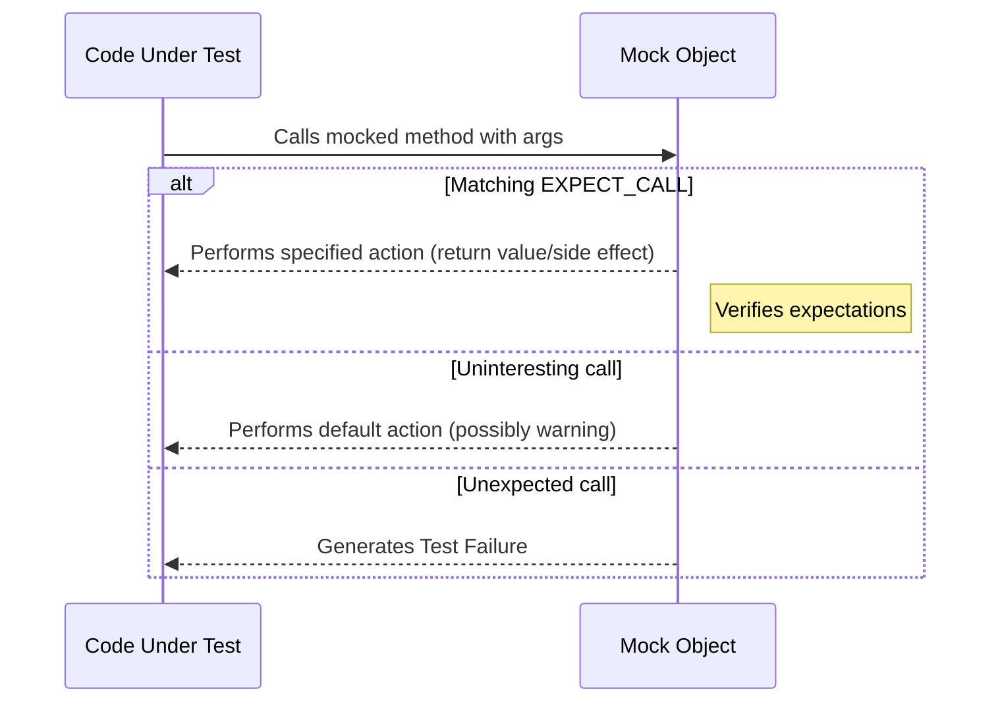

# Mock Objects: Concepts and Use Cases

Mock objects play an essential role in isolating units of code during testing. This page explores why mocks are indispensable for verifying the behavior of components in C++ projects, the fundamental mechanics behind them, and practical scenarios where mocking becomes the tool you rely on to write precise and maintainable tests.

---

## Understanding Mock Objects

Imagine you’re testing a module that depends on external systems or complex collaborators. Using real instances during tests can be impractical — they might be slow, non-deterministic, or difficult to control. Mock objects step in to simulate these collaborators, letting you focus solely on the interactions.

**What exactly is a mock object?** It’s a programmable substitute for a real object, designed to:

- Implement the same interface as the real dependency.
- Allow you to declare how it will behave during the test.
- Verify that expected interactions actually happen.

Mocks capture the *contract* of interaction, enabling you to specify:

- Which methods should be called.
- What arguments these methods should receive.
- How many times calls should occur.
- In what order calls should be made.
- What behavior (return values, side effects) should happen.

By doing so, you isolate the code under test from real dependencies, making your tests faster, more reliable, and focused on behavior rather than implementation details.

## Core Mechanics of GoogleMock Mocks

GoogleMock provides a powerful C++ framework for defining and using mocks. Here we present key concepts to help you understand how mock objects function under the hood from a user perspective.

### Defining a Mock Class

- Use the `MOCK_METHOD` macro to declare mock methods inside your mock class.
- These methods mirror the signature of the original interface's virtual functions.
- Mocks can also define multiple methods, including overloaded, const, noexcept, and methods with various calling conventions.

### Creating Mock Objects

- Instantiate mock classes directly in your tests or fixtures.
- GoogleMock supports special wrappers `NiceMock`, `NaggyMock`, and `StrictMock` to control behavior when unexpected or uninteresting calls occur (details in related documentation).

### Setting Default Behaviors with `ON_CALL`

- `ON_CALL` specifies what should happen *when* a mock method is called, without setting an expectation that it *must* be called.
- Use `WillByDefault` action clauses to define the default return values or side effects.
- It provides a fallback behavior that helps in crafting resilient tests by avoiding unnecessary failures.

### Declaring Expectations with `EXPECT_CALL`

- Use `EXPECT_CALL` to specify precisely which calls you expect to happen during the test.
- You can chain modifiers such as `.Times()`, `.WillOnce()`, `.WillRepeatedly()`, `.InSequence()`, and `.After()`.
- Expectations verify call count, argument values, and call ordering.
- Any call that does not satisfy an expectation is reported as a test failure.

### Matchers and Actions

- Argument matchers let you describe expected argument values for mock methods.
- Actions tell the mock what to do when an expectation is met (e.g., return a value, invoke a callback).

### Handling Uninteresting and Unexpected Calls

- **Uninteresting calls** are calls to mock methods without explicit expectations. By default, GoogleMock warns when they occur.
- **Unexpected calls** are calls that match expectations but do not conform to their specified arguments or counts, resulting in test failures.
- Use `NiceMock` to suppress warnings on uninteresting calls or `StrictMock` to treat them as errors.

---

## Real-World Use Cases For Mock Objects

### 1. Isolating Units Under Test

When a component interacts with external systems or complex collaborators, mocks provide the ability to:

- Control inputs and simulate specific conditions.
- Prevent side effects such as file or network operations.
- Verify that the component makes the right calls with the right data.

Example:

```cpp
using ::testing::Return;
using ::testing::_;

class MockDatabase {
 public:
  MOCK_METHOD(bool, Connect, (), ());
  MOCK_METHOD(int, Query, (const std::string& query), ());
};

TEST(MyComponentTest, QueriesDatabaseCorrectly) {
  MockDatabase mock_db;
  ON_CALL(mock_db, Connect()).WillByDefault(Return(true));
  EXPECT_CALL(mock_db, Query("SELECT * FROM users"))
      .Times(1)
      .WillOnce(Return(42));

  MyComponent comp(&mock_db);
  int result = comp.GetUserCount();
  EXPECT_EQ(result, 42);
}
```

This verifies that `GetUserCount()` queries the correct SQL without actually connecting to a real database.

### 2. Verifying Interactions & Protocol Enforcements

Mock objects can verify that the code under test adheres to the required interaction protocol, including call order and frequency.

For example, ensuring that:

- Initialization calls happen before data processing.
- Cleanup calls happen after all work is done.
- Certain methods are never called.

Sequence enforcement can be illustrated by the `InSequence` helper:

```cpp
using ::testing::InSequence;

TEST(NetworkTest, ConnectionSequence) {
  MockConnection conn;
  {
    InSequence seq;
    EXPECT_CALL(conn, Open());
    EXPECT_CALL(conn, SendData(_));
    EXPECT_CALL(conn, Close());
  }
  NetworkClient client(&conn);
  client.Run();
}
```

Such ordered expectations avoid fragile or incomplete testing of interaction flows.

### 3. Replacing Complex or Unavailable Collaborators

Mocks allow tests to run even when collaborators are:

- Not yet implemented.
- Slow, unstable, or have side effects.
- Hard to set up (prerequisite states, complex environment).

### 4. Simulating Error Conditions

Mocks let you simulate failures that would be difficult with real objects, such as:

- Returning error codes or exceptions.
- Simulating timeouts or unavailable resources.

Example:

```cpp
EXPECT_CALL(mock_db, Connect())
    .WillOnce(Return(false)); // Simulate database connection failure

EXPECT_FALSE(component.Initialize());
```

This helps ensure your error handling is exercised thoroughly.

---

## Key Best Practices When Using Mock Objects

- Prefer **`ON_CALL`** for specifying default behaviors without strict expectations.
- Use **`EXPECT_CALL`** sparingly and only for interactions you want to verify.
- Avoid over-specification — restricting argument matchers and call counts only as necessary.
- Use **`NiceMock`** to suppress warnings on uninteresting calls when such calls are expected but not important.
- Use **`StrictMock`** in exceptional cases to catch unexpected interactions immediately.
- Always define mock destructors as virtual to avoid undefined behavior.
- Structure tests to clearly separate mock setup, action, and verification phases.

---

## Troubleshooting Common Mocking Issues

### Uninteresting Mock Calls Warning

If you see warnings about uninteresting mock calls, it usually means your mocks are receiving calls without explicit expectations. To fix this, either:

- Add an `EXPECT_CALL(...).Times(AnyNumber())` for these methods.
- Switch to `NiceMock` to suppress the warnings if you don’t care about those calls.

### Unexpected Call Failures

When your tests fail with messages about unexpected calls:

- Verify that your `EXPECT_CALL` matchers are correct.
- Check that the call order and count conform to expectations or use sequences to specify order.
- Use `--gmock_verbose=info` command-line flag to print detailed call traces to diagnose mismatches.

### Over-saturated Expectation Errors

If a call triggers an error about exceeding expected invocation count:

- Use `.RetiresOnSaturation()` to automatically retire expectations after firing.
- Use `.Times()` to specify a more appropriate number of calls.

### Virtual Destructor Requirements

Mocks share base classes virtually. Lack of a virtual destructor in mocked interfaces results in undefined behavior and crashes.

Always ensure the interface you mock has a virtual destructor.

---

## Visualizing Mock Interaction Flows



This diagram outlines the runtime interaction when code under test invokes a mock method.

---

## Further Learning

To deepen your understanding and mastery of mock objects in GoogleTest and GoogleMock, consult the following:

- [Defining and Using Mock Classes](../guides/mocking-in-action/defining-mocks)
- [Setting Expectations and Verifying Interactions](../guides/mocking-in-action/setting-expectations)
- [Strictness Levels: Nice, Naggy, and Strict Mocks](../concepts/mocking-and-behavior-modeling/strictness-nice-naggy)
- [Matchers and Actions References](../api-reference/mocking-api/matchers-actions)
- [gMock Cookbook](../docs/gmock_cook_book.md) for practical recipes

Consult the [Mocking Reference](../docs/reference/mocking.md) for detailed API descriptions.

---

By understanding and leveraging mock objects effectively, you'll make your C++ testing more focused, resilient, and insightful — fostering better software quality and maintainability.

---
<br/>
**End of "Mock Objects: Concepts and Use Cases"**
