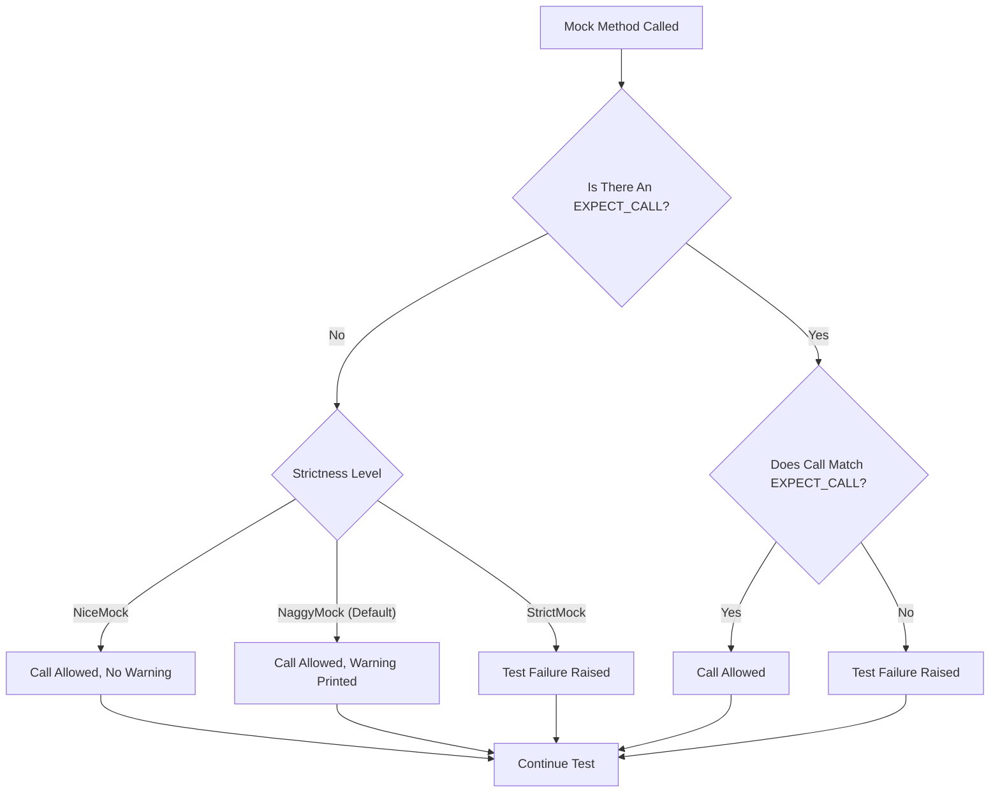

# Strictness Levels: Nice, Naggy, and Strict Mocks

Understand the different approaches to handling uninteresting mock calls using NiceMock, NaggyMock, and StrictMock. Learn the implications for test stability and debugging, and how to choose the right strategy for your codebase.

---

## Introduction

GoogleMock lets you control how uninteresting calls—calls to mock methods that have no expectations—are treated. These are calls that your tests don't explicitly expect but that might still occur during the test execution.

This page explains the three levels of strictness you can assign to mock objects:

- **NiceMock**: Ignores uninteresting calls silently.
- **NaggyMock**: Prints warnings on uninteresting calls.
- **StrictMock**: Treats uninteresting calls as test failures.

Choosing the appropriate strictness affects test stability, debugging experience, and maintenance.

---

## Background: Uninteresting Calls

When you create a mock object in GoogleMock and call its method for which **no** `EXPECT_CALL` expectation has been set, this triggers what is called an *uninteresting call*.

By default, uninteresting calls:

- Are allowed to proceed.
- Trigger warnings to notify the test author.

This default behavior corresponds to using Naggy mocks.

### Why Control Strictness?

Managing how uninteresting calls behave is important because:

- **Too strict** a policy (e.g., StrictMock) makes tests fragile and breaks on any unexpected call.
- **Too lenient** a policy (e.g., NiceMock) may allow silent bugs or unintended behavior.

The ability to tune strictness allows tests to balance verification rigor with maintainability.

---

## Strictness Levels Explained

### 1. NiceMock

A `NiceMock<T>` is a subclass of your mock class `T` that **suppresses warnings** for uninteresting calls.

- This means uninteresting calls are silently ignored.
- Your tests will not produce messages for unexpected interactions unless explicitly restricted.
- Keeps tests clean and less noisy, improving focus on expected interactions.

#### Usage Example

```cpp
using ::testing::NiceMock;

NiceMock<MockFoo> mock_foo;  // uninteresting calls produce no warnings
EXPECT_CALL(mock_foo, DoThis());
...
```

#### When to Use

- Use during active test development to avoid noise.
- Use when uninteresting calls are acceptable and do not indicate bugs.
- Recommended for most tests to improve maintainability.

#### Key Details

- NiceMock works only on mock methods defined directly in `T` using `MOCK_METHOD`.
- May misbehave if the mock class lacks a virtual destructor.

### 2. NaggyMock

A `NaggyMock<T>` is a subclass of `T` that behaves **like the default mock**.

- It prints warnings on uninteresting calls.
- Useful during debugging or when you want to be notified about unexpected mock calls.

#### Usage Example

```cpp
using ::testing::NaggyMock;

NaggyMock<MockFoo> mock_foo;  // uninteresting calls print warnings
EXPECT_CALL(mock_foo, DoThis());
...
```

#### When to Use

- Use when you want informative warnings but *not* failing tests on uninteresting calls.
- Helps find unexpected calls without breaking tests.

#### Additional Notes

- GoogleMock uses naggy behavior as the default for raw mocks (`MockFoo`).
- This default behavior is expected to become nice in future releases.

### 3. StrictMock

A `StrictMock<T>` is a subclass of `T` that treats **all uninteresting calls as failures**.

- Any call to a mock method with no matching expectation fails the test immediately.
- Provides the strictest verification level.

#### Usage Example

```cpp
using ::testing::StrictMock;

StrictMock<MockFoo> mock_foo;  // uninteresting calls cause test failure
EXPECT_CALL(mock_foo, DoThis());
...
```

#### When to Use

- Use in tests where uninteresting calls must never happen.
- Helps enforce incredibly tight interaction contracts.
- Should be used cautiously due to test fragility.

#### Important Tips

- StrictMock only affects methods defined directly with `MOCK_METHOD` in `T`.
- Can cause failures if your code calls methods without expectations unintentionally.

---

## Choosing the Right Strictness Level

| Strictness     | Effect on Uninteresting Calls            | Best Use Cases                         |
|----------------|-----------------------------------------|-------------------------------------|
| NiceMock       | Suppresses warnings                     | Production-quality tests, maintainability focus |
| NaggyMock      | Prints warnings                         | Debugging, exploratory tests        |
| StrictMock     | Fails on uninteresting calls            | Safety-critical tests, strict interaction verification |

### General Recommendation

Use **NiceMock** for everyday testing to reduce noise and allow harmless uninteresting calls.

Switch to **NaggyMock** when trying to surface potential unplanned calls without failing the test.

Reserve **StrictMock** for situations demanding explicit call restrictions.

---

## How to Create Nice, Naggy, and Strict Mocks

Assuming `MockFoo` is your mock class (created with `MOCK_METHOD` macros):

```cpp
using ::testing::NiceMock;
using ::testing::NaggyMock;
using ::testing::StrictMock;

NiceMock<MockFoo> nice_foo;      // suppresses uninteresting call warnings
NaggyMock<MockFoo> naggy_foo;    // (default) warns on uninteresting calls
StrictMock<MockFoo> strict_foo;  // errors on uninteresting calls
```

You can construct these mock objects with any constructor arguments your mock class provides:

```cpp
NiceMock<MockBar> bar('a', 'b', "c", "d", 1, 2, "e", "f", true, false);
```

This flexibility lets you adopt strictness control without invasive code changes.

---

## Impact on Test Behavior and Debugging

| Behavior Aspect              | NiceMock                          | NaggyMock                    | StrictMock                        |
|-----------------------------|---------------------------------|------------------------------|----------------------------------|
| Uninteresting Call Warnings | Suppressed                      | Printed                      | Test failure                     |
| Unexpected Calls            | Always fail (errors)             | Always fail (errors)          | Always fail (errors)              |
| Test Verbosity              | Quiet                          | Medium                       | Verbose and strict               |
| Debugging Ease              | Lower (less noise)               | Medium (some debug info)      | High rigor (immediate failures) |

> **Note:** Unexpected calls (calls matching no expectations despite having expectations set for that method) always cause test failures regardless of strictness.

---

## Best Practices and Recommendations

- **Prefer NiceMock** for ongoing test maintenance and development to reduce fragile failures caused by refactorings.
- Use **NaggyMock** during initial test development or debugging phases, when you want to be alerted about calls that you haven't yet specified expectations for.
- Reserve **StrictMock** for tests that must enforce precise call contracts, like security or safety-critical domains.
- Avoid *nesting* strictness wrappers, e.g. `NiceMock<StrictMock<MockFoo>>` is unsupported and will fail.
- Ensure your mock classes have virtual destructors to guarantee proper behavior when wrapped in these modifiers.

### Handling Move-Only Types

These strictness levels support mock classes with move-only type constructors and return types.

---

## Troubleshooting Tips

- **Warnings still appear in NiceMock:** Verify your mock methods are defined **directly** in the mock class using `MOCK_METHOD`; those inherited from a base class may still warn.
- **Unexpected test failures with StrictMock:** Check if any mock method calls occur for which no `EXPECT_CALL` is set.
- **Compiler errors with nesting:** Avoid nesting `NiceMock`, `NaggyMock`, or `StrictMock` templates.
- **Destructor problems:** If destructors are not virtual in your mocks, behavior might be undefined.
- **Verbose logging:** Use `--gmock_verbose=info` to get detailed logs about which expectations matched calls and how.

See the [Troubleshooting & Common Issues guide](/getting-started/quickstart-and-troubleshooting/troubleshooting-validation) for additional help.

---

## Summary

Controlling uninteresting mock call behavior via Nice, Naggy, and Strict mocks shapes the flexibility and reliability of your tests:

- `NiceMock` silences warnings for uninteresting calls, promoting maintainable and less brittle tests.
- `NaggyMock` (the current default) warns on uninteresting calls, aiding discovery of unexpected behaviors.
- `StrictMock` treats uninteresting calls as errors, enforcing strict interaction contracts.

Adopting the appropriate strictness level is critical to balancing test robustness, clarity, and failure noticeability.

---

## Additional Resources

- [gMock Cheat Sheet](https://google.github.io/googletest/gmock_cheat_sheet.html) — Quick reference for mocks, including strictness levels.
- [Mocking Reference](reference/mocking.md#NiceMock) — Detailed documentation on NiceMock, NaggyMock, and StrictMock.
- [Troubleshooting & Common Issues](getting-started/quickstart-and-troubleshooting/troubleshooting-validation.mdx) — Practical solutions for uninteresting call warnings and errors.
- [gMock Cookbook: The Nice, the Strict, and the Naggy](docs/gmock_cook_book.md#NiceStrictNaggy) — In-depth discussion on mock strictness concepts.
- [Debugging Test Failures and Output Customization](guides/integration-and-best-practices/debugging-and-output.mdx) — Techniques to analyze mock failures.

For best results, combine this strictness understanding with proper expectation setting (`EXPECT_CALL`) and default action specification (`ON_CALL`) in your tests.

---

## See Also

- [Defining and Using Mock Classes](guides/mocking-in-action/defining-mocks) — How to create mock classes compatible with strictness modifiers.
- [Setting Expectations and Verifying Interactions](guides/mocking-in-action/setting-expectations) — Establish expectations that avoid triggering uninteresting calls.
- [Advanced Mocking Techniques](guides/mocking-in-action/advanced-mocking) — Covers mock verbosity and interaction control.

---

##### Diagram: Uninteresting Call Behavior by Strictness Level



This illustrates the decision process when a mock method is called.
