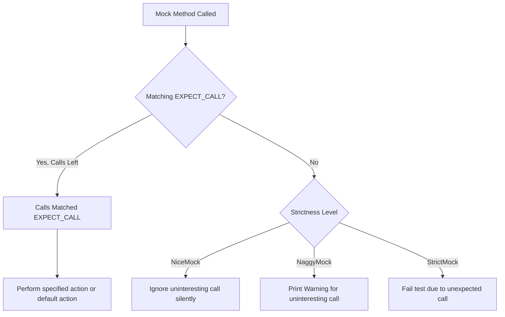

# Configuring Strictness: Nice, Naggy, and Strict Mocks

Understanding how to configure the strictness of mock objects is crucial for writing effective tests with GoogleMock. This guide explains the rationale behind different levels of strictness — **NiceMock**, **NaggyMock**, and **StrictMock** — and guides you on when and how to use each type to achieve the desired balance between developer convenience and test rigor.

---

## Why Control Mock Strictness?

Mock objects simulate real interfaces in tests, but not every interaction is equally important. Sometimes, you want to silently ignore uninteresting calls to mocks, while other times, you want such calls to warn you or even fail your test. Strictness modifiers give you control over how uninteresting (unexpected but unverified) calls to mock methods are treated.


## The Three Strictness Levels

### 1. NiceMock — Silencing Uninteresting Calls

`NiceMock<T>` creates a mock object of type `T` that **suppresses warnings** for uninteresting calls. This lets your tests focus on relevant interactions without noise from unexpected but harmless calls.

#### When to use NiceMock

- You want tests to ignore calls to mock methods that aren't explicitly expected.
- You prioritize clean test output during normal development.
- Your mock class uses `MOCK_METHOD` macros directly.

#### How to create a NiceMock

```cpp
using ::testing::NiceMock;

NiceMock<MockFoo> nice_foo;  // nice_foo behaves like MockFoo, but ignores uninteresting calls
```

You can construct `NiceMock` objects with any constructor arguments supported by the underlying mock class:

```cpp
NiceMock<MockFoo> nice_foo_with_args(5, "hello");
```

#### Notes

- Works only for mock methods defined directly in the mock class via `MOCK_METHOD`.
- Requires that the mock class have a virtual destructor to function correctly.
- The default behavior for uninteresting calls in GoogleMock **may become nice by default in the future**.


### 2. NaggyMock — Warning About Uninteresting Calls (Default Behavior)

`NaggyMock<T>` creates a mock object of type `T` that **prints warnings** when uninteresting calls occur. Currently, the default mock objects behave like `NaggyMock`, meaning a warning is issued for calls without specific expectations.

#### When to use NaggyMock

- You want to be alerted when your code makes unexpected calls.
- You are debugging or developing tests and want feedback on potentially unintended calls.

#### How to create a NaggyMock

```cpp
using ::testing::NaggyMock;

NaggyMock<MockFoo> naggy_foo;
```

NaggyMock behaves just like the underlying mock class except it warns on uninteresting calls.


### 3. StrictMock — Treating Uninteresting Calls as Errors

`StrictMock<T>` creates a mock object of type `T` for which **any uninteresting calls are treated as test failures**. This is the strictest enforcement and helps ensure your test explicitly specifies all expected behavior.

#### When to use StrictMock

- You want to fully specify and verify all mock interactions.
- You want tests to fail if code under test calls unexpected or unplanned mock methods.
- You want the highest confidence in interaction correctness.

#### How to create a StrictMock

```cpp
using ::testing::StrictMock;

StrictMock<MockFoo> strict_foo;
```

Your tests will fail immediately if an uninteresting method call happens on `strict_foo`.


## Summary of Behavior Differences

| Aspect                    | NiceMock          | NaggyMock (Default)           | StrictMock         |
|---------------------------|-------------------|-------------------------------|--------------------|
| Uninteresting Call Action | Silently ignores  | Prints warning to stdout       | Causes test failure |
| Expected Call Behavior     | Normal            | Normal                        | Normal             |
| Default Use Case           | Most test cases   | Development/debugging         | Strict verification|


## Practical Guidance

### Choosing the Right Strictness

- **Use `NiceMock` by default** to reduce noise and make tests easier to maintain.
- **Use `NaggyMock` when debugging test behaviors** to identify unexpected calls.
- **Use `StrictMock` sparingly** when you want fully specified tests, especially for critical components.

### Important Caveats

- `NiceMock<T>`, `NaggyMock<T>`, and `StrictMock<T>` only affect mock methods defined via `MOCK_METHOD` **directly** in `T`. Inherited mock methods may not behave as expected.
- Do **not** nest strictness wrappers (e.g., `NiceMock<StrictMock<T>>`) — this is unsupported.
- Mock classes *must* have virtual destructors for strictness wrappers to work correctly.


### Usage Example

```cpp
#include <gmock/gmock.h>
using ::testing::NiceMock;
using ::testing::NaggyMock;
using ::testing::StrictMock;

class MockFoo {
 public:
  MOCK_METHOD(void, DoThis, (), ());
  MOCK_METHOD(int, GetValue, (), (const));
};

void TestNiceMock() {
  NiceMock<MockFoo> nice;
  EXPECT_CALL(nice, DoThis());
  nice.DoThis();                        // Ok
  nice.GetValue();                     // Ignored without warning
}

void TestNaggyMock() {
  NaggyMock<MockFoo> naggy;
  EXPECT_CALL(naggy, DoThis());
  naggy.DoThis();                      // Ok
  naggy.GetValue();                   // Warning about uninteresting call
}

void TestStrictMock() {
  StrictMock<MockFoo> strict;
  EXPECT_CALL(strict, DoThis());
  strict.DoThis();                    // Ok
  strict.GetValue();                 // Test fails due to unexpected call
}
```


## Troubleshooting Common Issues

<AccordionGroup title="Common Pitfalls and Tips">
<Accordion title="Unexpected Behavior of Strictness Wrappers with Inherited Mock Methods">
If your mock inherits mock methods from a base class, the strictness wrappers (`NiceMock`, `NaggyMock`, `StrictMock`) **may not affect** those inherited methods consistently due to compiler differences. Defining `MOCK_METHOD`s directly in the mock class prevents this.
</Accordion>
<Accordion title="Destructor Not Virtual Error with Strictness Wrappers">
Ensure that your mock classes have virtual destructors. Without them, `NiceMock`, `NaggyMock`, and `StrictMock` might behave unpredictably.
</Accordion>
<Accordion title="Suppressing Uninteresting Call Warnings Without Strictness Wrappers">
Instead of using `NaggyMock`, you can suppress warnings for specific methods via expectations like `EXPECT_CALL(mock, Method(_)).Times(AnyNumber());` to explicitly allow uninteresting calls.
</Accordion>
<Accordion title="Unexpected Calls Not Suppressed by NiceMock">
Remember that `NiceMock` only suppresses warnings about uninteresting calls, it does not suppress failures on *unexpected calls* where argument matchers do not match any expectation.
</Accordion>
</AccordionGroup>


## Internal Behavior Outline

When a mock method is called:

1. gMock searches for matching expectations in reverse order (newer overrides older).
2. If a matching expectation is found and calls remain, the expectation is satisfied.
3. If no matching expectation exists, or expectation call limit is exceeded, the call is either an uninteresting or unexpected call.
4. The strictness wrapper adjusts the behavior on uninteresting calls:
    - `NiceMock`: ignores silently.
    - `NaggyMock`: prints a warning.
    - `StrictMock`: treats as an error.


## Further Reading and Related Topics

- [gMock Cookbook](https://google.github.io/googletest/gmock_cook_book.html#NiceStrictNaggy) — Detailed recipes and examples for using strictness wrappers.
- [Mocking Reference: Strictness Wrappers](https://google.github.io/googletest/reference/mocking.html#NiceMock) — Official API details.
- [gMock for Dummies](https://google.github.io/googletest/gmock_for_dummies.html) — Beginner-friendly introduction.

---

## Summary

Controlling mock strictness with `NiceMock`, `NaggyMock`, and `StrictMock` helps balance test noise with verification rigor. `NiceMock` suppresses warnings from uninteresting calls for cleaner tests, `NaggyMock` (the current default) warns about such calls, and `StrictMock` treats uninteresting calls as test failures to enforce strict interaction contracts.

<Check>
**Tip:** Favor `NiceMock` in most tests for maintainability; reserve `StrictMock` for scenarios requiring tight interaction verification.
</Check>

---

## Visual Overview



This diagram illustrates how the mock's strictness wrapper influences handling of calls without matching expectations.
