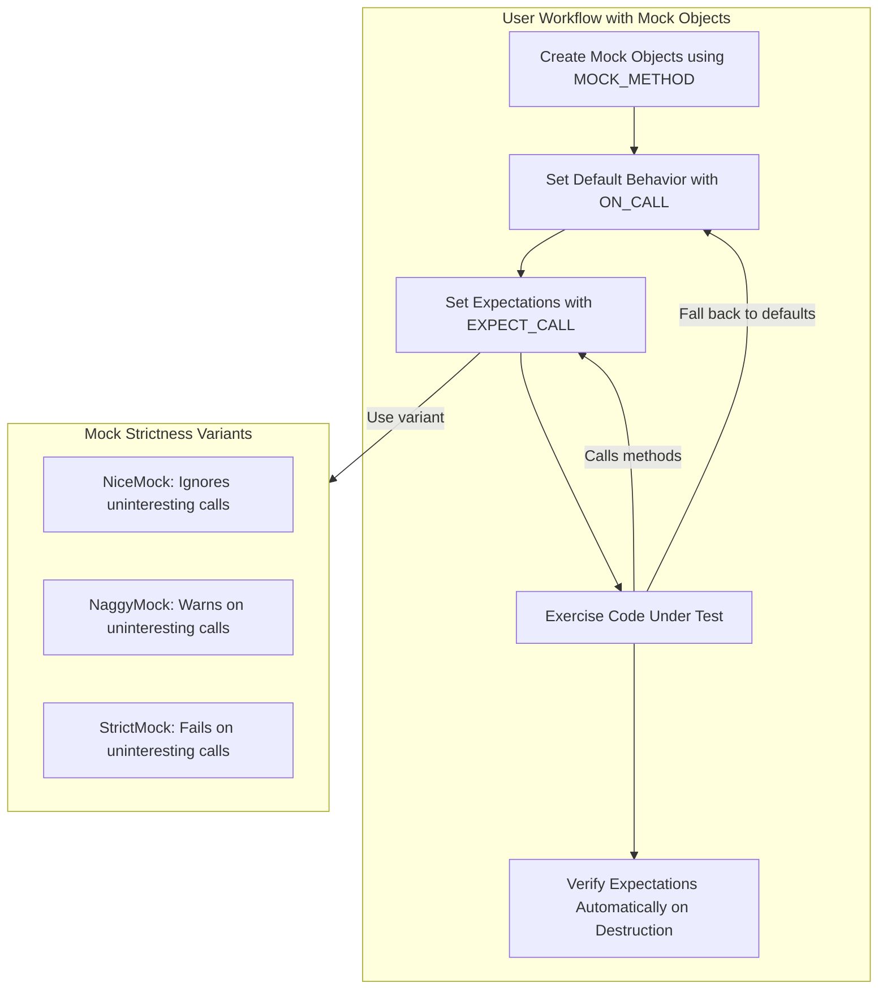

# Mock Objects: Design and Usage

Mock objects are fundamental building blocks in GoogleMock that allow you to isolate components for testing by simulating dependencies. This guide unveils the design philosophy of mock objects, how to declare mock classes, set their behavior, and specify interaction expectations to verify that interfaces are used correctly.

---

## Introduction to Mock Objects

In unit testing, dependencies often complicate test setup and reliability. Mocks address this by providing controlled, programmable substitutes mimicking real objects' interfaces. They intercept calls, check arguments, enforce call order, and return controlled responses.

Mock objects allow tests to _verify interactions_ — what calls were made, with which arguments, and in what sequence — which is essential for interaction-based testing.

### Key Benefits of Using Mock Objects

- **Isolate components**: Reduce external dependencies for faster, more reliable tests.
- **Verify interactions**: Ensure the code under test calls its collaborators correctly.
- **Simulate complex behaviors**: Easily reproduce edge cases or failure modes that are hard to trigger in real objects.
- **Improve design**: Encourage interface-driven design and facilitate early prototyping.

---

## Declaring Mock Classes

A mock class is a subclass of an interface or abstract class that defines mock methods representing virtual functions. GoogleMock provides the `MOCK_METHOD` macro to declare these mock methods succinctly.

### Defining Mock Methods

Use the macro `MOCK_METHOD` with the following syntax:

```cpp
MOCK_METHOD(ReturnType, MethodName, (Arguments), (Qualifiers));
```

- `ReturnType`: The return type of the virtual function.
- `MethodName`: The name of the mocked method.
- `(Arguments)`: The parameters the function takes, enclosed in parentheses.
- `(Qualifiers)`: Optional qualifiers like `const`, `override`, `noexcept`.

**Example:**

```cpp
class Turtle {
 public:
  virtual ~Turtle() {}
  virtual void PenUp() = 0;
  virtual void PenDown() = 0;
  virtual void Forward(int distance) = 0;
  virtual void Turn(int degrees) = 0;
  virtual void GoTo(int x, int y) = 0;
  virtual int GetX() const = 0;
  virtual int GetY() const = 0;
};

class MockTurtle : public Turtle {
 public:
  MOCK_METHOD(void, PenUp, (), (override));
  MOCK_METHOD(void, PenDown, (), (override));
  MOCK_METHOD(void, Forward, (int distance), (override));
  MOCK_METHOD(void, Turn, (int degrees), (override));
  MOCK_METHOD(void, GoTo, (int x, int y), (override));
  MOCK_METHOD(int, GetX, (), (const, override));
  MOCK_METHOD(int, GetY, (), (const, override));
};
```

This macro automatically generates method definitions, so no additional definitions are necessary.

### Important Considerations

- Always declare mock methods in the `public` section, even if the base class method is protected or private.
- If the mocked method is `const`, add `(const)` to the macro qualifiers.
- Include `(override)` to express intent and catch interface mismatches early.
- Use type aliases or parentheses for complex return types or argument types to avoid macro parsing issues.

<Note>
Virtual destructors in interfaces are crucial. Without a virtual destructor, deleting a mock object through a base pointer can cause leaks or undefined behavior.
</Note>

---

## Specifying Mock Behavior and Expectations

Mock behavior hinges on two complementary concepts:

1. **Default behavior** — specified by `ON_CALL`, defines what a mock does when a method is called but no particular expectation exists.
2. **Expectations** — specified by `EXPECT_CALL`, assert that specific method calls occur, how often, with what arguments, and potentially define the expected behavior.

### Setting Expectations with `EXPECT_CALL`

Use `EXPECT_CALL` to declare the expectation that a mock method will be called with certain arguments:

```cpp
EXPECT_CALL(mock_object, MethodName(matchers...))
    .Times(cardinality)
    .WillOnce(action)
    .WillRepeatedly(action); 
```

- `mock_object`: The mock instance.
- `MethodName(matchers...)`: The method name and argument matchers (or no parentheses for non-overloaded methods).
- `.Times(cardinality)`: How many times the call is expected.
- `.WillOnce(action)`: Behavior for one call.
- `.WillRepeatedly(action)`: Behavior for repeated calls after `WillOnce`s are consumed.

Example:

```cpp
using ::testing::Return;
EXPECT_CALL(turtle, GetX())
    .Times(5)
    .WillOnce(Return(100))
    .WillOnce(Return(150))
    .WillRepeatedly(Return(200));
```

This sets that `GetX()` will be called five times, returning `100`, then `150`, then `200` for subsequent calls.

### Using Argument Matchers

Matchers specify which argument values the expectation applies to.

Common matchers include:
- `_` — wildcard that matches any argument.
- `Eq(value)`, implicit when using literal values — matches equal arguments.
- Predicate matchers like `Ge()`, `Lt()`, `NotNull()`, and more.

Example:

```cpp
EXPECT_CALL(turtle, Forward(Ge(100)));  // Forward called with value >= 100
EXPECT_CALL(turtle, GoTo(50, _));       // GoTo called with x=50 and any y
```

### Cardinalities with `.Times()`

Expressions like `Times(AnyNumber())`, `Times(AtLeast(n))`, `Times(Exactly(n))` control call counts:

| Cardinality       | Meaning                                      |
|-------------------|----------------------------------------------|
| `AnyNumber()`     | Called zero or more times                     |
| `AtLeast(n)`      | Called at least `n` times                      |
| `AtMost(n)`       | Called at most `n` times                       |
| `Between(m, n)`   | Called between `m` and `n` times, inclusive  |
| `Exactly(n)`      | Called exactly `n` times                       |

If `.Times()` is omitted, gMock infers it based on `.WillOnce()` and `.WillRepeatedly()` clauses.

---

## Controlling Call Ordering

By default, gMock does not enforce call order between different expectations. You can enforce ordering explicitly.

### Sequences

Use the `InSequence` helper to expect calls in the order they are specified:

```cpp
using ::testing::InSequence;
{
  InSequence s;  // All expectations in this block are ordered.
  EXPECT_CALL(foo, FirstCall());
  EXPECT_CALL(foo, SecondCall());
  EXPECT_CALL(foo, ThirdCall());
}
```

Now, `FirstCall()` must happen before `SecondCall()` and so on.

### Partial Order with Multiple Sequences

To express more complex partial orders, you can create multiple `Sequence` objects and associate expectations with them via `.InSequence()`. Calls must respect all sequence orderings specified.

### After Dependencies

Use `.After(...)` to specify that some calls must happen after others, even across multiple mock objects.

---

## Using Default Actions with `ON_CALL`

Sometimes you want to specify *how* a mock method behaves by default, without setting expectations that it must be called.

For this, use `ON_CALL(mock_object, MethodName(matchers...))` coupled with `.WillByDefault(action)`.

Example:

```cpp
ON_CALL(turtle, GoTo(_, _))
    .WillByDefault(Return());  // Default does nothing
```

`ON_CALL` defines default behaviors overridden by `EXPECT_CALL` when it applies to the same method signature and argument matchers.

---

## Handling Uninteresting and Unexpected Calls

- **Uninteresting calls**: Calls to mock methods without any expectations; by default, gMock prints a warning.
- **Unexpected calls**: Calls that *do* have expectations but none matches the actual call; always an error.

You can control uninteresting call behavior per-mock object using `NiceMock`, `NaggyMock`, or `StrictMock` wrappers around your mock class.

- `NiceMock<T>`: Suppresses warnings for uninteresting calls.
- `NaggyMock<T>`: Default behavior, warns on uninteresting calls.
- `StrictMock<T>`: Treats uninteresting calls as errors.

Example:

```cpp
NiceMock<MockTurtle> nice_turtle;
Expect_CALL(nice_turtle, PenDown()).Times(1);
// Calls to other methods won't warn.
```

---

## Best Practices and Tips

- **Declare all mock methods in `public`**: This ensures they can be referred to by `EXPECT_CALL` and `ON_CALL`.
- **Set expectations before exercising mocks**: Failing to do so results in undefined behavior.
- **Use matchers sparingly**: Specify only necessary argument matchers to avoid overly brittle tests.
- **Use default actions with `ON_CALL`** to set common behavior without enforcing expectations.
- **Control strictness level**: Use `NiceMock` by default for maintainable tests; sprinkle `StrictMock` as needed.
- **Use sequences to enforce call order** but avoid over-specifying order to reduce test fragility.
- **Leverage mocking for interface design**: Mock early to refine interfaces and isolate dependencies.

---

## Example End-to-End Mock Usage

```cpp
#include <gmock/gmock.h>
#include <gtest/gtest.h>

using ::testing::AtLeast;

class MockTurtle : public Turtle {
 public:
  MOCK_METHOD(void, PenUp, (), (override));
  MOCK_METHOD(void, PenDown, (), (override));
  MOCK_METHOD(void, Forward, (int distance), (override));
  MOCK_METHOD(void, Turn, (int degrees), (override));
  MOCK_METHOD(void, GoTo, (int x, int y), (override));
  MOCK_METHOD(int, GetX, (), (const, override));
  MOCK_METHOD(int, GetY, (), (const, override));
};

TEST(PainterTest, DrawsCircleCorrectly) {
  MockTurtle turtle;

  EXPECT_CALL(turtle, PenDown())
      .Times(AtLeast(1));
  EXPECT_CALL(turtle, Forward(100)).Times(AtLeast(1));

  Painter painter(&turtle);
  EXPECT_TRUE(painter.DrawCircle(0, 0, 10));
}
```

If the `Painter` class fails to call `PenDown` or `Forward(100)`, gMock reports an error immediately.

---

## Troubleshooting

- **Uninteresting mock function call warnings:** Consider using `NiceMock` or explicitly allowing calls with `.Times(AnyNumber())`.
- **Unexpected calls:** Check your `EXPECT_CALL` matchers and ordering.
- **Mock method not called as expected:** Confirm you set expectations *before* the actual test steps.
- **Heap checker failures:** Ensure interfaces have virtual destructors.

---

## Related Topics

- [Using the `MOCK_METHOD` Macro](../api-reference/mocking-apis/mock-classes-methods.md)
- [Setting Expectations with `EXPECT_CALL`](../api-reference/mocking-apis/defining-expectations-actions.md#EXPECT_CALL)
- [Mock Strictness: NiceMock, NaggyMock, StrictMock](../api-reference/mocking-apis/strictness-and-unexpected-calls.md)
- [gMock for Dummies](docs/gmock_for_dummies.md) tutorial for practical learning
- [gMock Cookbook](docs/gmock_cook_book.md) for advanced patterns

---

## Summary

This page equips you with a conceptual and practical understanding of GoogleMock mock objects. You learned how to define mock classes using `MOCK_METHOD`, specify method behaviors and expectations with `ON_CALL` and `EXPECT_CALL`, and manage call ordering and strictness with sequences and mock wrappers. Armed with these tools, you can write precise, maintainable tests that verify interactions effectively.

---

## Visual Overview


```

---

<Check>
Remember: always set expectations before exercising your test code. Use mock strictness wisely to balance noise and test maintenance.
</Check>

---

<Info>
Explore related pages like the [Mocking Reference](docs/reference/mocking.md) and [Mocking Best Practices](guides/essential-testing-patterns/mocking-best-practices.mdx) for further mastery.
</Info>
