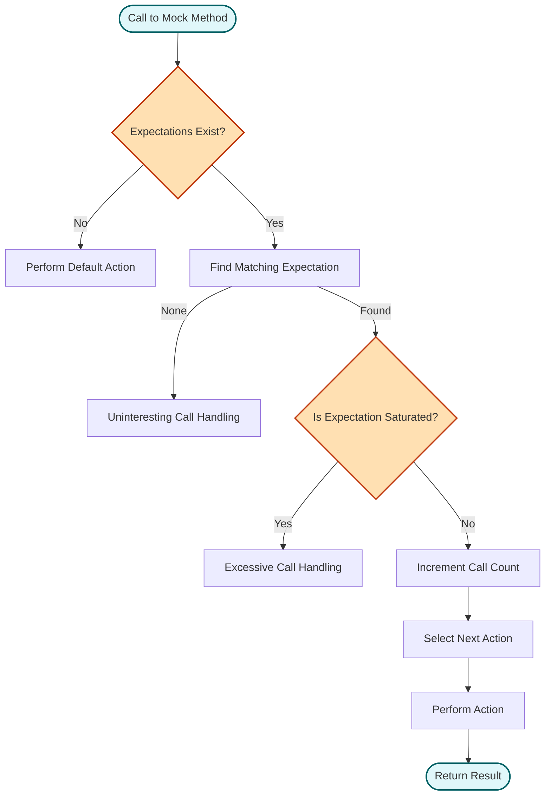

# Mock Objects and Expectations

This guide delves into *mock objects* and *expectations* within GoogleMock (gMock), illustrating how mock classes are defined, how expectations can be precisely declared and enforced, and how the framework verifies correct interactions between your code and its dependencies during testing.

---

## Introduction to Mock Objects

In complex C++ systems, directly using real objects in tests often leads to cumbersome, slow, or brittle tests. To achieve robust and fast unit tests, mocking offers a powerful approach. 

A mock object replicates the interface of a real object but allows you to specify expected interactions with it, such as which methods will be called, how often, in what order, with which arguments, and what those methods should return.

Unlike *fake* objects that provide alternative working implementations (which may shortcut real behavior for efficiency), *mock* objects work primarily by defining expectations on their use during tests.

GoogleMock (gMock) facilitates this for C++ by automating mock creation and providing a rich syntax to specify and verify behaviors precisely.

---

## Defining Mock Classes

To create a mock for an interface or abstract class:

1. **Derive a mock class** from the interface.
2. **Use the `MOCK_METHOD` macro** in the `public` section to define mock methods corresponding to each virtual method.

### Syntax of `MOCK_METHOD`

```cpp
MOCK_METHOD(return_type, method_name, (args...), (specifiers));
```

- `return_type`: The method's return type.
- `method_name`: The mocked method's name.
- `args...`: Arguments in parentheses; if arguments include commas, wrap the whole argument list in extra parentheses to disambiguate.
- `specifiers`: Optional list including `const`, `override`, `noexcept`, `Calltype(...)`, and `ref(...)` for reference qualifiers.

**Example:**

```cpp
class Turtle {
 public:
  virtual ~Turtle() {}
  virtual void PenUp() = 0;
  virtual int GetX() const = 0;
};

class MockTurtle : public Turtle {
 public:
  MOCK_METHOD(void, PenUp, (), (override));
  MOCK_METHOD(int, GetX, (), (const, override));
};
```

### Best Practices

- Always place `MOCK_METHOD` definitions in the `public:` section, regardless of the access level in the base class.
- Mock all virtual methods you intend to call or verify; pure virtual methods must be mocked or overridden.
- Avoid mocking classes you do not own, or place mock classes in appropriate test-only directories.
- For dependencies that lack an interface, consider writing an adaptor interface to mock against.

---

## Setting Expectations on Mock Objects

Once a mock object is defined, you set **expectations** to specify how you anticipate the object will be interacted with during the test.

### `EXPECT_CALL` Macro

Syntax:

```cpp
EXPECT_CALL(mock_object, Method(matchers...))
    .With(multi_argument_matcher)  // optional
    .Times(cardinality)            // optional
    .InSequence(sequences...)      // optional
    .After(expectations...)        // optional
    .WillOnce(action)              // optional, can appear multiple times
    .WillRepeatedly(action)        // optional, only once
    .RetiresOnSaturation();        // optional, only once
```

- **`mock_object`**: The mock instance.
- **`Method(matchers...)`**: The mock method with argument matchers (exact values, wildcards `_`, or custom matchers).
- **Clauses:** adjust the behavior and constraints.

### Example

```cpp
using ::testing::AtLeast;
using ::testing::Return;

MockTurtle turtle;
EXPECT_CALL(turtle, PenDown())
    .Times(AtLeast(1));

Painter painter(&turtle);
EXPECT_TRUE(painter.DrawCircle(0, 0, 10));
```

This expects that `PenDown()` is called at least once during the test. Failing to satisfy this expectation results in an immediate error.

### Matchers

Matchers specify which arguments the expectation applies to:

- Use exact values for precise matching.
- Use `_` to allow any argument value.
- Use built-in matchers like `Ge()`, `Eq()`, or custom predicate matchers.

### Cardinalities

Cardinalities specify how many times a method call is expected:

| Cardinality     | Meaning                                           |
|-----------------|--------------------------------------------------|
| `Exactly(n)` or `n` | The method must be called exactly `n` times.      |
| `AtLeast(n)`    | Call at least `n` times.                           |
| `AtMost(n)`     | Call at most `n` times.                            |
| `Between(m, n)` | Call between `m` and `n` times inclusive.         |
| `AnyNumber()`   | The method can be called any number of times.    |

If omitted, gMock infers cardinality based on `WillOnce()` and `WillRepeatedly()` clauses.

### Actions

Actions define what the mocked method will do when called:

- `WillOnce(action)`: Define behavior for one call.
- `WillRepeatedly(action)`: Define behavior for all subsequent calls after `WillOnce()` actions are exhausted.

Common actions include `Return(value)`, `ReturnRef(ref)`, and custom lambdas.

### Ordered and Unordered Calls

By default, gMock allows calls to mock methods to occur in **any order**. Use `InSequence` to enforce **strict call order**:

```cpp
{
  InSequence seq;
  EXPECT_CALL(turtle, PenDown());
  EXPECT_CALL(turtle, Forward(100));
  EXPECT_CALL(turtle, PenUp());
}
```

This enforces that the calls must occur sequentially as declared.

You can also specify **partial orders** of calls using the `After` clause or multiple `Sequence` objects. This provides flexible ordering constraints.

### Sticky Expectations

Expectations are *sticky* by default: they remain active even after full saturation, which can cause errors if the same call happens too many times.

Use `.RetiresOnSaturation()` to make an expectation retire immediately once satisfied. Especially useful in sequences or multiple `WillOnce` actions.

### Handling Uninteresting Calls

If a mock method is called without an expectation, it’s an *uninteresting call*. By default, gMock warns but allows it.

Customize the mock’s strictness using:

- `NiceMock<T>`: suppresses warnings on uninteresting calls.
- `NaggyMock<T>`: default behavior, warns on uninteresting calls.
- `StrictMock<T>`: treats uninteresting calls as failures.

---

## Verifying Mock Expectations

gMock verifies that all expectations have been met when a mock object is destructed.

You can also explicitly verify anytime:

```cpp
using ::testing::Mock;
...
ASSERT_TRUE(Mock::VerifyAndClearExpectations(&mock_obj));
```

Or verify and clear expectations and default actions:

```cpp
ASSERT_TRUE(Mock::VerifyAndClear(&mock_obj));
```

### Notes

- Avoid setting new expectations after verification on the same mock object.
- Leaking a mock object without verifying it can cause false positives; use `Mock::AllowLeak(mock_obj);` if intentional.

---

## Summary of User Workflow

<Steps>
<Step title="Define a Mock Class">
Derive a mock class and use `MOCK_METHOD` to override virtual methods.
</Step>
<Step title="Create Mock Objects in Tests">
Instantiate mock objects as needed in your test.
</Step>
<Step title="Set Default Behaviors (Optional)">
Use `ON_CALL` to specify default behavior of mocks when you don’t want to enforce call checks.
</Step>
<Step title="Set Expectations">
Use `EXPECT_CALL` to declare expected calls, argument matchers, call count, order, and behaviors.
</Step>
<Step title="Exercise Your Code">
Run your production code with the mocks injected.
</Step>
<Step title="Verify Expectations">
Expectations are verified on mock destruction or explicitly using `Mock::VerifyAndClearExpectations()`.
</Step>
</Steps>

---

## Troubleshooting Common Issues

<AccordionGroup title="Common Problems and Tips">
<Accordion title="Uninteresting Function Call Warning">
These warnings mean a mock method was called without expectation. Suppress with `NiceMock` or specify `EXPECT_CALL(...).Times(AnyNumber())` if the call is allowed.
</Accordion>
<Accordion title="Expectation Not Satisfied">
Verify that the expected method is actually invoked with the correct arguments and that `EXPECT_CALL` is set before code under test runs.
Use `--gmock_verbose=info` to trace calls and expectation matches.
</Accordion>
<Accordion title="Ordering Errors">
Use `InSequence` or `After` to specify call order. Verify no calls occur out-of-order.
</Accordion>
<Accordion title="Mock Object Not Verified">
Ensure mock objects are properly destructed or call `Mock::VerifyAndClearExpectations()` explicitly.
</Accordion>
<Accordion title="Over-specification of Expectations">
Avoid making expectations too strict; prefer specifying only what your test truly cares about.
</Accordion>
</AccordionGroup>

---

## Additional Tips and Best Practices

- Always set expectations **before** exercising code that uses the mock.
- When writing sequences, group expectations inside an `InSequence` block.
- Use `WillOnce` and `WillRepeatedly` to clearly specify repeated behaviors.
- Use matchers judiciously. `_` is convenient for unimportant arguments, but be explicit where necessary.
- Practice *interaction-based testing* to verify how your code interacts with its dependencies rather than just the final outcomes.

---

## Visual Overview of the Expectation Matching Flow



---

## References and Related Documentation

- [gMock for Dummies](https://google.github.io/googletest/gmock_for_dummies.html): Beginner-friendly introduction to gMock concepts and usage.
- [gMock Cookbook](https://google.github.io/googletest/gmock_cook_book.html): Recipes for advanced mocking techniques.
- [Mocking Reference](reference/mocking.md): Comprehensive API reference for defining mocks and setting expectations.
- [Matchers Reference](reference/matchers.md): Guide to argument matchers used in expectations.
- [Mock Object Configuration](api-reference/mocking-framework/mock-object-configuration.md): Explanation of `NiceMock`, `StrictMock`, and `NaggyMock`.

---

This guide focuses exclusively on the mechanics and concepts around mock objects, expectations, and verification within GoogleMock, enabling you to author high-quality, interaction-focused tests for C++ codebases.