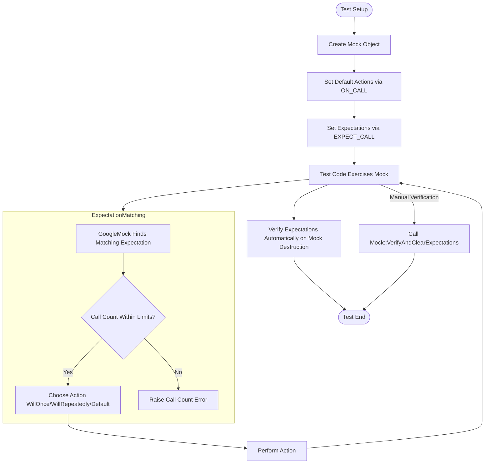

# Expectations, Actions, and Matchers

GoogleMock provides a rich and expressive framework to specify, control, and verify the behavior of mock objects. This page presents how GoogleMock separates concerns into Expectations, Actions, and Matchers — allowing users to precisely define how mock methods are called, with which arguments, what they return or invoke, and how often. Understanding these core concepts empowers you to write robust, maintainable, and flexible tests.

---

## 1. Expectations: Defining What Calls Are Expected

Expectations specify *which mock method calls should occur*, with what arguments, how many times, and in which order. They form the contract that the tested code should adhere to.

### 1.1 Declaring Expectations with `EXPECT_CALL`

You declare expectations using the `EXPECT_CALL()` macro in test code:

```cpp
EXPECT_CALL(mock_object, MethodName(matchers))
    .Times(cardinality)
    .WillOnce(action)
    .WillRepeatedly(action);
```

- **`mock_object`**: instance of your mock class.
- **`MethodName`**: mocked method.
- **`matchers`**: describe argument expectations (see section 3).
- **`.Times()`**: how often the call should happen (see below).
- **`.WillOnce()` / `.WillRepeatedly()`**: specify actions to perform.

Example:

```cpp
EXPECT_CALL(turtle, Forward(Ge(100)))
    .Times(AtLeast(1))
    .WillOnce(Return())
    .WillRepeatedly(Return());
```

This expects the `Forward` method to be called at least once with an argument greater than or equal to 100.

### 1.2 Cardinalities: How Many Times?

The `.Times()` clause defines call count expectations, using:

- `AnyNumber()` — any number of calls allowed
- `Exactly(n)` or `n` — exactly `n` times
- `AtLeast(n)`, `AtMost(n)` — lower or upper bounds
- `Between(m, n)` — within a range

If `.Times()` is omitted, GoogleMock infers it based on `.WillOnce()` and `.WillRepeatedly()` clauses.

> **Note:** When multiple expectations match a call, GoogleMock chooses the last matching expectation, allowing you to set default expectations early and override them later.

### 1.3 Ordering Expectations

By default, calls matching expectations can occur in any order. For ordering:

- Use **`InSequence(sequence)`** to specify sequential expectations.
- Use **`After(expectations...)`** to express partial ordering.

Example:

```cpp
Sequence s;
EXPECT_CALL(mock, Foo(1)).InSequence(s);
EXPECT_CALL(mock, Bar()).InSequence(s);
```

This requires `Foo(1)` to be called before `Bar()`.

### 1.4 Retiring Expectations When Saturated

By default, expectations remain active even after their call count quota is reached (sticky). Adding `.RetiresOnSaturation()` will cause the expectation to become inactive once saturated, allowing more specific expectations that follow to be used.

### 1.5 Common Pitfalls

- **Setting Expectations After Calls:** Always set expectations *before* exercising the mock, or behavior is undefined.
- **Sticky Expectations:** Without `.RetiresOnSaturation()`, an expectation that has reached its upper bound remains active, causing errors on additional matching calls.
- **Matching Order:** More specific expectations should be declared *after* more general ones to avoid shadowing.

---

## 2. Actions: Controlling What Happens When Expected Calls Occur

Actions define *how mock methods behave* when invoked: what they return, what side effects they have, or callbacks they invoke.

### 2.1 Default Actions

By default, mock methods return:

- `void`: no action
- `bool`: false
- numeric types: zero
- user-defined types with default constructors: default-constructed value

You can override these using `ON_CALL()` or specifying actions in `EXPECT_CALL()`.

### 2.2 Specifying Actions in `EXPECT_CALL`

- `.WillOnce(action)` defines the action for a single call
- `.WillRepeatedly(action)` defines the action applied after all `.WillOnce()` actions are exhausted

Example:

```cpp
EXPECT_CALL(mock, GetValue())
    .WillOnce(Return(10))
    .WillRepeatedly(Return(5));
```

### 2.3 Common Actions

- `Return(value)`: Return a value.
- `ReturnRef(variable)`: Return a reference.
- `Invoke(func)`: Call a callable (function, lambda, functor) when invoked.
- `SetArgPointee<N>(value)`: Sets the N-th argument pointed-to variable.
- `DoAll(actions...)`: Combines multiple actions in sequence; the last action's return value is used.
- `InvokeArgument<N>(args...)`: Calls the N-th argument as callable with given parameters.

### 2.4 Delegating Calls

You can delegate calls to:

- A **fake object** for default behavior.
- A **real object** to preserve original behavior while verifying interactions.
- A **parent class method** to use base class implementation instead of the mock.

### 2.5 Best Practices

- Use *lambdas* or *callables* to express complex behavior clearly.
- Avoid returning move-only values with `Return()`; instead, use lambdas for dynamic generation.
- Chain actions with `DoAll()` if multiple side effects are required.

---

## 3. Matchers: Describing Which Arguments Are Accepted

Matchers allow you to specify *which function arguments* are acceptable when matching expectations.

### 3.1 Basic Argument Matchers

- `_`: Wildcard matcher, matches anything.
- `Eq(value)`: Matches arguments equal to `value`.
- `Ge(value)`, `Gt(value)`, `Le(value)`, `Lt(value)`: Relational matchers.
- `Not(matcher)`: Negation matcher.

Example:

```cpp
EXPECT_CALL(mock, Foo(Ge(10), _));  // First argument >= 10, second – anything
```

### 3.2 Combining Matchers

Use composition to combine multiple matchers:

- `AllOf(m1, m2, ...)`: All matchers must be satisfied.
- `AnyOf(m1, m2, ...)`: At least one matcher is satisfied.

### 3.3 Custom Matchers

You can define your own matchers using `MATCHER`, `MATCHER_P`, or by implementing the matcher interface directly.

### 3.4 Matching Complex Types

Matchers can test container contents, tuples, or object fields:

- `ElementsAre(e1, e2, ...)` for containers.
- `Field(&Class::member, matcher)` to match object member fields.
- `Property(&Class::method, matcher)` to match return values of getter methods.

### 3.5 Matching Arguments as a Whole

You can use `.With()` on expectations or default actions to match *all* arguments as a tuple.

Example:

```cpp
EXPECT_CALL(mock, Method(_, _)).With(Lt());  // First argument < Second argument
```

### 3.6 Overloaded and Const Methods

- Use `Const(mock)` to specify expectations on const overloads.
- Use casting or explicit matcher typing to disambiguate overloaded methods.

### 3.7 Important Notes

- Matchers must be *pure functions* without side effects.
- Matchers should be efficient to invoke as they may be called many times.

---

## 4. Putting It All Together: User Flow

Here’s the typical user flow in a test:

1. **Create a mock object**.
2. **Set default behavior** for mock methods using `ON_CALL()` for calls you are not interested in verifying.
3. **Set expectations** using `EXPECT_CALL()` for calls you want to verify:
   - Use matchers to specify argument constraints.
   - Use `.Times()` to limit/exactly specify call counts.
   - Use `.InSequence()` or `.After()` to arrange call order if needed.
   - Use `.WillOnce()` and `.WillRepeatedly()` to specify behavior on calls.
4. **Exercise your code**, which uses the mock object.
5. **Verify** mock expectations implicitly by test framework teardown or explicitly using `Mock::VerifyAndClearExpectations()`.

This separation between setting expectations, defining argument constraints, and specifying actions allows for clean and declarative tests that catch deviation from expected behavior precisely.

---

## 5. Troubleshooting & Tips

### 5.1 Uninteresting Calls

Calling a mock method *without* any expectation will result in an "uninteresting call" warning (naggy mock behavior). Use `NiceMock` to silence warnings or `StrictMock` to treat them as errors.

### 5.2 Unexpected Calls

Calling a mock method that has expectations but doesn’t match any is an error. Make sure your expectations cover all valid calls or disallow unexpected calls with `.Times(0)`.

### 5.3 Too Few or Too Many Calls

GoogleMock will warn or generate errors if calls don’t meet `.Times()` criteria. Use `.RetiresOnSaturation()` to retire expectations once fulfilled.

### 5.4 Setting Default Actions Properly

Always use `ON_CALL()` to define fallback behaviors. Avoid suppressing warnings by adding empty `EXPECT_CALL()`.

### 5.5 Verbose Output

Run tests with flag `--gmock_verbose=info` to get detailed call matching and expectation evaluation logs.

### 5.6 Virtual Destructors

Ensure interfaces being mocked have virtual destructors to avoid memory issues and leaks.

### 5.7 Avoid Common Mistakes

- Don’t forget to put `MOCK_METHOD()` declarations in the `public:` section even if the original methods are protected/private.
- `const` parameters in method signatures are ignored by compilers; avoid adding top-level const qualifier on parameters to suppress MSVC warnings.

---

## 6. Additional Resources

- [gMock Cookbook](../docs/gmock_cook_book.md) — practical recipes and best practices
- [gMock for Dummies](../docs/gmock_for_dummies.md) — beginner-friendly introduction
- [Mocking Reference](../docs/reference/mocking.md) — API definitions
- [Matchers Reference](../api-reference/core-apis/matchers.mdx) — exhaustive matcher documentation
- [Actions Reference](../api-reference/mocking-apis/actions.mdx) — complete list of actions
- [Strictness Models: Nice, Naggy, Strict](concepts/mocking-and-extensibility/strictness-models-nice-naggy-strict.md) — managing uninteresting calls

---

## 7. Quick Example

```cpp
class MockTurtle : public Turtle {
 public:
   MOCK_METHOD(void, PenUp, (), (override));
   MOCK_METHOD(void, Forward, (int distance), (override));
};

TEST(PainterTest, DrawsLine) {
  MockTurtle turtle;

  // Set default behavior
  ON_CALL(turtle, PenUp()).WillByDefault(Return());

  // Expect PenUp to be called exactly once
  EXPECT_CALL(turtle, PenUp()).Times(1);

  // Expect Forward called with distance >= 10
  EXPECT_CALL(turtle, Forward(Ge(10))).WillOnce(Return());

  Painter painter(&turtle);
  painter.DrawLine(15);
}
```

This test precisely states the call expectations, argument constraints, and behaviors, ensuring the correctness of interaction between `Painter` and `Turtle`.

---

## Mermaid Diagram: Core Expectations Workflow



---

This overview is designed to help you build a solid understanding of how GoogleMock uses expectations, actions, and matchers to give you precise control over mock objects and tests.