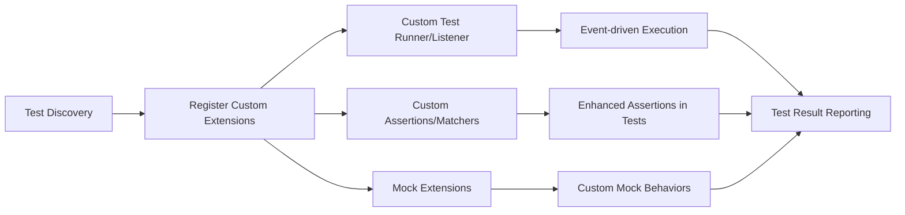

# Extending the Test Framework

Explore how to extend GoogleTest and GoogleMock with custom test runners, listeners, or assertion extensions. This guide reveals the key extension points and integration hooks that allow advanced control over test execution, reporting, and behavior customization to meet organizational and advanced testing needs.

---

## Why Extend GoogleTest and GoogleMock?

GoogleTest and GoogleMock offer powerful defaults that cover most testing scenarios. However, certain advanced or organizational requirements demand tailored behavior beyond built-in capabilities. Extensibility enables:

- Custom test execution flows and orchestration.
- Specialized event listeners for detailed or customized reporting.
- Additional assertion types to express domain-specific test conditions.
- Integration with other tools and test infrastructures.

Extending the framework ensures that testing fits seamlessly within complex workflows and organizational policies while maximizing reusability and maintainability.

---

## Extension Points Overview

GoogleTest and GoogleMock provide well-defined hooks to extend and customize behavior. The primary extension points include:

### 1. Custom Test Runners

Test runners manage the lifecycle of tests, including discovery, execution, and overall coordination. You may want a custom test runner when:

- Integrating GoogleTest into specialized build systems or CI/CD pipelines.
- Controlling execution order or concurrency beyond defaults.
- Adding pre- or post-execution operations globally.

**How to implement:**

- Derive from `testing::TestEventListener` or implement your own test runner by creating a custom event listener that controls test flow.
- Use `testing::UnitTest::GetInstance()` to access and manipulate the test environment.
- Replace the default test runner by specifying your custom listener before running `RUN_ALL_TESTS()`.

### 2. Event Listeners

GoogleTest’s event listener interfaces enable you to observe and react to key test execution events like test start, test success/failure, and test end.

**Typical uses include:**

- Custom reporting formats (e.g., XML, JSON beyond the built-in options).
- Metrics collection.
- Logging or tracing test progress.
- Integration with dashboards or analytics.

**Key classes:**

- `testing::TestEventListener` (interface to implement).
- `testing::TestEventListeners` (container for listeners).

You can add your listener via:

```cpp
// Replace default listener
testing::TestEventListeners& listeners = testing::UnitTest::GetInstance()->listeners();
listeners.Release(listeners.default_result_printer());  // Remove default
listeners.Append(new MyCustomListener());
```

### 3. Custom Assertions and Matchers

While GoogleTest and GoogleMock offer an extensive set of assertions and matchers, you can write custom ones to express rich domain-specific logic.

**Key concepts:**

- Use the `MATCHER` or `MATCHER_P` macros for quick matcher definitions.
- For more control, implement classes with methods like `MatchAndExplain()`, `DescribeTo()`, and `DescribeNegationTo()`.
- Extend with parameterized and polymorphic matchers for flexibility.

This extension fits naturally with GoogleMock’s use of matchers for mock expectations.

### 4. Mock Extensions

GoogleMock allows you to extend the mocking framework by:

- Defining new matchers and actions.
- Overriding behavior for mock methods.
- Using custom actions (`WillOnce`, `WillRepeatedly`) to define complex behaviors.
- Managing mock object lifecycles explicitly for advanced memory or thread safety.

Refer to the [`gmock_cook_book.md#NewMatchers`](https://google.github.io/googletest/gmock_cook_book.html#NewMatchers) and [`gmock_cook_book.md#NewMonoActions`](https://google.github.io/googletest/gmock_cook_book.html#NewMonoActions) for detailed recipes.

---

## Integration Workflow: Extending the Testing Framework

Below is a typical user flow for leveraging extension points:

1. **Identify the Need to Extend:**
   Your testing scenario requires behavior not covered by base GoogleTest/GoogleMock.

2. **Choose Extension Point:**
   Pick a custom test runner, event listener, assertion/matcher, or mock behavior depending on problem.

3. **Implement Extension:**
   Derive from appropriate interface or macro to implement your extension. Keep user outcomes in focus: what new value or behavior do you enable?

4. **Register Extension:**
   Add your listener to the event system or replace default runners. Integrate new matchers via usual `EXPECT_THAT()` or `EXPECT_CALL()` calls.

5. **Validate:**
   Use your custom extension in test runs, verify correctness, watching for side-effects or integration issues.

6. **Iterate and Maintain:**
   Ensure your extension remains maintainable, with clear boundaries and documentation to support team usage.

---

## Practical Tips and Best Practices

- **Keep Extensions Lightweight:** Extension code should be lean to avoid degrading test performance or complicating diagnostics.

- **Preserve Backward Compatibility:** When possible, design extensions that do not break existing tests.

- **Use Scoped Listeners:** Add and remove listeners within fixture scopes to prevent leaks or unexpected global state.

- **Use Extension Points Strategically:** Prefer matchers or actions over complex test runners for localized needs.

- **Leverage Example Implementations:** Study GoogleTest’s own event listeners and mock actions as templates for your extensions.

- **Error Handling:** Ensure your extensions produce meaningful error messages and do not obscure root causes.

- **Thread Safety:** If your tests run in parallel or multi-threaded environments, extensions must be thread-safe.

---

## Common Pitfalls and Troubleshooting

<AccordionGroup title="Troubleshooting Common Issues with Extensions">
<Accordion title="Custom Listener Not Invoked">
Make sure your listener is appended to the `TestEventListeners` **before** calling `RUN_ALL_TESTS()`. Check that you didn’t remove all listeners accidentally.
</Accordion>
<Accordion title="Mock Object Verifications Fail Unexpectedly">
Confirm that expectations are set before exercising the mock. Avoid setting expectations or modifying mocks after verification or execution.
</Accordion>
<Accordion title="Custom Matchers Yield Ambiguous Type Errors">
Use explicit type annotations or `SafeMatcherCast<>()` to help the compiler resolve overloads.
</Accordion>
<Accordion title="Tests Run Forever or Hang with Custom Actions">
Check for deadlocks in multi-threaded code or blocking waits in your custom actions or listeners. Use timeouts and diagnostics to isolate issues.
</Accordion>
</AccordionGroup>

---

## Additional Considerations

- **Extending for Organizational Policies:** Create reporting listeners that generate custom logs or enforce corporate test standards.

- **Layered Extensions:** Build modular extensions that build upon core GoogleTest facilities without needing to fork or patch.

- **Contribution and Sharing:** Share your extensions with the community or team via separate libraries or plugins.

- **Documentation:** Provide clear documentation and usage examples for your extensions to ensure adoption and maintenance.

---

## Further Reading and Resources

- [gMock Cookbook - New Matchers](https://google.github.io/googletest/gmock_cook_book.html#NewMatchers)
- [gMock Cookbook - New Actions](https://google.github.io/googletest/gmock_cook_book.html#NewMonoActions)
- [GoogleTest TestEventListener API](https://github.com/google/googletest/blob/main/include/gtest/gtest.h) (see `TestEventListener` class)
- [Using Matchers to Extend Assertion Capabilities](reference/matchers.md)
- [Core GoogleTest Architecture](overview/foundations-and-architecture/architecture-overview)

---

## Summary

By leveraging GoogleTest’s extensibility, you can tailor test execution, reporting, and assertion logic to your unique needs. Whether you need to integrate with specialized environments, introduce domain-specific assertions, or orchestrate complex mock interactions, these extension points empower advanced testing strategies with complete control and maintainability.

---

## Example: Adding a Custom Listener

```cpp
#include <gtest/gtest.h>
#include <iostream>

class MyListener : public testing::TestEventListener {
 public:
  void OnTestStart(const testing::TestInfo& test_info) override {
    std::cout << "Starting test: " << test_info.name() << std::endl;
  }
  void OnTestEnd(const testing::TestInfo& test_info) override {
    std::cout << "Finished test: " << test_info.name() << std::endl;
  }
  // Override other methods or leave empty
};

int main(int argc, char** argv) {
  testing::InitGoogleTest(&argc, argv);

  testing::TestEventListeners& listeners = 
      testing::UnitTest::GetInstance()->listeners();
  delete listeners.Release(listeners.default_result_printer());
  listeners.Append(new MyListener());

  return RUN_ALL_TESTS();
}
```

This replaces the default console printer with a simple listener that prints messages at test start and end.

---

## Example: Writing a Simple Custom Matcher

```cpp
#include <gmock/gmock.h>

MATCHER(IsEven, "checks if a number is even") {
  return (arg % 2) == 0;
}

// Usage in tests:
// EXPECT_THAT(value, IsEven());
```

This matcher can be used anywhere GoogleTest expects matchers, enabling expressive assertions.

---

## Diagram: Extension Integration Flow



This high-level flow shows how custom components integrate into the GoogleTest lifecycle.

---

