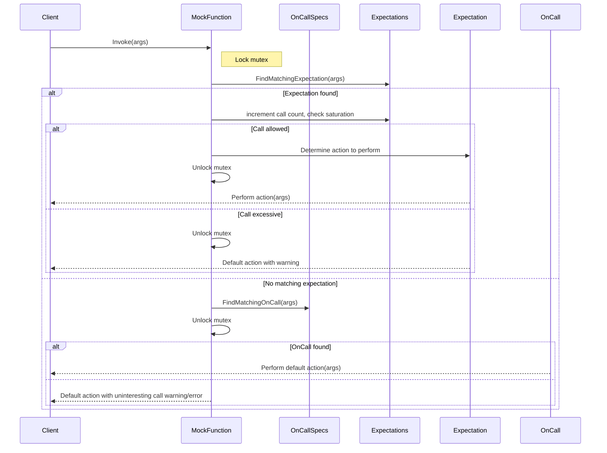

# Argument Matching and Custom Actions

GoogleMock uses an expressive and flexible system for controlling how mock functions respond to various argument values and how custom behaviors can be defined for expected calls. This page explains the core concepts of argument matching with matchers, cardinalities for call counts, and the advanced action templates that enable dynamic and conditional test scenarios.

---

## 1. Understanding Matchers: What Arguments Do We Expect?

Matchers provide a powerful way to specify precisely which arguments a mock method is expected to receive. Instead of matching arguments strictly by value, matchers allow testing argument properties, ranges, or custom predicates.

- **Matchers as Predicates**: Matchers behave like expressive predicates, deciding if an argument satisfies a condition.
- **Using Wildcards**: The underscore (`_`) matcher indicates that any argument value is acceptable.
- **Built-in Matchers**: Include `Eq()`, `Ge()`, `Lt()`, `NotNull()`, `Pointee()`, and many more (see [Matchers Reference](reference/matchers.md)).
- **Combining Matchers**: Use combinators like `AllOf()`, `AnyOf()`, `Not()`, and tuple-based matchers to create complex conditions.

```cpp
using ::testing::_;
using ::testing::Ge;
// Expect method Forward() to be called with an integer >= 100.
EXPECT_CALL(turtle, Forward(Ge(100)));
// Expect GoTo() to be called with first argument 50 and any second argument.
EXPECT_CALL(turtle, GoTo(50, _));
```

### Important Tips

- When argument matchers are omitted, all arguments are assumed to accept any value.
- To avoid brittle tests, specify matchers only for arguments relevant to the test.

---

## 2. Specifying Call Cardinalities: How Many Times Will It Be Called?

Cardinalities control the number of expected calls on mock methods. They define expectations like "at least once," "exactly twice," or "any number of times."

Available cardinalities include:

| Cardinality         | Meaning                                         |
|---------------------|------------------------------------------------|
| `AnyNumber()`       | The method can be called any number of times.  |
| `AtLeast(n)`        | The method is expected at least *n* times.      |
| `AtMost(n)`         | The method is expected at most *n* times.       |
| `Between(m, n)`     | Must be called between *m* and *n* times.       |
| `Exactly(n)` or `n` | Must be called exactly *n* times.                |

If you omit the `Times()` clause, GoogleMock deduces cardinality based on action specifications:

- No `WillOnce` or `WillRepeatedly`: cardinality defaults to `Times(1)`.
- `n` `WillOnce` clauses without `WillRepeatedly`: cardinality is `Times(n)`.
- `n` `WillOnce` clauses with one `WillRepeatedly`: cardinality is `Times(AtLeast(n))`.

```cpp
using ::testing::Exactly;
EXPECT_CALL(foo, Bar()).Times(Exactly(2));
```

**Best Practice:** Use cardinalities to precisely capture the contract you expect your code to fulfill. `Times(0)` explicitly forbids calls.

---

## 3. Ordering Expectations: Sequencing and Partial Order

By default, expected calls can occur in any order. To enforce order:

- Use an [`InSequence`](#InjectionIntoSequence) object to require strict call order.
- Specify sequences explicitly with `InSequence(s1, s2, ...)` on expectations.
- Use `.After()` clauses to impose partial ordering among calls.

This helps model complex interactions and ensures correctness in protocols and workflows.

---

## 4. Defining Default Behaviors Using ON_CALL

`ON_CALL` is used to define what a mock method does when invoked, *without* setting an expectation that it must be called.

Syntax:

```cpp
ON_CALL(mock_object, Method(matchers))
    .With(multi_argument_matcher)  // Optional
    .WillByDefault(action);
```

If multiple `ON_CALL`s match an invocation, the most recent matching one is selected.

Example:

```cpp
ON_CALL(turtle, GetX()).WillByDefault(Return(10));
```

Unlike `EXPECT_CALL`, `ON_CALL` allows mocking methods without enforcing call counts or ordering.

---

## 5. Specifying Expected Calls with EXPECT_CALL

The core API to specify *expected* calls with constraints and behaviors is `EXPECT_CALL`.

Key syntax:

```cpp
EXPECT_CALL(mock_object, Method(matchers))
    .With(multi_argument_matcher)  // Optional
    .Times(cardinality)            // Optional
    .InSequence(sequences...)      // Optional, can be repeated
    .After(expectations...)        // Optional, can be repeated
    .WillOnce(action)              // Optional, can repeat
    .WillRepeatedly(action)        // Optional
    .RetiresOnSaturation();        // Optional
```

### Clause Details:

- `.With()`: Matches whole argument tuples with a multi-argument matcher.
- `.Times()`: Specifies expected number of calls.
- `.InSequence()`: Requires calls occur in specified sequences.
- `.After()`: Specifies call prerequisites; modeled as partial ordering.
- `.WillOnce()`: Defines action for individual calls sequentially.
- `.WillRepeatedly()`: Defines action for any remaining calls after `WillOnce`s.
- `.RetiresOnSaturation()`: Deactivates expectation when it reaches max calls.

Example:

```cpp
EXPECT_CALL(mouse, Click(_))
    .Times(AtLeast(1))
    .WillOnce(Return(true))
    .WillRepeatedly(Return(false));
```

---

## 6. Advanced Action Templates for Custom Behaviors

Standard actions you can specify in `WillOnce()` or `WillRepeatedly()` include:

- `Return(value)`: Returns the provided value (copied at setup time).
- `ReturnRef(variable)`: Returns a reference to a variable.
- `Invoke(function)`: Calls a user-defined function or lambda with the call arguments.
- `SetArgPointee<N>(value)`: Assigns to the pointer argument at position N.
- `DoAll(a1, a2, ..., an)`: Performs multiple actions sequentially, returning last result.
- `Throw(exception)`: Throws an exception.

You can also use lambdas, functors, and custom action macros (`ACTION`, `ACTION_P`) to define bespoke behaviors factoring argument values, call order, or external state.

```cpp
EXPECT_CALL(mock, Add(_, _))
    .WillOnce(Return(5))
    .WillRepeatedly([](int a, int b) { return a + b; });
```

Common patterns include:

- Returning move-only types by using lambdas.
- Delegating to real or fake implementations via `Invoke()`.
- Changing output arguments with `SetArgPointee` or `SetArrayArgument`.

---

## 7. Combining Matchers and Actions for Dynamic Testing

Matchers and actions integrate tightly to allow sophisticated test scenarios:

- Use `.With()` in expectations to express relations between arguments (e.g., first arg < second arg).
- Chain multiple `WillOnce()` calls to specify a sequence of different behaviors.
- Define `WillRepeatedly()` for fallback behaviors after `WillOnce()` actions are exhausted.

Example:

```cpp
EXPECT_CALL(mock, Foo(_, _))
    .With(Lt())  // first arg less than second arg
    .WillOnce(Return(1))
    .WillOnce(Return(2))
    .WillRepeatedly(Return(3));
```

This grants fine-grained control over mocked interfaces, fostering precise verification and flexible test arrangements.

---

## 8. Tips and Best Practices

- Always specify expectations *before* exercising the mock methods to prevent undefined behavior.
- Use `ON_CALL` for default behaviors without imposing expectations.
- When mocking overloaded methods, disambiguate overloads using parameter matchers or the `Const()` wrapper for const methods.
- Prefer sequences or `RetiresOnSaturation()` to manage ordered or limited calls elegantly.
- Avoid over-specifying expectations to keep tests maintainable and robust.
- Use `NiceMock`, `NaggyMock`, or `StrictMock` wrappers to control the handling of uninteresting calls.
- For complex actions, prefer lambdas or custom `ACTION` macros over raw `Return()` to ensure dynamic results.

---

## 9. Troubleshooting Common Issues

- **Too many or too few `WillOnce()` actions**: Be sure action counts correspond to your cardinality. GoogleMock warns when they mismatch.
- **Uninteresting Call Warnings**: If you receive warnings about uninteresting calls, consider using `NiceMock` or adding catch-all expectations with `Times(AnyNumber())`.
- **Unexpected Calls with Wrong Arguments**: Ensure your matchers accurately describe the call parameters. Use `--gmock_verbose=info` for detailed verbose logs.
- **Ambiguity with Overloaded Methods**: Specify matchers or overload disambiguation explicitly.
- **Flags Impacting Behavior**: Adjust `--gmock_verbose` flag (`info`, `warning`, `error`) to control output verbosity.

---

## 10. Helpful Code Snippet Examples

### Basic Expectation with Matchers and Actions

```cpp
EXPECT_CALL(mock, Compute(Ge(0), _))
    .Times(3)
    .WillOnce(Return(100))
    .WillOnce(Return(200))
    .WillRepeatedly(Return(300));
```

### Default Behavior with ON_CALL

```cpp
ON_CALL(mock, GetValue())
    .WillByDefault(Return(42));
```

### Specifying Call Order Using Sequences

```cpp
using ::testing::Sequence;
Sequence s;
EXPECT_CALL(mock, Start()).InSequence(s);
EXPECT_CALL(mock, Process()).InSequence(s);
EXPECT_CALL(mock, End()).InSequence(s);
```

### Custom Action with Lambda

```cpp
EXPECT_CALL(mock, Multiply(_, _))
    .WillRepeatedly([](int a, int b) { return a * b; });
```

### Using `.With()` Multi-Argument Matcher

```cpp
EXPECT_CALL(mock, Combine(_, _))
    .With(Lt())  // first arg less than second
    .WillRepeatedly(Return(true));
```

---

## 11. Diagram: Mock Function Call Matching and Action Execution Flow



---

## 12. Cross-References and Related Documentation

- [Mocking Reference](reference/mocking.md) — Full specification of mock macros and classes.
- [gMock for Dummies](gmock_for_dummies.md) — Beginner-friendly guide to mocking concepts.
- [Matchers Reference](reference/matchers.md) — Available argument matchers.
- [Actions Reference](reference/actions.md) — Built-in and custom actions.
- [Cardinalities Reference](reference/mocking.md#EXPECT_CALL.Times) — Controlling call counts.
- [gMock Cookbook](gmock_cook_book.md) — Recipes, patterns, and advanced examples.

---

For advanced usage, including custom matcher and action creation, refer to the [gMock Cookbook](gmock_cook_book.md) and [Creating Custom Actions and Matchers](guides/real-world-integration/custom-actions-and-matchers.mdx).

---

## Summary
This page details GoogleMock’s flexible matcher system for specifying how mock functions respond to argument values, how cardinalities constrain call counts, and how to define custom and composite actions to create realistic, dynamic mock behaviors. It covers using `EXPECT_CALL` and `ON_CALL` with chaining clauses such as `.Times()`, `.With()`, `.InSequence()`, and `.After()`, as well as advanced action templates.

---

