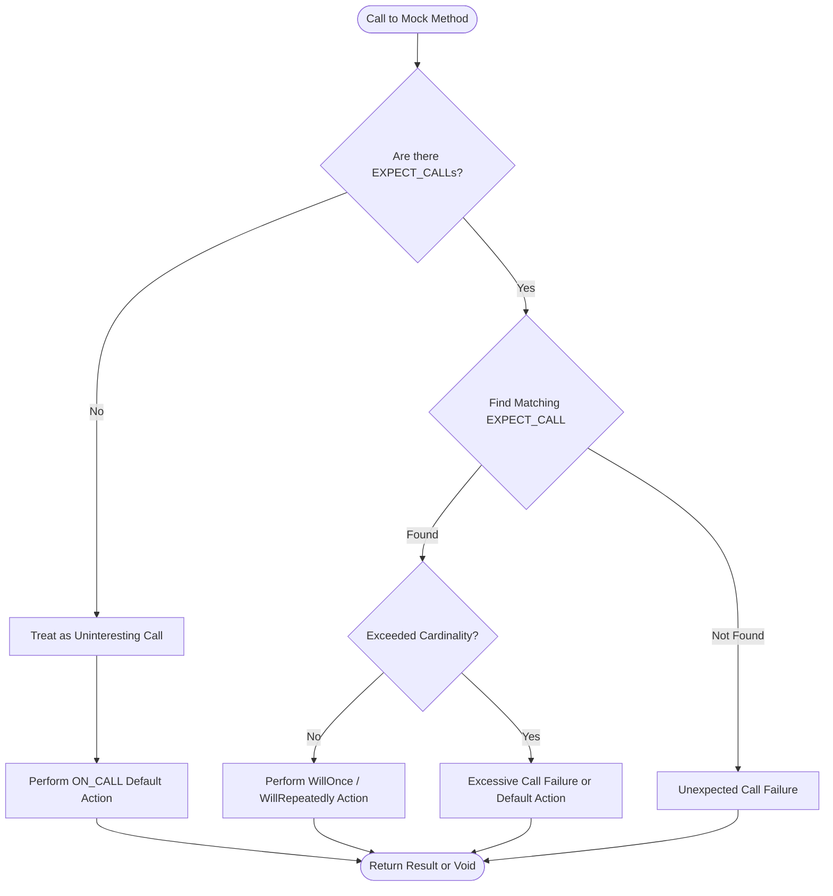

# Mock Objects and Behavior Simulation

GoogleMock (gMock) provides a powerful yet user-friendly way to create and control mock objects in C++. This page introduces you to the foundational concepts in Google's mocking framework: creating mock classes, setting expectations with `EXPECT_CALL()`, defining default behaviors with `ON_CALL()`, and simulating diverse behaviors during testing.

---

## Introduction to Mock Objects

Mock objects act as programmable substitutes for real objects. They implement the same interface but allow you to specify at runtime:

- Which methods will be called
- How many times and in what order
- What argument values to expect
- What results the methods should return
- How to simulate complex behaviors and side effects

This capability lets you focus your tests on interactions between components instead of relying on real dependencies.

### Defining Mock Methods

The primary mechanism for defining mock methods in your mock class is the `MOCK_METHOD` macro. For example, given an interface:

```cpp
class Turtle {
 public:
  virtual ~Turtle() {}
  virtual void PenUp() = 0;
  virtual void PenDown() = 0;
  virtual void Forward(int distance) = 0;
  virtual int GetX() const = 0;
};
```

You mock it by creating a mock class:

```cpp
class MockTurtle : public Turtle {
 public:
  MOCK_METHOD(void, PenUp, (), (override));
  MOCK_METHOD(void, PenDown, (), (override));
  MOCK_METHOD(void, Forward, (int distance), (override));
  MOCK_METHOD(int, GetX, (), (const, override));
};
```

The macro generates the necessary code to capture calls and enforce expectations.

> **Tip:** Always declare mock methods in the `public:` section even if the base method is protected or private.

## Setting Expectations with `EXPECT_CALL`

The heart of simulating behaviors boils down to the `EXPECT_CALL()` macro, which sets an expectation on a mock method:

```cpp
EXPECT_CALL(mock_object, MethodName(argument_matchers))
    .Times(cardinality)
    .WillOnce(action)
    .WillRepeatedly(action);
```

Here's what each part does:

- **Mock object and method:** The object to be mocked and the method expected to be called.
- **Argument matchers:** Specify argument constraints; `_` means any value.
- **Times:** Specifies how many times the call is expected.
- **WillOnce:** Defines the action taken for a single matching call. Can be repeated multiple times to sequence actions.
- **WillRepeatedly:** Defines the action for all subsequent matching calls after `WillOnce` clauses are exhausted.

### Example

```cpp
using ::testing::Return;

MockTurtle turtle;
EXPECT_CALL(turtle, GetX())
    .Times(3)
    .WillOnce(Return(100))
    .WillOnce(Return(150))
    .WillRepeatedly(Return(200));
```

Here, the first call to `GetX()` returns 100, the second 150, and subsequent calls return 200.

### Important Details

- If you omit `Times()`, gMock infers:
  - If no `WillOnce()` or `WillRepeatedly()`, then 1 call is expected.
  - If n `WillOnce()` actions but no `WillRepeatedly()`, it expects exactly n calls.
  - If n `WillOnce()` and a `WillRepeatedly()`, expects at least n calls.

- The last-defined matching expectation takes precedence.
- Multiple `EXPECT_CALL()`s on the same method can specify distinct behaviors for different argument patterns.

### Matchers

Matchers let you constrain which calls the expectation applies to. For example:

- `_` matches anything
- `Eq(value)` matches equality
- `Ge(n)` matches values greater or equal to n
- `Pointee(m)` matches pointers whose pointee matches matcher `m`

See the full list in the [Matchers Reference](api_reference/core_assertions_matchers/matchers_reference).

## Defining Default Behavior with `ON_CALL`

Unlike `EXPECT_CALL()`, `ON_CALL()` does not expect the method to be called; it defines how to behave if the method is called without an explicit `EXPECT_CALL`. This sets a **default action**, allowing your test to proceed gracefully when calls are made to uninteresting methods.

Syntax:

```cpp
ON_CALL(mock_object, MethodName(argument_matchers))
    .With(multi_argument_matcher)  // Optional
    .WillByDefault(action);
```

### Example

```cpp
ON_CALL(turtle, GetX()).WillByDefault(Return(42));
```

This means any call to `GetX()` will return 42 unless overridden by an `EXPECT_CALL`.

> **Note:** `ON_CALL` action is overridden by matching `EXPECT_CALL` actions.

### Best Practices

- Use `ON_CALL()` statements to define general default behaviors in your test fixture’s setup.
- Use `EXPECT_CALL()` to specify exact calls you expect and want verified.
- Avoid excessive `EXPECT_CALL()` use to reduce brittle tests; prefer `ON_CALL()` for behaviors you don't strictly verify.

## Controlling Call Ordering and Cardinalities

gMock provides ways to specify the order and number of expected calls for more precise control.

### Cardinalities using `Times()`

You can specify:

- `Times(AnyNumber())`: any number of calls allowed.
- `Times(AtLeast(n))`: at least n calls expected.
- `Times(AtMost(n))`: at most n calls allowed.
- `Times(Between(m, n))`: between m and n calls.
- `Times(Exactly(n))` or `Times(n)`: exactly n calls.
- `Times(0)`: calls are forbidden.

### Sequencing Calls

Use `InSequence` to enforce expectations occur in order:

```cpp
{
  InSequence s;
  EXPECT_CALL(mock, Func1());
  EXPECT_CALL(mock, Func2());
}
```

`Func1` must be called before `Func2` in this block.

Alternatively, the `.InSequence()` clause allows associating expectations with explicit `Sequence` objects for complex orderings.

### Prerequisites with `.After()`

Use `.After()` to specify that one expectation must happen after one or more other expectations.

```cpp
Expectation e1 = EXPECT_CALL(mock, Init());
EXPECT_CALL(mock, Start()).After(e1);
```

Here, `Start()` must be called after `Init()`.

## Handling Uninteresting, Unexpected, and Excessive Calls

GoogleMock distinguishes between:

- **Uninteresting calls:** Calls to methods without any `EXPECT_CALL`. By default, a warning is printed and the default action is performed.
- **Unexpected calls:** Calls that do not match any existing expectation. These cause an error.
- **Excessive calls:** Calls exceeding the specified cardinality.

You can control the strictness of uninteresting calls per mock object:

- **NiceMock:** suppress warnings on uninteresting calls.
- **NaggyMock:** (default) print warnings.
- **StrictMock:** treat uninteresting calls as errors.

## Simulating Complex Behaviors: Actions

gMock supports a flexible set of _actions_ that determine what a mock method does when called.

### Built-in Actions

Some commonly used actions include:

- `Return(value)`: returns a value
- `ReturnRef(variable)`: returns a reference
- `Invoke(callable)`: calls a function, method, or functor
- `SetArgPointee<N>(value)`: sets the value pointed to by the Nth argument
- `DoAll(action1, action2, ...)`: executes multiple actions sequentially
- `InvokeArgument<N>(args...)`: invokes the Nth argument assuming it is a callable

### Custom Actions

You can define your own using lambdas, function objects, or the `ACTION` macros.

### Tips for Actions

- Use `WillOnce` for single-use actions and `WillRepeatedly` for ongoing behavior.
- Remember that actions specified in `EXPECT_CALL` override defaults set by `ON_CALL`.

## Best Practices and Common Pitfalls

- Set expectations _before_ calling mock methods.
- Avoid overwriting cardinality or action clauses multiple times; gMock enforces this.
- Use wildcard matchers (`_`) judiciously to avoid overly brittle tests.
- Use `RetiresOnSaturation()` to automatically retire expectations once saturated.
- When matching overloaded methods, use `Const()` to distinguish const overloads.
- Prefer coding to interfaces when possible; mock only the interfaces you own.
- Use `Mock::VerifyAndClearExpectations()` to verify and clear expectations explicitly when needed.
- For move-only types (e.g., `std::unique_ptr`), use lambdas or callable objects for actions.

## Troubleshooting Common Issues

<AccordionGroup title="Troubleshooting and Tips">
<Accordion title="Uninteresting Call Warnings">
If you see warnings for uninteresting calls unexpectedly:

- Consider using `NiceMock` to suppress harmless warnings.
- Add `EXPECT_CALL(...).Times(AnyNumber())` for catch-all expectations.
- Use the `--gmock_verbose=error` flag to silence warnings completely.
</Accordion>
<Accordion title="Upper Bound Violations">
If you get errors for a method called more times than expected:

- Check your `Times()` clause and ensure it matches expected call count.
- Use `RetiresOnSaturation()` if you want the expectation to retire when saturated.
- Consider using sequences or `.After()` clauses to enforce call order.
</Accordion>
<Accordion title="Default Actions Not Being Applied">
If mock calls return default values unexpectedly:

- Make sure to set default actions using `ON_CALL` if the default constructor or 0 isn’t suitable.
- Remember, `WillOnce` and `WillRepeatedly` override defaults.
- Check if multiple `ON_CALL`s might be shadowing each other; last matching one wins.
</Accordion>
<Accordion title="How to Mock Overloaded or Const Methods">
When mocking overloaded methods:

- Use signatures with precise qualifiers.
- Use `Const(mock_object)` to specify const overload expectations.
- Use disambiguating matchers or wrapper helpers if necessary.
</Accordion>
</AccordionGroup>

## Visualizing the Mock Expectation Flow

Users often find it helpful to visualize how calls interact with expectations and actions in gMock. Here's a simplified flowchart of the life cycle of a mock method invocation:



## Summary

This document explained how GoogleMock helps you create mock objects, set expectations, specify behaviors, and control the mocking flow during testing. Understanding these fundamentals enables you to write precise tests that verify not only outputs but also the interactions between components.

---

## Additional Resources and Next Steps

- [gMock for Dummies](docs/gmock_for_dummies.md): A beginner-friendly introduction to mocking.
- [Mocking Reference](docs/reference/mocking.md): Detailed API and usage.
- [gMock Cookbook](docs/gmock_cook_book.md): Practical recipes and advanced techniques.
- [Matchers Reference](api_reference/core_assertions_matchers/matchers_reference.mdx)
- [Actions Reference](api_reference/mocking_framework/actions_and_invocations.mdx)
- [Using Assertions Effectively](guides/core-workflows/using-assertions.mdx)
- [Writing Your First Test](guides/getting-started/writing-first-test.mdx)
- Troubleshooting tips are also available in [Common Setup Issues](getting-started/troubleshooting-support/common-setup-issues.mdx)

By mastering the concepts of expectations, matchers, cardinalities, and actions, you will be empowered to simulate and verify intricate behaviors with confidence.

---