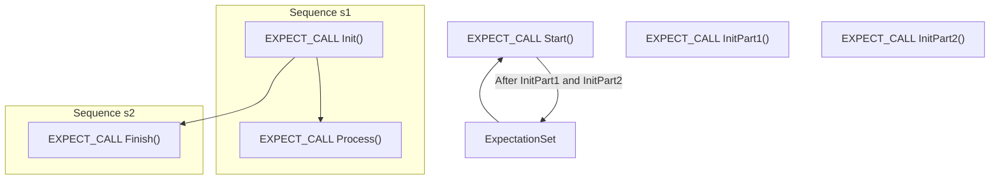

# Actions, Sequences, and Ordered Expectations

Welcome to an in-depth exploration of how GoogleTest’s GoogleMock framework uses *actions* and *ordering expectations*—including sequences—to provide precise, flexible, and programmatic control over mock object behaviors in your C++ tests. This page is dedicated to helping you understand how to use these features to express complex interaction patterns, customize mock method return values, and impose ordering constraints that reflect real-world call sequences.

---

## Why Actions and Ordering Matter in Mocking

Imagine you have a mock object representing a collaborator in your system, and you want to test not only that certain methods are called, but also how many times, with what arguments, what they return, and in which order. GoogleMock’s *actions* and *ordering expectations* empower you to specify all these behaviors declaratively, making your tests clear, robust, and meaningful.

For example, you may want a mock method to:

- Return different values on subsequent calls.
- Have a default return behavior when no explicit expectation matches.
- Enforce that method `A()` runs before `B()` and `C()`, but allow `B()` and `C()` to occur in any order.

Such control is crucial for verifying correct interaction, detecting bugs early, and ensuring that your tested code respects protocols and contracts.

---

## Setting Return Values with Actions

An *action* defines what happens when a mock method is called. GoogleMock provides a rich set of built-in actions to customize this behavior.

### Using `WillOnce` and `WillRepeatedly`

- `.WillOnce(action)` specifies an action to be performed exactly once for the matching call. Multiple `WillOnce()` clauses perform their actions in the order declared, one per call.
- `.WillRepeatedly(action)` sets a default action for all subsequent calls after all `WillOnce()` clauses are exhausted.

### Example: Returning Different Values on Each Call

```cpp
using ::testing::Return;

EXPECT_CALL(mock_obj, GetValue())
    .WillOnce(Return(1))   // first call returns 1
    .WillOnce(Return(2))   // second call returns 2
    .WillRepeatedly(Return(3)); // subsequent calls return 3

int val1 = mock_obj.GetValue();  // val1 == 1
int val2 = mock_obj.GetValue();  // val2 == 2
int val3 = mock_obj.GetValue();  // val3 == 3
```

**Tip:** The `.WillOnce()` clauses implicitly set the expected number of calls (`Times`), so often you can omit specifying `.Times()` explicitly.

### Default Actions with `ON_CALL`

`ON_CALL` allows you to specify default behaviors without setting an *expectation* that the method must be called:

```cpp
ON_CALL(mock_obj, Compute(_))
    .WillByDefault(Return(42));
```

Calls matching this `ON_CALL` will return `42` unless overridden by an `EXPECT_CALL`.

---

## Expressing Call Order with Sequences

By default, mock expectations in GoogleMock can be fulfilled in *any* order that matches their call conditions. When the relative order of calls matters to your test, you need to impose *sequence constraints*.

### The `Sequence` Class and `.InSequence()` Clause

You can create one or more `Sequence` objects and use the `.InSequence()` clause to specify that expectations belong to these sequences, enforcing an order within each sequence:

```cpp
using ::testing::Sequence;
Sequence seq1, seq2;

EXPECT_CALL(mock, Init())
    .InSequence(seq1, seq2);
EXPECT_CALL(mock, Process())
    .InSequence(seq1);
EXPECT_CALL(mock, Finish())
    .InSequence(seq2);
```

This layout enforces the following partial order:

- `Init()` must happen before both `Process()` and `Finish()`.
- `Process()` and `Finish()` must follow `Init()`.
- However, the order between `Process()` and `Finish()` is unconstrained.

### Using `InSequence` Helper Scope for Sequential Calls

For simple linear orders, wrap expectations in an `InSequence` scope:

```cpp
using ::testing::InSequence;
{
  InSequence seq;
  EXPECT_CALL(mock, Step1());
  EXPECT_CALL(mock, Step2());
  EXPECT_CALL(mock, Step3());
}
```

Here, calls to `Step1`, then `Step2`, then `Step3` must occur in that order or the test fails.

---

## Partial and Complex Ordering with `.After()`

While `Sequence` expresses linear orderings (paths), sometimes you want more flexible partial order constraints corresponding to Directed Acyclic Graphs (DAGs). For this, GoogleMock provides the `.After()` clause.

### Using `Expectation` and `ExpectationSet`

Retrieve `Expectation` objects when you create an expectation to express dependencies:

```cpp
using ::testing::Expectation;

Expectation e1 = EXPECT_CALL(mock, Init());
Expectation e2 = EXPECT_CALL(mock, Configure()).After(e1);
EXPECT_CALL(mock, Run()).After(e2);
```

Here:

- `Configure()` is expected *after* `Init()` completes.
- `Run()` happens *after* `Configure()`.

You can also use `ExpectationSet` to define multiple prerequisites:

```cpp
using ::testing::ExpectationSet;

ExpectationSet all_inits;
all_inits += EXPECT_CALL(mock, InitPart1());
all_inits += EXPECT_CALL(mock, InitPart2());
EXPECT_CALL(mock, Start()).After(all_inits);
```

`Start()` depends on both `InitPart1()` and `InitPart2()` having occurred.

### Combining `.InSequence()` and `.After()`

Ordering clauses can be combined:

```cpp
Sequence seq;
Expectation e1 = EXPECT_CALL(mock, Load()).InSequence(seq);
EXPECT_CALL(mock, Process()).InSequence(seq).After(e1);
```

This enforces both sequence order and explicit dependencies.

---

## Controlling Expectation Lifetimes: `.RetiresOnSaturation()`

Expectations are *sticky* by default, meaning they stay active even after being fully satisfied. This can lead to failures if the same call happens more times than expected.

If you want an expectation to become *inactive* immediately after it’s fully satisfied (so that subsequent calls won't match it), use `.RetiresOnSaturation()`:

```cpp
EXPECT_CALL(mock, Foo(42))
    .Times(2)
    .RetiresOnSaturation();
```

After two calls to `Foo(42)`, this expectation retires, and further calls won’t match it, potentially falling back to other expectations.

### Combining with Sequences

Expectations in sequences automatically retire when the next expectation in the sequence is used, enforcing a strictly linear order and preventing saturation issues.

---

## Practical User Workflow for Actions and Sequences

1. **Define Expectations:** Use `EXPECT_CALL` with argument matchers and cardinality constraints (`Times` or implicit), to describe expected calls.
2. **Customize Behavior:** Chain `.WillOnce()` and `.WillRepeatedly()` actions to return values or perform side effects.
3. **Enforce Ordering:** Use `InSequence` objects or `.InSequence()` clauses to require strict call order.
4. **Express Partial Orders:** Use `.After()` with `Expectation` or `ExpectationSet` to specify dependencies across expectations.
5. **Retire Expectations When Done:** Add `.RetiresOnSaturation()` to prevent stale expectations from matching later calls unexpectedly.

By following this flow, you express sophisticated interaction protocols declaratively and effectively verify the behavior of your code.

---

## Common Pitfalls and Troubleshooting Tips

- **Expectations Must Be Set Before Calls:** Always set `EXPECT_CALL`s before code that exercises mocks. Setting them after calls leads to undefined behavior.

- **Sticky Expectations Can Cause Surprises:** Without `.RetiresOnSaturation()`, an expectation remains active even after saturation, which may lead to `upper bound violated` errors.

- **Ordering Clauses Must Follow Correct Syntactic Order:** For example, `.Times()` must come before `.InSequence()`, and `.InSequence()` before `.After()` and `.WillOnce()`.

- **Beware of Overlapping Expectations:** If multiple `EXPECT_CALL`s match the same method and arguments, the last declared one takes precedence. Order your expectations carefully.

- **Using `InSequence` with Multiple Sequences:** An expectation can belong to multiple sequences, creating partial order DAGs, but avoid cycles.

- **Default Action Doesn't Imply Expectation:** `ON_CALL` sets behavior but not expected calls. If calls happen without matching expectations, you get warnings.

- **Suppressed Warnings:** To suppress warnings for uninteresting calls, use `NiceMock`. Use `StrictMock` to turn such warnings into errors.

---

## Summary of Key Clauses and Their Order

| Clause                  | Usage             | Notes                                   |
|-------------------------|-------------------|-----------------------------------------|
| `.With()`               | 0 or 1 time       | Must be the first clause.                |
| `.Times()`              | 0 or 1 time       | Must come before `.InSequence()`.        |
| `.InSequence()`         | Any number        | Must appear before `.After()` and `.WillOnce()`. |
| `.After()`              | Any number        | Must come before `.WillOnce()`.          |
| `.WillOnce()`           | Any number        | Must come before `.WillRepeatedly()`.    |
| `.WillRepeatedly()`     | 0 or 1 time       | Must come before `.RetiresOnSaturation()` |
| `.RetiresOnSaturation()`| 0 or 1 time       | Must be the last clause.                  |

---

## Recommended Further Reading

- [Mocking Reference](reference/mocking.md) for complete details on `EXPECT_CALL` and `ON_CALL`.
- [Actions Reference](reference/actions.md) for available built-in actions.
- [gMock Cookbook](gmock_cook_book.md) for recipes and practical examples.
- [GoogleMock for Dummies](gmock_for_dummies.md) for fundamental concepts and quick start.
- [Mocking API: Actions and Defaults](api-reference/mocking-api/actions-and-defaults.mdx) for in-depth usage.

---

## Visual Diagram of Call Ordering with Sequences and After Clauses



---

# Troubleshooting Section

### Common Issues

- **Calls not matching expectations:** Check argument matchers are correct and expectations are set *before* calls.
- **Unexpected call warnings:** Possibly missing or incorrect `EXPECT_CALL` or overly narrow argument matchers.
- **Upper bound violated errors:** You likely called a method more times than allowed; consider `.RetiresOnSaturation()` or adjusting `.Times()`.
- **Ordering failures:** Verify sequences and `.After()` clauses correctly represent the intended call order.

### Tips

- Enable verbose output with `--gmock_verbose=info` to see detailed call matching process.
- Use `InSequence` to express strict linear order.
- Use multiple sequences or `.After()` clauses for partial order.
- Combine `.WillOnce()` and `.WillRepeatedly()` to simulate state changes over calls.

---

With these tools and concepts, you can express and validate the most intricate interaction patterns your code requires, enabling rich and reliable C++ unit tests.
