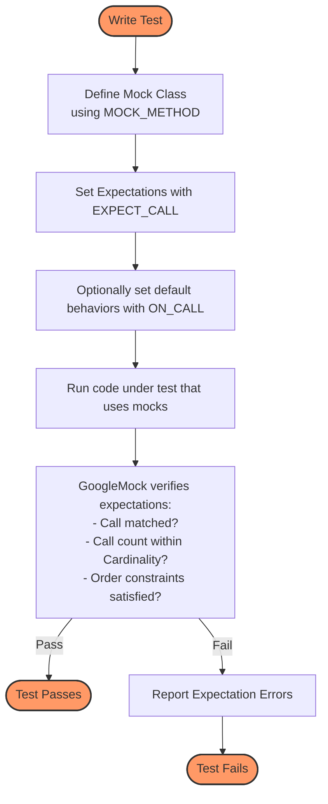

# Mocking Fundamentals and Specification

Understanding mocking is vital for mastering unit testing, and GoogleMock elegantly implements this through a declarative mechanism to define mock behaviors in C++. This guide unpacks the core concepts of mocking in GoogleMock, revealing how it empowers developers to specify precisely how mock objects should behave and interact, which is essential for effective test-driven development.

---

## What Is Mocking?

Mocking is a testing technique where mock objects simulate the behavior of real components or interfaces. These mocks help isolate the unit under test by mimicking dependencies, allowing developers to verify interactions, inputs, outputs, and control flow without relying on actual implementations.

In GoogleMock (gMock), mocks implement the interfaces of real classes but provide a flexible way to specify their expected behavior declaratively and dynamically during tests.

> **Key Value:** Mocking lets you define *what interactions* you expect with your dependencies and *how they should behave*, allowing pinpoint control and verification of complex scenarios.

---

## The Declarative Specification Model

Unlike traditional mocks that require manual implementation, gMock uses macros and a domain-specific language (DSL) to set up mock classes and their behaviors effortlessly.

### Defining Mock Methods

- Use the `MOCK_METHOD` macro inside your mock class to declare mocked methods.
- It automatically generates all the machinery needed to intercept calls and handle expectation management.

**Example:**
```cpp
class MockFoo {
 public:
  MOCK_METHOD(int, Bar, (), ());   // Mock a method Bar with no args and int return.
};
```

### Setting Expectations with `EXPECT_CALL`

This macro sets expectations about how and when mock methods are called:

```cpp
EXPECT_CALL(mock_object, MethodName(matchers...))
    .Times(cardinality)
    .WillOnce(action)
    .WillRepeatedly(action);
```

- Specifies that `MethodName` should be called matching given arguments.
- Defines **cardinality** (i.e., call count expectations).
- Associates actions defining return values and side effects.

**User Intent:**
- Express precisely which calls your code should make.
- Enforce how often and in which order.
- Define behaviors concretely.

### Default Behaviors with `ON_CALL`

- Unlike `EXPECT_CALL`, `ON_CALL` defines default behaviors without creating expectations.
- Useful for setting fallback behaviors or for mock methods where calls are permitted but not strictly verified.

### Importance of Ordering and Interaction

- Expectations have ordering clauses: `.InSequence()`, `.After()` to specify order.
- Ensures mocks are invoked following intended protocols.

---

## Understanding Cardinalities: How Often?

Cardinalities allow flexible specification of expected call counts, from zero to any number, including ranges.

- `AnyNumber()`: any number of calls allowed.
- `AtLeast(n)`: called at least `n` times.
- `AtMost(n)`: called at most `n` times.
- `Between(m, n)`: called between `m` and `n` times, inclusive.
- `Exactly(n)`: called exactly `n` times.

These flexible expectations capture real-world scenarios where exact counts may be unknown or variable.

**Example:**
```cpp
EXPECT_CALL(mock, Foo()).Times(AtLeast(2));
```
means `Foo()` must be called two or more times.

---

## Actions: What Does the Mock Do?

Actions define the behavior of mock methods when called.

- `Return(value)`: return `value`.
- `ReturnRef(var)`: return reference to `var`.
- `Invoke(function)`: forward call to a real function or callable.
- `DoAll(...)`: combine multiple actions.

You can chain multiple `WillOnce` and use `WillRepeatedly` for subsequent calls.

**Example:** Specify different returns for sequential calls:
```cpp
EXPECT_CALL(mock, GetValue())
    .WillOnce(Return(1))
    .WillOnce(Return(2))
    .WillRepeatedly(Return(3));
```

---

## Interactions, Order, and Sequencing

By default, expectations are unordered, meaning calls can happen in any order matching their expectations. However, gMock allows:

- **Sequencing:** Group expectations using `Sequence` objects for ordering.
- **`InSequence` block:** Automatically sequences all expectations in the block.
- **Partial order with `After`:** Specify that one call must happen after another.

This provides expressiveness to specify complex workflows in tests.

---

## Lifecycle of a Mock Expectation

1. **Set up**: User defines expectations (`EXPECT_CALL`) and/or default behaviors (`ON_CALL`).
2. **Execution**: Test code uses mocks; gMock verifies if calls match expectations.
3. **Counting**: Calls are tracked and checked if they satisfy cardinality.
4. **Saturation**: Expectations can become saturated (maximum calls reached) or unsatisfied.
5. **Retirement:** Expectations may retire automatically or via `.RetiresOnSaturation()`.
6. **Verification:** At destruction or explicitly, gMock confirms all expectations are met.

Failing any check generates readable errors pinpointing the violation.

---

## Special Mock Types: Strict, Naggy, and Nice

Mocks can control how strictly unexpected or uninteresting calls are treated:

- **NaggyMock (default):** Warns on unexpected calls.
- **NiceMock:** Suppresses warnings for unexpected calls.
- **StrictMock:** Treats unexpected calls as test failures.

Choose the appropriate strictness level based on test purpose and tolerance.

---

## Why Mocking Matters: The Test Writer's Perspective

- Decouples tests from complex or slow dependencies.
- Provides control over dependencies' behavior and state.
- Enables verification of interactions, not just outcomes.
- Facilitates testing error conditions and corner cases.
- Improves test reliability and maintainability.

All of these contribute to faster and more robust development.

---

## Practical Example: Using Mock and Expectation

```cpp
#include <gmock/gmock.h>
#include <gtest/gtest.h>

class Turtle {
 public:
  virtual ~Turtle() {}
  virtual void PenDown() = 0;
  virtual void Forward(int) = 0;
};

class MockTurtle : public Turtle {
 public:
  MOCK_METHOD(void, PenDown, (), (override));
  MOCK_METHOD(void, Forward, (int), (override));
};

TEST(PaintTest, DrawLine) {
  MockTurtle mock_turtle;

  EXPECT_CALL(mock_turtle, PenDown())
      .Times(1);
  EXPECT_CALL(mock_turtle, Forward(100))
      .Times(1);

  // Code that exercises mock_turtle.
  mock_turtle.PenDown();
  mock_turtle.Forward(100);
}
```

- This test ensures `PenDown` and `Forward(100)` are called exactly once.
- gMock validates these expectations during test execution.

---

## Troubleshooting Common Mocking Issues

| Issue                                      | Advice                                                        |
|--------------------------------------------|---------------------------------------------------------------|
| Call count mismatch                         | Check cardinalities and ensure code calls mock expected times.|
| Unexpected call errors                      | Add additional expectations or use `NiceMock` if appropriate.|
| Uninteresting calls warning messages       | Suppress with `NiceMock` or add catch-all `EXPECT_CALL` clauses.| 
| Overlapping expectations causing shadowing | Order `EXPECT_CALL`s carefully (newer override older).        |
| Infinite recursion when delegating to real | Delegate carefully to avoid calling mocked method infinitely. |

Always carefully check expectations' arguments, matcher usage, and call ordering.

---

## Summary

GoogleMock offers a powerful, expressive, and user-friendly way to create mock objects and specify exact expectations about their use. Its declarative syntax allows you to define not only what happens when mocks are called but also how often and in what order. Leveraging cardinalities, actions, sequences, and mock strictness, it transforms mock-based testing from a tedious chore into an effective design and verification technique.

---

## Additional Resources and References

- [Mocking Reference](/api-reference/mocking-api/setting-expectations)
- [gMock for Dummies](https://google.github.io/googletest/gmock_for_dummies.html)
- [gMock Cookbook](https://google.github.io/googletest/gmock_cook_book.html)
- [MOCK_METHOD Macro Documentation](/api-reference/mocking-api/mock-methods)
- [Actions, Defaults, and Sequences Reference](/api-reference/mocking-api/actions-and-defaults)
- [Nice, Naggy, and Strict Mocks](/api-reference/mocking-api/nice-naggy-strict-mocks)

Explore these to achieve mastery over mock specifications and harness their full potential in your tests.

---

## Diagram: Mocking Workflow in GoogleMock


