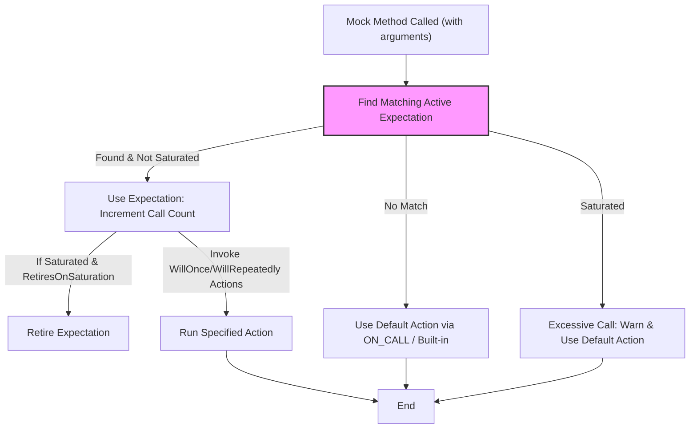

# Expectations, Cardinalities, and Call Semantics

Learn how expectations express the intended behavior of the code under test, including cardinalities that specify allowable call counts and rules governing strictness and tolerance in validations.

---

## Introduction

In GoogleMock, **expectations** specify how mock methods are expected to be called during a test. They define *which method* should be called, *with what arguments*, *how many times*, and *in what order*. Along with expectations, **cardinalities** express the allowable number or frequency of those calls, enabling flexible and precise test specifications.

This page covers how to use expectations to declare intended test behaviors, how to specify call cardinalities, and how GoogleMock validates calls against these expectations during test execution.

---

## Expressing Expectations with `EXPECT_CALL`

An **expectation** is set on a mock method using the `EXPECT_CALL` macro, which declares:

- The mock object and method to be expected.
- Argument matchers to constrain acceptable call arguments.
- How many times the method is expected to be called (cardinality).
- How to respond when the method is called (actions).
- Order constraints related to other expectations.

### Syntax Overview

```cpp
EXPECT_CALL(mock_object, Method(matchers...))
    .With(multi_argument_matcher)  // Optional
    .Times(cardinality)            // Optional, see below
    .InSequence(sequences...)      // Optional
    .After(expectations...)        // Optional
    .WillOnce(action)              // Optional
    .WillRepeatedly(action)        // Optional
    .RetiresOnSaturation();        // Optional
```

Each clause refines the expectation. This modular design lets you clearly express intricate test requirements.

### Key Points About Expectations

- **Order of multiple expectations:** If multiple expectations apply to the same method with overlapping argument matchers, the **last matching expectation** added will be used to handle the call.
- **Expectation verifications:** GoogleMock automatically verifies at the end of the test whether expectations are satisfied.
- **Sticky expectations:** By default, an expectation remains active even after its cardinality is met, unless explicitly retired.

### Example

```cpp
using ::testing::Return;
using ::testing::_;

EXPECT_CALL(turtle, GetX())
    .Times(3)
    .WillOnce(Return(100))
    .WillOnce(Return(150))
    .WillRepeatedly(Return(200));
```

This declares that `GetX()` will be called exactly 3 times: the first call returns 100, the second 150, and the third (and any subsequent call) 200.

---

## Specifying Call Cardinalities with `.Times()`

The **cardinality** defines how many times a mock method call is expected. You specify it with the `.Times()` clause.

### Common Cardinalities

| Cardinality           | Semantics                                         |
|----------------------|--------------------------------------------------|
| `Exactly(n)` or `n`  | Expected *exactly* `n` calls                      |
| `AnyNumber()`         | Can be called any number of times (including 0)  |
| `AtLeast(n)`          | Expected *at least* `n` calls                      |
| `AtMost(n)`           | Expected *at most* `n` calls                       |
| `Between(m, n)`       | Expected between `m` and `n` calls (inclusive)    |

### Omitting `.Times()` Clause

If you omit `.Times()`, GoogleMock infers cardinality using these rules:

- If no `.WillOnce()` or `.WillRepeatedly()`, inferred cardinality is `Exactly(1)`.
- If exactly *n* `.WillOnce()` clauses and no `.WillRepeatedly()`, inferred cardinality is `Exactly(n)`.
- If *n* `.WillOnce()` clauses and one `.WillRepeatedly()`, inferred cardinality is `AtLeast(n)`.

### Disallowing Calls

To assert that a method **must never be called**, use:

```cpp
EXPECT_CALL(mock, Method(_)).Times(0);
```

### Example

```cpp
EXPECT_CALL(foo, Bar(_, _))
    .Times(AtLeast(1))  // bar() must be called at least once
    .WillRepeatedly(Return(true));

EXPECT_CALL(foo, Bar(3, 5))
    .Times(0);  // bar(3, 5) should never be called
```

---

## Controlling Expectation Order

By default, expectations are unordered and may match calls in any order. For tests requiring ordered call validation, use the following:

- **`InSequence` Class:**

  Create an `InSequence` object; expectations defined in its scope are expected sequentially.

  ```cpp
  {
    InSequence s;
    EXPECT_CALL(mock, Call1());
    EXPECT_CALL(mock, Call2());
  }
  ```
  The calls must occur in the declared order.

- **`InSequence` Clause:**

  Assign expectations to named `Sequence` objects to establish partial or complex orders.

- **`After()` Clause:**

  You can specify that an expectation occurs after one or more other expectations:

  ```cpp
  Expectation e1 = EXPECT_CALL(mock, Init());
  EXPECT_CALL(mock, Start()).After(e1);
  ```

These mechanisms let you precisely express temporal relationships among mock calls, ensuring tests validate interaction protocols exactly.

---

## Call Semantics: Matching and Handling Calls

When a mock method is called, GoogleMock determines how to handle the call through the following flow:

1. **Expectation Matching:**
    - GoogleMock walks through expectations in reverse order (newest to oldest), searching for an active expectation whose argument matchers match the call.
    - Only active expectations whose pre-requisites (from `InSequence` or `After`) are satisfied are considered.

2. **Action Selection:**
    - If a matching expectation is found and not saturated, the call counts toward it.
    - The expectation returns the next action, throwing warnings or errors if cardinality limits are violated.

3. **Default Action:**
    - If no matching expectation is found, GoogleMock runs the default behavior for the mock method.
    - The default behavior is set using `ON_CALL` or else the built-in default action applies.

### Outcomes of Call Matching

- **Expected Call:** Matches an active expectation within its cardinality; observed as normal.
- **Excessive Call:** Matches an expectation but called more times than allowed; triggers a failure and runs default action.
- **Unexpected Call:** Matches no expectation; triggers a failure and runs default action.
- **Uninteresting Call:** Corresponds to no expectation for the method; not an error, but a warning by default.

### Handling Retired Expectations

Expectations that have been *retired* (due to saturation and `RetiresOnSaturation()` or sequencing) no longer match calls. This prevents over-matching and helps write clean, sequential tests.

---

## Setting Default Behavior with `ON_CALL`

Whereas `EXPECT_CALL` sets an *expectation* for a call, `ON_CALL` sets a *default action* for when the call occurs but is not explicitly expected.

Example:

```cpp
ON_CALL(mock, Foo(_))
    .WillByDefault(Return(5));
```

If `Foo()` is called without a matching expectation, the default action specified here is invoked. This is helpful to avoid warnings about uninteresting calls or to provide common stub behavior shared by multiple tests.

---

## Managing Strictness: Nice, Naggy, and Strict Mocks

GoogleMock supports three modes that control its reaction to uninteresting calls (calls with no matching `EXPECT_CALL`):

| Mock Type         | Uninteresting Calls Behavior                                   |
|------------------|---------------------------------------------------------------|
| `NiceMock<T>`    | Suppresses warnings for uninteresting calls (default actions still run).|
| `NaggyMock<T>`   | Prints warnings about uninteresting calls (default behavior).  |
| `StrictMock<T>`  | Treats uninteresting calls as test failures.                   |

Example usage:

```cpp
NiceMock<MockFoo> nice_mock;
NaggyMock<MockFoo> naggy_mock;
StrictMock<MockFoo> strict_mock;
```

Use nice mocks to reduce noise in tests when uninteresting calls are benign, and strict mocks to enforce stricter interaction contracts.

> **Tip:** Use these selectively based on your test goals. Overuse of strict mocks can result in brittle tests.

---

## Retiring Expectations with `.RetiresOnSaturation()`

By default, expectations remain **sticky**: even if an expectation's call count reaches its upper bound, it remains active and can cause saturation errors if matched again.

Use `.RetiresOnSaturation()` to mark an expectation as retiring immediately after saturation, allowing older expectations to handle further calls.

Example:

```cpp
EXPECT_CALL(mock, SetNumber(_)).Times(AnyNumber());
EXPECT_CALL(mock, SetNumber(7)).Times(2).RetiresOnSaturation();
```

Here, the first two calls to `SetNumber(7)` will match the second expectation and saturate it. The third call to `SetNumber(7)` will then match the first expectation.

---

## Practical Tips and Best Practices

- **Set expectations *before* exercising the mock** to avoid undefined behavior.
- **Use argument matchers judiciously** to avoid over-specification, which leads to brittle tests.
- **Order expectations carefully**. More specific expectations should come *after* more general ones to override them.
- **Suppress uninteresting call warnings with `NiceMock`** rather than adding blanket `EXPECT_CALL(...).Times(AnyNumber())`.
- **Use sequences and partial ordering (`After`) for complex call order requirements.**
- **When dealing with multiple `WillOnce()` clauses, remember that they are consumed in order and once exhausted, default or `WillRepeatedly()` is used.**
- **Use the `--gmock_verbose=info` flag** when debugging expectation matches and call behavior.

---

## Troubleshooting Common Call Issues

| Problem                   | Description & Solutions                                             |
| ------------------------- | ----------------------------------------------------------------- |
| Unexpected Calls          | Occur when no matching `EXPECT_CALL` is found; causes test failures. Check argument matchers and ordering. |
| Excessive Calls           | Expectation called more than allowed. Consider `.RetiresOnSaturation()` or adjust `.Times()`. |
| Uninteresting Calls       | Methods called without expectations. Use `NiceMock` to suppress warnings or add appropriate expectations if calls should be expected. |
| Duplicate Expectation Failures | If GoogleMock reports expectation failures multiple times, they refer to distinct points in time and provide valid information. |

---

## Example Scenario

Imagine you want to test an interface `Logger`:

```cpp
class Logger {
 public:
  virtual ~Logger() {}
  virtual void LogWarning(const std::string& message) = 0;
};

class MockLogger : public Logger {
 public:
  MOCK_METHOD(void, LogWarning, (const std::string& message), (override));
};
```

You want to verify that exactly two warnings with a particular message occur:

```cpp
MockLogger logger;
{
  InSequence s;

  EXPECT_CALL(logger, LogWarning("Low disk space"))
      .Times(2)
      .RetiresOnSaturation();
  EXPECT_CALL(logger, LogWarning(_))
      .Times(AnyNumber());
}

// Code under test triggers log warnings...

// GoogleMock verifies that the first expectation was called twice, and any other warnings may occur afterward.
```

This setup enforces the two warnings with specific message happen first, and any other warnings are allowed.

---

## Further Learning

For more details and examples related to expectations, cardinalities, and sequences, see the following:

- [`EXPECT_CALL` and default `ON_CALL` usage](api-reference/mocking-apis/expectations-sequences.mdx)
- [Mocking with GoogleMock guide](guides/advanced-testing/mocking-with-googlemock.mdx)
- [The gMock Cookbook section on ordered and partially ordered calls](docs/gmock_cook_book.md#OrderedCalls)
- [Understanding uninteresting vs unexpected calls](docs/gmock_cook_book.md#uninteresting-vs-unexpected)

The `--gmock_verbose=info` flag is highly useful during test development for understanding call matching and expectation triggering.

---

## See Also

- [Mock Classes and Methods Declaration](api-reference/mocking-apis/mock-classes.mdx)
- [Matchers and Actions: Matching Behavior and Producing Results](concepts/mocking-and-testing-concepts/matchers-actions.mdx)
- [Expectations and Sequences API](api-reference/mocking-apis/expectations-sequences.mdx)
- [gMock Cheat Sheet](docs/gmock_cheat_sheet.md)
- [gMock FAQ](docs/gmock_faq.md) for common issues

---

## Summary Diagram: Call Handling Flow



This flow illustrates how GoogleMock determines which expectation or action to use when a mock method is called.

---

## Troubleshooting

### Expectation Not Satisfied
If your test fails due to unsatisfied expectations:

- Check that you added **all** necessary `EXPECT_CALL` before exercising the mock.
- Verify argument matchers are sufficiently general or specific as intended.
- If ordering matters, confirm sequences and `.After()` constraints.
- Use the `--gmock_verbose=info` flag to trace call matching.

### Unexpected Calls or Excessive Calls
- Confirm that all expected calls are specified.
- Add a catch-all `EXPECT_CALL(mock, Method(_)).Times(AnyNumber())` if other calls are allowed.
- Use `.RetiresOnSaturation()` to avoid sticky expectations causing upper bound errors.

### Uninteresting Call Warnings
- If warnings are noisy, consider using `NiceMock` for the mock object.
- Alternatively, explicitly allow calls with catch-all expectations.

---

By mastering expectations, cardinalities, and call semantics, you gain complete control over mock object behavior, enabling thorough, robust, and maintainable unit tests with GoogleMock.