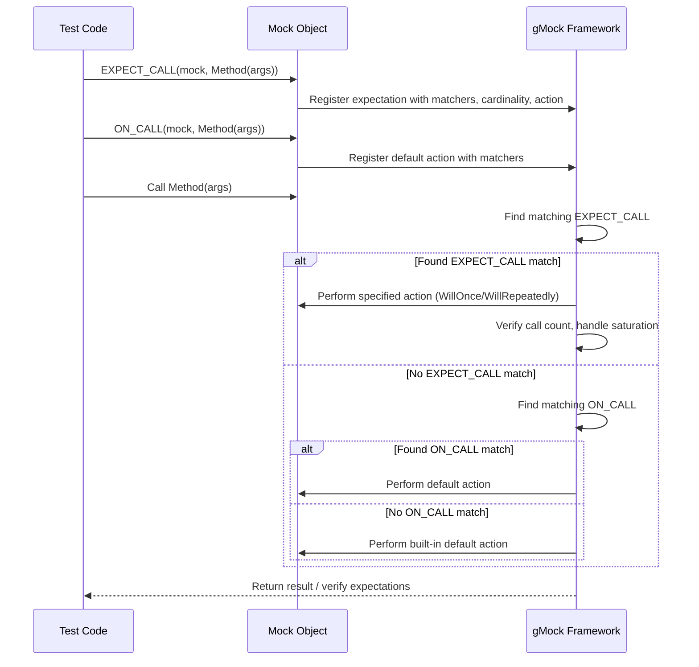

# Expectations, Cardinalities, and Actions

GoogleMock (gMock) provides a powerful, expressive syntax to precisely define how mock objects should behave and be verified during tests. This guide unpacks how you express expectations on mock methods using `EXPECT_CALL` and default behaviors with `ON_CALL`. It also explains how to specify how often methods should be called using cardinalities and how to dictate what those mock methods should do when invoked, including returning values or invoking custom actions.

---

## Overview of Expectation Mechanisms

Mock objects in gMock are instruments to monitor and control interactions between code under test and its dependencies. To leverage them effectively, you define:

- **What method calls you expect (or allow).**
- **How many times each call is anticipated.**
- **What a mocked method should do when called (return values, side effects).**

Two primary mechanisms do this:

- `EXPECT_CALL(mock_object, Method(args))` — declares an expectation that this call *must* happen during the test.
- `ON_CALL(mock_object, Method(args))` — sets a default behavior that applies *if* the call occurs, but doesn’t assert that it must happen.

This separation helps you write precise, resilient tests by verifying only what truly matters and letting other calls pass gracefully.

## Defining Expectations with `EXPECT_CALL`

Use `EXPECT_CALL` to specify that a particular method on a mock object is expected to be called, optionally with:

- Argument **matchers** to specify which arguments are acceptable.
- **Cardinalities** to describe how many times the call should happen.
- **Actions** to specify the behavior (what the method does when called).
- **Ordering constraints** like sequences or dependencies.

### Basic Syntax

```cpp
EXPECT_CALL(mock_object, Method(matcher1, matcher2, ...))
    .Times(cardinality)
    .WillOnce(action)
    .WillRepeatedly(action)
    .InSequence(seq)
    .After(expectation)
    .RetiresOnSaturation();
```

### Argument Matchers

For the method arguments, specify what you expect using matchers:

- Literal values imply exact match (e.g., `5` means equals 5).
- `_` means "match anything" — useful for ignoring some arguments.
- More specific matchers like `Ge(100)` (greater or equal) or `NotNull()` add precision.

If you don’t care about arguments at all, and the method isn’t overloaded, you may omit the argument list entirely:

```cpp
EXPECT_CALL(turtle, Forward);
```

### Cardinalities: Specifying Call Counts

Cardinality controls "how many times" a method should be called:

| Cardinality     | Meaning                                         |
|-----------------|-------------------------------------------------|
| `Exactly(n)` or `n`   | Call expected exactly `n` times                |
| `AtLeast(n)`    | Call expected *at least* `n` times              |
| `AtMost(n)`     | Call expected *at most* `n` times               |
| `Between(m, n)` | Call expected between `m` and `n` times (inclusive) |
| `AnyNumber()`   | Call can be made any number of times             |

If you omit `.Times()`, gMock infers it:
- No `WillOnce` or `WillRepeatedly` → `Times(1)` 
- n `WillOnce` → `Times(n)`
- n `WillOnce` + one `WillRepeatedly` → `Times(AtLeast(n))`

To forbid a call entirely, use `Times(0)`.

### Actions: Defining Mock Behavior

By default, mock methods return default values (e.g., `0` for ints, `nullptr` for pointers) or perform no operation for `void` methods.

You can specify desired behaviors using:
- `.WillOnce(action)` — for actions to perform on the *next* call(s).
- `.WillRepeatedly(action)` — for actions on *all* subsequent calls after `WillOnce` actions are exhausted.

Examples of built-in actions:

- `Return(value)` — return a specified value.
- `ReturnRef(variable)` — return a reference.
- `Invoke(function)` — call a custom function or lambda.
- `SetArgPointee<N>(value)` — set an output pointer argument.

Example:

```cpp
EXPECT_CALL(turtle, GetX())
    .WillOnce(Return(100))
    .WillOnce(Return(150))
    .WillRepeatedly(Return(200));
```

Here, the method returns 100 first call, 150 second, then 200 for all subsequent calls.

<br>

## Default Behavior with `ON_CALL`

Use `ON_CALL` to specify the default behavior for calls without requiring them explicitly:

```cpp
ON_CALL(mock_object, Method(matcher1, matcher2, ...))
    .WillByDefault(action);
```

`ON_CALL` does *not* impose any expectation; it just defines what happens when the matching method call occurs.

This is useful to avoid verbose `EXPECT_CALL`s when you don’t intend to verify certain calls, but you want them to behave in a specific way.

<br>

## Argument Matching in Detail

gMock offers a rich set of matchers to articulate complex expectations about arguments.

- `_` matches any value.
- Value matchers like `Eq(value)`, `Ne(value)`, `Ge(value)`, etc.
- Composite matchers: `AllOf()`, `AnyOf()`, `Not()`, and tuple matchers for multi-argument matching.

Example: Expect a method called with first argument 50 and any second argument

```cpp
EXPECT_CALL(mock, GoTo(50, _));
```

Or, for matching multiple arguments together:

```cpp
EXPECT_CALL(mock, SetPosition(_, _)).With(Lt());  // First arg < second arg
```

## Controlling Order of Calls

### Sequences with `InSequence`
Wrap the expectations in an `InSequence` object to enforce strict call order:

```cpp
{
  testing::InSequence seq;
  EXPECT_CALL(turtle, PenDown());
  EXPECT_CALL(turtle, Forward(100));
  EXPECT_CALL(turtle, PenUp());
}
```

### Partial Ordering with `InSequence` Clauses
You can attach one or more `Sequence` objects to expectations to construct a partial ordering DAG for call sequences.

### Dependencies with `After`
You can specify that certain calls occur only after one or more other expectations have been satisfied:

```cpp
Expectation e1 = EXPECT_CALL(mock, Init());
EXPECT_CALL(mock, Run()).After(e1);
```

<br>

## Sticky Expectations and Saturation

By default, expectations "stick" around even when their call count upper bound is reached, so further calls matching this expectation will cause failures. Use `.RetiresOnSaturation()` to retire (deactivate) an expectation immediately upon reaching its upper bound, allowing other expectations to match subsequent calls.

Example:

```cpp
EXPECT_CALL(mock, SetNumber(7))
    .Times(2)
    .RetiresOnSaturation();
EXPECT_CALL(mock, SetNumber(_))
    .Times(testing::AnyNumber());
```

Calls to `SetNumber(7)` beyond the second call will match the second expectation.

<br>

## Handling Multiple Expectations

Multiple expectations on the same method are resolved in reverse order — the last matching active expectation is used. More specific expectations should be placed after more general ones to avoid being shadowed.

Example:

```cpp
EXPECT_CALL(turtle, Forward(_));
EXPECT_CALL(turtle, Forward(10)).Times(2);
```

Calls with argument `10` match the last expectation (twice), other calls match the first.

<br>

## Best Practices and Common Pitfalls

- **Set expectations before exercising mocks:** `EXPECT_CALL` must precede any calls to the mock method.
- **Use `ON_CALL` for default behaviors without imposing call expectations**—avoid overconstraining tests.
- **Avoid ambiguous overloaded method expectations**; specify argument types or use tailored mock interfaces.
- **Use matchers judiciously**; too strict expectations cause brittle tests.
- **Investigate unexpected or uninteresting calls** using `--gmock_verbose=info` for detailed tracing.
- **Remember sticky expectations may cause unexpected "too many calls" failures**; control with `RetiresOnSaturation()` or use sequences.

<br>

## Troubleshooting Common Issues

- *Expectation not satisfied:* Confirm that the mock method was called with the expected arguments and number of times.
- *Uninteresting call warnings:* Use `NiceMock` to suppress or write explicit catch-all expectations with `.Times(AnyNumber())`.
- *Ambiguous overload errors:* Specify arguments in `EXPECT_CALL` precisely.
- *Side effect evaluation once:* Understand `WillOnce(Return(n++))` evaluates `n++` once when expectation is set, not per call.
- *Calls out of expected order:* Use `InSequence` or `After` to enforce orderings.

<br>

## Practical Example

```cpp
using ::testing::_;
using ::testing::Return;
using ::testing::AtLeast;

TEST(PainterTest, DrawsCircle) {
  MockTurtle turtle;

  // Expect PenDown() to be called at least once
  EXPECT_CALL(turtle, PenDown()).Times(AtLeast(1));

  // Control GetX() return values on consecutive calls
  EXPECT_CALL(turtle, GetX())
      .WillOnce(Return(100))
      .WillOnce(Return(150))
      .WillRepeatedly(Return(200));

  Painter painter(&turtle);
  EXPECT_TRUE(painter.DrawCircle(0, 0, 10));
}
```

This test verifies interaction with the mock turtle, controlling what it returns and expecting the pen to be down at least once during drawing.

---

## Diagram: Mock Interaction Flow for `EXPECT_CALL` and `ON_CALL`



---

## Summary

Expectations, cardinalities, and actions together form the core language to control mock behavior and verification in gMock. By combining expressive argument matchers, flexible call count specifications, and customizable response actions, you gain complete control over your mocked dependencies, enabling fine-grained interaction testing.

# Additional Resources

- [gMock for Dummies](https://google.github.io/googletest/gmock_for_dummies.html) — introduction to mocks
- [Mocking Reference](reference/mocking.md) — detailed API for mocks
- [Actions and Cardinalities](api-reference/gmock-api/actions-and-cardinalities.md)
- [Matchers Reference](api-reference/gmock-api/matchers-reference.md)
- [gMock Cookbook](https://google.github.io/googletest/gmock_cook_book.html) — practical recipes
- [gMock Cheat Sheet](https://google.github.io/googletest/gmock_cheat_sheet.html) — quick syntax summary

---

<Tip>
Use `ON_CALL` for default mock behaviors that don’t require strict verification, and `EXPECT_CALL` for calls you want to assert explicitly, including call counts and call sequences.
</Tip>

<Note>
When specifying multiple expectations for the same method, remember gMock picks the last matching active one, so order your `EXPECT_CALL`s from general to specific accordingly.
</Note>

<Warning>
Over-specifying expectations (too rigid argument matching, excessive ordering constraints) leads to brittle tests. Aim for clear, focused expectations that verify the contract without constraining implementation details unnecessarily.
</Warning>
