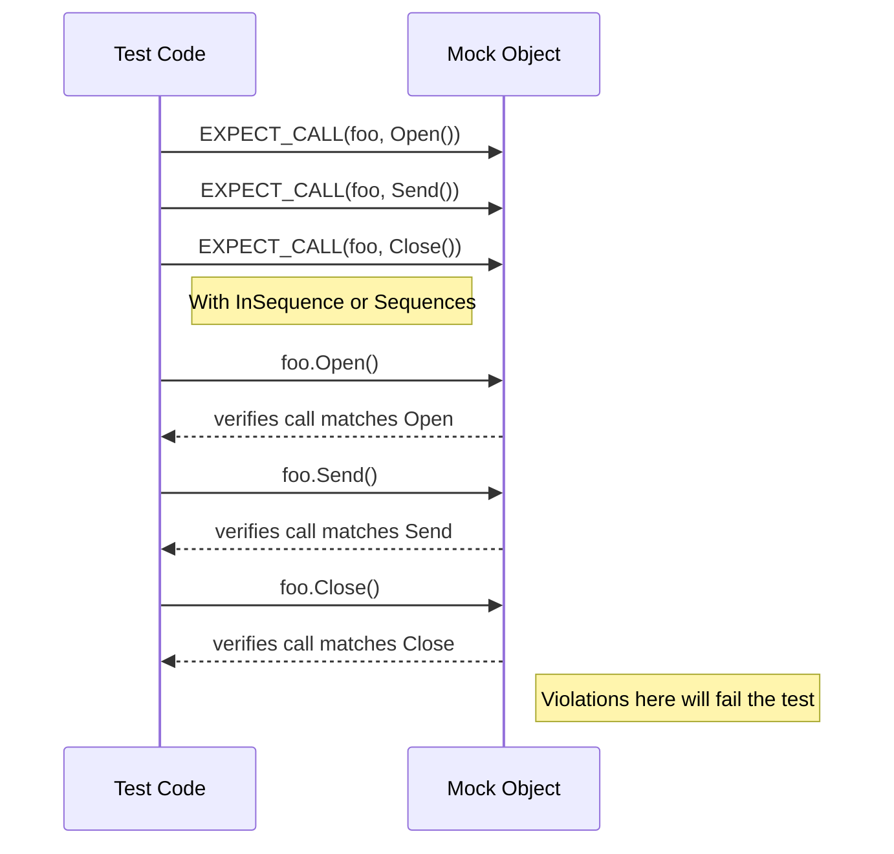

# Call Sequencing and Thread Safety

Explore how GoogleMock manages call order, enforces expected sequences, and ensures thread safety in concurrent test scenarios. Learn best practices for leveraging these features in complex applications.

---

## Introduction

In unit tests using GoogleMock, you often need not only to verify *which* calls a mock object receives but also *when* and *in what order* these calls happen. This is especially crucial in complex applications with multiple interactions and concurrent threads. This guide breaks down how GoogleMock supports specifying call sequences and ensures thread safety during mock interactions.

Understanding these concepts empowers you to write tests that confidently validate call order and operate reliably in concurrent scenarios.

---

## Call Sequencing: Enforcing Order of Mock Calls

By default, GoogleMock does **not** enforce any order between expected calls. Your tests specify *which* calls are expected, but the calls may occur in any sequence. However, the framework provides powerful tools to explicitly specify call sequences and partial orderings.

### Why Specify Call Order?

Imagine you have a mock representing a network socket. Your component must first open the connection, send data, then close the connection. Calling `Send()` before `Open()` would be a bug. Your test needs to catch such logic errors.

### How to Specify Call Order

GoogleMock offers two primary ways to specify strict or partial call order:

#### 1. Using `InSequence` Scope

Wrap your expected calls inside an `InSequence` object. This causes GoogleMock to enforce **strict** sequential order for all expectations declared within the scope:

```cpp
using ::testing::InSequence;

{
  InSequence seq;

  EXPECT_CALL(mock, Open());
  EXPECT_CALL(mock, Send(_));
  EXPECT_CALL(mock, Close());
}

// Code under test invokes calls; must follow the above order.
```

If the code calls `Send()` before `Open()`, your test will fail immediately.

#### 2. Using `Sequence` Objects for Partial Order

Not all interactions require strict sequences. You may require some calls to happen in a defined order, but others can be unordered.

Declare one or more `Sequence` objects and associate each expectation with one or multiple sequences:

```cpp
using ::testing::Sequence;

Sequence s1, s2;

EXPECT_CALL(mock, Connect()).InSequence(s1);
EXPECT_CALL(mock, Authenticate()).InSequence(s1);
EXPECT_CALL(mock, FetchData()).InSequence(s2);
EXPECT_CALL(mock, Disconnect()).InSequence(s1, s2);
```

This sets a partial order where `Connect` must precede `Authenticate`, and both must precede `Disconnect`. Meanwhile, `FetchData` also must happen before `Disconnect` but may be unordered with respect to authentication.

### Ordering Relations via `After` Clause

You can also enforce call order using the `.After()` clause, specifying prerequisite expectations or sets of expectations:

```cpp
Expectation a = EXPECT_CALL(mock, A());
Expectation b = EXPECT_CALL(mock, B());
EXPECT_CALL(mock, C()).After(a, b);
```

This states that `C()` must be called after both `A()` and `B()` have been called.

### Important Sequencing Behaviors

- **Sticky Expectations**: Expectation specifications in GoogleMock remain active even after their upper-bound call limit is reached unless explicitly retired (see `.RetiresOnSaturation()` below).
- **Retiring Expectations**: Use `.RetiresOnSaturation()` to make an expectation inactive once its call limit is reached, allowing other overlapping expectations to match subsequent calls.
- **Mixed Sequences**: Combine sequences to express complex partial orders and enforce correct call interleaving.

---

## Thread Safety in Mock Calls

Modern applications are often multi-threaded. GoogleMock includes robust support for safely using mocks across threads, with clear rules to prevent undefined behaviors.

### Key Thread Safety Rules

1. **Test Code in a Single Thread**

   Your test code (the code that sets expectations and verifies) should run in a single thread. This approach simplifies reasoning and avoids race conditions during setup and teardown.

2. **Exclusive Access for Setup and Teardown**

   When setting expectations (`EXPECT_CALL`) or default behaviors (`ON_CALL`) and when destroying mocks, make sure no other thread is calling into the mocks.

3. **Concurrent Calls Allowed**

   Methods on mock objects can be concurrently called from multiple threads. GoogleMock serializes calls internally and protects internal data structures to avoid races.

4. **No Concurrent Setup/Teardown and Calls**

   Calling mocks concurrently while expectations or actions are being modified results in undefined behavior.

### What GoogleMock Guarantees

- The **action** associated with a mock function call executes in the **same thread** that made the call.
- Internal **locking** ensures that state related to expectations and sequences remains consistent across threads.
- GoogleMock does **NOT** impose inter-thread ordering of mock method calls. Actions executing on different threads may interleave arbitrarily.

### Synchronizing Across Threads

If your test scenario requires strict ordering or synchronization of calls across multiple threads, you must implement explicit synchronization in your test code.

### Example: Concurrent Calls on the Same Mock

The included `gmock_stress_test.cc` showcases typical usage of mocks in multi-threaded scenarios. Here is a simplified user flow:

- Setup the mock with `ON_CALL` default actions and `EXPECT_CALL` expectations.
- Launch multiple threads invoking mock methods concurrently.
- Use GoogleMock to verify expectations after the threads complete.

The test validates that GoogleMock handles concurrent calls correctly and detects expectation violations.

---

## Practical Tips and Best Practices

- **Declare all expectations before invoking calls on mocks.** Modifying expectations while mocks are in use leads to undefined behavior.
- **Use `InSequence` or `Sequence` to document expected call order explicitly.** Over-constraining tests by unnecessary strict ordering may make tests brittle.
- **Use `.RetiresOnSaturation()` to allow expectations to deactivate after being fulfilled, especially when multiple overlapping expectations exist for the same mock method.**
- **Wrap related expectations inside an `InSequence` scope to simplify strict ordering. Use sequences for more flexible partial orders.**
- **To suppress warnings about uninteresting calls in multithreaded tests, consider using `NiceMock` if appropriate.**
- **Consider synchronizing your test logic explicitly when order or interleaving of calls across multiple threads matters.** GoogleMock does not enforce this.
- **Inspect call violations with `--gmock_verbose=info` for detailed tracing of call and expectation matches.**

---

## Troubleshooting Common Issues

### Calls Occurring Out of Expected Order

This typically indicates missing or improperly defined sequences or `InSequence` usage. Review your expected call order clauses and add or adjust sequences accordingly.

### Thread Safety Violations

If your tests crash or behave unpredictably under concurrency:

- Check that no expectations or default actions are added or altered while calls to mocks occur in other threads.
- Ensure your test harness runs setup and verification steps in a single thread.

### Excessive or Missing Calls Failures

If mock methods are called more or fewer times than expected, GoogleMock informs you precisely which expectation failed. Consider using `.RetiresOnSaturation()` to handle multiple calls cleanly where overlap exists.

---

## Summary

GoogleMock offers a robust mechanism for asserting call order via `InSequence`, `Sequence`, and `After` clauses, allowing you to verify both strict and partial orders of function calls.

Thread safety is guaranteed under the simple condition that setup and teardown code run single-threaded, while usage of mocks in multiple threads is safe. GoogleMock handles locking internally, but cross-thread ordering must be managed explicitly in tests.

Mastering call sequencing and thread safety equips you to write clear, precise, and reliable tests for complex, asynchronous or concurrent systems.

---

## Visualizing Call Sequencing



## References

- [GoogleMock for Dummies](https://google.github.io/googletest/gmock_for_dummies.html) – Beginner's guide to using mock expectations and behaviors.
- [Mocking Reference](https://google.github.io/googletest/reference/mocking.html) – Detailed API reference for `EXPECT_CALL`, `ON_CALL`, and sequencing.
- [gMock Cookbook - Using gMock and Threads](https://google.github.io/googletest/gmock_cook_book.html#Using-gMock-and-Threads) – Recipes and best practices for threads.
- [Nice, Naggy, and Strict Mocks](https://google.github.io/googletest/reference/nice-strict-mocks.html) – Controlling uninteresting call warnings.
- [GoogleMock API: `Sequence` and `InSequence`](https://google.github.io/googletest/reference/mocking.html#Sequence) – How to apply sequences.

For an integrated understanding, consult the **Mocking Concepts & Data Models** section of the Concepts guide to see how call sequencing fits in with other mocking capabilities.

---

## Next Steps

- Start practicing with simple `InSequence` blocks for strict ordering.
- Explore `Sequence` objects to model complex call graphs.
- Incorporate thread-safe test patterns by confining setup to one thread and using mocks across multiple threads safely.
- Use verbose logging options for debugging call mismatches and sequencing problems.

You are now ready to write tests that validate not just the *what*, but also the *when* and *how* of your system's interactions, even under concurrency.