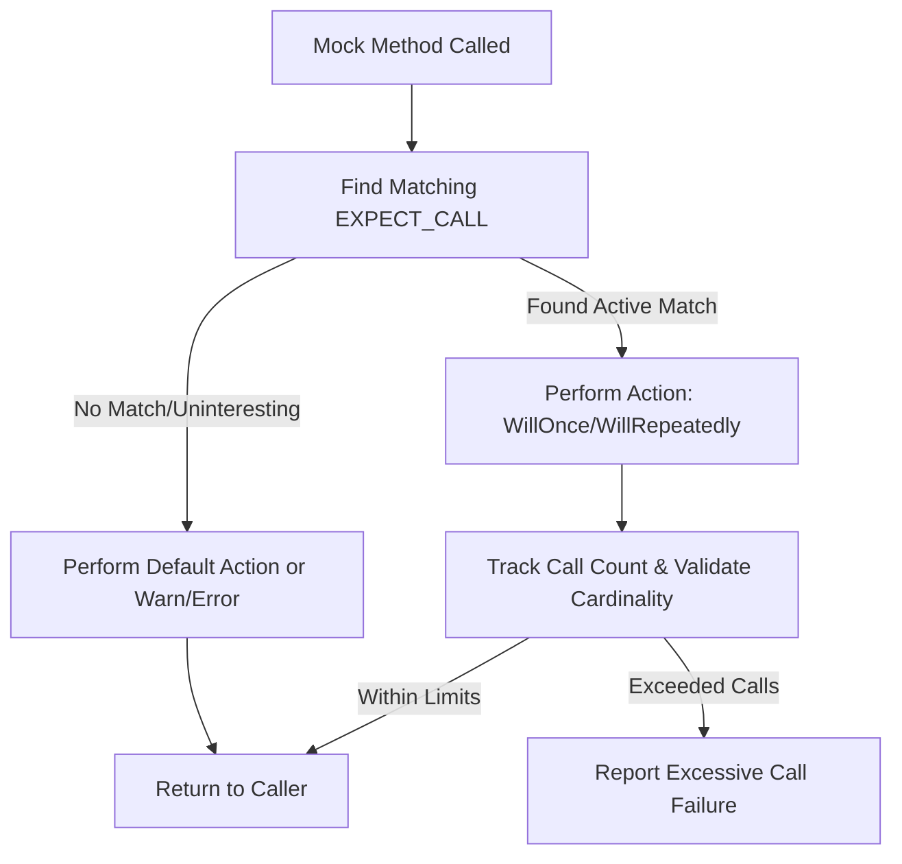

# Defining and Using Mocks

Understanding how to create and utilize mock classes and methods in GoogleMock is essential for writing effective, maintainable C++ tests. This guide covers the declaration of mock methods with the powerful `MOCK_METHOD` macro, how to handle complex method signatures—including qualifiers and overloads—and the mechanism by which GoogleMock tracks and validates expected calls.

---

## 1. Declaring Mock Methods with `MOCK_METHOD`

At the heart of mock definition is the `MOCK_METHOD` macro, designed to succinctly declare mocked methods inside your mock classes.

### Syntax Overview

```cpp
MOCK_METHOD(ReturnType, MethodName, (ArgumentTypes...), (Qualifiers...));
```

- **ReturnType**: The return type of the method.
- **MethodName**: The name of the method to mock.
- **ArgumentTypes**: The parameter types of the method, enclosed in parentheses.
- **Qualifiers** (optional): Such as `const`, `override`, `noexcept`, `Calltype(...)` (for calling convention), and reference qualifiers like `ref(&)` or `ref(&&)`.

### Important Details

- Place all `MOCK_METHOD` declarations in the `public:` section of your mock class—this is required even if the base method is `private` or `protected`. This visibility ensures `ON_CALL` and `EXPECT_CALL` can interact correctly with the mocks.

- For methods overridden from base classes, particularly virtual ones, it is **recommended** to specify the `override` qualifier.

- When mocking a `const` method, include `const` in the qualifiers.

- Reference qualifiers are supported and must be specified if they exist on the original method, for example, methods qualified with `&` or `&&`.

- To specify non-default calling conventions (common in Windows COM interfaces), use the `Calltype(STDMETHODCALLTYPE)` qualifier.

### Handling Commas in Return or Argument Types

Because the macro parameters are separated by commas, **unparenthesized commas in types break parsing**. For example, these will **fail** to compile:

```cpp
MOCK_METHOD(std::pair<bool, int>, GetPair, ());              // Error!
MOCK_METHOD(bool, CheckMap, (std::map<int, double>, bool));  // Error!
```

You have two ways to fix this:

1. Wrap the type containing commas in extra parentheses:

```cpp
MOCK_METHOD((std::pair<bool, int>), GetPair, ());
MOCK_METHOD(bool, CheckMap, ((std::map<int, double>), bool));
```

2. Use type aliases for complex types:

```cpp
using BoolAndInt = std::pair<bool, int>;
using MapIntDouble = std::map<int, double>;

MOCK_METHOD(BoolAndInt, GetPair, ());
MOCK_METHOD(bool, CheckMap, (MapIntDouble, bool));
```

### Example Mock Class Definition

```cpp
class MockFoo : public Foo {
 public:
  MOCK_METHOD(int, GetSize, (), (const, override));
  MOCK_METHOD(bool, Process, (const std::string& input), (override));
  MOCK_METHOD(void, Reset, (), (override));
  MOCK_METHOD(std::pair<bool, int>, GetPair, (), (override));
};
```

## 2. Mocking Overloaded Methods

GoogleMock fully supports mocking overloaded functions. To avoid ambiguity:

- Specify the exact method signature in `MOCK_METHOD`.
- Use `Const()` when mocking const overloads, so the compiler knows which version you mean.

Example:

```cpp
class MockBar : public Bar {
 public:
  MOCK_METHOD(int, Add, (Element x), (override));
  MOCK_METHOD(int, Add, (int times, Element x), (override));

  MOCK_METHOD(const Bar&, GetBar, (), (const, override));
  MOCK_METHOD(Bar&, GetBar, (), (override));
};
```

If you don't mock all overloads, bring the other overloads into scope using `using`:

```cpp
class MockBar : public Bar {
 public:
  using Bar::Add;  // Bring all overloads into scope
  MOCK_METHOD(int, Add, (Element x), (override));
  // Not mocking Add(int, Element)
};
```

## 3. Handling Method Qualifiers

GoogleMock supports specifying method qualifiers commonly used in C++:

| Qualifier           | Use case                                                    |
|---------------------|-------------------------------------------------------------|
| `const`             | Marks the method as `const`. Must match the base method.    |
| `override`          | Marks the method as `override`. Recommended for virtuals.   |
| `noexcept`          | Marks the method as `noexcept`. Must match the base method. |
| `Calltype(...)`     | Sets the call type (e.g., Windows calling convention).       |
| `ref(&)` / `ref(&&)`| Specifies lvalue/rvalue reference qualifiers. Must match base method. |

Including these qualifiers ensures your mocks behave correctly and compile, especially when overriding virtual methods.

## 4. Setting Expectations and Default Behaviors

GoogleMock distinguishes two key constructs for controlling mock behavior:

### ON_CALL

Defines the **default behavior** of a mocked method but sets no expectation that it must be called.

Example:

```cpp
ON_CALL(mock_obj, Method(_))
    .WillByDefault(Return(42));
```

Default actions apply to calls that don't match any `EXPECT_CALL`.

### EXPECT_CALL

Sets an **expectation** that a mocked method will be called with specified arguments and controls how many times and in what order.

Example:

```cpp
EXPECT_CALL(mock_obj, Method(5))
    .Times(3)
    .WillRepeatedly(Return(true));
```

Behavior includes:

- Matching calls against expectations in reverse order (`newer` overrides `older`).
- Cardinality to specify how many calls expected (e.g., Exactly, AtLeast, AnyNumber).
- Sequencing calls using `.InSequence()` or `.After()`.
- Specifying call handling actions via `.WillOnce()` and `.WillRepeatedly()`.

### Important Order for Clauses in `EXPECT_CALL`

The following chainable clauses must appear in the specified order:

```
EXPECT_CALL(mock, method(matchers...))
    .With(multi_argument_matcher)  // Optional
    .Times(cardinality)            // Optional
    .InSequence(sequences...)      // Optional
    .After(expectations...)        // Optional
    .WillOnce(action)              // Optional (multiple allowed)
    .WillRepeatedly(action)        // Optional
    .RetiresOnSaturation();        // Optional
```

## 5. How GoogleMock Tracks and Validates Calls

- **Expectation Matching:** When a mock method is invoked, GoogleMock searches expectations in reverse order, picking the most recent matching one that is still active.

- **Active Expectations:** Expectations can be active, retired, or saturated. By default, saturated expectations stay active ("sticky") unless `.RetiresOnSaturation()` is used.

- **Sequences and Ordering:** Using `Sequence` objects and the `InSequence` or `After` clauses, expectations can enforce call order and partial ordering (DAGs).

- **Uninteresting vs Unexpected Calls:**
  - *Uninteresting call:* No `EXPECT_CALL` sets an expectation for the method. By default, a warning is issued, but calls are allowed.
  - *Unexpected call:* The method has some expectations, but none match the actual call.

- **Behavior Modifiers:**
  - `NiceMock` suppresses warnings on uninteresting calls.
  - `NaggyMock` (default) warns on uninteresting calls.
  - `StrictMock` treats uninteresting calls as errors.

## 6. Examples

### Basic Mock Method Declaration

```cpp
class MockCalculator {
 public:
  MOCK_METHOD(int, Add, (int a, int b), (override));
  MOCK_METHOD(void, Reset, (), (override));
  MOCK_METHOD(int, GetValue, (), (const, override));
};
```

### Setting Expectations

```cpp
MockCalculator mock_calc;
EXPECT_CALL(mock_calc, Add(5, _))
    .Times(2)
    .WillOnce(Return(10))
    .WillOnce(Return(15));
```

### Using Qualifiers

```cpp
class MockDevice {
 public:
  MOCK_METHOD(bool, Connect, (), (noexcept, override));
  MOCK_METHOD(void, Disconnect, (), (override));
  MOCK_METHOD(int, GetStatus, (), (const, override));
};
```

### Handling Overloads

```cpp
class MockPrinter {
 public:
  MOCK_METHOD(void, Print, (int pages), (override));
  MOCK_METHOD(void, Print, (const std::string& text), (override));
};

// Using EXPECT_CALL with disambiguation
EXPECT_CALL(mock_printer, Print(::testing::An<int>()));
EXPECT_CALL(mock_printer, Print(::testing::Matcher<const std::string&>(::testing::_)));
```

---

## Tips & Best Practices

- Always specify `MOCK_METHOD` inside the public section of your mock class.

- Use type aliases or extra parentheses to handle types containing commas.

- Use `ON_CALL` to define default mock behavior without requiring call expectations.

- Prefer `EXPECT_CALL` when you need to verify that a mock method is actually invoked.

- When mocking overloaded methods, disambiguate which overload you mean explicitly.

- Take advantage of sequence objects and `.InSequence()` for ordered call testing.

- Use `.RetiresOnSaturation()` on expectations when you want them to retire after the upper bound number of calls.

- Understand the semantics of uninteresting vs unexpected calls to write tests with the right level of strictness.

- Use `NiceMock` and `StrictMock` wrappers judiciously to control warnings and failures on uninteresting calls.

- Keep expectations set *before* exercising code that calls mocks to avoid undefined behavior.

---

## Troubleshooting Common Issues

- **Coma Parsing Errors**: If your `MOCK_METHOD` fails to compile due to commas in types, wrap the complex type in parentheses or use a type alias.

- **Ambiguous Overloads**: When mocking overloaded methods without explicit parameters, you will get ambiguity errors. Specify parameters or use `Const()` helper for const overloads.

- **Unexpected Call Failures**: Usually caused by missing or incorrectly specified `EXPECT_CALL` to cover the calls your code performs.

- **Excessive Calls**: Calls made more times than expected cause failures unless handled with `.Times(AnyNumber())` or flexible cardinalities.

- **Destructor Not Virtual**: Mocking classes whose destructors are not virtual can cause undefined behavior when deleting through base pointers.

- **Uninteresting Call Warnings**: Use `NiceMock` to suppress, or add catch-all `EXPECT_CALL(mock, method(_)).Times(AnyNumber())`.

## References & Further Reading

- [`MOCK_METHOD` Macro Details](https://github.com/google/googletest/blob/main/docs/reference/mocking.md#mock-method)
- [gMock Cookbook: Defining and Using Mocks](https://google.github.io/googletest/gmock_cook_book.html#Creating-Mock-Classes)
- [Matchers, Actions, and Cardinalities](https://github.com/google/googletest/blob/main/docs/concepts/mocking-concepts/matchers-actions-cardinalities.md)
- [Nice, Naggy, and Strict Mocks](https://github.com/google/googletest/blob/main/docs/api-reference/gmock-apis/nice-strict-mocks.md)

---

## Related Documentation

- [Test Doubles with GoogleMock](https://github.com/google/googletest/blob/main/guides/core-testing-workflows/test-doubles-with-googlemock.md)
- [Matchers Reference](https://github.com/google/googletest/blob/main/api-reference/gmock-apis/matchers-reference.md)
- [Actions Reference](https://github.com/google/googletest/blob/main/api-reference/gmock-apis/actions-reference.md)
- [Call Expectations and Cardinalities](https://github.com/google/googletest/blob/main/api-reference/gmock-apis/cardinalities-reference.md)

---

## Summary
This guide empowers C++ developers to declare mock classes using the `MOCK_METHOD` macro, handle method qualifiers and overloading, and set expectations or default behaviors. It clarifies how GoogleMock matches and tracks method calls, enforces call counts, manages ordered sequences, and distinguishes uninteresting versus unexpected calls.

---

### Mermaid Diagram: Expectation Matching Flow



---

