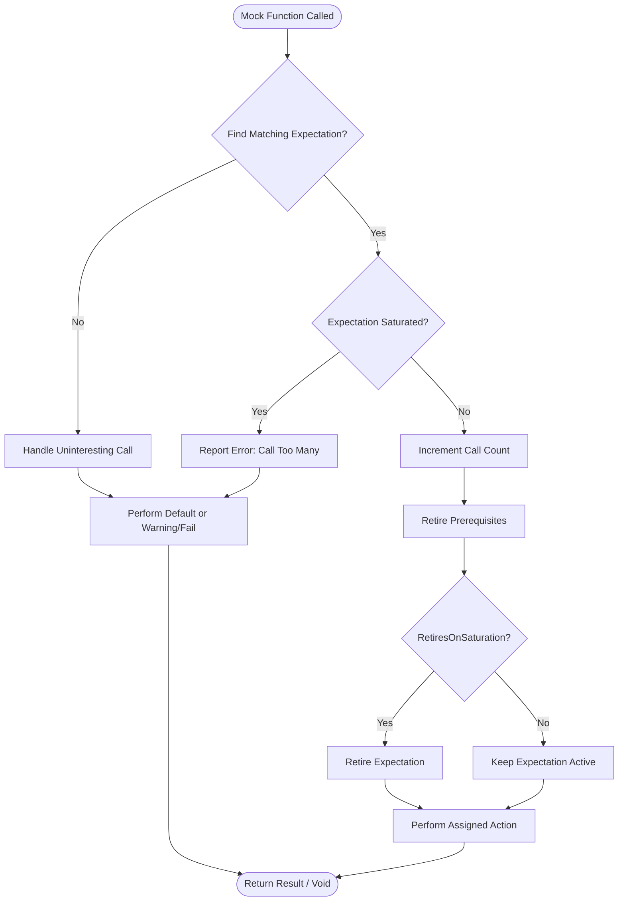

# Expectations, Cardinalities, and Verification

GoogleMock lets you precisely define how your mock objects should behave during tests by setting *expectations*—definitions of expected interactions such as which methods will be called, how many times, with what arguments, and what they return.

This guide will help you:

- Understand what *expectations* are and how to define them with `EXPECT_CALL`.
- Specify *cardinalities* to control the expected number of calls.
- Explore the verification process that ensures expectations are met.
- Differentiate mock object behaviors: Strict, Nice, and Naggy.

---

## What Are Expectations?

An *expectation* in GoogleMock is a precise contract about how a mock method should be called in your test. It specifies:

- The method to expect.
- The argument matchers that describe allowed values.
- The number of times the method is expected to be called (cardinality).
- The behavior or return values when the method is invoked.

Expectations are declared using the `EXPECT_CALL()` macro, which both defines the behavior of the mock method and asserts that the method is indeed called as expected:

```cpp
EXPECT_CALL(mock_object, MethodName(matchers...))
    .Times(cardinality)
    .WillOnce(action)
    .WillRepeatedly(action);
```

> Note: `EXPECT_CALL` **must** be declared before exercising the code that invokes the mock method to ensure proper verification.

### Basic Example

```cpp
using ::testing::Return;

EXPECT_CALL(mock_turtle, GetX())
    .Times(3)
    .WillOnce(Return(100))
    .WillOnce(Return(200))
    .WillOnce(Return(300));

// The test expects mock_turtle.GetX() to be called exactly 3 times,
// returning 100, then 200, then 300.
```

### Expectations Without Explicit Matchers

For non-overloaded methods, argument matchers can be omitted to mean 'match any arguments':

```cpp
EXPECT_CALL(mock_turtle, Forward)
    .Times(AnyNumber());  // Any calls to Forward() are allowed.
```

> Be cautious when omitting matchers on overloaded methods; this will cause compilation errors due to ambiguity.

---

## Specifying Cardinalities: How Many Times?

Cardinalities define how many times a mock method invocation is expected.

### Cardinality Clauses

Use `.Times()` to explicitly specify cardinality:

| Cardinality Function      | Meaning                                   |
|---------------------------|-------------------------------------------|
| `AnyNumber()`             | The method can be called zero or many times. |
| `AtLeast(n)`              | The method is expected to be called at least n times. |
| `AtMost(n)`               | The method is expected to be called at most n times. |
| `Between(m, n)`           | The method is expected between m and n times inclusive. |
| `Exactly(n)` or just `n`  | The method is expected exactly n times; 0 means never called. |

If `.Times()` is omitted, GoogleMock infers cardinality based on `WillOnce()` and `WillRepeatedly()` clauses:

- No `WillOnce()` or `WillRepeatedly()` → `Times(1)`.
- *n* `WillOnce()` clauses, no `WillRepeatedly()` → `Times(n)`.
- *n* `WillOnce()` clauses and one `WillRepeatedly()` → `Times(AtLeast(n))`.

### Examples

```cpp
EXPECT_CALL(mock, Foo()).Times(AnyNumber());
EXPECT_CALL(mock, Bar()).Times(Exactly(3));
EXPECT_CALL(mock, Baz()).Times(AtLeast(1));
EXPECT_CALL(mock, Qux()).Times(Between(2, 5));
```

### Handling Zero Calls

To verify a method should never be called:

```cpp
EXPECT_CALL(mock, DoNotCallMe()).Times(0);
```

Calls to such methods will cause test failures.

---

## Verification of Expectations

GoogleMock automatically verifies that all expectations are satisfied when a mock object is destructed. Verification includes:

- Checking if each expected call happened the required number of times.
- Reporting errors when calls are missing, exceeded, or out of order.

### Manually Forcing Verification

You can verify and clear a mock's expectations manually before destruction:

```cpp
using ::testing::Mock;
...
ASSERT_TRUE(Mock::VerifyAndClearExpectations(&mock_obj));
```

This is especially useful when a mock is owned by production code and may not be destroyed in the test.

### Retiring Expectations

Expectations remain *sticky* by default; even saturated expectations stay active unless explicitly retired. Use `.RetiresOnSaturation()` to make an expectation retire once saturated:

```cpp
EXPECT_CALL(mock, Foo())
    .Times(2)
    .RetiresOnSaturation();
```

---

## Understanding Uninteresting Calls and Mock Strictness

### Uninteresting Calls

If a mock method is called but there is no matching `EXPECT_CALL`:

- It's an *uninteresting call*.
- GoogleMock by default prints a warning.
- It will perform the default action (e.g., returning zero or default-constructed values).

To avoid these warnings when calls are expected but don't need explicit verification, you can use:

- `NiceMock<T>`: suppresses warnings on uninteresting calls.
- `NaggyMock<T>`: default behavior printing warnings.
- `StrictMock<T>`: treats uninteresting calls as errors causing test failures.

### Example Using NiceMock

```cpp
using ::testing::NiceMock;
NiceMock<MockFoo> mock_foo;
EXPECT_CALL(mock_foo, DoThis());  // Only DoThis() is expected
// Other method calls won't produce warnings
```

### StrictMock Example

```cpp
using ::testing::StrictMock;
StrictMock<MockFoo> mock_foo;
EXPECT_CALL(mock_foo, DoThis());
// Any uninteresting call triggers a test failure
```

### Choosing Strictness

- Use **nice mocks** when you want to ignore uninteresting calls during normal test operation.
- Use **strict mocks** to catch unexpected calls and enforce strict interface contracts.
- Use **naggy mocks** (default) during development to get warnings.

### Notes on Strictness

- `NiceMock` and `StrictMock` only affect methods defined with `MOCK_METHOD` *directly* in the mock class.
- They do not affect methods inherited from base classes in some compilers.
- Destructors of mock classes should be virtual for correct strictness behavior.

---

## Ordering and Sequences of Expectations

### Ordering Expectations with `InSequence`

To enforce call order, wrap expectations in an `InSequence` block:

```cpp
{
  InSequence s;
  EXPECT_CALL(mock, FirstCall());
  EXPECT_CALL(mock, SecondCall());
}
```

Expectations declared in an `InSequence` block must be invoked in that order.

### Using `Sequence` Objects for Partial Orders

For more complex partial orderings, create named `Sequence` objects and specify which sequences expectations belong to:

```cpp
Sequence s1, s2;
EXPECT_CALL(mock, A()).InSequence(s1, s2);
EXPECT_CALL(mock, B()).InSequence(s1);
EXPECT_CALL(mock, C()).InSequence(s2);
```

This defines a DAG of call order dependencies.

### Specifying Dependencies with `After`

You can require one expectation to only be matched *after* other expectations are satisfied:

```cpp
Expectation e1 = EXPECT_CALL(mock, Init1());
Expectation e2 = EXPECT_CALL(mock, Init2());
EXPECT_CALL(mock, DoWork()).After(e1, e2);
```

This means `DoWork()` won't match until both `Init1()` and `Init2()` have happened.

---

## Best Practices and Common Pitfalls

- **Set expectations before use:** `EXPECT_CALL` should be set before the mock methods are called.
- **Use `ON_CALL` to set behavior without expectation:** If you don't want to verify a method call but need to specify behavior.
- **Avoid over-specification:** Use cardinalities and matchers to verify just what matters.
- **Use `RetiresOnSaturation` for sequential calls:** Prevents stuck saturated expectations.
- **Beware of sticky expectations:** Saturated expectations remain active unless retired.
- **Suppress uninteresting call warnings carefully:** Use `NiceMock` or explicit `EXPECT_CALL` with `Times(AnyNumber())`.
- **Use sequences to make tests more robust:** Don't overconstrain call order if it isn’t required.

---

## Summary

Your journey through understanding GoogleMock expectations, cardinalities, and verification equips you to control how mock methods behave and how their calls are verified in tests. By mastering expectations and their cardinalities, you can precisely specify and verify interactions, ensuring your tests are both accurate and maintainable. Using mock strictness levels and ordering constructs, you can tailor the behavior and verification rigor to your test needs.

---

## Additional Resources

- [GoogleMock Getting Started and Primer](overview/introduction-and-value/core-concepts.md)
- [gMock Cookbook](docs/gmock_cook_book.md) for practical recipes
- [Mocking Reference](docs/reference/mocking.md) for detailed API usage
- [Cardinalities API](api-reference/mocking-framework/cardinalities-api.md) for advanced numeric expectations
- [Controlling Mock Strictness](guides/best-practices-and-patterns/mock-strictness.md) for managing mock behaviors
- [Writing Tests](guides/core-workflows/writing-tests.md) and [Mocking Workflow](guides/core-workflows/mocking-workflow.md) for orchestration

Explore these to deepen your expertise and write robust, clear, and effective tests with GoogleMock.

---

## Frequently Referenced Code Example

```cpp
#include <gmock/gmock.h>
#include <gtest/gtest.h>

using ::testing::Return;
using ::testing::_;
using ::testing::Sequence;

class MockFoo {
 public:
  MOCK_METHOD(int, Bar, (int n), ());
};

TEST(MockFooTest, ExampleExpectations) {
  MockFoo mock;
  Sequence s;

  EXPECT_CALL(mock, Bar(1))
      .InSequence(s)
      .Times(2)
      .WillRepeatedly(Return(100));

  EXPECT_CALL(mock, Bar(_))
      .InSequence(s)
      .WillOnce(Return(200));

  EXPECT_EQ(mock.Bar(1), 100);
  EXPECT_EQ(mock.Bar(1), 100);
  EXPECT_EQ(mock.Bar(42), 200);
}
```

This example sets ordered expectations with specified call counts and return values.

---

## Troubleshooting

- If unexpected calls occur, verify that you have correctly set `EXPECT_CALL` with appropriate matchers.
- If warnings on uninteresting calls are distracting, consider using `NiceMock` or add catch-all expectations.
- Use the `--gmock_verbose=info` flag while running tests to trace mock function calls and understand failure reasons.
- Remember to call `Mock::VerifyAndClearExpectations()` if your mock objects outlive the test scope.

---

## Glossary

- **Expectation:** A declaration of an expected method call, its argument values, times, and behavior.
- **Cardinality:** The quantitative description of how many times a method should be called.
- **Uninteresting Call:** A call to a mock method for which no expectations have been set.
- **Retire:** An expectation becomes inactive and no longer matches calls after its conditions are met.
- **Strictness:** Levels controlling the severity of behavior towards uninteresting calls (`StrictMock`, `NiceMock`, `NaggyMock`).
- **Sequence:** An ordering constraint grouping expectations to enforce call order.

---

## Mermaid Diagram: Mock Call Verification Flow



This diagram visualizes the core call verification and action selection process in GoogleMock.
