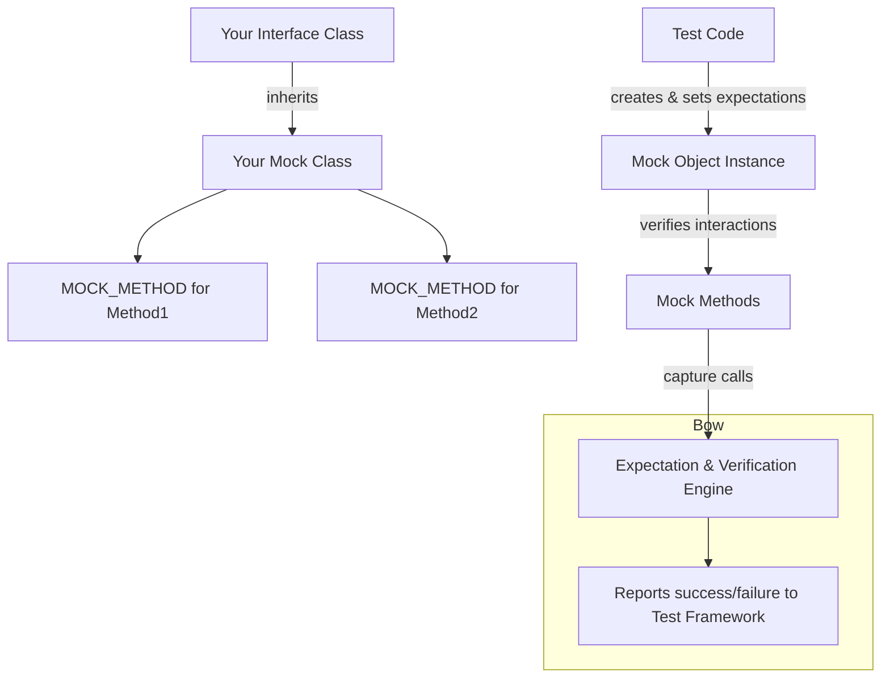

# Mock Object Model

GoogleMock models mock objects using expressive, type-safe macros and templates that allow C++ developers to define mock classes and methods with ease and precision. This page introduces how GoogleMock represents mocks, supports various C++ features in mock definitions, and lays the foundation for behavior verification through expectations.

---

## Introducing Mock Objects

In testing, a **mock object** is a stand-in for a real class or interface implementation. It mimics the real object's interface but lets you programmatically specify how its methods behave and what interactions are expected during test execution. These mock objects enable you to *verify* that the code under test calls its dependencies correctly.

GoogleMock implements this using C++ templates and macros to automatically generate mock methods from your interface declarations.

<Tip>
Mock objects function as both flexible stubs (returning desired values) and disciplined spies (recording and verifying how they were called).
</Tip>

---

## Defining Mock Classes and Methods

### The `MOCK_METHOD` Macro

GoogleMock generates mock methods using the `MOCK_METHOD` macro, which you place inside your mock class definition. Its syntax mirrors normal C++ method declarations but is broken into parts to facilitate macro processing.

```cpp
class MockFoo {
 public:
   MOCK_METHOD(ReturnType, MethodName, (Args...), (Qualifiers));
};
```

- **ReturnType**: The return type of the method.
- **MethodName**: The method's name.
- **(Args...)**: The argument list enclosed in parentheses.
- **(Qualifiers)**: Optional C++ qualifiers such as `const`, `override`, `noexcept`, custom calling conventions (`Calltype(...)`), and reference qualifiers (`ref(&)`).

**Example:**

```cpp
class MockTurtle : public Turtle {
 public:
   MOCK_METHOD(void, PenUp, (), (override));
   MOCK_METHOD(int, GetX, (), (const, override));
};
```

### Handling Types with Commas

Some types like `std::pair<bool, int>` contain commas, which confuse macros. GoogleMock supports two solutions:

1. Wrap the return or argument type with extra parentheses: 

```cpp
MOCK_METHOD((std::pair<bool, int>), GetPair, ());
```

2. Use a `using` alias to simplify the type:

```cpp
using BoolAndInt = std::pair<bool, int>;
MOCK_METHOD(BoolAndInt, GetPair, ());
```

### Visibility Requirement

All `MOCK_METHOD` declarations **must** be placed in the `public:` section of your mock class, regardless of whether the method is `public`, `protected` or `private` in the base class. This ensures that GoogleMock's infrastructure can access the mock methods for setting expectations and behaviors.

### Mocking Overloads

GoogleMock supports mocking overloaded methods directly. Simply declare each overload separately with `MOCK_METHOD` using the matching signature and qualifiers.

If you do not mock all overloads, be wary of hiding base class methods unintentionally - use `using BaseClass::method;` to bring hidden overloads back into scope.

### Mocking Virtual, Non-Virtual, and Template Methods

- **Virtual methods:** GoogleMock mocks virtual methods by overriding them, enabling runtime polymorphism.
- **Non-virtual methods:** You can mock non-virtual methods by defining mock methods with the same signatures, but your code must be templated to accept the mock or real implementation separately, typically chosen at compile time.
- **Templates:** Class templates can be mocked just like regular classes, by templating your mock class accordingly.

### Inability to Mock Free Functions

GoogleMock cannot directly mock free (non-member) or static functions. To mock usage of such functions, encapsulate them inside an interface and mock that interface instead. Alternatively, adapt your code to accept `std::function` objects and use `MockFunction` helpers to mock.

---

## Why GoogleMock Follows the Mock Object Paradigm

Mock objects are about *interaction verification* — confirming not only what a function returns but how the system under test interacts with its dependencies. GoogleMock’s mock object model:

- **Captures method calls dynamically:** enabling expectations on call counts, argument matching, and call order.
- **Separates behavior specification and verification:** users first declare their expectations, then run tests that verify them automatically.

This model encourages writing tests that are both **declarative** in expectation and **precise** in assertion, improving both test quality and expressiveness.

---

## Dynamic Interaction Verification Workflow

1. **Create Mock Objects:** Define and instantiate mocks representing your dependencies.
2. **Set Expectations:** Use `EXPECT_CALL` macros to specify expected methods, argument matchers, call cardinalities, and behaviors.
3. **Exercise Code:** Run the code under test which interacts with mocks.
4. **Automatic Verification:** On destruction, mocks verify all expectations were met, reporting failures immediately.

This seamless model ensures tight coupling between test intent and verification results.

---

## Working with Mock Objects: Summary Examples

### Simple Mock Class Definition

```cpp
class MockTurtle : public Turtle {
 public:
   MOCK_METHOD(void, PenUp, (), (override));
   MOCK_METHOD(void, Forward, (int distance), (override));
   MOCK_METHOD(int, GetX, (), (const, override));
};
```

### Using Mock Strictness Wrappers

You can create mock objects that tune the behavior for uninteresting calls:

- `NiceMock<MockTurtle>` suppresses uninteresting call warnings.
- `NaggyMock<MockTurtle>` is the default, which warns on uninteresting calls.
- `StrictMock<MockTurtle>` treats uninteresting calls as errors.

```cpp
using ::testing::NiceMock;
NiceMock<MockTurtle> turtle;
EXPECT_CALL(turtle, PenUp());
// No warning if other methods are called without expectations.
```

---

## Practical Tips & Best Practices

- Prefer to mock interfaces with virtual methods to ease test maintenance and design clarity.
- When mocking overloaded functions, mock each overload used or bring base overloads into scope to avoid compiler warnings.
- Use `NiceMock` in tests where you want to avoid noise from uninteresting calls, reserving `StrictMock` for high-assurance tests.
- Define aliases for complex types used in mocks to simplify macro usage.
- Place all `MOCK_METHOD` declarations publicly to ensure gMock access.

---

## Troubleshooting Common Pitfalls

- **Unprotected commas in types:** Wrap return/argument types containing commas with parentheses or use type aliases.
- **Access level errors:** Always put `MOCK_METHOD`s in `public:` even if mocking protected/private methods.
- **Overload hiding warnings:** Use `using BaseClass::method` in mocks to expose hidden overloads.
- **Non-virtual functions:** Be aware that mocking non-virtual functions requires separate mock classes and code templating.
- **Missing virtual destructors:** Ensure base interfaces have virtual destructors to avoid leaks or undefined behavior during mock deletion.

---

## Further Learning and References

- Explore the detailed [gMock Cookbook](https://google.github.io/googletest/gmock_cook_book.html) for recipes on advanced mocking.
- Understand the difference between `ON_CALL` and `EXPECT_CALL` for setting default actions and expectations.
- Learn about mock strictness (`NiceMock`, `NaggyMock`, `StrictMock`) in the [Nice, Strict, and Naggy](https://google.github.io/googletest/gmock_cook_book.html#the-nice-the-strict-and-the-naggy) guide.
- Review the [Mock Objects and Methods API](https://google.github.io/googletest/reference/mocking.html#mock_object_api) for syntax and options.

---

For a practical introduction to using mocks in tests, consult the [gMock for Dummies guide](https://google.github.io/googletest/gmock_for_dummies.html).


---

### Mermaid Diagram: Mock Object Model Simplified Overview

