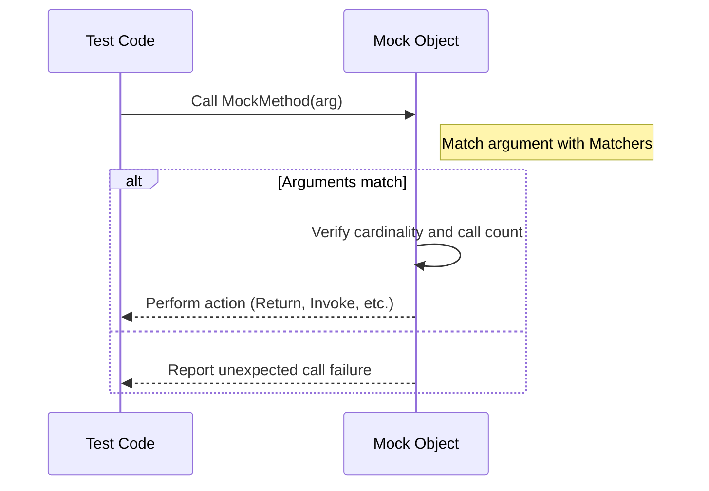

# Matchers, Actions, and Cardinalities

Understanding how to precisely control the behavior and verification of mock objects in GoogleMock begins with mastering matchers, actions, and cardinalities. These concepts empower you to specify exactly what arguments a mock method is expected to receive, what it should do when called, and how many times it can be invoked. This guide breaks down these core ideas, demonstrating how they work together to define your test doubles' behavior.

---

## Matchers: Verifying Argument Values

Matchers are the fundamental mechanism for describing the expected arguments of mocked methods. They enable you to express criteria for which calls will satisfy your expectations beyond just simple equality.

### What Are Matchers?
Matchers are predicates or conditions that test whether an argument to a mock method satisfies a certain property. For example, you can require that an argument equals a specific value, lies within a range, or meets some custom condition.

### Basic Matcher Usage
```cpp
using ::testing::_;             // Matches anything
using ::testing::Eq;            // Exact equality matcher
using ::testing::Gt;            // Greater-than matcher

EXPECT_CALL(mock, Foo(5));             // arg must be exactly 5
EXPECT_CALL(mock, Foo(Eq(5)));          // equivalent to above
EXPECT_CALL(mock, Foo(_));              // accepts any argument
EXPECT_CALL(mock, Foo(Gt(0)));          // arg must be > 0
```

### Combining Matchers
Matchers can be combined for complex conditions:

```cpp
using ::testing::AllOf;
using ::testing::Not;

// Matches a value greater than 5 and less than 10
EXPECT_CALL(mock, Bar(AllOf(Gt(5), Lt(10))));

// Matches an argument that is not equal to 0
EXPECT_CALL(mock, Baz(Not(Eq(0))));
```

### Matching Multiple Arguments as a Tuple
When an expectation needs to involve relationships between multiple arguments, use `.With()` clause with multi-argument matchers:

```cpp
using ::testing::Lt;

EXPECT_CALL(mock, SetRange(_, _))
    .With(Lt());  // first argument < second argument
```

### Custom Matchers
You can define your own matcher to check complex invariants, either with the `MATCHER` family of macros or by implementing the matcher interface directly. This allows matching sophisticated properties of argument values with expressive failure messages.

## Actions: Controlling Mock Method Behavior

Actions define what happens when a mock method is called. While matchers specify _which_ calls are matched, actions specify _what_ the mock does once matched.

### Built-in Actions
- **Return(value)**: Return a fixed value
- **ReturnRef(variable)**: Return a reference to a variable
- **ReturnPointee(pointer)**: Return the value pointed by a pointer at call time
- **DoDefault()**: Perform the default action for the return type
- **Invoke(function/functor/lambda)**: Call a user-provided callable
- **Throw(exception)**: Throw an exception
- **SetArgPointee<N>(value)**: Set the N-th argument (pointer) to value
- **DoAll(actions...)**: Perform multiple actions in sequence

### Setting Actions in Expectations
You can specify actions using `.WillOnce()` and `.WillRepeatedly()`:

```cpp
EXPECT_CALL(mock, Foo(5))
    .WillOnce(Return(42))             // first matched call returns 42
    .WillRepeatedly(Return(99));      // subsequent matched calls return 99
```

If you do not specify an action, GoogleMock uses the **default action** for the return type: for built-in types, typically zero or equivalent.

### Using Lambdas or Callables as Actions
Actions can be user functions that get full access to the method arguments:

```cpp
EXPECT_CALL(mock, Bar(_))
    .WillOnce([](int x) { return x * 10; });
```

### Chaining and Composing Actions
You can combine side effects and return values with `DoAll()`:

```cpp
EXPECT_CALL(mock, Mutate(_))
    .WillOnce(DoAll(SetArgPointee<0>(5), Return(true)));
```

### Default Actions with `ON_CALL`
Set default mock behavior without setting expectations:

```cpp
ON_CALL(mock, Foo(_)).WillByDefault(Return(0));
```

This configures what happens when calls are made to the mock method that do not have explicit expectations.

### Ignoring Results or Adapting Arguments
- Use `IgnoreResult()` to discard a callable's return value when needed.
- Use `WithArgs<N1, N2>(action)` to forward selected arguments to a different action.

## Cardinalities: Setting Invocation Limits

Cardinalities specify how many times a mocked method is expected to be called. They help assert whether the test code interacts with its dependencies as intended in terms of call counts.

### Built-in Cardinalities
| Cardinality        | Meaning                                 |
|--------------------|-----------------------------------------|
| `AnyNumber()`      | The method may be called any number of times.
| `AtLeast(n)`       | Called at least _n_ times.
| `AtMost(n)`        | Called at most _n_ times.
| `Between(m, n)`    | Called between _m_ and _n_ times (inclusive).
| `Exactly(n)`       | Called exactly _n_ times. (0 means never called.)

If `.Times()` is omitted on an `EXPECT_CALL`, gMock infers a sensible default based on presence and quantity of `WillOnce()` and `WillRepeatedly()` clauses.

### Specifying Cardinality
```cpp
EXPECT_CALL(mock, Foo(5))
    .Times(Exactly(3))
    .WillRepeatedly(Return(10));
```

### Multiple Expectations Order and Shadowing
The last matching expectation in declaration order takes precedence. This allows you to define broad catch-all expectations first, and more specific ones later.

### Controlling Cardinality Use in Sequences
When combined with sequences and `.RetiresOnSaturation()`, cardinalities help control call ordering and automatic retiring of expectations when saturated.

## Working Together: Matcher, Action, and Cardinality Example

```cpp
using ::testing::_;
using ::testing::Return;
using ::testing::AtLeast;

// Expect Foo to be called at least twice with any integer greater than 5
EXPECT_CALL(mock, Foo(::testing::Gt(5)))
    .Times(AtLeast(2))
    .WillRepeatedly(Return(42));

// Expect Bar to be called exactly once with argument 10, returning true
EXPECT_CALL(mock, Bar(10))
    .Times(Exactly(1))
    .WillOnce(Return(true));

// By default, Foo returns 0 when called with other arguments
ON_CALL(mock, Foo(_)).WillByDefault(Return(0));
```

This example shows:
- How matchers limit matched calls.
- How actions set return values.
- How cardinalities control invocation frequency.

## Troubleshooting and Best Practices

<AccordionGroup title="Troubleshooting Common Issues">
<Accordion title="Unexpected Call Warnings">
If your test prints 'Uninteresting mock function call' warnings, it means a mock method was called without an `EXPECT_CALL`. Add an `EXPECT_CALL(...).Times(AnyNumber())` or use a `NiceMock` wrapper to suppress these messages.
</Accordion>
<Accordion title="Too Many or Too Few Actions">
gMock warns if you specify too many or too few `WillOnce()` actions compared to the cardinality. Ensure the number of `WillOnce()` matches or is less than the cardinality, and use `WillRepeatedly()` for all subsequent calls.
</Accordion>
<Accordion title="Matcher Side Effects">
Matchers must be pure functions without side effects. Side effects can cause unpredictable test results.
</Accordion>
</AccordionGroup>

<Note>
Use `ON_CALL()` to set default behavior without requiring a call, and `EXPECT_CALL()` to both set behavior and specify call expectations.
</Note>

---

## Visual Overview of Interaction



---

## References and Further Reading

- [gMock Cookbook](docs/gmock_cook_book.md) — Practical recipes for mocking classes, setting expectations, and using matchers.
- [Mocking Reference](docs/reference/mocking.md) — Detailed reference of mocking macros, classes, and methods.
- [gMock Cheat Sheet](docs/gmock_cheat_sheet.md) — Quick reference for common mock constructs.
- [Core Concepts: Nice, Naggy, and Strict Mocks](concepts/mocking-fundamentals/nice-naggy-strict-mocks) — Understanding how mock strictness affects test outcomes.

---

## Summary
This page has given you a comprehensive conceptual foundation on:
- How **matchers** define argument constraints.
- How **actions** specify mock method behavior when called.
- How **cardinalities** control call frequency expectations.

By combining these pieces precisely, you can write expressive, maintainable, and robust tests that thoroughly verify interactions between your code and its dependencies.