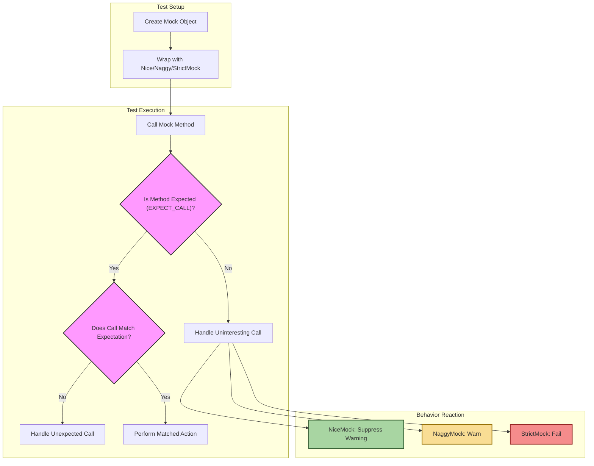

# Controlling Mock Object Behaviors

Learn the principles behind NiceMock, NaggyMock, and StrictMock to manage how a mock object responds to unexpected or uninteresting calls. Understand why these modes exist and how they affect test clarity and failure analysis.

---

## Introduction

When writing tests with GoogleMock, understanding how mocks respond to method calls that are either uninteresting or unexpected is crucial for writing clear, maintainable tests. GoogleMock provides three main behavior modes — NiceMock, NaggyMock, and StrictMock — to help you control how a mock object reacts when it receives such calls.

## Background: Uninteresting vs Unexpected Calls

Before diving into the behavior modes, it is important to clarify two key terms used by GoogleMock:

- **Uninteresting Calls**: Calls to mock methods for which no expectation (`EXPECT_CALL`) has been set. These calls are not explicitly allowed or disallowed by the test.

- **Unexpected Calls**: Calls to mock methods that have one or more expectations, but none of these expectations match the current invocation (either due to arguments mismatch or call count violation).

By default, uninteresting calls trigger warnings to help detect mistakes or missing expectations, but do not cause test failures. Unexpected calls always result in test failures, as they indicate actual deviations from the test’s expected interactions.

## The Behavior Modes

GoogleMock lets you decide the strictness level on a per-mock-object basis through three float-successor templates that wrap your mock class:

### 1. NiceMock<T>

- **Purpose:** Make the mock object *silent* on uninteresting calls.
- **Behavior:** Warnings about uninteresting calls are suppressed.
- **Use Case:** When you want to avoid noise from unrelated calls that are not part of your test’s interest.
- **Example:**

  ```cpp
  using ::testing::NiceMock;

  TEST(...) {
    NiceMock<MockFoo> mock_foo;
    EXPECT_CALL(mock_foo, DoThis());
    /* Calls to other methods will NOT generate warnings */
  }
  ```

- **Notes:**
  - `NiceMock<T>` inherits from `T` and can be used wherever a `T` is expected.
  - The constructor arguments of `T` can be forwarded through `NiceMock<T>`.

### 2. NaggyMock<T> (Default Behavior)

- **Purpose:** Provide *warning* level notifications on uninteresting calls.
- **Behavior:** Prints warnings for uninteresting calls but does not fail the test.
- **Use Case:** While developing tests or debugging, when you want to be notified about unexpected usage without failing immediately.
- **Example:**

  ```cpp
  using ::testing::NaggyMock;

  TEST(...) {
    NaggyMock<MockFoo> mock_foo;
    EXPECT_CALL(mock_foo, DoThis());
    /* Calls to other methods will generate warnings but tests remain green */
  }
  ```

- **Notes:**
  - This is the default mode for mocks unless wrapped explicitly.

### 3. StrictMock<T>

- **Purpose:** Make the mock object *fail* on any uninteresting call.
- **Behavior:** Uninteresting calls cause the test to fail immediately.
- **Use Case:** When you want to enforce precise interaction contracts and catch any unexpected usage.
- **Example:**

  ```cpp
  using ::testing::StrictMock;

  TEST(...) {
    StrictMock<MockFoo> mock_foo;
    EXPECT_CALL(mock_foo, DoThis());
    /* Any call other than DoThis() will cause a test failure */
  }
  ```

- **Notes:**
  - Like `NiceMock`, `StrictMock<T>` inherits from `T`.
  - Helps ensure that the test fully specifies the mock’s interactions.

## Why These Modes Exist

These modes help balance test clarity, strictness, and maintenance burden:

- **NaggyMock** warns you when your mocks receive calls they don’t expect, which might point to a missing expectation or harmless irrelevant calls.
- **NiceMock** quiets these warnings when you care only about some interactions but want to ignore the rest, reducing test noise.
- **StrictMock** tightens correctness and signals immediately if the code under test calls unexpected methods, improving test precision.

GoogleMock encourages:

- Using **NiceMock** most of the time for flexible, robust tests.
- Using **NaggyMock** during test development or debugging.
- Using **StrictMock** sparingly, mainly for enforcing strict contracts in edge cases or critical modules.

## Practical Usage Patterns

Here’s how you can use these modes effectively in your testing workflow:

<Steps>
<Step title="Start with NiceMock">
Use `NiceMock` wrappers to reduce noise and focus on key behaviors.
</Step>
<Step title="Develop with NaggyMock">
Temporarily use `NaggyMock` to catch unexpected calls you might have missed, providing warnings without failing tests.
</Step>
<Step title="Enforce with StrictMock">
Switch to `StrictMock` when you want to lock down interactions to exactly those expected, causing failures if unexpected calls happen.
</Step>
</Steps>

## Important Considerations and Limitations

- **Works only with MOCK_METHOD-defined methods:** Only mock methods defined directly with the `MOCK_METHOD` macro in the mock class will be affected by these wrappers.
- **No support for nesting:** Nesting these wrappers (like `NiceMock<StrictMock<T>>`) is unsupported and may cause incorrect behavior.
- **Virtual destructors recommended:** The mock class should have a virtual destructor for these wrappers to work reliably.
- **Test brittleness:** Strict mocks increase the chance that refactoring code breaks tests without changing behavior, so use them judiciously.

## Example Code Snippet

```cpp
#include <gmock/gmock.h>
using ::testing::NiceMock;
using ::testing::StrictMock;

class MockFoo {
 public:
  MOCK_METHOD(void, DoThis, (), ());
  MOCK_METHOD(void, DoThat, (), ());
};

TEST(MyTest, Example) {
  // Nice mock suppresses warnings on uninteresting calls
  NiceMock<MockFoo> mock_nice;
  EXPECT_CALL(mock_nice, DoThis());

  mock_nice.DoThis();  // OK
  mock_nice.DoThat();  // No warning

  // Strict mock fails on uninteresting calls
  StrictMock<MockFoo> mock_strict;
  EXPECT_CALL(mock_strict, DoThis());

  mock_strict.DoThis();  // OK
  mock_strict.DoThat();  // Test fails here
}
```

## Troubleshooting and Best Practices

<AccordionGroup title="Common Pitfalls and Tips">
<Accordion title="Unexpected Test Failures with StrictMock">
Make sure your expectations cover all possible calls your code will make. Use `StrictMock` only when precise control is necessary, otherwise `NiceMock` provides flexibility.
</Accordion>
<Accordion title="Suppressed Warnings in NiceMock">
If you miss important signals about uninteresting calls, temporarily switch to `NaggyMock` or increase verbosity with `--gmock_verbose=info`.
</Accordion>
<Accordion title="Methods Not Affected by Wrappers">
Only methods directly defined with `MOCK_METHOD` in the mock class will be affected. Ensure your mocks adhere to this.
</Accordion>
</AccordionGroup>

<Tip>
Use the correct wrapper to fit your test goals: suppress uninteresting call noise with NiceMock, get warned when unsure with NaggyMock, and enforce strictness with StrictMock. Wrap your mocks early to promote clarity.
</Tip>

## Summary

Controlling mock object behaviors with `NiceMock`, `NaggyMock`, and `StrictMock` is essential for managing test output verbosity and strictness of behavior verification. These wrappers help balance informative warnings with maintainable tests, letting you tune your mocks' reaction to uninteresting calls without affecting unexpected calls. Incorporate these modes thoughtfully to improve test robustness and clarity.

---

## Additional Resources

- [gMock Cookbook — The Nice, the Strict, and the Naggy](https://google.github.io/googletest/gmock_cook_book.html#NiceStrictNaggy) 
- [Mocking Reference — NiceMock, NaggyMock, StrictMock](https://google.github.io/googletest/reference/mocking.html#NiceMock) 
- [gMock Cheat Sheet — Mock Class Behavior Modes](https://google.github.io/googletest/gmock_cheat_sheet.html#mock-class-behavior-modes) 
- [gMock for Dummies](https://google.github.io/googletest/gmock_for_dummies.html) 

---

## Conceptual Interaction Diagram


