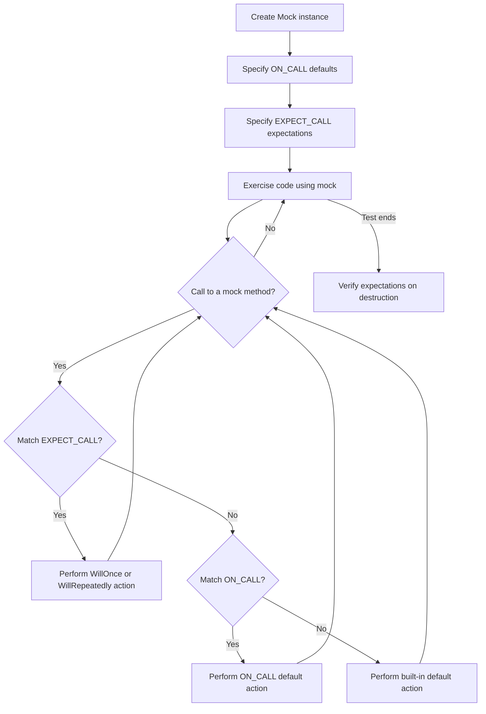

# The GoogleMock Mocking Model

Welcome to an in-depth conceptual exploration of how GoogleMock structures its mocking model. This page uncovers the foundational mental model that governs mock objects — how mocks are created, how expectations are specified and enforced, and the underlying philosophy that empowers isolated, effective unit testing.

Whether you’re a new user learning the ropes or a seasoned test engineer looking to deepen your mastery, this conceptual guide will help you understand the core principles of mocking with GoogleMock through relatable user flows and practical examples.

---

## Understanding Mock Objects

At its core, a **mock object** in GoogleMock is a controllable substitute for a real object, implementing the same interface. The primary goal of a mock object is to allow you to **specify and verify how that object is expected to be used** by the system under test.

### Defining Mocks

Mocks are typically created by inheriting from an existing interface or base class and using the `MOCK_METHOD` macro to declare mock methods. These mock methods replace the real implementations with runtime-interceptable functions.

#### Example: Defining a Simple Mock

```cpp
#include <gmock/gmock.h>

class Turtle {
 public:
  virtual ~Turtle() {}
  virtual void PenUp() = 0;
  virtual void Forward(int distance) = 0;
};

class MockTurtle : public Turtle {
 public:
  MOCK_METHOD(void, PenUp, (), (override));
  MOCK_METHOD(void, Forward, (int distance), (override));
};
```

Here, `MockTurtle` can be used to capture and control calls to `PenUp()` and `Forward()` methods.

---

## Setting Expectations and Behaviors

Mocking isn’t just about replacing code — it’s about specifying *how* and *when* the mocks will be used.

GoogleMock achieves this by allowing you to declare **expectations** using `EXPECT_CALL` and default behaviors using `ON_CALL`. These two macro-driven building blocks underpin the mocking model.

### The Role of EXPECT_CALL

`EXPECT_CALL(mock_object, Method(args))` sets an **expectation** that the method will be called with matching arguments. You can chain modifiers to specify:

- How many times the call is expected (`Times()`)
- The order of calls (`InSequence()`, `After()`)
- What the call should do (`WillOnce()`, `WillRepeatedly()`)

This is about **verifying interactions**, ensuring that the system invokes its dependencies exactly as intended.

### The Role of ON_CALL

`ON_CALL(mock_object, Method(args))` specifies the **default behavior** of a method, allowing the mock to respond sensibly if a method is called but not explicitly expected.

This separates **behavior definition** from **verification**, fostering clearer and more maintainable tests.

### User Flow: Specifying and Using a Mock

1. **Create Mock Object:** Instantiate your mock, e.g., `MockTurtle turtle;`
2. **Specify Default Behavior:** Use `ON_CALL(turtle, Forward(_)).WillByDefault(Return());` to specify default behavior for uninteresting calls.
3. **Set Expectations:** Use `EXPECT_CALL(turtle, PenUp()).Times(1);` to expect a call.
4. **Exercise Your Code:** Run your test subject interacting with the mock.
5. **Verification:** On destructor or explicitly, GoogleMock verifies all expectations.

If the calls don’t match expectations, test failures with clear diagnostics occur immediately.

---

## Handling Call Strictness: Nice, Naggy, and Strict Mocks

Not every mock scenario requires the same call strictness. GoogleMock offers three decorators that control the **severity** with which uninteresting calls (calls with no expectations) are handled:

- **NiceMock<T>**: Suppresses warnings on uninteresting calls.
- **NaggyMock<T>** (default behavior): Warns on uninteresting calls but allows them.
- **StrictMock<T>**: Treats uninteresting calls as test errors.

### Why Strictness Matters

- **Uninteresting calls** are calls to mock methods that have no `EXPECT_CALL` therefore no explicit expectations.
- By default, these calls cause warnings but do not fail tests.
- **StrictMock** helps catch unintended calls early by turning these warnings into errors.

### Usage Example

```cpp
using ::testing::NiceMock;
using ::testing::StrictMock;

// NiceMock example
NiceMock<MockTurtle> nice_turtle;
EXPECT_CALL(nice_turtle, PenUp());
// Calls to other uninteresting methods won't trigger warnings.

// StrictMock example
StrictMock<MockTurtle> strict_turtle;
EXPECT_CALL(strict_turtle, PenUp());
// Any other unexpected method calls will cause test failures.
```

### Important Considerations

- `NiceMock` and `StrictMock` work only with mock methods defined using the `MOCK_METHOD` macro **directly** in the mock class.
- Nesting these wrappers (e.g., `NiceMock<StrictMock<T>>`) is *not supported*.
- These wrappers inherit constructors, so mocks can be instantiated with constructor arguments transparently.

---

## Expectation Ordering and Sequences

GoogleMock provides constructs to control **the order of expected calls**, making tests more precise and meaningful.

### Unordered Calls (Default)

Expectations can match calls in any order by default to reduce brittleness.

### Ordered Calls with `InSequence`

Using the `InSequence` helper, you can group expectations to require calls in the specified order.

```cpp
using ::testing::InSequence;
{
  InSequence seq;
  EXPECT_CALL(turtle, PenDown());
  EXPECT_CALL(turtle, Forward(100));
  EXPECT_CALL(turtle, PenUp());
}
```

### Partial Ordering with `After`

For more complex dependencies, you can specify that one expectation should only happen after certain other expectations have been satisfied.

### Sequences and Combining

Expectations can belong to multiple sequences.
Sequences effectively create a Directed Acyclic Graph (DAG) of call dependencies.

---

## Matching Arguments: What Calls Are We Looking For?

Matchers enable flexible and precise control over which calls satisfy expectations.

### Basic Matching

- Use values to require exact matches.
- Use `_` (underscore) as a wildcard matcher to accept any argument.

### Advanced Matching

- Compose matchers for ranges, predicates, and container checks.
- Use `.With()` clause to match arguments as a whole tuple.

### Overloaded Methods

For overloaded methods, specify the exact overload by providing matchers or using helper functions like `Const()`.

---

## Actions: Specifying What Mocks Should Do

Besides verifying calls, mocks can perform actions such as returning values, invoking functions, or modifying output parameters.

### Built-in Actions

- `Return(value)`: returns a constant value.
- `ReturnRef(variable)`: returns a reference.
- `SetArgPointee<N>(value)`: sets the Nth pointer argument’s pointee.
- `Invoke(function)`: calls an actual function.

### Chaining and Combining

`DoAll()` can combine multiple actions to run sequentially.

### Custom Actions

Actions can be user-defined using lambdas or function objects compatible with the mock method signature.

---

## Common Pitfalls and Best Practices

- **Set expectations before calling mocks:** GoogleMock expects `EXPECT_CALL` statements before the calls.
- **Avoid over-specifying expectations:** Use `ON_CALL` to set default behavior and sparse `EXPECT_CALL` to verify important interactions.
- **Use sequences judiciously** to keep tests maintainable and expressive.
- **Use `NiceMock` for general tests, `StrictMock` for tight control:** This approach balances test robustness and failure sensitivity.

---

## Troubleshooting Mock Calls and Failures

GoogleMock provides detailed, actionable failure messages when:

- Calls are unexpected or arguments don’t match.
- A function is called more or fewer times than expected.
- Calls happen out of sequence.

Set the flag `--gmock_verbose=info` to get detailed traces of mock calls, matchers, and expectation matches to diagnose complexity.

---

## Summary Diagram: Mocking Flow



---

## Further Resources

- [gMock Cookbook](https://github.com/google/googletest/blob/main/docs/gmock_cook_book.md): Practical recipes and examples.
- [Mocking Reference](https://github.com/google/googletest/blob/main/docs/reference/mocking.md): Official API and detailed usage.
- [Managing Mock Strictness](https://github.com/google/googletest/blob/main/guides/mocking-advanced-testing/strictness-niceness.md): Understanding nice, naggy, and strict mocks.
- [Matchers Reference](https://github.com/google/googletest/blob/main/docs/api-reference/advanced-mocking-matchers-actions/matchers-reference.md): Guide to matchers and custom extensions.

---

By mastering these concepts, you will harness GoogleMock’s power to write clear, maintainable, and robust tests that precisely verify the interactions of your code’s components.

---