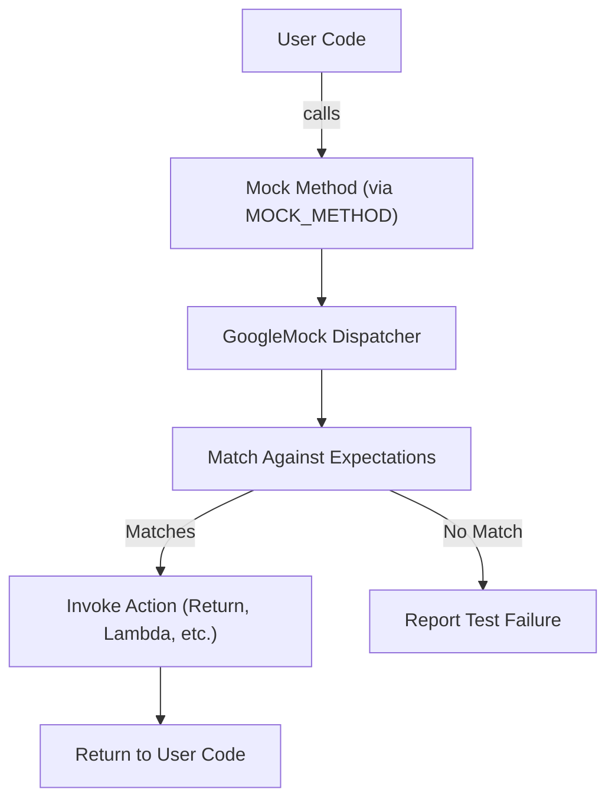

# Mock Object Model

Understand the fundamentals of mock objects in GoogleTest, including how interfaces are mocked, the specification of method expectations, and the role of `MOCK_METHOD` macros in achieving compile-time correctness and expressive test behavior.

---

## Introduction to Mock Objects

A **mock object** replicates the interface of a real object in your C++ code but allows you to predefine expected interactions and behaviors dynamically in tests. These expectations include how many times methods are called, with which arguments, and what behaviors they produce.

GoogleTest facilitates creating mock objects through declarative macros that automatically generate necessary code, enabling precise control over your testing interactions with dependencies.

---

## Defining Mock Methods with `MOCK_METHOD`

The cornerstone of GoogleTest's mock object model for methods is the `MOCK_METHOD` macro. This macro generates a mock method that precisely matches the original interface method — including its return type, name, arguments, and qualifiers — while integrating seamlessly with GoogleTest's expectation and verification system.

### Syntax and Parameters

```cpp
MOCK_METHOD(ReturnType, MethodName, (Args...), (Specifiers...));
```

- **ReturnType**: The return type of the method being mocked.
- **MethodName**: The identifier of the method.
- **Args**: The parameter list enclosed in parentheses, e.g. `(int, const std::string&)`.
- **Specifiers** (optional): A comma-separated list of qualifiers enclosed in parentheses such as `const`, `override`, `noexcept`, `Calltype(...)`, and `ref(&)`. For example, `(const, override)`.

### Usage Guidelines

- Always place `MOCK_METHOD` declarations **in the public section** of your mock class — even if mocking protected or private base methods. This is required so that `EXPECT_CALL` and `ON_CALL` can access the mock methods.

- To mock **const** methods, include `(const)` or `(const, override)` as the last parameter.

- Commas within types (like `std::pair<int, double>`) must be wrapped with extra parentheses or replaced with type aliases to prevent parsing ambiguity.

### Example

```cpp
class MockWidget : public WidgetInterface {
 public:
  MOCK_METHOD(int, GetSize, (), (const, override));
  MOCK_METHOD(void, SetName, (const std::string& name), (override));
  MOCK_METHOD((std::pair<int, int>), GetCoordinates, ());  // Parentheses wrap return type with commas

  // Using type alias to avoid wrapping
  using IntPair = std::pair<int, int>;
  MOCK_METHOD(IntPair, GetBackupCoordinates, ());
};
```

This example shows how to mock an interface with const and non-const methods as well as methods returning types that internally contain commas.

---

## How `MOCK_METHOD` Works for You

- Automatically **generates method implementations** that integrate with GoogleTest's mock system.

- Enforces at **compile-time that your mock method signatures are valid** and match the original interface.

- Provides **helper methods** named `gmock_MethodName` and proxy methods, enabling GoogleTest to intercept calls and apply expectations.

- Supports modifiers that match your original method's qualifiers, such as `const`, `override`, `noexcept`, custom calling conventions (`Calltype`), and reference qualifiers (`ref(&)`, `ref(&&)`).

### Benefits of Compile-time Checking

The macro system statically verifies:

- Proper signature formatting.
- Enclosure of argument lists in parentheses.
- Validity of specifiers.

If you misuse the macro (e.g., improper argument parentheses or invalid specifiers), the compiler will emit clear messages guiding you towards a valid mock method declaration.

---

## Specifiers and Their Meanings

| Specifier               | Purpose                                                                                  |
|------------------------|------------------------------------------------------------------------------------------|
| `const`                | Marks the mock method as const, matching const-qualified methods.                        |
| `override`             | Informs the compiler that the mocked method overrides a virtual method from base class. |
| `final`                | Marks the method as final to prevent further overriding.                                |
| `noexcept`             | Marks the method with `noexcept` specifier.                                             |
| `Calltype(...)`        | Sets the calling convention, e.g., `Calltype(STDMETHODCALLTYPE)`, useful on Windows.     |
| `ref(&)` or `ref(&&)`  | Marks the method with lvalue or rvalue reference qualifiers, matching original methods. |

> **Note:** The order of specifiers inside parentheses is flexible but each specifier must be valid and appear only once.

---

## Mocking Overloaded and Template Methods

GoogleTest's `MOCK_METHOD` supports mocking overloaded and templated methods naturally:

- **Overloaded methods** are mocked by specifying the exact signature in each mock method.

- **Template classes** can be mocked similarly; just place `MOCK_METHOD` declarations in the mock class template.

Example:

```cpp
template <typename T>
class Stack {
 public:
  virtual ~Stack() {}
  virtual void Push(const T& item) = 0;
  virtual T Pop() = 0;
};

template <typename T>
class MockStack : public Stack<T> {
 public:
  MOCK_METHOD(void, Push, (const T& item), (override));
  MOCK_METHOD(T, Pop, (), (override));
};
```

You can mock overloaded methods the same way:

```cpp
class Foo {
 public:
  virtual int Add(int x) = 0;
  virtual int Add(int x, int y) = 0;
  virtual const Bar& GetBar() const = 0;
  virtual Bar& GetBar() = 0;
};

class MockFoo : public Foo {
 public:
  MOCK_METHOD(int, Add, (int x), (override));
  MOCK_METHOD(int, Add, (int x, int y), (override));
  MOCK_METHOD(const Bar&, GetBar, (), (const, override));
  MOCK_METHOD(Bar&, GetBar, (), (override));
};
```

> If mocking only some overloads, bring others into scope with `using` to avoid hiding warnings.

---

## Understanding Mock Invocation and Expectations

When your test calls a mock method, GoogleTest intercepts the call and checks it against your **expectations**:

- You specify expected calls using `EXPECT_CALL` with argument matchers.

- You can define **default behaviors** for methods using `ON_CALL`.

- The mock methods created by `MOCK_METHOD` forward calls to GoogleTest’s internal dispatcher, which verifies expectations, tracks call counts, and executes prescribed actions.

- If a call does not meet any expectation:
  - It may be an **uninteresting call** (no expectation) and trigger a warning or failure based on the mock's strictness.
  - Or an **unexpected call** (no matching expectation found) producing test failures.

---

## Strictness Modifiers: NiceMock, NaggyMock, StrictMock

By default, mock objects are *naggy* — they warn on uninteresting calls. GoogleTest offers wrappers for fine control:

| Modifier               | Behavior on Uninteresting Calls                                               |
|------------------------|------------------------------------------------------------------------------|
| `NiceMock<T>`          | Suppresses warnings on uninteresting calls.                                 |
| `NaggyMock<T>`         | Default; warns on uninteresting calls.                                      |
| `StrictMock<T>`        | Treats uninteresting calls as test failures.                                |

Example usage:

```cpp
using ::testing::NiceMock;

NiceMock<MockFoo> nice_foo;
EXPECT_CALL(nice_foo, DoSomething());
// No warnings for other method calls.
```

These wrappers inherit constructors from the base mock class, so you can instantiate them the same way.

---

## Common Pitfalls and Tips

- **Put mocks in public section:** `MOCK_METHOD` declarations must always be public even if mocking protected/private methods.

- **Wrap comma-containing types:** Wrap any return or argument type containing commas with parentheses or define a type alias.

- **Override all overloads you intend to mock:** To avoid compiler warnings about hiding base overloads.

- **Specify specifiers carefully:** Incorrect specifiers or missing parentheses cause compilation failures.

- **Always set expectations before code execution:** Calling a mock method before setting its expectations or default actions results in undefined behavior.

- **Use strictness wrappers cautiously:** Strict mocks lead to brittle tests that may break during unrelated refactoring. Use nice mocks for maintainable tests.

- **Use sequences and `RetiresOnSaturation()` to handle ordered calls:** To enforce call order and retiring expectations after being used.

---

## Summary Diagram of Mock Object Call Flow



---

## Further Learning and Next Steps

To deepen your understanding and practical skills in using mocks with GoogleTest, explore:

- [Defining and Using Mocks](../api-reference/mocking-apis/defining-mocks.md): Detailed API guide on creating mock classes and setting expectations.
- [Actions & Behavioral Specification](../concepts/mocking-isolation/actions-behaviors.md): How to define behaviors and side effects of mocked methods.
- [Call Expectations, Cardinality, and Strictness](../concepts/mocking-isolation/call-counting-strictness.md): Managing call counts and strictness modes.
- [gMock for Dummies](../guides/gmock_for_dummies.md): Beginner-friendly tutorial with examples.
- [Using Assertions Effectively](../guides/getting-started/using-assertions.mdx): How to assert test results when using mocks.


---