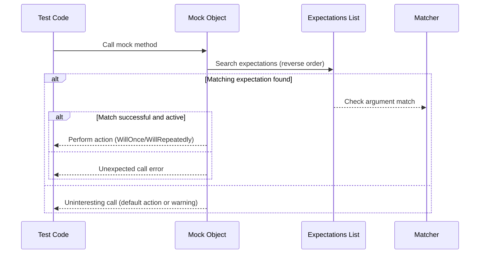

# Matchers and Expectations Model

Understand the matcher system used to define expected arguments and return values, including core, polymorphic, and custom matchers. Learn how expectations are set, verified, and the role of matchers in expressive, maintainable test code.

---

## Introduction to Matchers and Expectations

When writing tests with GoogleMock, the power to specify exactly what arguments you expect a mock method to receive, and what it should return or do, comes from the matchers and expectations model. This model makes your tests precise, readable, and resilient.

Matchers act as expressive predicates describing constraints on function arguments, while expectations declare how often and in what order particular mock methods should be called.

## Matchers: Defining Expected Arguments

### What Are Matchers?

Matchers are objects that test whether an argument passed to a mock method satisfies certain conditions. They behave like predicates but also provide descriptive failure messages, enhancing test diagnostics.

### Using Built-In Matchers

GoogleMock provides a rich set of built-in matchers that cover common use cases:

- **Wildcard matcher**: `_` matches any argument.
- **Equality matchers**: `Eq(value)` matches if argument equals `value`.
- **Comparison matchers**: `Ge(value)`, `Lt(value)`, etc., for numeric comparisons.
- **String matchers**: `HasSubstr(substring)`, `StartsWith(prefix)`, etc.
- **Container matchers**: `ElementsAre(...)`, `UnorderedElementsAre(...)`.
- **Pointer matchers**: `NotNull()`, `IsNull()`, `Pointee(matcher)`.

### Custom and Composite Matchers

You can create your own matchers to express domain-specific checks:

- Use `MATCHER` and `MATCHER_P` macros for quick custom matchers.
- Implement matcher classes for more complex or reusable predicates.
- Combine matchers using logical combinators like `AllOf()`, `AnyOf()`, and `Not()`.

Example custom matcher:

```cpp
MATCHER(IsDivisibleBy7, "") { return (arg % 7) == 0; }
EXPECT_CALL(mock_obj, Foo(IsDivisibleBy7()));
```

### Polymorphic vs. Monomorphic Matchers

- **Monomorphic matchers** only match arguments of a specific type.
- **Polymorphic matchers** can match arguments of multiple types, adapting to the context.

GoogleMock supports defining polymorphic matchers that work for any compatible argument type, enhancing matcher flexibility.

## Setting Expectations: Specifying Call Behavior

Expectations define the execution contract for mock methods—how often they should be called, with what arguments, in what order, and what they should do.

### Defining Expectations with `EXPECT_CALL`

Use the `EXPECT_CALL` macro to specify an expectation on a mock method:

```cpp
EXPECT_CALL(mock_object, Method(matcher1, matcher2, ...))
    .Times(cardinality)
    .InSequence(seq1, seq2)
    .After(other_expectation)
    .WillOnce(action)
    .WillRepeatedly(action)
    .RetiresOnSaturation();
```

- **Matchers** specify which argument values the expectation is for.
- **Cardinality** (`Times()`) specifies how many times the call is expected.
- **InSequence()** and **After()** specify ordering constraints.
- **WillOnce() / WillRepeatedly()** specify actions the mock should perform when called.
- **RetiresOnSaturation()** retires an expectation after reaching its call count, allowing fallback expectations.

### Default Cardinality Inference

If you omit `.Times()`, GoogleMock infers it based on `.WillOnce()` and `.WillRepeatedly()` clauses:

- No `.WillOnce()` or `.WillRepeatedly()`: calls expected once.
- `n` `.WillOnce()` clauses, no `.WillRepeatedly()`: expect exactly `n` calls.
- `n` `.WillOnce()` clauses and a `.WillRepeatedly()`: expect at least `n` calls.

### Ordering Expectations

GoogleMock allows specifying strict or partial call sequences:

- **`InSequence` object**: all expectations in its scope must occur in order.
- **`.InSequence()` clause**: attach one or more `Sequence` objects to expectations for partial order DAGs.
- **`.After()` clause**: specify that a call should happen after certain expectations.

Example using `InSequence`:

```cpp
{
  InSequence seq;
  EXPECT_CALL(mock, Initialize()).Times(1);
  EXPECT_CALL(mock, Start()).Times(1);
}
```

### Multiple Expectations on The Same Method

GoogleMock matches calls against expectations in reverse order of declaration, so newer expectations take precedence. This supports overriding default expectations with more specific ones.

### Using `.With()` for Multi-Argument Matching

The `.With()` clause lets you apply a matcher over the entire argument tuple, enabling conditions on multiple arguments together:

```cpp
EXPECT_CALL(mock, SetPosition(_, _))
    .With(Lt());  // First argument less than second
```

## Actions: What Should the Mock Do?

Specifying the behavior of mock method calls lets you simulate real object responses or control test flow.

- **Default actions** return default values or do nothing.
- Customize behavior with `.WillOnce(action)` and `.WillRepeatedly(action)`.
- Actions can return values, set output parameters, invoke callables, or perform side effects.

Example:

```cpp
EXPECT_CALL(mock, GetValue())
    .WillOnce(Return(42))
    .WillRepeatedly(Return(0));
```

## Best Practices

- Use matchers minimally to avoid over-specification and brittle tests.
- Prefer `ON_CALL` to set default behavior, reserving `EXPECT_CALL` for calls you want to verify.
- Take advantage of sequences (`InSequence`, `After`) for ordered call verification.
- Use catch-all expectations (`_` matcher with `Times(AnyNumber())`) to accept other inputs without failures.
- Use `RetiresOnSaturation()` to avoid expectation saturation errors when expectations overlap.

## Troubleshooting Common Issues

- If an expectation is never satisfied, verify matchers and execution flow.
- Use `--gmock_verbose=info` to get detailed logs of matching decisions and call traces.
- Remember to set expectations before exercising mocks; undefined behavior results otherwise.
- Avoid setting expectations after a mock has been used for calls.

## Summary

Matchers and expectations enable expressive and precise mock definitions, enhancing test clarity and robustness. By understanding how to use matchers for argument validation and expectations for call constraints, you can write maintainable, meaningful unit tests that verify both state and interaction effectively.

---

## Additional Resources

- [gMock for Dummies](https://google.github.io/googletest/gmock_for_dummies.html) — Beginner-friendly introduction to mocks and matchers.
- [Matchers Reference](reference/matchers.md) — Full list of built-in matchers.
- [Mocking Reference](docs/reference/mocking.md) — Detailed API and behavior of mocks.
- [gMock Cookbook](https://google.github.io/googletest/gmock_cook_book.html) — Recipes for advanced mocking techniques.
- [Expectations documentation](reference/mocking.md#EXPECT_CALL) — In-depth perspective on `EXPECT_CALL` and clauses.

---

## Example: Using Matchers and Expectations Together

```cpp
#include <gmock/gmock.h>
using ::testing::_;
using ::testing::Return;
using ::testing::Sequence;

class MockTurtle : public Turtle {
 public:
  MOCK_METHOD(void, PenDown, (), (override));
  MOCK_METHOD(void, Forward, (int distance), (override));
  MOCK_METHOD(int, GetX, (), (const, override));
};

TEST(DrawingTest, DrawsLine) {
  MockTurtle turtle;
  Sequence seq;

  EXPECT_CALL(turtle, PenDown()).InSequence(seq);
  EXPECT_CALL(turtle, Forward(100)).InSequence(seq);
  EXPECT_CALL(turtle, GetX()).WillRepeatedly(Return(10));

  DrawLine(&turtle, 100);
}
```

In this example, expectations ensure calls happen in order with matched arguments.

---

## Glossary

| Term          | Description                                     |
|---------------|------------------------------------------------|
| Matcher       | An object that checks if an argument matches expected criteria. |
| Expectation   | A declaration of an expected mock method call with constraints on arguments, call count, and order. |
| Cardinality   | The number or range of expected calls (`Times()`). |
| Action        | The behavior a mock method performs when called (e.g., return a value, invoke a function). |
| Sequence      | An ordering constraint grouping multiple expectations. |
| Polymorphic Matcher | A matcher usable with multiple argument types, adapting to context. |

---

## How This Fits Into GoogleTest Documentation

This guide dives deep into the matcher and expectation model, complementing:

- The [Basic Mocking Guide](../guides/getting-started/basic-mocking.md) which helps define mocks.
- The [Mocking Fundamentals](../concepts/mocking-matchers-actions/mocking-primitives.md) page covering mocking design.
- The [Setting Expectations and Actions](../api-reference/mocking-api/setting-expectations-actions.md) API reference for detailed usage patterns.

For advanced test flows, please see the [Advanced Assertions and Matchers](../guides/core-test-workflows/advanced-assertions-matchers.md).

---

## Mermaid Diagram: Expectation Matching Flow


