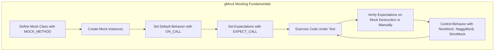

# Mocking Fundamentals and Class Design

GoogleMock (gMock) is a powerful framework designed to facilitate writing mock classes in C++. Understanding how to construct mock classes, define mocked methods, and control mock behavior is essential for effective usage. This guide explores the principles behind C++ mocking with GoogleMock, explaining mock class design, method mocking conventions, and behavioral tuning through NiceMock, NaggyMock, and StrictMock wrappers.

---

## Defining Mock Classes: The Building Blocks of Mocking

Mock classes act as stand-ins for real classes, implementing the same interfaces but allowing you to specify expectations and behaviors at runtime. To define a mock class:

- Derive your mock class from the base class or interface you want to mock.
- Use the `MOCK_METHOD` macro inside the `public:` section of your mock class to declare mock methods.

### The `MOCK_METHOD` Macro

Syntax:

```cpp
MOCK_METHOD(ReturnType, MethodName, (Args...), (Qualifiers));
```

- **ReturnType:** The return type of the method.
- **MethodName:** The name of the method to mock.
- **Args:** The comma-separated list of argument types and names enclosed in parentheses.
- **Qualifiers:** Optional list of method qualifiers such as `(const, override)`, `(noexcept)`, `Calltype(...)`, or `ref(...)`.

### Examples

```cpp
class Turtle {
 public:
  virtual ~Turtle() {}
  virtual void PenUp() = 0;
  virtual void PenDown() = 0;
  virtual void Forward(int distance) = 0;
  virtual int GetX() const = 0;
  virtual int GetY() const = 0;
};

class MockTurtle : public Turtle {
 public:
  MOCK_METHOD(void, PenUp, (), (override));
  MOCK_METHOD(void, PenDown, (), (override));
  MOCK_METHOD(void, Forward, (int distance), (override));
  MOCK_METHOD(int, GetX, (), (const, override));
  MOCK_METHOD(int, GetY, (), (const, override));
};
```

### Handling Complex Signatures

- Wrap return or argument types containing commas in extra parentheses or use type aliases to avoid macro parsing issues.

```cpp
using BoolAndInt = std::pair<bool, int>;
MOCK_METHOD((BoolAndInt), GetPair, ());
```

### Mocking Overloads and Const Methods

For overloaded methods or const-qualified methods, specify all versions you want to mock:

```cpp
MOCK_METHOD(int, Add, (int x), (override));
MOCK_METHOD(int, Add, (Element x), (override));
MOCK_METHOD(const Bar&, GetBar, (), (const, override));
``` 

If you don’t mock all overloads, use `using` to bring in the base class methods to avoid hiding them.

### Mocking Virtual Destructors

Ensure your base class has a virtual destructor. Without it, destruction through base pointers will be unsafe and can cause resource leaks.

---

## Mocking Method Behavior and Expectations

### Expectations with `EXPECT_CALL`

The core of gMock’s power lies in setting expectations on how your mocks should behave and be interacted with.

Basic syntax:

```cpp
EXPECT_CALL(mock_object, Method(arg_matchers))
    .Times(cardinality)
    .WillOnce(action)
    .WillRepeatedly(action);
```

- **arg_matchers:** Specify what arguments you expect, using matchers like `_` (wildcard), `Eq(value)`, or predicates.
- **Times:** How many times the call is expected.
- **Actions:** What the call does when invoked - return values, side-effects, or custom behaviors.

### Default Actions with `ON_CALL`

Use `ON_CALL` to set default behaviors without asserting calls must happen:

```cpp
ON_CALL(mock_object, Method(_))
    .WillByDefault(Return(default_value));
```

This is commonly set in test setup code, allowing tests to only specify new behaviors where relevant.

### Cardinalities with `.Times()`

Built-in cardinalities include:

- `Times(1)`: Exactly once
- `Times(AnyNumber())`: Any number
- `Times(AtLeast(n))`, `Times(AtMost(n))`
- `Times(Between(m, n))`

If omitted, `Times` is inferred from the presence of `WillOnce()`/`WillRepeatedly()` clauses.

### Sequencing Calls

Use the `InSequence` block or `.InSequence()` expectation clause to enforce call order:

```cpp
{
  InSequence seq;
  EXPECT_CALL(mock, First());
  EXPECT_CALL(mock, Second());
}
```

Or specify partial order using multiple sequences or `.After()` clauses.

### Sticky Expectations and Retiring

Expectations stay active (“sticky”) by default, even if saturated. To retire them (make inactive) after saturation, use `.RetiresOnSaturation()`.

This is important when you want to allow fallback matchers after some specific calls.

---

## Behavioral Modes: NiceMock, NaggyMock, and StrictMock

GoogleMock provides special wrappers to adjust how mocks react to calls without expectations (called *uninteresting calls*).

| Wrapper      | Behavior on uninteresting calls                   | Typical Use Cases                   |
|--------------|--------------------------------------------------|-----------------------------------|
| **NiceMock** | Suppresses warnings for uninteresting calls.     | When you want to ignore irrelevant calls gracefully. |
| **NaggyMock** | Warns about uninteresting calls (default).       | Default behavior during development, helps detect missed expectations. |
| **StrictMock** | Fails test when uninteresting calls happen.     | Enforce strict call patterns for very precise tests. |

### How to Use

```cpp
using ::testing::NiceMock;
using ::testing::StrictMock;

NiceMock<MockFoo> nice_foo;      // Warnings suppressed
StrictMock<MockFoo> strict_foo;  // Unexpected calls cause failures
```

### Important Notes

- These wrappers only affect *uninteresting* calls, not *unexpected* calls (calls that don’t match any *set* expectation).
- They only work for methods mocked directly in the mock class with `MOCK_METHOD`.
- If the mocked class lacks a virtual destructor, some behaviors may be unpredictable.

---

## Practical Tips and Common Pitfalls

### Always Put MOCK_METHOD in Public Section

Even if the base method is private or protected, `MOCK_METHOD` declarations should be public for gMock to access them.

### Use ON_CALL for Default Behavior, EXPECT_CALL for Verification

- Prefer `ON_CALL` to specify common default-actions.
- Use `EXPECT_CALL` only when you want to verify the call happens.
- Overusing `EXPECT_CALL` can lead to brittle tests.

### Mock Virtual Destructors

Make sure the base class destructor is virtual to avoid resource leaks or incomplete destruction.

### Avoid Mocking Variadic Functions

gMock cannot mock variadic functions directly; instead, overload with fixed parameter versions.

### Dealing with Move-Only Types

`MOCK_METHOD` supports move-only types (e.g., `std::unique_ptr`) naturally. Use lambdas or `Return(std::move(...))` carefully to avoid double-move issues.

### Debugging Expectation Failures

- Increase verbosity with `--gmock_verbose=info` to trace calls and matched expectations.
- Use `Mock::VerifyAndClearExpectations()` to force verification before object destruction.

### Avoid Order-Dependent Spec Bugs

Set expectations before exercising your mocks—setting them after calls will lead to undefined behaviors.

### Using `NiceMock` to Silence Noisy Tests

If your test generates too many uninteresting call warnings, wrap your mock in `NiceMock` rather than suppressing warnings manually.

---

## Illustrative User Workflow

1. **Define your mock class:** Derive from the interface and declare mock methods with `MOCK_METHOD`.
2. **Create mock instances:** In your test setup or test case.
3. **Set common mock behavior:** Use `ON_CALL` in setup for default behavior.
4. **Set expectations:** Use `EXPECT_CALL` with appropriate matchers, cardinalities, and actions.
5. **Exercise your code:** Run code that interacts with your mocks.
6. **Verification:** gMock automatically verifies expectations when mock objects are destructed; optionally verify earlier.

---

## Summary

GoogleMock fosters robust, maintainable C++ testing by providing expressive mock classes and method behavior control. By understanding mocking fundamentals, using `MOCK_METHOD` to define mocks, appropriately configuring expectations with `EXPECT_CALL` and `ON_CALL`, and leveraging mock strictness wrappers, users can finely tune test robustness and diagnostics. This guide equips you to create precise mocks that reflect real-world interaction scenarios and avoid common pitfalls.

---

## Further Resources

- [gMock Cookbook](https://google.github.io/googletest/gmock_cook_book.html) — Practical recipes to master mocking.
- [Mocking Reference](https://google.github.io/googletest/reference/mocking.html) — Detailed API reference on mocking.
- [gMock Cheat Sheet](https://google.github.io/googletest/gmock_cheat_sheet.html) — Quick syntax and usage guide.
- [GoogleMock README](googlemock/README.md) — Overview and introduction to GoogleMock.

---

## See Also

- Concepts Guide: [Matchers and Expectations Model](../concepts/mocking-matchers-actions/matchers-and-expectations.md)
- API Reference: [Defining Mocks and Mocked Methods](../api-reference/mocking-api/defining-mocks-and-methods.md)
- API Reference: [Setting Expectations and Configuring Actions](../api-reference/mocking-api/setting-expectations-actions.md)
- Guides: [Basic Mocking with GoogleMock](../guides/getting-started/basic-mocking.md)
- Guides: [Strict, Nice, and Naggy Mocks](../api-reference/mocking-api/strict-nice-mocks.md)

---


```
