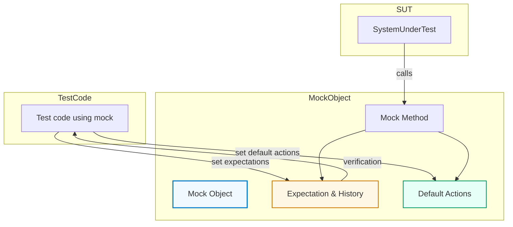

# Mock Objects: Structure and Usage

Mock objects are fundamental components in GoogleMock (gMock), enabling precise control and observation of interactions in C++ unit tests. This guide delves into the anatomy of mock objects: how mock methods are declared, how call histories are maintained, and how mock classes relate to interfaces and the system under test. Understanding these principles equips you to write effective, maintainable, and expressive tests.

---

## Anatomy of a Mock Object

### Declaring Mock Methods

In gMock, mock methods within a mock class are declared using the `MOCK_METHOD` macro:

```cpp
MOCK_METHOD(return_type, method_name, (args...), (qualifiers));
```

- **Signature Mirroring:** The macro parameters mirror the original virtual method's signature.
- **Qualifiers:** Include `const`, `override`, `noexcept`, calling conventions (`Calltype(...)`), and reference qualifiers (`ref(&)`, `ref(&&)`) as needed.
- **Placement:** Mock methods must be declared in the `public:` section of a mock class regardless of the accessibility of the original method. This is essential for the mock framework to access and set expectations on these methods.

#### Handling Complex Types

Methods returning or accepting complex types containing commas (e.g., `std::pair<bool, int>`) require wrapping the type in parentheses or defining type aliases to avoid macro parsing issues:

```cpp
class MyMock {
 public:
  MOCK_METHOD((std::pair<bool, int>), GetPair, ());
  MOCK_METHOD(bool, CheckMap, ((std::map<int, double>), bool));
  
  // or using aliases
  using BoolAndInt = std::pair<bool, int>;
  MOCK_METHOD(BoolAndInt, GetPair, ());
  using MapIntDouble = std::map<int, double>;
  MOCK_METHOD(bool, CheckMap, (MapIntDouble, bool));
};
```

### Mock Classes and Interfaces

Mock classes typically inherit from interfaces or base classes with virtual methods. They replace those interfaces in tests to isolate the system under test (SUT) from dependencies.

```cpp
class Interface {
 public:
  virtual ~Interface() = default;
  virtual int Compute(int x) = 0;
};

class MockInterface : public Interface {
 public:
  MOCK_METHOD(int, Compute, (int x), (override));
};
```

Such mocks behave like concrete objects implementing the interface but allow you to specify expected calls and stub behaviors.

### Relationship Between Mock Classes and the SUT

Mocks stand in place of real collaborators of the SUT. When the SUT calls mock methods, gMock verifies these calls against expectations you set and executes predefined behaviors.

This interaction allows:

- Controlled testing of the SUT behavior independent of collaborators.
- Verification that the SUT uses collaborators correctly (calls made with expected arguments, frequencies, and orders).

---

## Tracking Call Histories and Expectations

### Call Recording

Every time a mock method is invoked, gMock records the call internally, tracking:

- The arguments passed.
- The number of times it has been called.
- Matches against expectations set by `EXPECT_CALL`.

This enables immediate verification of call cardinality and ordering.

### Setting Expectations

Use the `EXPECT_CALL` macro to declare what you expect in test scenarios:

```cpp
EXPECT_CALL(mock_object, MethodName(arg_matchers...))
    .Times(cardinality)
    .WillOnce(action)
    .WillRepeatedly(action);
```

- **Matchers:** Specify argument conditions (e.g., `Eq(5)`, `_` for wildcard).
- **Cardinality:** Number of expected calls (`Exactly(n)`, `AtLeast(n)`, `AnyNumber()`, etc.).
- **Actions:** Define the consequences of calls (`Return(value)`, `Invoke()`, `SetArgPointee()`, etc.).

### Default Actions with `ON_CALL`

`ON_CALL` sets default behaviors for mock methods without implying that they must be called:

```cpp
ON_CALL(mock_object, MethodName(arg_matchers...))
    .WillByDefault(action);
```

This differentiates between specifying behavior (`ON_CALL`) and verifying calls (`EXPECT_CALL`).

---

## Principles Behind Effective Mocking

### Specification Before Execution

Expectations must be set before exercising the code that uses mocks. Defining expectations after calls happen results in undefined behavior and prevents reliable verification.

### Handling Overloaded and Const Methods

Overloaded methods and those differing by `const` qualifier require you to specify qualifiers and, if needed, help the compiler resolve the overload (e.g., use the `Const()` wrapper for `const` methods).

### Sequencing and Partial Ordering

Mock expectations by default can be matched in any order. To enforce call sequences or partial ordering:

- Use `InSequence` blocks to enforce a strict call order.
- Use `Sequence` objects with `.InSequence(s1, s2)` clauses to specify partial orders.
- Use `.After(expectation...)` for fine-grained control over call ordering.

### Managing Sticky Expectations

Expectations are *sticky* by default, remaining active after being saturated, which means multiple matching calls can lead to errors unless expectations retire. Use `.RetiresOnSaturation()` to automatically retire expectations after saturation, especially in sequences.

### Handling Uninteresting Calls

Calls to mocked methods without expectations are "uninteresting calls." By default, these generate warnings unless you:

- Use `NiceMock` to suppress warnings.
- Use `StrictMock` to treat uninteresting calls as errors.
- Write catch-all expectations with `EXPECT_CALL(...).Times(AnyNumber())`.

---

## Mock Object Types to Control Uninteresting Calls

GoogleMock provides wrapper templates to modify the behavior of mocks regarding uninteresting calls:

- **NiceMock<T>:** Suppresses warnings for uninteresting calls.
- **NaggyMock<T>:** Default behavior; warns on uninteresting calls.
- **StrictMock<T>:** Treats uninteresting calls as test failures.

These wrappers inherit from your mock class and preserve constructor arguments, so you can seamlessly switch mocking strictness.

### Example

```cpp
using ::testing::NiceMock;

NiceMock<MockFoo> nice_mock_foo;  // Uninteresting calls produce no warnings
EXPECT_CALL(nice_mock_foo, ExpectedMethod());
// ... test code ...
```

---

## Visual Overview of Mock Object Interaction



---

## Practical Tips and Best Practices

- Always declare mock methods in the public section for accessibility.
- Prefer setting default behaviors with `ON_CALL` and verify interactions with `EXPECT_CALL`.
- Use `NiceMock` for less noisy tests; reserve `StrictMock` for stricter correctness verification.
- Wrap complex argument matchers carefully to avoid parsing issues.
- Use sequences or `.After()` clauses to enforce the necessary call ordering without over-constraining.
- Remember to verify mock expectations either by destruction or explicitly with `Mock::VerifyAndClearExpectations()`.

---

## Troubleshooting Common Issues

### Warnings About Uninteresting Calls

If you see warnings about uninteresting calls, review if you need to add catch-all expectations or switch to a `NiceMock` wrapper.

### Expectation Ordering Failures

When calls fail because of ordering, consider:

- Using `InSequence` or `Sequence` objects for ordering.
- Adding `.RetiresOnSaturation()` to expectations in sequences.

### Method Overload Ambiguities

For overloaded or const methods, assist the compiler using the `Const()` wrapper or explicitly specify matchers to disambiguate.

### Mock Object Leaks

Leaked mocks mean expectations may not be verified:

- Use `Mock::AllowLeak()` if intentional.
- Prefer stack allocation or smart pointers and ensure proper destruction.

---

## Summary

Mock objects in gMock serve as powerful tools to simulate and verify interactions within C++ tests. By properly declaring mock methods, setting expectations, and controlling behavior, you create reliable and maintainable tests that isolate your system from external dependencies.

Use the wrappers `NiceMock`, `NaggyMock`, and `StrictMock` to control the strictness of mocks. Manage call ordering with sequences and explicitly specify behavior using `ON_CALL` and `EXPECT_CALL` macros. Adhering to these principles ensures your tests accurately capture the intents and contracts of your components.

---

## References and Further Reading

- [`MOCK_METHOD` Macro and Usage](reference/mocking-api/mock-methods.md)
- [`EXPECT_CALL`, `ON_CALL` Behavior and Clauses](reference/mocking-api/expectations-actions.md)
- [gMock for Dummies](guides/getting-started/using-googlemock-basics.mdx)
- [gMock Cookbook - Advanced Mocking Techniques](guides/advanced-usage-and-integration/advanced-mocking.mdx)
- [Controlling Mock Behavior with `NiceMock` and `StrictMock`](api-reference/mocking-api/mock-behavior-control.mdx)
- [Matchers and Actions Overview](guides/core-test-workflows/using-matchers.mdx)

---

<Callout>
Tip: When in doubt, start your tests with `ON_CALL` to set general default behaviors and follow with minimal `EXPECT_CALL` statements specifying only the necessary interactions you want to verify.
</Callout>