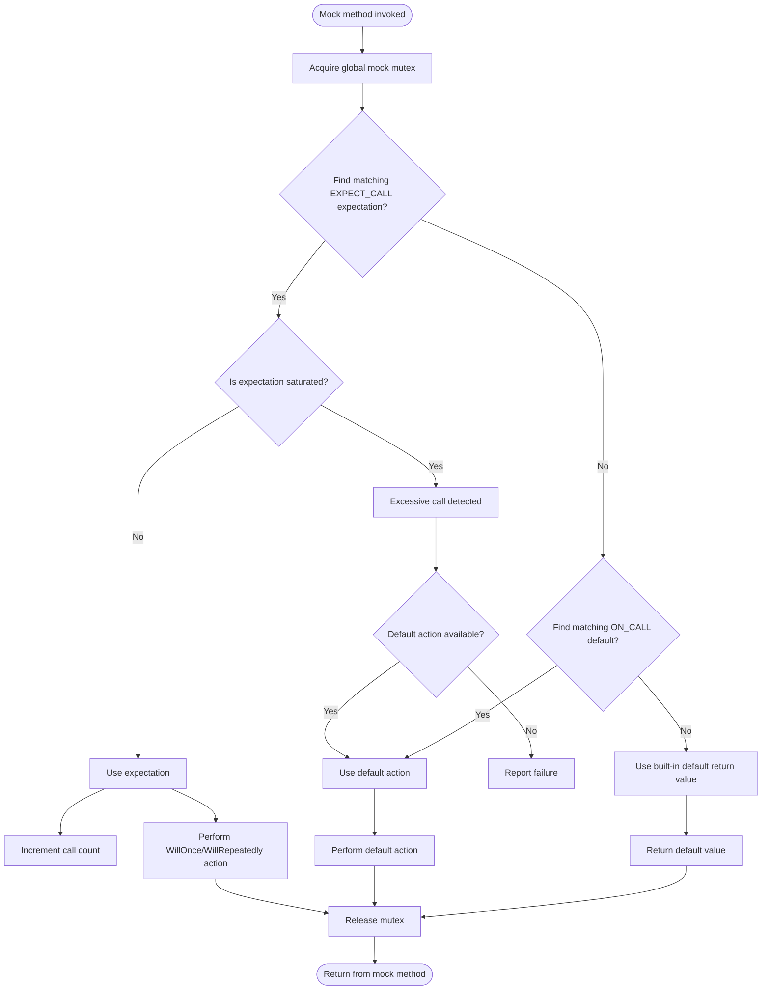

# Defining and Using Mocks

Understand how mocks are declared and used within GoogleMock, focusing on the `MOCK_METHOD` macro, the lifecycle of mocked calls, and the relationship between interfaces, implementations, and their test doubles.

---

## Introduction to Mocks

Mocks are test doubles that enable you to verify interactions between your code and its dependencies. GoogleMock facilitates creating mocks by generating mock classes where methods are declared as `MOCK_METHOD`s. These mock methods simulate the behavior of real methods for testing purposes.

Unlike real implementations, mocks let you specify at runtime:

- Which methods will be called
- How many times
- With which arguments
- What they should return or perform

This page concentrates exclusively on the declaration and usage of mocks, how the `MOCK_METHOD` macro functions, and the core lifecycle of calls made to mocks.

---

## Declaring Mocks with `MOCK_METHOD`

The core facility to create mock methods is the macro:

```cpp
MOCK_METHOD(return_type, method_name, (args...), (specifiers...));
```

where:

- `return_type`: Type returned by the method.
- `method_name`: Name of the method to mock.
- `(args...)`: Parameter list wrapped in parentheses.
- `(specifiers...)`: Optional qualifiers like `const`, `override`, `noexcept`, calling conventions (`Calltype(...)`), or reference qualifiers (`ref(&)`, `ref(&&)`).

### Key Rules and Tips

- Always place `MOCK_METHOD` declarations inside the `public:` section of your mock class, regardless of the original method’s visibility.
- For methods whose argument or return types involve commas (like `std::pair<bool, int>` or complex templates), either wrap the type in extra parentheses or use type aliases to avoid macro parsing errors.

Example:

```cpp
class MockFoo {
 public:
  MOCK_METHOD((std::pair<bool, int>), GetPair, ());
  MOCK_METHOD(bool, CheckMap, ((std::map<int, double>), bool));
};
```

or

```cpp
using BoolAndInt = std::pair<bool, int>;
using MapIntDouble = std::map<int, double>;

class MockFoo {
 public:
  MOCK_METHOD(BoolAndInt, GetPair, ());
  MOCK_METHOD(bool, CheckMap, (MapIntDouble, bool));
};
```

### Mocking Overloaded and Const Methods

- `MOCK_METHOD` supports overloading; you must provide the exact signature with specifiers.
- Use `const` specifier for const methods.

Example:

```cpp
MOCK_METHOD(int, Compute, (int x), (const, override));
MOCK_METHOD(int, Compute, (double x, double y), (override));
```

---

## Understanding `MOCK_METHOD` Macro Expansion

When you declare a mock method using `MOCK_METHOD`, GoogleMock generates internal implementations that include:

- Registration of the mock object and method.
- Handling of expectations (`EXPECT_CALL`) and default actions (`ON_CALL`).
- Argument matching and action dispatching during invocation.

This process allows the mock method to dynamically respond to various expectations and behaviors set during tests.

---

## Using `EXPECT_CALL` and `ON_CALL` with Mocks

### `EXPECT_CALL` – Expecting Method Calls

Use `EXPECT_CALL(mock_obj, Method(args))` to set expectations on method calls, including argument matchers, call count (`Times()`), call order (`InSequence()`, `After()`), and actions to be performed (`WillOnce()`, `WillRepeatedly()`). This establishes what calls must occur for the test to pass.

### `ON_CALL` – Defining Default Behaviors

Use `ON_CALL(mock_obj, Method(args))` to specify default behaviors for calls that do not have expectations. Unlike `EXPECT_CALL`, it does not enforce call expectations but defines behavior if the method is invoked.

Both macros share similar syntax and support the `.With()` clause to match arguments as a tuple.

---

## Typical Lifecycle of a Mocked Call

When a call is made to a mock method:

1. GoogleMock locks to ensure thread safety.
2. It checks **expectations** (matching `EXPECT_CALL`s) in the reverse order they were defined, selecting the last matching active expectation.
3. If no expectation matches, it falls back to **default actions** defined by `ON_CALL`.
4. When executing an expectation:
   - It checks cardinality (i.e., call count constraints).
   - If the call exceeds an expectation's limits, it's considered excessive.
   - The expectation may retire after saturation if `.RetiresOnSaturation()` is specified.
5. The selected action (from `WillOnce`, `WillRepeatedly`, or default action) is performed.

If no default action is set and the return type is not `void` or does not have a default value, GoogleMock either asserts or throws to indicate this problem.

---

## Expectations, Actions, and Cardinalities

- **Expectations** specify what calls are expected with which arguments.
- **Actions** specify what the mock method should do when called.
- **Cardinalities** (such as `Times()`) control how many times an expectation should match.

`EXPECT_CALL` macro enables chaining clauses for expectations in a specific order:

```
EXPECT_CALL(mock, Method(args))
    .With(multi_arg_matcher)  // optional, can appear once and must be first
    .Times(cardinality)       // optional, can appear once
    .InSequence(sequences...) // optional, can appear repeatedly
    .After(expectations...)   // optional, up to five
    .WillOnce(action)         // optional, can appear multiple times
    .WillRepeatedly(action)   // optional, can appear once
    .RetiresOnSaturation();   // optional, once and last
```

---

## Interfaces, Implementations, and Mocks

Mocks are derived from interfaces or concrete classes where virtual methods are overridden with mocks.

- Interfaces define pure virtual methods.
- Implementations provide real behavior.
- Mocks override methods using `MOCK_METHOD` to enable specifying expectations and behavior during tests.

This design allows tests to substitute mocks for real implementations, facilitating interaction verification without changing production code.

---

## Practical Tips

- Declare `MOCK_METHOD`s only in public sections for accessibility by `ON_CALL` and `EXPECT_CALL`.
- Use `ON_CALL` to set default behavior for mock methods when you don’t want to enforce call counts.
- Use `EXPECT_CALL` to verify calls, specifying cardinality and actions.
- When mocking move-only types, define mocks normally and use lambdas or custom actions for move semantics.
- Use sequences or `InSequence` for ordered expectations.
- Utilize `.RetiresOnSaturation()` to deactivate saturated expectations for flexible call patterns.

---

## Common Pitfalls

- Declaring `MOCK_METHOD` with complex types without parentheses or type aliases causes parsing errors.
- Setting expectations after the mock method invocation leads to undefined behavior.
- Over-specifying expectations may make tests brittle; prefer using `ON_CALL` for behavior and reserve `EXPECT_CALL` for actual call verification.
- Not specifying correct qualifiers (`const`, `override`, etc.) can cause compilation errors.

---

## Example Mock Class and Usage

```cpp
class MockFoo : public Foo {
 public:
  MOCK_METHOD(int, Compute, (int x), (const, override));
  MOCK_METHOD(void, Display, (const std::string& msg), (override));
};

// Test Example
TEST(FooTest, CallsCompute) {
  MockFoo foo;
  ON_CALL(foo, Compute(_)).WillByDefault(Return(42));
  EXPECT_CALL(foo, Compute(5)).WillOnce(Return(10));

  int result = foo.Compute(5);  // Returns 10
  int default_result = foo.Compute(7);  // Returns 42

  EXPECT_EQ(result, 10);
  EXPECT_EQ(default_result, 42);
}
```

---

## Internal Working of `MOCK_METHOD` (Conceptual Overview)

Internally, when you declare `MOCK_METHOD`, GoogleMock:

- Creates an instance of `FunctionMocker` responsible for intercepting calls to the mock method.
- Registers the mock method and its owner mock object in a global registry.
- When the mock method is called, it consults sets of expectations and default actions.
- Chooses the best matching expectation or default action, taking call counts and prerequisites into account.
- Executes the chosen action, which might be returning a value, invoking a callback, or other user-defined behavior.

These details are hidden from the user, allowing focus on writing readable, maintainable tests.

---

## Summary

This page introduced the fundamental concepts behind defining and using mocks in GoogleMock:

- Mock methods declared with the `MOCK_METHOD` macro.
- Specifying expectations (`EXPECT_CALL`) and default behaviors (`ON_CALL`).
- The lifecycle of mocked calls, including matching expectations, cardinality checks, and action execution.
- How mocks, interfaces, and implementations relate.

For practical usage patterns, best practices, and deeper understanding of expectations and actions, consult related guides such as the [Mocking Reference](../reference/mocking.md) and the [gMock Cookbook](../gmock_cook_book.md).

---

## See Also

- [Mocking Reference](../reference/mocking.md)
- [gMock Cookbook](../gmock_cook_book.md)
- [Writing and Using Mocks Guide](../guides/mocking-and-advanced-techniques/creating-and-using-mocks.md)
- [EXPECT_CALL Syntax](../reference/mocking.md#EXPECT_CALL)
- [ON_CALL Syntax](../reference/mocking.md#ON_CALL)

---

## Mermaid Diagram: Mock Call Lifecycle


