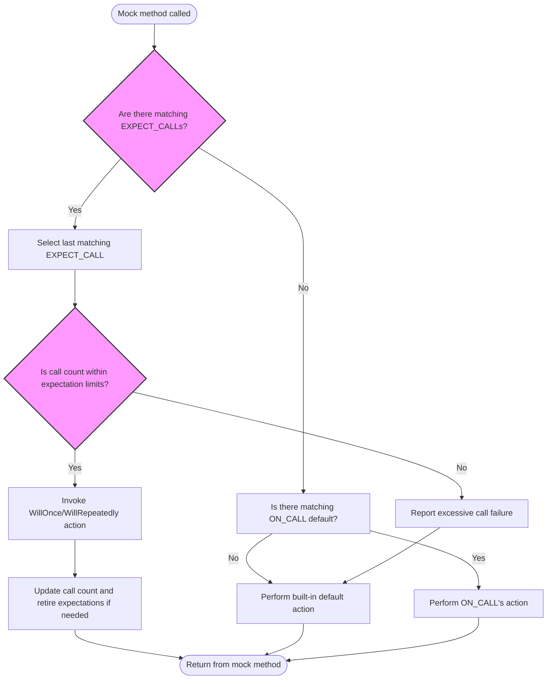

# Expectations, Actions, and Cardinality

This guide takes you on a comprehensive journey through defining expectations on mock methods using `EXPECT_CALL` and `ON_CALL` in GoogleMock. You will learn how to specify the behavior and ordering of mock method calls, how to constrain the number of times methods are expected to be called via cardinalities, and the logic that guides this powerful mechanism for encoding test intent.

---

## Overview of Expectations and Default Actions

In GoogleMock, expectations rigorously specify how mock methods should be used in tests. They declare *which* mock methods will be called, *with what arguments*, *how often*, *in which order*, and *what they do* when invoked.

- **`EXPECT_CALL`**: Declares that a mock method will be called with certain arguments and possibly a specified behavior. Failing to honor these expectations results in test failures.
- **`ON_CALL`**: Defines a default behavior for mock method calls without enforcing that they must occur.

By combining these, you explicitly state your test’s contract with mock objects, helping verify interactions precisely while controlling behavior.

---

## Setting Expectations with `EXPECT_CALL`

### Basic Syntax

```cpp
EXPECT_CALL(mock_object, Method(arg_matchers...))
    .Times(cardinality)
    .WillOnce(action)
    .WillRepeatedly(action);
```

- `mock_object`: The instance of your mock.
- `Method`: The method you expect to be called.
- `arg_matchers...`: Matchers that specify what argument values to expect.
- Clause `.Times()` controls *how many times* the call must occur.
- Clause `.WillOnce()` specifies the behavior for a single call (can be chained).
- Clause `.WillRepeatedly()` specifies the behavior for *all subsequent* calls after those in `.WillOnce()`.

### Matchers

Use matchers like `_` (wildcard), `Eq(value)`, `Ge(n)`, or custom matchers to specify argument constraints.

Example:

```cpp
EXPECT_CALL(turtle, Forward(Ge(50)))  // Expect Forward called with >= 50
    .Times(AtLeast(1))
    .WillRepeatedly(Return());
```

### Inference of Cardinality

If `.Times()` is omitted, GoogleMock infers how often the call is expected based on the presence of `WillOnce()` and `WillRepeatedly()`:

- No `WillOnce()` and no `WillRepeatedly()` → `Times(1)`.
- `n` `WillOnce()` calls, no `WillRepeatedly()` → `Times(n)`.
- `n` `WillOnce()` calls and one `WillRepeatedly()` → `Times(AtLeast(n))`.

### Declaring Behaviors with Actions

- `WillOnce(action)`: Specify actions for each matching call, in order.
- `WillRepeatedly(action)`: Action for all calls after `WillOnce()` actions are exhausted.

Common actions include returning values, throwing exceptions, or invoking custom lambdas.

Example:

```cpp
EXPECT_CALL(mock, GetValue())
    .WillOnce(Return(10))
    .WillOnce(Return(20))
    .WillRepeatedly(Return(30));
```

### Ordering Expectations

By default, invocations need not occur in order. To specify call order, use:

- **Sequences**: Use `InSequence` to require strict ordering of expectations defined inside its scope.

```cpp
{
  InSequence s;
  EXPECT_CALL(mock, Init());
  EXPECT_CALL(mock, Run());
}
```

- **Partial Orders**: Use `.InSequence(...)` with multiple `Sequence` objects or `.After()` clauses to build complex call order DAGs.

---

## `ON_CALL` for Default Behavior Without Expectations

Use `ON_CALL` to specify what a method *does* when called but *does not* set an expectation that it will be called.

Syntax:

```cpp
ON_CALL(mock_object, Method(arg_matchers...))
    .With(multi_argument_matcher)
    .WillByDefault(action);
```

- `.With(...)` restricts the calls to those matching all arguments together.
- `.WillByDefault(...)` specifies the action taken when no `EXPECT_CALL` matches.

Example:

```cpp
ON_CALL(mock, GetName(_))
    .WillByDefault(Return("default_name"));
```

`ON_CALL` is recommended for setting common fallback behavior in test setup, reserving `EXPECT_CALL` for verifying specific interactions.

---

## Cardinalities: Specifying Call Count Constraints

Cardinalities describe how many times an expectation is expected to be satisfied:

| Cardinality         | Meaning                                             |
| ------------------- | --------------------------------------------------- |
| `AnyNumber()`       | Any number of calls is allowed                       |
| `AtLeast(n)`        | Method must be called at least `n` times             |
| `AtMost(n)`         | Called at most `n` times                              |
| `Between(m, n)`     | Called between `m` and `n` times (inclusive)         |
| `Exactly(n)` or `n` | Called exactly `n` times                              |

### How Cardinality Affects Expectations

- Setting `Times(0)` disallows calls altogether, causing failures if invoked.
- `Times()` must appear before `InSequence()`, `WillOnce()`, `WillRepeatedly()`, or `.RetiresOnSaturation()`.
- Cardinality bounds are checked against the number of `WillOnce()` and `WillRepeatedly()` clauses.

### Retiring Expectations

Use `.RetiresOnSaturation()` to automatically deactivate an expectation once its upper bound is reached. This is helpful to allow fallback to other expectations or default behavior after a limit.

Example:

```cpp
EXPECT_CALL(mock, SetNumber(7))
    .Times(2)
    .RetiresOnSaturation();
```

After 2 calls with argument `7`, this expectation retires, so further calls fall back to other matching expectations or default action.

---

## Controlling Call Order with Sequences and Dependencies

### `Sequence` Objects

Sequences allow grouping expectations to enforce strict call order:

```cpp
Sequence s1, s2;
EXPECT_CALL(mock, Reset()).InSequence(s1, s2);
EXPECT_CALL(mock, GetSize()).InSequence(s1);
EXPECT_CALL(mock, Describe()).InSequence(s2);
```

The above requires `Reset()` to happen before both `GetSize()` and `Describe()`, while `GetSize()` and `Describe()` can be unordered relative to each other.

### `InSequence` Object

A local `InSequence` instance declares that all `EXPECT_CALL`s within its scope are ordered:

```cpp
{
  InSequence seq;
  EXPECT_CALL(mock, Step1());
  EXPECT_CALL(mock, Step2());
}
```

### `After` Clause

Use `.After()` to specify that one expectation depends on one or several others being satisfied first:

```cpp
Expectation e1 = EXPECT_CALL(mock, InitX());
Expectation e2 = EXPECT_CALL(mock, InitY());
EXPECT_CALL(mock, Describe()).After(e1, e2);
```

Here, `Describe()` cannot be called before both `InitX()` and `InitY()` are called.

---

## Behavior of Conflicting or Multiple Expectations

- **Last Matching Rule**: GoogleMock matches mock method calls against the most recently declared matching expectation.
- You can create broad "catch-all" expectations with `Times(AnyNumber())` and wide matchers like `_` to provide fallback behavior.
- More specific expectations should follow general ones to take precedence.

Example:

```cpp
EXPECT_CALL(mock, Process(_)).Times(AnyNumber());  // General fallback
EXPECT_CALL(mock, Process(42)).Times(1);          // More specific override
```

If `Process(42)` is called, it’s matched by the second expectation; other arguments match the first.

---

## Common Pitfalls and Tips

- Always set expectations *before* exercising code that calls mocked methods.
- Avoid overusing strict ordering unless necessary; tests should verify intent without being brittle.
- Use `.RetiresOnSaturation()` or sequences to handle call count limits without unexpected match failures.
- Prefer `ON_CALL` for default behaviors that don't require verification, lowering test maintenance burden.
- Consult `--gmock_verbose=info` to debug why calls match or fail to match expectations.

---

## Mermaid.js Flowchart Illustrating Expectation Matching Flow



---

## Summary

By mastering `EXPECT_CALL` and `ON_CALL` syntax, cardinalities, action specifications, and call ordering constructs like sequences and `.After()`, you gain precise control over mock behavior and test validation. This guide enables encoding complex test intent robustly and elegantly.

---

## See Also

- [Mocking Reference](reference/mocking.md#EXPECT_CALL)
- [gMock Cookbook](gmock_cook_book.md#SettingExpectations)
- [gMock for Dummies](gmock_for_dummies.md#SettingExpectations)
- [Matchers Reference](reference/matchers.md)
- [Actions Reference](reference/actions.md)
- [Cardinalities API](reference/mocking.md#EXPECT_CALL.Times)
- [Nice, Naggy, and Strict Mocks](mocking_models.md#mock-behavior-modes)

---

## Practical Example

```cpp
#include <gmock/gmock.h>

class MockTurtle {
 public:
  MOCK_METHOD(void, PenUp, (), (override));
  MOCK_METHOD(void, PenDown, (), (override));
  MOCK_METHOD(void, Forward, (int distance), (override));
};

TEST(TurtleTest, MovesForward) {
  MockTurtle turtle;

  // Expect 'Forward' to be called exactly 3 times with any argument.
  EXPECT_CALL(turtle, Forward(::testing::_))
      .Times(3)
      .WillOnce(::testing::Return())
      .WillOnce(::testing::Return())
      .WillOnce(::testing::Return());

  turtle.Forward(10);
  turtle.Forward(20);
  turtle.Forward(30);
}
```

In this example, `Forward()` is expected to be called exactly three times with any arguments. Each call will just execute the default action.

---