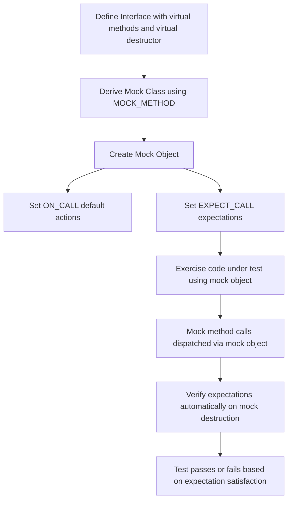

# Mock Object Model

GoogleMock (gMock) excels as a framework for creating and using mock objects in C++. Understanding the Mock Object Model is essential to harness gMock's full power and write modular, robust, and maintainable tests. This page guides you through the core concepts behind mock objects—their purpose, design, and lifecycle—and illustrates how to effectively define, instantiate, and integrate mock objects into your code.

---

## What Is a Mock Object?

Imagine you're developing a complex system where components interact through well-defined interfaces, but during testing, the real collaborators are unavailable, slow, or hard to control. This is where mock objects come into play.

A **mock object** mimics a real object's interface, but instead of a real implementation, it provides a way to specify:

- Which methods are expected to be called,
- With what arguments,
- How many times,
- In which order, and
- What values those methods should return or how they should behave.

Mock objects thus allow you to isolate the component under test and precisely verify its interactions with external dependencies.

---

## Designing Mock Classes

### Defining Mock Methods with `MOCK_METHOD`

The cornerstone of creating a mock class in gMock is the `MOCK_METHOD` macro. To mock an interface or base class, follow these principles:

- Your original class should have **virtual** methods and a **virtual destructor** for proper polymorphic behavior.
- Derive a new mock class from this interface.
- Use `MOCK_METHOD` in the `public:` section of your mock class to declare mock implementations of the virtual methods.

Example:

```cpp
class Foo {
 public:
  virtual ~Foo();
  virtual int GetSize() const = 0;
  virtual std::string Describe(const char* name) = 0;
  virtual bool Process(int elem) = 0;
};

class MockFoo : public Foo {
 public:
  MOCK_METHOD(int, GetSize, (), (const, override));
  MOCK_METHOD(std::string, Describe, (const char* name), (override));
  MOCK_METHOD(bool, Process, (int elem), (override));
};
```

**Key points:**

- Mock methods must appear `public`, even if the base methods are `protected` or `private`. This enables gMock to harness these mocks fully.
- The macro's parameters follow: the return type, method name, argument list, and optional qualifiers like `(const, override)`.

### Mocking Overloaded Methods

Simply mock each overloaded variant with the full signature. If you omit some overloads, you must bring the missing overloads into scope with `using` to avoid hiding base methods.

```cpp
MOCK_METHOD(int, Add, (int x), (override));
MOCK_METHOD(int, Add, (double x), (override));

// If not mocking all overloads:
using Base::Add;
```

### Mocking Class Templates

Template classes can be mocked similarly by templating the mock class itself:

```cpp
template <typename T>
class StackInterface {
 public:
  virtual ~StackInterface();
  virtual void Push(const T& x) = 0;
  virtual int Size() const = 0;
};

template <typename T>
class MockStack : public StackInterface<T> {
 public:
  MOCK_METHOD(void, Push, (const T& x), (override));
  MOCK_METHOD(int, Size, (), (const, override));
};
```

---

## Mock Object Lifecycle

Understanding the lifecycle from mock class definition to usage and verification is critical.

### Creating Mock Objects

Create mock objects either as automatic variables or dynamically on the heap:

```cpp
MockFoo foo;
// or
MockFoo* foo_ptr = new MockFoo;
```

You can also use wrappers:

- `NiceMock<MockFoo>` suppresses warnings about uninteresting calls.
- `NaggyMock<MockFoo>` (default) warns on uninteresting calls.
- `StrictMock<MockFoo>` treats uninteresting calls as test failures.

Example:

```cpp
using ::testing::NiceMock;
NiceMock<MockFoo> foo_nice;
EXPECT_CALL(foo_nice, Process(42));
```

### Defining Behavior with `ON_CALL`

Use `ON_CALL` to set default behaviors of mock methods without strictly requiring the calls:

```cpp
ON_CALL(foo, GetSize()).WillByDefault(Return(10));
```

This way, if the method is called without an explicit expectation, it will exhibit the specified default behavior.

### Setting Expectations with `EXPECT_CALL`

Expectations declare how many times a method should be called, with which arguments, and what it should do:

```cpp
EXPECT_CALL(foo, Process(42))
    .Times(2)
    .WillOnce(Return(true))
    .WillRepeatedly(Return(false));
```

This means `foo.Process(42)` should be called twice: the first time returns `true`, the second and subsequent times return `false`.

### Automatic Verification

When a mock object is destroyed, gMock automatically verifies all expectations have been met, producing a test failure if any expectations were violated.

You can also enforce verification explicitly:

```cpp
using ::testing::Mock;
Mock::VerifyAndClearExpectations(&foo);
```

### Allowing Leaks

If your test design means mock objects may leak (e.g., objects owned by production code), instruct gMock to allow it without warning:

```cpp
Mock::AllowLeak(&foo);
```

---

## Using Mocks in Tests: A Workflow

Here's the straightforward user flow for working with mock objects:

1. **Include and import gMock symbols:**
   ```cpp
   #include <gmock/gmock.h>
   using ::testing::_;  // Common matcher allowing any value.
   using ::testing::Return;
   ```
2. **Define or use an existing mock class** that properly mocks your interface.
3. **Create mock objects:**
   ```cpp
   MockFoo foo;
   ```
4. **Set default behaviors:**
   ```cpp
   ON_CALL(foo, GetSize()).WillByDefault(Return(42));
   ```
5. **Set expectations:**
   ```cpp
   EXPECT_CALL(foo, Process(_)).Times(3).WillRepeatedly(Return(true));
   ```
6. **Exercise the code under test** that depends on these mock objects.
7. **Check return values and final state if necessary.**
8. **Allow gMock to verify expectations automatically on mock destruction.**

Example test:

```cpp
TEST(FooTest, WorksWithMocks) {
  MockFoo foo;

  ON_CALL(foo, GetSize()).WillByDefault(Return(3));

  EXPECT_CALL(foo, Process(_)).Times(2);

  DoSomethingThatCallsProcess(&foo);
  EXPECT_EQ(foo.GetSize(), 3);
}
```

---

## Interactions and Important Concepts

### Expectations Are Sticky

By default, expectations remain **active** even after their upper bound is reached, preventing other matching expectations from taking effect unless `.RetiresOnSaturation()` is set.

If you want the expectation to retire immediately when saturated, use:

```cpp
EXPECT_CALL(foo, Bar()).Times(2).RetiresOnSaturation();
```

### Matching Order and Precedence

If multiple expectations match the same set of arguments, gMock picks the **last** expectation declared that matches and is still active. This supports the pattern of setting general catch-all expectations early and specialized expectations later.

### Argument Matching

Matchers (`_`, `Eq`, `Ge`, custom matchers, etc.) allow precise control over which calls satisfy expectations. For uninterested arguments, use `_`. Customize as needed for exactitudes or ranges.

### Call Order Control

To enforce call order, wrap expectations inside an `InSequence` block:

```cpp
{
  InSequence seq;
  EXPECT_CALL(foo, First());
  EXPECT_CALL(foo, Second());
}
```

For partial ordering, use [`After()`](reference/mocking.md#EXPECT_CALL.After) and [`Sequence`](reference/mocking.md#Sequence).

### Default Actions Vs. Expectations

Use `ON_CALL` to set default behaviors without requiring a call; use `EXPECT_CALL` to both define behavior and expect calls.

Do **not** intermix calls to mock methods and expectations improperly:

- Set expectations **before** calling the methods.
- Do not set new expectations after the mock has been used.

### Controlling Strictness Mode

- `NiceMock` suppresses warnings for uninteresting calls.
- `NaggyMock` (default) warns about uninteresting calls.
- `StrictMock` treats uninteresting calls as errors.

Choose the mock wrapper based on your test needs to balance strictness and test fragility.

---

## Best Practices and Common Pitfalls

- Always define virtual destructors in interfaces to avoid undefined behavior.
- Only mock interfaces or abstract classes you own; otherwise, isolate external dependencies with adaptors.
- Use `EXPECT_CALL` judiciously—overexpectation makes tests brittle.
- When mocking overloaded methods, mock all expected overloads or use `using` to avoid hiding.
- Avoid mocking variadic functions directly; use overloaded versions instead.
- Use `ON_CALL` for common behaviors and `EXPECT_CALL` for verifications to keep tests maintainable.
- Avoid setting expectations after exercising the mock object.
- If you get warnings about uninteresting calls but believe they should be accepted, switch to a `NiceMock` or explicitly allow calls with `EXPECT_CALL(...).Times(AnyNumber())`.

---

## Summary Diagram of Mock Object Lifecycle



---

## Further Learning and Related Topics

For deeper details on usage:
- See the [gMock Cheat Sheet](https://github.com/google/googletest/blob/main/docs/gmock_cheat_sheet.md) for quick references.
- Dive into [gMock for Dummies](https://github.com/google/googletest/blob/main/docs/gmock_for_dummies.md) for beginner-oriented tutorials.
- Explore the [Mocking Reference](https://github.com/google/googletest/blob/main/docs/reference/mocking.md) for thorough API explanations.

For advanced mocking patterns and strictness control, consult the [gMock Cookbook](https://github.com/google/googletest/blob/main/docs/gmock_cook_book.md) and [Mock Strictness & Behavior Control](https://github.com/google/googletest/blob/main/concepts/scalability-and-extensibility/strictness-modes.md).

---

## Troubleshooting

### Mock Method Calls Invoking Real Methods

- Ensure all methods you want to mock are declared `virtual` in the base class.

### Warnings About Uninteresting Calls

- These occur when methods are called without any `EXPECT_CALL`.
- Switch to `NiceMock` or add catch-all expectations.

### Problems with Overloads and Constness

- Use `Const()` wrapper for const overloads; mock all overloads explicitly.
- Use `using Base::Method;` to bring hidden overloads into scope.

### Issues with Move-only Types

- `MOCK_METHOD` supports move-only types starting from 2017.
- For input move-only types, use lambdas in actions.

### Verification Failures

- Make sure all expected calls have happened.
- Verify no calls exceed expected call count.

---

This guide equips you with fundamental understanding of the mock object model in gMock. Armed with this, you can confidently design mocks suited to your interfaces and build robust interaction-based tests.

---

[GoogleMock Cheat Sheet](https://github.com/google/googletest/blob/main/docs/gmock_cheat_sheet.md) | [gMock for Dummies](https://github.com/google/googletest/blob/main/docs/gmock_for_dummies.md) | [Mocking Reference](https://github.com/google/googletest/blob/main/docs/reference/mocking.md) | [GoogleTest Primer](primer.md)

---

<Check>
Be sure your mock classes define virtual destructors.
Use `ON_CALL` for base behavior and `EXPECT_CALL` for verifications.
Set expectations before exercising the mock.
Use `NiceMock` or `StrictMock` to control uninteresting call policies.
</Check>
