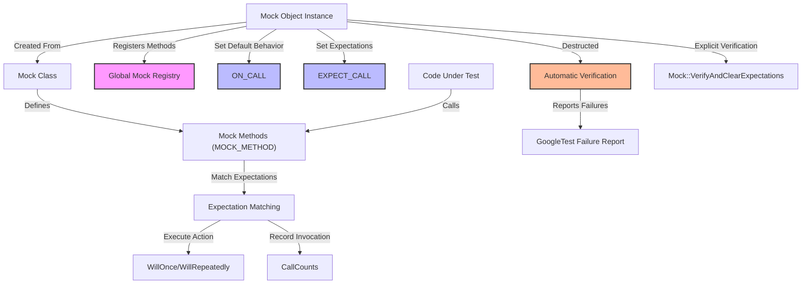

# Mock Objects: Structure and Lifecycle

GoogleMock enables precise and powerful testing by providing mock objects that replicate behavior of real classes. This document explores the anatomy of mock objects created with GoogleMock, focusing on how mock methods are declared, how their internal lifecycle is managed from construction through expectation verification, and practical strategies for introducing mocks into both legacy and new codebases.

---

## Defining Mock Objects with `MOCK_METHOD`

At the heart of GoogleMock is the `MOCK_METHOD` macro, which allows you to declare mock methods inside a mock class. These methods simulate virtual functions of the real class or interface you want to mock.

- **Declaration Syntax:**
  ```cpp
  MOCK_METHOD(ReturnType, MethodName, (Arguments), (Qualifiers));
  ```
- **Qualifiers** include `const`, `override`, `noexcept`, and calling conventions such as `Calltype(STDMETHODCALLTYPE)`.
- Mock methods must be declared **public** in the mock class even if mocked methods in the base class are protected or private to allow GoogleMock macros like `EXPECT_CALL` and `ON_CALL` to reference them.

### Mocking Different Method Variants

- Supports mocking of virtual methods, including those that:
  - Take incomplete types by reference (as long as printing is defined)
  - Are const-qualified or not
  - Are overloaded or templated
  - Return move-only and non-default-constructible types (with appropriate care)
  - Have reference qualifiers

### Example: Mocking a Class

```cpp
class Foo {
 public:
  virtual ~Foo();
  virtual int GetSize() const = 0;
  virtual std::string Describe(const char* name) = 0;
  virtual bool Process(int count) = 0;
};

class MockFoo : public Foo {
 public:
  MOCK_METHOD(int, GetSize, (), (const, override));
  MOCK_METHOD(std::string, Describe, (const char* name), (override));
  MOCK_METHOD(bool, Process, (int count), (override));
};
```

### Tips for Complex Signatures

- Wrap types containing unprotected commas in parentheses or use type aliases to avoid macro parser issues.
- When mocking overloaded methods, mock all overloads to avoid hiding base-class methods.
- For functions with non-virtual methods or free functions, consider interfaces or templates for injecting mock behavior.

---

## Mock Object Lifecycle

### Construction & Registration

- When a mock object is created, each of its mock methods registers with GoogleMock's global registry.
- This registry tracks mock objects and their individual method mockers to enable automatic verification and leak detection.

### Setting Default Actions & Expectations

- Use `ON_CALL(mock, method(args))` to define default behavior without setting a usage expectation.
- Use `EXPECT_CALL(mock, method(args))` to both set expected calls and specify behavior.
- Expectations are evaluated before exercising code that uses the mock.

### Invocation

- When the tested code calls mock methods, GoogleMock:
  1. Matches the call with the latest matching `EXPECT_CALL` expectation.
  2. Executes the defined action(s) in order (`WillOnce()`, `WillRepeatedly()`).
  3. Tracks invocation counts against expected cardinalities.

### Verification & Cleanup

- Upon mock object's destruction, GoogleMock automatically verifies if all expectations have been satisfied.
- If verification fails, clear and detailed failure reports are generated immediately.
- Alternatively, manual verification can be done earlier using `Mock::VerifyAndClearExpectations(&mock)` or `Mock::VerifyAndClear(&mock)`.

### Leaking Mocks Safely

- To suppress leaked mock detection (e.g., for mocks owned by the production code), call `Mock::AllowLeak(&mock)`.

---

## Handling Mock Object Behavior Strictness

GoogleMock provides three wrappers to control warning and failure behavior around uninteresting (no expectation) calls:

| Wrapper       | Behavior                                                                 |
|---------------|---------------------------------------------------------------------------|
| `NiceMock<T>` | Suppresses warnings on uninteresting calls; treats unexpected calls normally.
| `NaggyMock<T>`| (Default) Warns on uninteresting calls.
| `StrictMock<T>` | Treats all uninteresting calls as errors.

```
using ::testing::NiceMock;
using ::testing::NaggyMock;
using ::testing::StrictMock;

NiceMock<MockFoo> nice_mock;  // Ignores uninteresting calls without warnings.
NaggyMock<MockFoo> naggy_mock; // Warns on uninteresting calls.
StrictMock<MockFoo> strict_mock; // Errors on uninteresting calls.
```

### Key Notes

- Wrappers inherit constructors from `T`, so argument forwarding for construction is seamless.
- Only mock methods defined *directly* in `T` are affected by these wrappers.
- Nesting wrappers is not supported.

---

## Using Mocks in Legacy and Modern Codebases

### Strategies for Introduction

1. **Encapsulate Interface**: For legacy code tightly coupled to concrete classes, consider defining interfaces to wrap dependencies. Mock these interfaces in tests.

2. **Progressive Refactoring**: Gradually replace real objects with mocks in tests, starting with the most critical or flaky dependencies.

3. **Delegating to Real Objects or Fakes**:
   - Delegate default behavior to a real object or a fake class within a mock, preserving functionality while enabling verification.
   - Use `ON_CALL` with function or lambda to forward calls.

4. **Using Strictness Wrappers**: Adopt `NiceMock` during transition to reduce noise from uninteresting calls, switching to `StrictMock` as expectations stabilize.

### Common Pitfalls

- Forgetting to declare mock methods in the `public` section.
- Mixing expectations and mock use order causing undefined behavior.
- Ignoring ownership and lifecycle leading to leaks or premature destruction.

---

## Practical Example Showcase

```cpp
#include <gmock/gmock.h>
using ::testing::Return;

class MockDatabase {
 public:
  MOCK_METHOD(bool, Connect, (const std::string&), ());
  MOCK_METHOD(int, GetData, (int id), (const));
};

TEST(DatabaseTest, ConnectsAndRetrievesData) {
  MockDatabase mock_db;

  // Define default actions
  ON_CALL(mock_db, Connect).WillByDefault(Return(true));
  ON_CALL(mock_db, GetData).WillByDefault(Return(42));

  // Set expectations
  EXPECT_CALL(mock_db, Connect("localhost"))
      .Times(1)
      .WillOnce(Return(true));

  EXPECT_CALL(mock_db, GetData(5))
      .Times(2)
      .WillRepeatedly(Return(100));

  // Exercise code
  EXPECT_TRUE(mock_db.Connect("localhost"));
  EXPECT_EQ(mock_db.GetData(5), 100);
  EXPECT_EQ(mock_db.GetData(5), 100);
}
```

---

## Troubleshooting Common Issues

- **Uninteresting Calls Warning:** If warnings appear for calls without expectations, consider adding a catch-all expectation `EXPECT_CALL(mock, method(_)).Times(AnyNumber());` or use `NiceMock` to suppress.
- **Unexpected Calls Errors:** Ensure all expected calls are set before exercising mocks, and match arguments correctly.
- **Leak Detection Fails:** If leaks are reported due to mocks not destructing, verify ownership or mark mock objects as leakable with `Mock::AllowLeak()`.
- **Non-default Constructible Return Types:** When mocking methods returning non-default-constructible types, specify return values explicitly or handle exceptions accordingly.
- **Multiple Expectations for Overloads:** To mock overloaded methods properly, specify matchers or use `Const()` wrapper for const overloads.

---

## Diagram: Mock Object Lifecycle Overview



---

## Additional Best Practices

- **Set expectations before exercising mocks** to avoid undefined behavior.
- **Use the fewest possible expectations** to keep tests resilient to implementation changes.
- **Utilize sequences (`InSequence`) and ordering (`After`)** to enforce call order when necessary.
- **Leverage `RetiresOnSaturation()`** to retire expectations as soon as they are satisfied to avoid conflicts.
- **Avoid over-specifying argument matchers** unless the exact value is critical to test intent.

---

## References and Next Steps

- [Mock Object Definition (API Reference)](/api-reference/gmock-mocking-apis/mock-object-definition)
- [Mocking and Setting Expectations Guide](/guides/core-testing-workflows/mocking-and-expectations)
- [Mocking Best Practices](/guides/real-world-patterns/mocking-best-practices)
- [gMock Cheat Sheet](https://google.github.io/googletest/gmock_cheat_sheet.html)
- [gMock Cookbook](https://google.github.io/googletest/gmock_cook_book.html)
- [Understanding Uninteresting vs Unexpected Calls](https://google.github.io/googletest/gmock_cook_book.html#uninteresting-vs-unexpected)

For mastering mock objects, users should explore how to define detailed expectations with matchers and actions, manage call order, and embed mocks within build systems and test suites seamlessly.

---

This concepts guide equips you with the knowledge to structure GoogleMock mock objects effectively and to manage their lifecycle from set up through teardown and verification — empowering you to write interaction-based unit tests with confidence and clarity.
