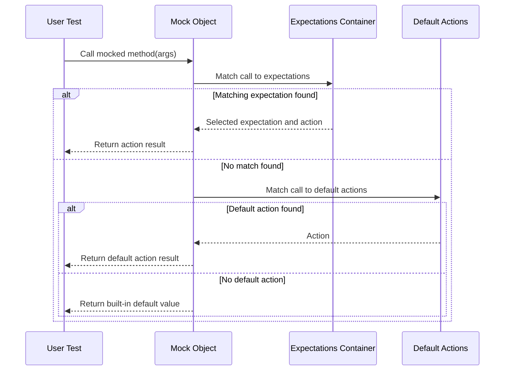

# Mock Object Model & Function Mocker

Welcome to the core concepts behind GoogleMock's mock object model and function mocking mechanism. This guide unpacks how mock classes and their methods are defined, instantiated, and validated, enabling you to precisely control and verify interactions in your unit tests.

---

## Introduction to Mock Classes and Methods

GoogleMock enables you to create **mock classes** that mimic your real interfaces, controlling how their methods behave during tests. These mock classes use the `MOCK_METHOD` macro to declare mocked methods with specific signatures and expected behaviors.

### Defining a Mock Class

To create a mock class, inherit from the interface you want to mock and add mock methods using `MOCK_METHOD`, specifying:

- The method's return type
- The method's name
- Argument types
- Optional qualifiers such as `const`, `override`, and `noexcept`

#### Example: Simple Mock Class

```cpp
class MockFoo : public Foo {
 public:
  MOCK_METHOD(int, GetSize, (), (const, override));
  MOCK_METHOD(string, Describe, (const char* name), (override));
  MOCK_METHOD(bool, Process, (Bar elem, int count), (override));
};
```

#### Handling Commas in Template Arguments

When your method signatures use types that internally contain commas (e.g., `std::pair<bool, int>`), you must either:

- Wrap the type in extra parentheses, or
- Use a `using` alias to simplify the type before using `MOCK_METHOD`.

For example:

```cpp
class MockFoo {
 public:
  MOCK_METHOD((std::pair<bool, int>), GetPair, ());          // Wrapped in parentheses
  MOCK_METHOD(bool, CheckMap, ((std::map<int, double>), bool)); // Wrapped argument
  
  using BoolAndInt = std::pair<bool, int>;
  MOCK_METHOD(BoolAndInt, GetPair, ());                      // Using alias
};
```

### Visibility of Mock Methods

All mock methods declared with `MOCK_METHOD` **must** be placed in the `public:` section of the mock class, regardless of the visibility of the corresponding base class methods (public, protected, or private). This ensures they are accessible for expectations and call definitions in tests.

---

## Mock Method Declaration and Qualifiers

`MOCK_METHOD` accepts an optional fourth parameter—for method qualifiers that specify how the method overrides the base class method. Common qualifiers include:

- `const` — marks the method as a constant method
- `override` — ensures you're correctly overriding a virtual method
- `noexcept` — marks the method as `noexcept`
- `Calltype(...)` — sets calling conventions (e.g., for Windows interoperability)
- `ref(...)` — applies reference qualifiers like `ref(&)` or `ref(&&)`

#### Example:

```cpp
MOCK_METHOD(int, GetValue, (), (const, override));
MOCK_METHOD(void, Process, (int x), (noexcept, override));
```

---

## Mocking Overloaded Methods

You can mock all overloads independently by declaring each with `MOCK_METHOD`. If you omit mocking certain overloads, the compiler will warn about base class methods being hidden. To fix this, bring the base class method(s) into scope using `using`.

```cpp
class MockFoo : public Foo {
 public:
  using Foo::Add;  // bring other overloads into scope
  MOCK_METHOD(int, Add, (Element x), (override));
};
```

---

## Mocking Template Classes

Template classes can be mocked similarly by templating the mock class and using `MOCK_METHOD` inside:

```cpp
template <typename Elem>
class MockStack : public StackInterface<Elem> {
 public:
  MOCK_METHOD(int, GetSize, (), (const, override));
  MOCK_METHOD(void, Push, (const Elem& x), (override));
};
```

---

## Mocking Non-Virtual Methods

GoogleMock provides a *high-performance dependency injection* pattern for mocking non-virtual methods. The mock class does not inherit from the real class but defines methods with the same signatures. The selection of the concrete or mock class to use occurs at compile time, often via templates.

Example:

```cpp
class ConcretePacketStream {
 public:
  void AppendPacket(Packet* new_packet);
  const Packet* GetPacket(size_t packet_number) const;
  size_t NumberOfPackets() const;
};

class MockPacketStream {
 public:
  MOCK_METHOD(const Packet*, GetPacket, (size_t packet_number), (const));
  MOCK_METHOD(size_t, NumberOfPackets, (), (const));
};

template <class PacketStream>
void CreateConnection(PacketStream* stream) { ... }
```

You can instantiate `CreateConnection<ConcretePacketStream>` in production and `CreateConnection<MockPacketStream>` in tests.

---

## Mocking Free Functions

Directly mocking free or static functions is not supported. To mock their behavior, introduce an abstract interface and rewrite the code to depend on the interface.

Example:

```cpp
class FileInterface {
 public:
  virtual bool Open(const char* path, const char* mode) = 0;
};

class File : public FileInterface {
 public:
  bool Open(const char* path, const char* mode) override {
    return OpenFile(path, mode);
  }
};
```

Tests mock the interface `FileInterface` instead.

Alternatively, functions can be passed as `std::function` parameters and mocked using `MockFunction`.

---

## Choosing Between Niceness Levels: NiceMock, NaggyMock, and StrictMock

By default, mocks are **naggy**, meaning they warn on uninteresting calls (calls without explicit expectations). To customize this:

- Use `NiceMock<T>` to **suppress warnings** on uninteresting calls.
- Use `StrictMock<T>` to **fail tests** on uninteresting calls.

Example:

```cpp
using ::testing::NiceMock;
using ::testing::StrictMock;

NiceMock<MockFoo> nice_mock;    // No warning on uninteresting calls
StrictMock<MockFoo> strict_mock; // Fail on uninteresting calls
```

Be cautious with strict mocks as they tend to make tests brittle and require more maintenance.

---

## Delegation Patterns

GoogleMock supports delegation to:

- **Fake objects:** Use `ON_CALL()` to forward calls to a fake implementation.
- **Real objects:** Similarly, delegate calls to real concrete objects for behavior verification.
- **Parent classes:** Delegate specific calls to base class implementations to mix mock and real behavior.

These patterns help maintain correctness and reduce duplication.

---

## Expectations and Actions

**`EXPECT_CALL()`** is used to specify that a mock method is expected to be called with certain arguments, cardinality (`Times()`), and behaviors (`WillOnce()`, etc.).

**`ON_CALL()`** sets the default action for calls without explicit expectations and does not imply that a call must occur.

The main clauses for `EXPECT_CALL` are:

- `.With()` — multi-argument matcher for holistic argument matching
- `.Times()` — call count constraints (e.g., `Exactly(3)`, `AtLeast(1)`, `AnyNumber()`)
- `.InSequence()` — enforces call order
- `.After()` — defers this call after others
- `.WillOnce()` — action for a single call
- `.WillRepeatedly()` — action for subsequent calls
- `.RetiresOnSaturation()` — retires expectation when saturated

Example:

```cpp
EXPECT_CALL(mock, DoSomething(_, 5))
    .Times(3)
    .WillOnce(Return(true))
    .WillRepeatedly(Return(false));
```

---

## Matchers and Argument Matching

Matchers specify the expected properties of an argument in `EXPECT_CALL()`. Common matchers include:

- `_` — wildcard matching any value
- `Eq(value)` — equals
- `Ge(val)`, `Lt(val)` — inequalities
- Composite matchers like `AllOf`, `AnyOf`, `Not`

Matchers are statically typed and can be combined and composed to express complex expectations.

---

## Summary of the Mock Object Model

- Every mocked method is a **function mocker** generated by the `MOCK_METHOD` macro.
- Each mock method keeps:
  - A list of **expectations** (`EXPECT_CALL`) with argument expectations, cardinalities, and actions.
  - A list of **default actions** (`ON_CALL`) for uninteresting calls.
- At runtime, mock calls are matched against expectations first (checked in reverse order), then default actions, then built-in defaults.
- Thread safety is ensured by internal locking during expectation matching and call counting.
- The mock object model supports sophisticated ordering, sequencing, and partial ordering constraints via `InSequence` and `After` clauses.

---

## Practical Tips and Best Practices

- Declare mock methods **public** in the mock class.
- Use `NiceMock` to reduce noisy uninteresting call warnings when appropriate.
- Sequence expectations with `InSequence` or `After` for ordered calls.
- Use `ON_CALL` for setting default behaviors and `EXPECT_CALL` only when verifying calls.
- Be careful with the quantities of `.WillOnce` and `.WillRepeatedly` to match your `.Times()`.
- Avoid mocking non-virtual functions unless using high-perf template-based injection.
- Prefer coding to interfaces for cleaner mocking and separation.

---

## Further Reading and Related Documentation

- [GoogleMock Cookbook](https://google.github.io/googletest/gmock_cook_book.html) — Recipes and deep dives
- [GoogleMock for Dummies](https://google.github.io/googletest/gmock_for_dummies.html) — Beginner-friendly introduction
- [Mocking Reference](https://google.github.io/googletest/reference/mocking.html) — API level details
- [Matchers Reference](https://google.github.io/googletest/reference/matchers.html) — Argument matching
- [Expectations and Actions Reference](https://google.github.io/googletest/reference/expectations.html) — Configuration of behaviors

----

For full details on macros, qualifiers, advanced usage, and extension points, refer to [GoogleMock's official documentation](https://google.github.io/googletest/).

---

<AccordionGroup title="Quick Reference">
<Accordion title="Defining a Mock Method">
```cpp
MOCK_METHOD(ReturnType, MethodName, (Args...), (Qualifiers));
```
Qualifiers can be `const`, `override`, `noexcept`, `Calltype(...)`, or `ref(...)`.
</Accordion>
<Accordion title="Setting an Expectation">
```cpp
EXPECT_CALL(mock_object, Method(ArgMatchers...))
    .Times(cardinality)
    .WillOnce(action)
    .WillRepeatedly(action);
```
Use ON_CALL for default behaviors without expectations.
</Accordion>
<Accordion title="Matchers">
Common matchers:
- `_` for wildcard
- `Eq(value)`, `Ge(value)`, `Lt(value)`, etc.
Compose with `AllOf()`, `AnyOf()`, `Not()`, etc.
</Accordion>
</AccordionGroup>

---

## Mermaid Diagram: Mock Object Interaction Flow



---