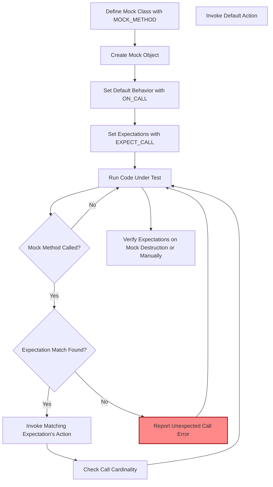

# Mock Objects and Expectations

Understand what mock objects are, how they work within the framework, and how expectations define the interactions you anticipate. This page covers the central concept of simulating dependencies to isolate and verify component behavior.

---

## Introduction to Mock Objects

Mock objects are simulated objects that replicate the behavior of real components in controlled ways. By using mock objects within the GoogleMock framework, you can isolate the unit under test from its dependencies, allowing precise verification of interactions such as function calls, argument values, and call sequences.

### Why Use Mock Objects?

Real dependencies might be unavailable, slow, or produce nondeterministic results. Mock objects let you simulate these dependencies so that:

- You only test the unit's logic, independent of collaborators.
- You specify *expectations* about how your unit should interact with dependencies.
- You precisely control returns, side effects, and call ordering to test complex scenarios.

---

## Core Concept: Expectations

An *expectation* describes the interaction you anticipate between your code and a mock method. Expectations define:

- **Which method** is called.
- **How many times** it is called (cardinality).
- **What arguments** it receives (using argument matchers).
- **In what order** calls occur (sequence or partial ordering).
- **What actions** it performs when invoked (return values, side effects, etc.).

### Creating Expectations

You create expectations with the `EXPECT_CALL` macro:

```cpp
EXPECT_CALL(mock_object, Method(matchers...))
    .With(multi_argument_matcher)  // Optional
    .Times(cardinality)            // Optional
    .InSequence(sequences...)      // Optional
    .After(expectations...)        // Optional
    .WillOnce(action)              // Optional, repeatable
    .WillRepeatedly(action)        // Optional
    .RetiresOnSaturation();        // Optional
```

Each clause refines the expectation or modifies its behavior.

---

## Understanding Expectation Clauses

### `.With(multi_argument_matcher)`
Refines argument matching by applying a matcher to the tuple of all arguments as a whole, allowing complex conditions on multiple arguments simultaneously.

### `.Times(cardinality)`
Specifies how many times you expect the method to be called. Common cardinalities include:

- `Exactly(n)` (or `n`) — exactly n times.
- `AtLeast(n)` — at least n times.
- `AtMost(n)` — at most n times.
- `Between(m, n)` — between m and n times.
- `AnyNumber()` — any number of times.

If omitted, GoogleMock infers cardinality based on `.WillOnce()` and `.WillRepeatedly()` clauses.

### `.InSequence(sequences...)`
Associates the expectation with one or more `Sequence` objects. Calls on expectations in the same sequence must occur in the order the expectations are declared.

```cpp
Sequence seq1, seq2;
EXPECT_CALL(mock, First()).InSequence(seq1, seq2);
EXPECT_CALL(mock, Second()).InSequence(seq1);
EXPECT_CALL(mock, Third()).InSequence(seq2);
```

This enforces a partial order where `First()` precedes `Second()` and `Third()`, but `Second()` and `Third()` have no order constraint.

### `.After(expectations...)`
Specifies that the call must happen after the listed expectations are met. It is useful for expressing partial orders when sequences are not enough or too cumbersome.

### `.WillOnce(action)`
Defines the behavior (action) for the next matching function call. Multiple `.WillOnce()` clauses define a sequence of actions for consecutive calls.

### `.WillRepeatedly(action)`
Defines the behavior for all matching calls after `.WillOnce()` actions are exhausted. Can only be used once.

### `.RetiresOnSaturation()`
Indicates that the expectation becomes inactive after it reaches its upper-bound cardinality, allowing subsequent matching calls to match other, lower-priority expectations.

---

## Default Behavior with `ON_CALL`

`ON_CALL` is used to specify default behaviors of mock methods without setting expectations on their invocation count or argument patterns.

```cpp
ON_CALL(mock_object, Method(matchers...))
    .With(multi_argument_matcher)  // Optional
    .WillByDefault(action);         // Mandatory
```

This lets the mock method respond in a predefined way when no matching `EXPECT_CALL` is set.

**Tip:** Use `ON_CALL` liberally to define default mock behavior and reserve `EXPECT_CALL` for the specific interactions you want to verify.

---

## How Expectations Work Internally

* GoogleMock keeps track of all expectations on every mock method.
* When a mock method is called, GoogleMock searches these expectations in reverse order (newest first) to find a match.
* It verifies call counts against cardinalities, enforces call order and prerequisites, and triggers defined actions.
* If no expectation matches, GoogleMock classifies the call as *unexpected* and reports a failure.
* Calls to mock methods without any expectation are *uninteresting* and handled based on mock strictness (Naggy, Nice, Strict).

---

## Sequences and Call Ordering

Sequences (`Sequence` objects) allow structuring expectations to require calls to occur in a specified order. All expectations linked to the same sequence will enforce calls in the order declared.

You can use `InSequence` to create anonymous sequences that enclose multiple expectations:

```cpp
{
  InSequence seq;
  EXPECT_CALL(mock, Step1());
  EXPECT_CALL(mock, Step2());
  EXPECT_CALL(mock, Step3());
}
```

This enforces that `Step1()` must be called before `Step2()` and so on.

For more complex partial orders, combine multiple sequences or use `.After()`.

---

## Retiring Expectations

By default, expectations are "sticky" — they remain active even after their call count reaches the specified limit, causing errors if called too many times.

`.RetiresOnSaturation()` allows you to mark expectations to become inactive (retire) once saturated. This enables fallback expectations to handle calls after the saturation.

Example:

```cpp
EXPECT_CALL(mock, Func(7))
    .Times(2)
    .RetiresOnSaturation(); // After 2 calls, this expectation retires.
EXPECT_CALL(mock, Func(_))
    .Times(AnyNumber());    // Matches subsequent calls.
```

---

## Uninteresting Calls and Mock Strictness

Uninteresting calls are calls to mock methods for which no `EXPECT_CALL` is set.

- **NaggyMock (default)** warns on uninteresting calls.
- **NiceMock** suppresses warnings on uninteresting calls.
- **StrictMock** treats uninteresting calls as errors.

Use mock variants according to your test strictness needs.

---

## Verifying and Clearing Expectations

GoogleMock automatically verifies expectations when mock objects are destroyed.

If your mock object has a longer lifespan or is dynamically allocated, use manual verification:

```cpp
ASSERT_TRUE(::testing::Mock::VerifyAndClearExpectations(&mock_obj));
```

You may also clear default actions along with expectations:

```cpp
ASSERT_TRUE(::testing::Mock::VerifyAndClear(&mock_obj));
```

Warning: Do not set new expectations after clearing verification, as this leads to undefined behavior.

---

## Common Pitfalls and Best Practices

- **Set expectations before calling the mock methods.**
- **Avoid over-specification:** Prefer defining only necessary expectations.
- Use `ON_CALL` for default behaviors and only use `EXPECT_CALL` when verifying interactions.
- When mock methods are overloaded, provide argument lists to avoid ambiguity.
- Use `RetiresOnSaturation()` for chains of ordered expectations to avoid "sticky" saturation errors.
- For partial call ordering, prefer sequences and the `.After()` clause.
- Use mock variants (`NiceMock`, `StrictMock`, etc.) wisely to manage test noise.
- Use thorough matchers to specify argument expectations precisely but concisely.

---

## Sample User Flow

Imagine you want to test a component that depends on a network interface. You replace the real network interface with a mock and specify:

1. What methods it should call (`EXPECT_CALL` on `SendRequest` with required arguments).
2. How many times and in what order (`Times(AtLeast(1))`, `InSequence`).
3. What values it should return (`WillOnce(Return(...))`).
4. Default behavior for other calls (`ON_CALL` with `WillByDefault`).

Run your tests to ensure interactions conform to expectations. Remove or modify as necessary.

---

## Troubleshooting Common Issues

### Too Few Calls
If a mock method is expected to be called a minimum number of times and isn't, GoogleMock reports an unmet expectation failure with details.

### Too Many Calls
If a mock method is called more often than expected (upper bound exceeded), GoogleMock reports an over-saturation failure.

### Unexpected Calls
Calls that don't match any expectation trigger errors detailing the mismatch and listing tried expectations.

### Uninteresting Calls
Warnings are issued if calls occur on mock methods with no expectations; consider defining default behavior or marking the mock as `NiceMock`.

### Saturated Expectations Without Retirement
Use `.RetiresOnSaturation()` to retire expectations and avoid errors from saturation.

### Ambiguous Overloads
Provide full method signatures when mocking overloaded methods to avoid ambiguity errors.

---

## Additional Resources

- [Mocking Reference](../docs/reference/mocking.md) for detailed syntax on `EXPECT_CALL`, `ON_CALL`, and argument matching.
- [gMock Cookbook](../docs/gmock_cook_book.md) for practical advice and recipes.
- [gMock for Dummies](../docs/gmock_for_dummies.md) for step-by-step beginner-friendly explanations.
- [gMock Cheat Sheet](../docs/gmock_cheat_sheet.md) for a quick syntax and usage summary.

---

## Summary

Mock Objects and Expectations are central to writing effective interaction-based tests in GoogleMock. By defining mock behavior through expectations (`EXPECT_CALL`) and default behaviors (`ON_CALL`), users can precisely simulate and verify interactions of the unit under test with its dependencies. Facilities such as cardinalities, sequences, call ordering, and mock strictness empower detailed and manageable test scenarios.

<Info>
Refer to related concepts such as [Matchers and Actions](concepts/mocking-principles/matchers-actions), [Controlling Mock Behavior](concepts/mocking-principles/controlling-mock-behavior), and practical guides like [Using Mock Objects](guides/mocking-and-advanced-testing/mock-objects).
</Info>

---

## Mermaid Diagram: Mock Expectation Lifecycle



---

## Practical Tips

- Use `RetiresOnSaturation()` when multiple expectations cover the same calls to prevent upper bound violations.
- For complex call ordering, combine `Sequence` objects or chain `.After()` clauses.
- Control uninteresting calls with `NiceMock` or explicit catch-all `EXPECT_CALL` with `Times(AnyNumber())`.
- Always check mock verification results if manually verifying expectations.
- Avoid mixing `EXPECT_CALL` additions and mock usage to prevent undefined behaviors.

---

## Troubleshooting Checklist

- **Method called fewer times than expected?** Verify `Times()` clause.
- **Method called more times than expected?** Use `.RetiresOnSaturation()` or relax `Times()`.
- **Unexpected calls?** Add catch-all expectations or correct argument matchers.
- **Ambiguous overloads?** Provide parameter lists in `EXPECT_CALL` and `ON_CALL`.
- **Warning 'Uninteresting function call'?** Consider if this call should be expected or ignored via `NiceMock`.

---

## Best Practices

- Set **only necessary** expectations to avoid brittle tests.
- Use `ON_CALL` freely for default responses.
- Make expectation ordering explicit where order matters.
- Review test failures carefully to understand which expectation failed.
- Group related expectations using `Sequence` and `.After()` to express call dependencies cleanly.

---

For further mastery, explore the rest of the [GoogleMock documentation](https://github.com/google/googletest/tree/main/docs) and study practical examples in the gMock Cookbook and Mocking Reference.