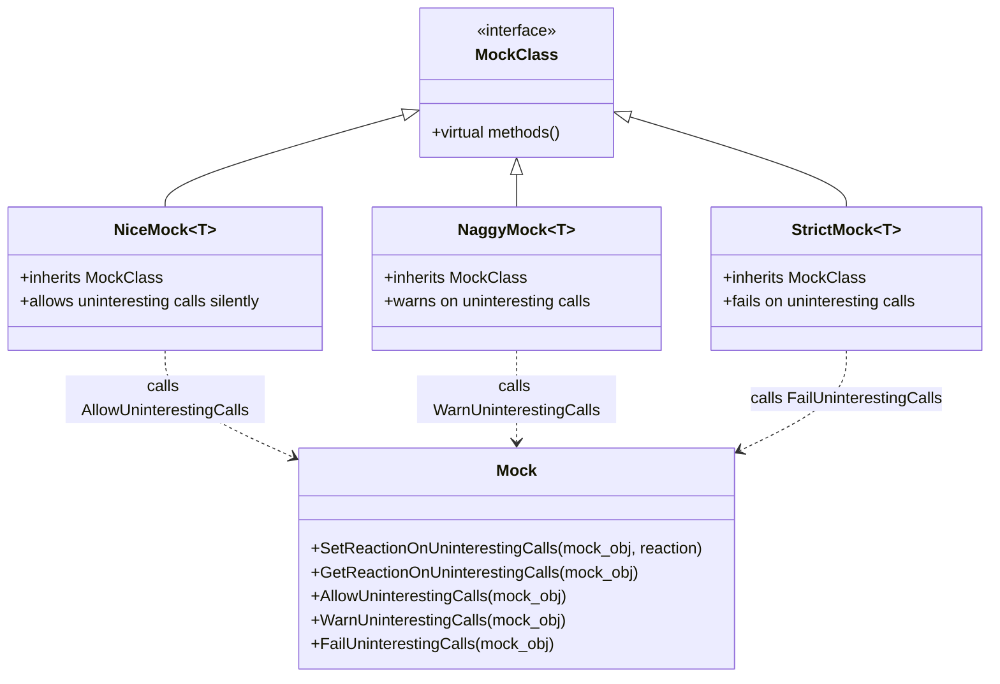

# Strict, Naggy, and Nice Mocks

GoogleMock categorizes mock objects by how strictly they enforce **uninteresting calls** — method calls for which no explicit expectations have been set. Understanding these three core mock behaviors helps you craft tests that balance strictness and flexibility, leading to more maintainable and meaningful test suites.

---

## Understanding Mock Behavior Categories

### 1. StrictMock

- **Behavior:** Treats all *uninteresting calls* as errors.
- **Effect:** Any method call on the mock object that has no matching `EXPECT_CALL` statement causes the test to fail immediately.
- **Use Case:** When you want your test to enforce *strict adherence* to specified interactions and fail on any unexpected behavior.
- **User Impact:** Provides the strictest verification, catching unintended calls but at risk of fragile tests if the interface evolves frequently.

### 2. NaggyMock

- **Behavior:** Prints **warnings** for uninteresting calls but allows them.
- **Effect:** The test continues running after warnings, which highlight calls that are unexplained by `EXPECT_CALL` yet do not break the test.
- **Use Case:** Useful during development or debugging phases to become aware of unexpected calls without failing the test.
- **User Impact:** Balances awareness and flexibility but can generate noisy output if many uninteresting calls occur.

### 3. NiceMock

- **Behavior:** Suppresses *all warnings* about uninteresting calls, effectively ignoring them.
- **Effect:** Uninteresting calls proceed silently, with default actions performed but no warning or failure.
- **Use Case:** Ideal when tests care only about specific method calls and want to ignore irrelevant interactions.
- **User Impact:** Creates the least noisy tests and supports loosely coupled testing, but risks missing unintentional calls if overused.

---

## When and How to Use Each Mock Type

Choosing the right mock strictness model depends on your testing goals and system complexity:

| Mock Type   | Strictness Level | Ideal Scenario                                  | Output on Uninteresting Calls                                            |
|-------------|------------------|------------------------------------------------|--------------------------------------------------------------------------|
| StrictMock  | High             | Enforcing exact call verification                | Test fails immediately                                                    |
| NaggyMock   | Medium           | Development/debugging to catch unexpected calls | Warning messages logged, test continues                                  |
| NiceMock    | Low              | Ignoring irrelevant calls                        | No warnings, test continues silently                                     |

**Best Practice:** Use **NiceMock** as your default when you want cleaner tests and only verify calls you care about, switch to **NaggyMock** to debug unexpected calls, and apply **StrictMock** when you want to enforce precise interaction requirements.

---

## Architectural Design and Implementation Insights

GoogleMock implements these behaviors through different mock wrappers that subclass your defined mock class:

- `NiceMock<MockClass>` allows uninteresting calls without warnings or failures.
- `NaggyMock<MockClass>` warns about uninteresting calls.
- `StrictMock<MockClass>` treats uninteresting calls as errors.

### Example Usage

```cpp
#include <gmock/gmock.h>

using ::testing::NiceMock;
using ::testing::NaggyMock;
using ::testing::StrictMock;

class MockFoo {
 public:
  MOCK_METHOD(void, DoThis, (), ());
};

// NiceMock suppresses warnings for uninteresting calls
NiceMock<MockFoo> nice_foo;

// NaggyMock prints warnings for uninteresting calls
NaggyMock<MockFoo> naggy_foo;

// StrictMock treats uninteresting calls as errors
StrictMock<MockFoo> strict_foo;
```

### Key Constraints and Notes

- These wrappers only work correctly for mock methods defined using the `MOCK_METHOD` macro *directly* in the mock class.
- Nesting strictness modifiers (e.g., `NiceMock<StrictMock<MockFoo>>`) is *not* supported.
- `StrictMock` and `NiceMock` may not operate correctly if the mock class's destructor is not virtual.

---

## How GoogleMock Reacts Under the Hood

GoogleMock assigns each mock object a policy governing reactions to uninteresting calls:

- **Allow (NiceMock):** Calls silently proceed.
- **Warn (NaggyMock):** Warnings are printed.
- **Fail (StrictMock):** Calls cause an error and test failure.

This is managed internally by registering each mock object's reaction preference upon construction and deregistering it on destruction, ensuring consistent behavior throughout the mock object’s lifetime.

---

## Practical Tips and Best Practices

- Default GoogleMock mocks behave like `NaggyMock` currently. This may change to `NiceMock` in the future.
- Use `NiceMock` if you want less verbose tests especially when many mock methods exist and only some are relevant.
- Use `StrictMock` for highly deterministic tests where any deviation from expected calls should fail immediately.
- Avoid overusing `StrictMock` to prevent brittle tests that break on harmless refactorings or unintended calls.
- You can verify and clear mock expectations mid-test with:

  ```cpp
  ::testing::Mock::VerifyAndClearExpectations(&mock_obj);
  ```

- If you experience unexpected warnings on uninteresting calls when using default mocks, consider switching the mock to `NiceMock` or adding catch-all expectations using `EXPECT_CALL(...).Times(AnyNumber())` to explicitly allow calls.

---

## Troubleshooting Common Pitfalls

<AccordionGroup title="Common Issues and Solutions">
<Accordion title="Unintended Warning Messages about Uninteresting Calls">
If you see warnings about uninteresting calls during your tests and want to suppress them, switch to `NiceMock` or explicitly allow the calls with catch-all expectations.
</Accordion>
<Accordion title="Unexpected Test Failures When Using StrictMock">
StrictMock treats unexpected calls as failures. If your test is brittle, ensure all intended calls have expectations or switch to Naggy or Nice mocks.
</Accordion>
<Accordion title="Nesting NiceMock and StrictMock Not Working">
Nesting `NiceMock<StrictMock<T>>` or other combinations is unsupported and may cause compilation or runtime issues. Use only one modifier.
</Accordion>
<Accordion title="Mock Class Destructor Not Virtual">
If your mock class's destructor is not virtual, `NiceMock` and `StrictMock` behavior may be inconsistent or problematic. Always declare virtual destructors for mocks.
</Accordion>
</AccordionGroup>

---

## Related Concepts and Further Reading

- [gMock for Dummies](https://google.github.io/googletest/gmock_for_dummies.html) — beginner-friendly introduction to mocking.
- [gMock Cookbook — The Nice, the Strict, and the Naggy](https://google.github.io/googletest/gmock_cook_book.html#NiceStrictNaggy) — detailed usage guidelines.
- [Mock Objects and Methods API Reference](https://google.github.io/googletest/reference/mocking.html#NiceMock) — technical API details.
- [Actions and Cardinalities in Expectations](https://google.github.io/googletest/concepts/mocking-strategies-extensibility/actions-cardinalities.html) — deeper understanding of expectations and behaviors.

---

## Summary

This guide compares **StrictMock**, **NaggyMock**, and **NiceMock** — the three core GoogleMock mock types managing the treatment of uninteresting calls. Choosing the right mock behavior helps you write tests with appropriate strictness, balancing test robustness, noise, and error detection. For predictable, strict validation, use `StrictMock`. For broader tolerance with warnings, choose `NaggyMock`. If you prefer silence on unverified calls, favor `NiceMock`.

---

## Source and Implementation Details

For details on the implementation of mock behavior controls and internal registration, see the source file [`gmock-spec-builders.cc`](https://github.com/google/googletest/blob/main/googlemock/src/gmock-spec-builders.cc) and the header [`gmock-nice-strict.h`](https://github.com/google/googletest/blob/main/googlemock/include/gmock/gmock-nice-strict.h).


<Source url="https://github.com/google/googletest" branch="main" paths={[{"path": "googlemock/include/gmock/gmock-nice-strict.h", "range": "1-209"}, {"path": "googlemock/src/gmock-spec-builders.cc", "range": "30-471"}]} />

---

## Diagram: Overview of Mock Strictness Behavior Classes


