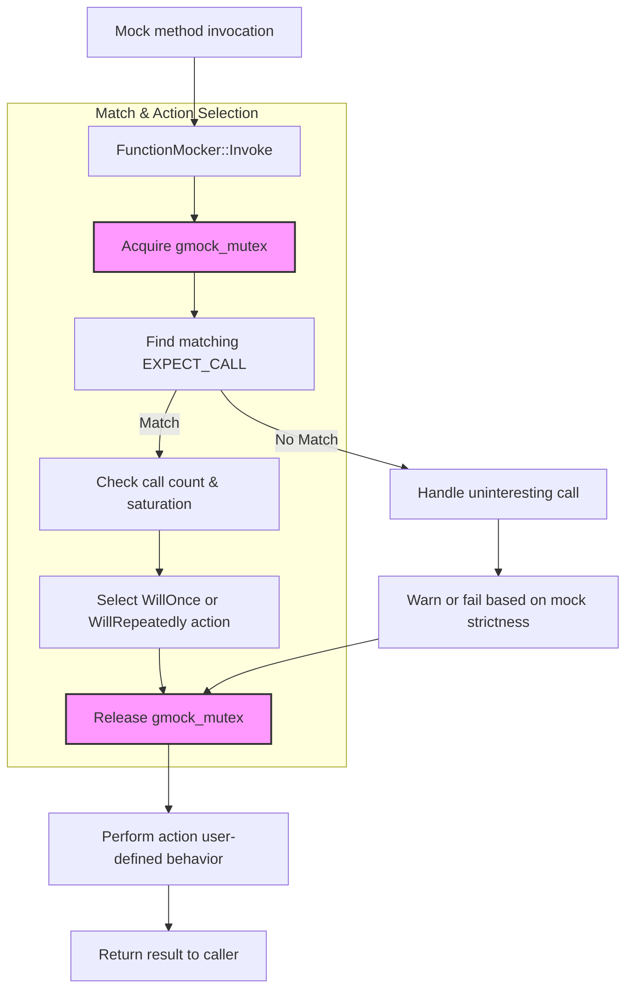

# Anatomy of Mock Classes and Methods

Understand the foundational principles behind the generation, behavior, and interaction of mock classes and methods in GoogleMock. This guide explores the use of the `MOCK_METHOD` macro to define mock methods, how these mocks model method signatures and behaviors, and the mechanisms that enable method call interception and verification in unit tests.

---

## Introduction to Mock Class Anatomy

In GoogleMock, a mock class simulates a real class interface, allowing you to specify and verify interactions during testing. The anatomy of mock classes centers around the `MOCK_METHOD` macro which defines mocked methods that track calls, match arguments, and provide controllable behaviors.

### What is `MOCK_METHOD`?

- It declares a mock method within a mock class.
- The macro reflects the signature of the method being mocked, including:
  - Return type
  - Method name
  - Argument types
  - Optional qualifiers like `const`, `override`, `noexcept`, and call types

### Example Structure

```cpp
class MockTurtle : public Turtle {
 public:
  MOCK_METHOD(void, PenUp, (), (override));
  MOCK_METHOD(int, GetX, (), (const, override));
};
```

- The macro generates function implementations that interact with GoogleMock's framework.
- Mock methods can be `const` or non-`const`, override virtual methods, and support a variety of qualifiers.

---

## Modeling Method Signatures

Mock methods model the exact signature of the method they replace:

- GoogleMock handles methods with multiple parameters, including complex and templated types.
- Support exists for overloaded methods, where the mock class includes a mock method for each overload.
- Special care is taken for methods with move-only types (e.g., `std::unique_ptr`) by allowing `MOCK_METHOD` to declare them naturally.

### Dealing with Commas in Types

Since commas in template types confuse macro parsing, you may:

- Wrap the return or argument type in parentheses.
- Use a `using` alias to simplify types.

Example:
```cpp
using BoolAndInt = std::pair<bool, int>;
MOCK_METHOD(BoolAndInt, GetPair, ());
```

---

## Behavioral Specification: Default Actions and Expectations

Mock methods do not operate independently but rely on behavioral specifications set by the user.

### ON_CALL: Default Behavior

- Specifies the default action when the mock method is called.
- Using `.WillByDefault(action)` defines what happens unless overridden.
- Supports chaining with `.With(matcher)` for argument tuples.

Example:
```cpp
ON_CALL(mock_obj, Method(_))
    .WillByDefault(Return(42));
```

### EXPECT_CALL: Expectations

- Declares expected calls with argument matchers.
- Allows chaining of clauses:
  - `.With(multi_arg_matcher)`
  - `.Times(cardinality)`
  - `.InSequence(sequence_objects)`
  - `.After(expectations)`
  - `.WillOnce(action)` — for specific calls
  - `.WillRepeatedly(action)` — fallback action
  - `.RetiresOnSaturation()` — disables the expectation after use

Example:
```cpp
EXPECT_CALL(mock_obj, DoSomething(Ge(0)))
    .Times(2)
    .WillOnce(Return(true))
    .WillRepeatedly(Return(false));
```

### Order and Cardinality

- Expectations can be in sequence or partial order using `Sequence` and `InSequence`.
- Cardinalities (`Times()`) define how many calls are expected; can be exact, at least, at most, etc.
- Expectations are checked strictly; calls outside defined expectations cause failures.

---

## Interaction with Test Runner and Call Handling

GoogleMock intercepts mock method calls and routes them through the mock framework's core components:

1. **Call Interception:** The generated mock method delegates to internal `FunctionMocker` which:
   - Records the call.
   - Checks match against `EXPECT_CALL` expectations in reverse order (newer take precedence).
   - Determines if the call is expected, uninteresting, or excessive.

2. **Action Execution:** Once the matching expectation or default action is selected:
   - The associated action is executed.
   - Actions can return values, modify arguments, invoke callbacks, or invoke user-provided callable.

3. **Call Tracking:** The framework tracks the number of times expectations are matched.
   - Handles sufficiency, saturation, and retirement (i.e., deactivation) of expectations.

4. **Failure Reporting:** If calls violate expectations or cardinalities:
   - Detailed failure messages with call arguments and source locations are issued.
   - Uninteresting calls may generate warnings or errors based on mock strictness.

---

## Internals of Mock Method Behavior

### Use of Macros for Mock Method Generation

- `MOCK_METHOD` expands to generate method declarations and definitions inside the mock class.
- It creates a `FunctionMocker` that manages expectations for that method.
- `ON_CALL` and `EXPECT_CALL` map onto `MockSpec` objects linked to `FunctionMocker`.

### Thread Safety and Synchronization

- GoogleMock serializes accesses to mocks internally using a mutex to ensure thread safety.
- Calls to mocked methods acquire internal locks during expectation matching but release them while running user code to avoid deadlocks.

### Support for Const, Overloaded, and Move-Only Methods

- Different macros such as `MOCK_CONST_METHOD` patterns are supported.
- Disambiguation for overloaded methods is done via `Const()` wrapper or explicit matcher typing.
- Move-only types are supported directly; sample tests show usage returning `std::unique_ptr`.

---

## Strictness and Uninteresting Calls

GoogleMock provides three levels of mock strictness impacting uninteresting calls (calls to methods with no active expectations):

- **NaggyMock (default):** Uninteresting calls generate warnings.
- **NiceMock:** Suppresses warnings for uninteresting calls.
- **StrictMock:** Treats uninteresting calls as failures.

You can create a mock object wrapped in these modifiers like:

```cpp
NiceMock<MockFoo> nice_foo;
StrictMock<MockBar> strict_bar;
NaggyMock<MockBaz> naggy_baz;
```

Changing strictness controls how forgiving the mock is toward unexpected interactions, improving test resilience or rigor.

---

## Practical Tips and Best Practices

- **Order your expectations carefully:** Newer expectations override older ones.
- **Use `ON_CALL` for default behaviors:** Reserves `EXPECT_CALL` to visibly check interactions.
- **Control strictness wisely:** Use `NiceMock` for less noisy tests, and `StrictMock` only when necessary to enforce completeness.
- **Leaking mocks:** Use `Mock::AllowLeak()` if you intentionally manage mock lifetime outside the scope.
- **Use sequences and partial orders:** To ensure calls happen in the intended order without making tests brittle.
- **Avoid over-specification:** Match only on arguments that matter to reduce maintenance.
- **Verify and clear expectations:** You can call `Mock::VerifyAndClearExpectations()` early if mocks live longer than the test scope.

---

## Troubleshooting Mock Methods

### Common Pitfalls

- Calling a mock method without any expectation - triggers uninteresting call warnings/errors.
- Defining `MOCK_METHOD` incorrectly due to unprotected commas in complex types.
- Overlooking the proper use of qualifiers (`const`, `override`, etc.) causes compiler errors.
- Overusing `EXPECT_CALL` leading to brittle tests; prefer `ON_CALL` when verification is not needed.

### How to Diagnose

- Run tests with `--gmock_verbose=info` to get detailed call traces and expectation matching details.
- Inspect messages for expectations not satisfied or exceeded.
- Verify call order and cardinality if failures stem from unexpected sequences.

---

## How Mock Methods Interact with the Testing Framework



This flow illustrates the internal lifecycle of a mock method call, from interception to behavior dispatch.

---

## References and Further Reading

- [Using Mocks with GoogleMock](../guides/core-testing-workflows/using-mocks.md)
- [Mocking Reference](../api-reference/mocking-api/mock-methods.md)
- [gMock Cookbook](../docs/gmock_cook_book.md) for advanced mock usage patterns
- [Legacy gMock FAQ](../docs/gmock_faq.md) for common questions and issues
- [Nice, Strict, and Naggy Mock Objects](../googlemock/include/gmock/gmock-nice-strict.h) for uninteresting call behaviors
- [Mock Spec Builders Implementation](../googlemock/include/gmock/gmock-spec-builders.h) for macro and internal class details

---

By mastering the anatomy of mock classes and methods, you gain full command over GoogleMock’s powerful mocking features, enabling precise control of testing interactions and resulting in robust, maintainable unit tests.
